-- page 13 --

# 1. Introduction and Functional Overview

The ECU Manager module (as specified in this document) is a basic software module (see [1]) that manages common aspects of ECU states. Specifically, the ECU Manager module:

* Initializes and de-initializes the OS, the SchM and the BswM as well as some basic software driver modules.

* configures the ECU for SLEEP and SHUTDOWN when requested.

* manages all wakeup events on the ECU

The ECU Manager module provides the wakeup validation protocol to distinguish 'real' wakeup events from 'erratic' ones.

Furthermore:

* Partial or fast startup where he ECU starts up with limited capabilities and later, as determined by the application, continues startup step by step.

* Interleaved startup where the ECU starts minimally and then starts the RTE to execute functionality in SW-Cs as soon as possible. It then continues to start further BSW and SW-Cs, thus interleaving BSW and application functionality..

* Multiple operational states where the ECU has more than one RUN state. This, among other things, refines the notion of a spectrum of SLEEP states to RUN states. There can now be a continuum of operational states spanning from the classic RUN (fully operational) to the deepest SLEEP (processor halted).

* Multi-Core ECUs: STARTUP, SHUTDOWN, SLEEP and WAKEUP are coordinated on all cores of the ECU.

Flexible ECU management employs the generic mode management facilities provided by the following modules:

* RTE and BSW Scheduler module [2] are now amalgamated into one module: This module supports freely configurable BSW and application modes and their mode-switching facilities.

* BSW Mode Manager module [3]: This module implements configurable rules and action lists to evaluate the conditions for switching ECU modes and to implement the necessary actions to do so.

Thus with Flexible ECU Management, most ECU states are no longer implemented in the ECU Manager module itself. In general, the ECU Manager module takes over control when the generic mode management facilities are unavailable in:

* Early STARTUP phases,

* Late SHUTDOWN phases,

* SLEEP phases where the facilities are locked out by the scheduler.
-- page 14 --

During the UP Phase of the ECU Manager module the BSW Mode Manager is responsible for further actions. Whereas, the ECU Manager module arbitrates RUN and POST_RUN Requests from SW-Cs and notifies BswM about the status of the modes.

## 1.1 Backwards Compatibility to Previous ECU Manager Module Versions

Flexible ECU management is backward compatible to previous ECU Manager versions if it is configured accordingly.

For more information about a configuration in respect to compatibility see the "Guide to Mode Management" [4].
-- page 15 --

# 2. Definitions and Abbreviations

This chapter defines terms that are of special significance to the ECU Manager and the acronyms of related modules.

## 2.1 Definitions

|Term|Description|
|-|-|
|Callback|Refer to the Glossary \[5]|
|Callout|'Callouts' are function stubs that the system designer can replace with code, usually at configuration time, to add functionality to the ECU Manager module. Callouts are separated into two classes. One class provides mandatory ECU Manager module functionality and serves as a hardware abstraction layer. The other class provides optional functionality.|
|Integration Code|Refer to the Glossary \[5]|
|Mode|A Mode is a certain set of states of the various state machines (not only of the ECU Manager) that are running in the vehicle and are relevant to a particular entity, an application or the whole vehicle|
|Passive Wakeup|A wakeup caused from an attached bus rather than an internal event like a timer or sensor activity.|
|Phase|A logical or temporal assembly of ECU Manager's actions and events, e.g. STARTUP, UP, SHUTDOWN, SLEEP, ... Phases can consist of Sub-Phases which are often called Sequences if they above all exist to group sequences of executed actions into logical units. Phases in this context are not the phases of the AUTOSAR Methodology.|
|Shutdown Target|The ECU must be shut down before it is put to sleep, before it is powered off or before it is reset. SLEEP, OFF, and RESET are therefore valid shutdown targets. By selecting a shutdown target, an application can communicate its wishes for the ECU behavior after the next shutdown to the ECU Manager module.|
|State|States are internal to their respective BSW component and thus not visible to the application. So they are only used by the BSW's internal state machine. The States inside the ECU Manager build the phases and therefore handle the modes.|
|Wakeup Event|A physical event which causes a wakeup. A CAN message or a toggling IO line can be wakeup events. Similarly, the internal SW representation, e.g. an interrupt, may also be called a wakeup event.|
|Wakeup Reason|The wakeup reason is the wakeup event that is the actual cause of the last wakeup.|
|Wakeup Source|The peripheral or ECU component which deals with wakeup events is called a wakeup source.|


## 2.2 Abbreviations
-- page 16 --

|Abbreviation|Description|
|-|-|
|BswM|Basic Software Mode Manager|
|Dem|Diagnostic Event Manager|
|Det|Default Error Tracer|
|EcuM|ECU Manager|
|Gpt|General Purpose Timer|
|Icu|Input Capture Unit|
|ISR|Interrupt Service Routine|
|Mcu|Microcontroller Unit|
|NVRAM|Non-volatile random access memory|
|Os|Operating System|
|Rte|Runtime Environment|
|VFB|Virtual Function Bus|


-- page 17 --

# 3. Related documentation

## 3.1 Input documents & related standards and norms

[1] List of Basic Software Modules
    AUTOSAR_TR_BSWModuleList

[2] Specification of RTE Software
    AUTOSAR_SWS_RTE

[3] Specification of Basic Software Mode Manager
    AUTOSAR_SWS_BSWModeManager

[4] Guide to Mode Management
    AUTOSAR_EXP_ModeManagementGuide

[5] Glossary
    AUTOSAR_TR_Glossary

[6] General Specification of Basic Software Modules
    AUTOSAR_SWS_BSWGeneral

[7] Virtual Functional Bus
    AUTOSAR_EXP_VFB

[8] General Requirements on Basic Software Modules
    AUTOSAR_SRS_BSWGeneral

[9] Requirements on Mode Management
    AUTOSAR_SRS_ModeManagement

[10] Specification of MCU Driver
     AUTOSAR_SWS_MCUDriver

[11] Specification of CAN Transceiver Driver
     AUTOSAR_SWS_CANTransceiverDriver

## 3.2 Related specification

AUTOSAR provides a General Specification on Basic Software modules (see [6]), which is also valid for ECU State Manager. Thus, the specification [6] shall be considered as additional and required specification for ECU State Manager.
-- page 18 --

# 4. Constraints and Assumptions

## 4.1 Limitations

ECUs cannot always be switched off (i.e. zero power consumption).

*Rationale:* The shutdown target OFF can only be reached using ECU special hardware (e.g. a power hold circuit). If this hardware is not available, this specification proposes to issue a reset instead. Other default behaviors are permissible, however.

## 4.2 Hardware Requirements

In this section, the term "EcuM RAM" refers to a block of RAM reserved for use by the ECU Manager module.

The EcuM RAM shall keep contents of vital data while the ECU clock is switched off.

*Rationale:* This requirement is needed to implement sleep states as required in section 7.5 SLEEP Phase.

The EcuM RAM shall provide a no-init area that keeps contents over a reset cycle.

The no-init area of the EcuM RAM (see EcuM2869) shall only be initialized on a power on event (clamp 30).

The system designer is responsible for establishing an initialization strategy for the no init area of the ECU RAM.

## 4.3 Applicability to car domains

The ECU Manager module is applicable to all car domains.
-- page 19 --

# 5. Dependencies to other modules

The following sections outline the important relationships to other modules. They also contain some requirements that these modules must fulfill to collaborate correctly with the ECU Manager module.

If data pointers are passed to a BSW module, the address needs to point to a location in the shared part of the memory space.

## 5.1 SPAL Modules

### 5.1.1 MCU Driver

The MCU Driver is the first basic software module initialized by the ECU Manager module. When `MCU_Init` returns (see [SWS_EcuM_02858]), the MCU module and the MCU Driver module are not necessarily fully initialized, however. Additional MCU module specific steps may be needed to complete the initialization. The ECU Manager module provides two callout where this additional code can be placed. Refer to section 7.3.2 Activities in StartPreOS Sequence for details.

### 5.1.2 Driver Dependencies and Initialization Order

BSW drivers may depend on each other. A typical example is the watchdog driver, which needs the SPI driver to access an external watchdog. This means on the one hand, that drivers may be stacked (not relevant to the ECU Manager module) and on the other hand that the called module must be initialized before the calling module is initialized.

The system designer is responsible for defining the initialization order at configuration time in `EcuMDriverInitListZero`, `EcuMDriverInitListOne`, `EcuMDriverRestartList` and in `EcuMDriverInitListBswM`.

## 5.2 Peripherals with Wakeup Capability

Wakeup sources must be handled and encapsulated by drivers.

These drivers must follow the protocols and requirements presented in this document to ensure a seamless integration into the AUTOSAR BSW. Basically, the protocol is as follows:

The driver must invoke `EcuM_SetWakeupEvent` (see [SWS_EcuM_02826]) to notify the ECU Manager module that a pending wakeup event has been detected. The driver must not only invoke `EcuM_SetWakeupEvent` while the ECU is waiting for a wakeup
-- page 20 --

event during a sleep phase but also during the driver initialization phase and during normal operation when EcuM_MainFunction is running.

The driver must provide an explicit function to put the wakeup source to sleep. This function shall put the wakeup source into an energy saving and inert operation mode and rearm the wakeup notification mechanism.

If the wakeup source is capable of generating spurious events<sup>1</sup> then either

• the driver or

• the software stack consuming the driver or

• another appropriate BSW module

must either provide a validation callout for the wakeup event or call the ECU Manager module's validation function. If validation is not necessary, then this requirement is not applicable for the corresponding wakeup source.

## 5.3 Operating System

The ECU Manager module starts the AUTOSAR OS and also shuts it down. The ECU Manager module defines the protocol how control is handled before the OS is started and how control is handled after the OS has been shut down.

## 5.4 BSW Scheduler

The ECU Manager module initializes the BSW Scheduler and the ECU Manager module also contains EcuM_MainFunction (see [SWS_EcuM_02837]) which is scheduled to periodically evaluate wakeup requests and update the Alarm Clock.

## 5.5 BSW Mode Manager

ECU states are generally implemented as AUTOSAR modes and the BSW Mode Manager is responsible for monitoring changes in the ECU and affecting the corresponding changes to the ECU state machine as appropriate. Refer to the Specification of the Virtual Function Bus [7] for a discussion of AUTOSAR mode management and to the Guide to Mode Management [4] for ECU state machine implementation details and for guidelines about how to configure the BSW Mode Manager to implement the ECU state machine

The BSW Mode Manager can only manage the ECU state machine after mode management is operational - that is, after the SchM has been initialized and until the SchM

<sup>1</sup>Spurious wakeup events may result from EMV spikes, bouncing effects on wakeup lines etc.
-- page 21 --

is de-initialised or halted. The ECU Manager module takes control of the ECU when the BSW Mode manager is not operational.

The ECU Manager module therefore takes control immediately after the ECU has booted and relegates control to the BSW Mode Manager after initializing the SchM and the BswM.

The BswM passes control of the ECU back to the ECU Manager module to lock the operating system and handle wakeup events.

The BswM also passes control back to the ECU Manager immediately before the OS is stopped on shutdown.

When wakeup sources are being validated, the ECU Manager module indicates wakeup source state changes to the BswM through mode switch requests.

## 5.6 Software Components

The ECU Manager module handles the following ECU-wide properties:

* Shutdown targets.

This specification assumes that SW-Cs set these properties (through AUTOSAR ports), typically by some ECU specific part of the SW-C. The ECU Manager does not prevent a SW-C from overrighting settings made by SW-Cs. The policy must be defined at a higher level.

The following measures might help to resolve this issue.

* The SW-C Template may contain a field to indicate whether the SW-C sets the shutdown target.

* The generation tool may only allow configurations that have one SW-C accessing the shutdown target.

## 5.7 File Structure

### 5.7.1 Code file structure

This specification does not define the code file structure completely.

**[SWS_EcuM_02990]** The ECU Manager module implementation shall provide a single `EcuM_Callout_Stubs.c` file which contains the stubs of the callouts realized in this implementation. ()

See also section 8.5 Callout Definitions for a list of the callouts that could possibly be implemented.
-- page 22 --

Whether `EcuM_Callout_Stubs.c` can be edited manually or is composed only of other generated files depends on the implementation.

### 5.7.2 Header file structure

Also refer to chapter 8.7 Expected Interfaces for dependencies to other modules.
-- page 23 --

# 6. Requirements Tracing

The following tables reference the requirements specified in [8] and [9] and links to the fulfillment of these. Please note that if column "Satisfied by" is empty for a specific requirement this means that this requirement is not fulfilled by this document.

|Requirement|Description|Satisfied by|
|-|-|-|
|\[SRS\_BSW\_00005]|Modules of the μC Abstraction Layer (MCAL) may not have hard coded horizontal interfaces|\[SWS\_EcuM\_NA\_00000]|
|\[SRS\_BSW\_00010]|The memory consumption of all Basic SW Modules shall be documented for a defined configuration for all supported platforms.|\[SWS\_EcuM\_NA\_00000]|
|\[SRS\_BSW\_00101]|The Basic Software Module shall be able to initialize variables and hardware in a separate initialization function|\[SWS\_EcuM\_02811]|
|\[SRS\_BSW\_00159]|All modules of the AUTOSAR Basic Software shall support a tool based configuration|\[SWS\_EcuM\_NA\_00000]|
|\[SRS\_BSW\_00160]|Configuration files of AUTOSAR Basic SW module shall be readable for human beings|\[SWS\_EcuM\_NA\_00000]|
|\[SRS\_BSW\_00161]|The AUTOSAR Basic Software shall provide a microcontroller abstraction layer which provides a standardized interface to higher software layers|\[SWS\_EcuM\_NA\_00000]|
|\[SRS\_BSW\_00162]|The AUTOSAR Basic Software shall provide a hardware abstraction layer|\[SWS\_EcuM\_NA\_00000]|
|\[SRS\_BSW\_00164]|The Implementation of interrupt service routines shall be done by the Operating System, complex drivers or modules|\[SWS\_EcuM\_NA\_00000]|
|\[SRS\_BSW\_00167]|All AUTOSAR Basic Software Modules shall provide configuration rules and constraints to enable plausibility checks|\[SWS\_EcuM\_NA\_00000]|
|\[SRS\_BSW\_00168]|SW components shall be tested by a function defined in a common API in the Basis-SW|\[SWS\_EcuM\_NA\_00000]|
|\[SRS\_BSW\_00172]|The scheduling strategy that is built inside the Basic Software Modules shall be compatible with the strategy used in the system|\[SWS\_EcuM\_02836]|
|\[SRS\_BSW\_00307]|Global variables naming convention|\[SWS\_EcuM\_NA\_00000]|
|\[SRS\_BSW\_00308]|AUTOSAR Basic Software Modules shall not define global data in their header files, but in the C file|\[SWS\_EcuM\_NA\_00000]|
|\[SRS\_BSW\_00309]|All AUTOSAR Basic Software Modules shall indicate all global data with read-only purposes by explicitly assigning the const keyword|\[SWS\_EcuM\_NA\_00000]|
|\[SRS\_BSW\_00314]|All internal driver modules shall separate the interrupt frame definition from the service routine|\[SWS\_EcuM\_NA\_00000]|


-- page 24 --

△

|Requirement|Description|Satisfied by|
|-|-|-|
|\[SRS\_BSW\_00323]|All AUTOSAR Basic Software Modules shall check passed API parameters for validity|\[SWS\_EcuM\_03009]|
|\[SRS\_BSW\_00325]|The runtime of interrupt service routines and functions that are running in interrupt context shall be kept short|\[SWS\_EcuM\_NA\_00000]|
|\[SRS\_BSW\_00327]|Error values naming convention|\[SWS\_EcuM\_04032]|
|\[SRS\_BSW\_00330]|It shall be allowed to use macros instead of functions where source code is used and runtime is critical|\[SWS\_EcuM\_NA\_00000]|
|\[SRS\_BSW\_00331]|All Basic Software Modules shall strictly separate error and status information|\[SWS\_EcuM\_91005]|
|\[SRS\_BSW\_00333]|For each callback function it shall be specified if it is called from interrupt context or not|\[SWS\_EcuM\_02171] \[SWS\_EcuM\_02345]|
|\[SRS\_BSW\_00334]|All Basic Software Modules shall provide an XML file that contains the meta data|\[SWS\_EcuM\_NA\_00000]|
|\[SRS\_BSW\_00337]|Classification of development errors|\[SWS\_EcuM\_04032]|
|\[SRS\_BSW\_00339]|Reporting of production relevant error status|\[SWS\_EcuM\_02987]|
|\[SRS\_BSW\_00341]|Module documentation shall contains all needed informations|\[SWS\_EcuM\_NA\_00000]|
|\[SRS\_BSW\_00347]|A Naming seperation of different instances of BSW drivers shall be in place|\[SWS\_EcuM\_NA\_00000]|
|\[SRS\_BSW\_00348]|All AUTOSAR standard types and constants shall be placed and organized in a standard type header file|\[SWS\_EcuM\_NA\_00000]|
|\[SRS\_BSW\_00350]|All AUTOSAR Basic Software Modules shall allow the enabling/ disabling of detection and reporting of development errors.|\[SWS\_EcuM\_04032]|
|\[SRS\_BSW\_00353]|All integer type definitions of target and compiler specific scope shall be placed and organized in a single type header|\[SWS\_EcuM\_NA\_00000]|
|\[SRS\_BSW\_00358]|The return type of init() functions implemented by AUTOSAR Basic Software Modules shall be void|\[SWS\_EcuM\_02811]|
|\[SRS\_BSW\_00359]|All AUTOSAR Basic Software Modules callback functions shall avoid return types other than void if possible|\[SWS\_EcuM\_02826] \[SWS\_EcuM\_02829]|
|\[SRS\_BSW\_00360]|AUTOSAR Basic Software Modules callback functions are allowed to have parameters|\[SWS\_EcuM\_02826] \[SWS\_EcuM\_02829]|
|\[SRS\_BSW\_00361]|All mappings of not standardized keywords of compiler specific scope shall be placed and organized in a compiler specific type and keyword header|\[SWS\_EcuM\_NA\_00000]|


▽
-- page 25 --

△

|Requirement|Description|Satisfied by|
|-|-|-|
|\[SRS\_BSW\_00373]|The main processing function of each AUTOSAR Basic Software Module shall be named according the defined convention|\[SWS\_EcuM\_02837]|
|\[SRS\_BSW\_00385]|List possible error notifications|\[SWS\_EcuM\_04032]|
|\[SRS\_BSW\_00406]|A static status variable denoting if a BSW module is initialized shall be initialized with value 0 before any APIs of the BSW module is called|\[SWS\_EcuM\_NA\_00000]|
|\[SRS\_BSW\_00407]|Each BSW module shall provide a function to read out the version information of a dedicated module implementation|\[SWS\_EcuM\_02813]|
|\[SRS\_BSW\_00410]|Compiler switches shall have defined values|\[SWS\_EcuM\_NA\_00000]|
|\[SRS\_BSW\_00411]|All AUTOSAR Basic Software Modules shall apply a naming rule for enabling/disabling the existence of the API|\[SWS\_EcuM\_02813]|
|\[SRS\_BSW\_00413]|An index-based accessing of the instances of BSW modules shall be done|\[SWS\_EcuM\_NA\_00000]|
|\[SRS\_BSW\_00414]|Init functions shall have a pointer to a configuration structure as single parameter|\[SWS\_EcuM\_02811]|
|\[SRS\_BSW\_00415]|Interfaces which are provided exclusively for one module shall be separated into a dedicated header file|\[SWS\_EcuM\_NA\_00000]|
|\[SRS\_BSW\_00416]|The sequence of modules to be initialized shall be configurable|\[SWS\_EcuM\_02559]|
|\[SRS\_BSW\_00417]|Software which is not part of the SW-C shall report error events only after the DEM is fully operational.|\[SWS\_EcuM\_NA\_00000]|
|\[SRS\_BSW\_00422]|Pre-de-bouncing of error status information is done within the DEM|\[SWS\_EcuM\_NA\_00000]|
|\[SRS\_BSW\_00425]|The BSW module description template shall provide means to model the defined trigger conditions of schedulable objects|\[SWS\_EcuM\_02837]|
|\[SRS\_BSW\_00426]|BSW Modules shall ensure data consistency of data which is shared between BSW modules|\[SWS\_EcuM\_NA\_00000]|
|\[SRS\_BSW\_00427]|ISR functions shall be defined and documented in the BSW module description template|\[SWS\_EcuM\_NA\_00000]|
|\[SRS\_BSW\_00432]|Modules should have separate main processing functions for read/receive and write/transmit data path|\[SWS\_EcuM\_NA\_00000]|
|\[SRS\_BSW\_00437]|Memory mapping shall provide the possibility to define RAM segments which are not to be initialized during startup|\[SWS\_EcuM\_NA\_00000]|
|\[SRS\_BSW\_00439]|Enable BSW modules to handle interrupts|\[SWS\_EcuM\_NA\_00000]|


▽
-- page 26 --

△

|Requirement|Description|Satisfied by|
|-|-|-|
|\[SRS\_BSW\_00440]|The callback function invocation by the BSW module shall follow the signature provided by RTE to invoke servers via Rte\_Call API|\[SWS\_EcuM\_02826] \[SWS\_EcuM\_02829]|
|\[SRS\_BSW\_00449]|BSW Service APIs used by Autosar Application Software shall return a Std\_ReturnType|\[SWS\_EcuM\_NA\_00000]|
|\[SRS\_BSW\_00450]|A Main function of a un-initialized module shall return immediately|\[SWS\_EcuM\_NA\_00000]|
|\[SRS\_BSW\_00453]|BSW Modules shall be harmonized|\[SWS\_EcuM\_NA\_00000]|
|\[SRS\_ModeMgm\_-09072]|ECU shutdown shall be forced|\[SWS\_EcuM\_03022]|
|\[SRS\_ModeMgm\_-09098]|Storing the wake-up reasons shall be available|\[SWS\_EcuM\_02826]|
|\[SRS\_ModeMgm\_-09100]|Selection of wake-up sources shall be configurable|\[SWS\_EcuM\_02389]|
|\[SRS\_ModeMgm\_-09104]|ECU State Manager shall take over control after OS shutdown|\[SWS\_EcuM\_02952] \[SWS\_EcuM\_02953]|
|\[SRS\_ModeMgm\_-09113]|Initialization of Basic Software modules shall be done|\[SWS\_EcuM\_02932]|
|\[SRS\_ModeMgm\_-09114]|Starting/invoking the shutdown process shall be provided|\[SWS\_EcuM\_00624] \[SWS\_EcuM\_02185] \[SWS\_EcuM\_02585] \[SWS\_EcuM\_02812] \[SWS\_EcuM\_02822]|
|\[SRS\_ModeMgm\_-09116]|Requesting and releasing the RUN state shall be provided|\[SWS\_EcuM\_04115] \[SWS\_EcuM\_04116] \[SWS\_EcuM\_04117] \[SWS\_EcuM\_04118] \[SWS\_EcuM\_04119] \[SWS\_EcuM\_04120] \[SWS\_EcuM\_04121] \[SWS\_EcuM\_04123] \[SWS\_EcuM\_04125] \[SWS\_EcuM\_04126] \[SWS\_EcuM\_04127] \[SWS\_EcuM\_04128] \[SWS\_EcuM\_04129] \[SWS\_EcuM\_04130] \[SWS\_EcuM\_04132]|
|\[SRS\_ModeMgm\_-09126]|An API for querying the wake-up reason shall be provided|\[SWS\_EcuM\_02827] \[SWS\_EcuM\_02828] \[SWS\_EcuM\_02830] \[SWS\_EcuM\_02831]|
|\[SRS\_ModeMgm\_-09127]|The ECU State Manager shall de-initialize Basic Software modules where appropriate during the shutdown process|\[SWS\_EcuM\_03021]|
|\[SRS\_ModeMgm\_-09128]|Several shutdown targets shall be supported|\[SWS\_EcuM\_02822] \[SWS\_EcuM\_02824] \[SWS\_EcuM\_02825]|
|\[SRS\_ModeMgm\_-09136]|The ECU State Manager shall be the receiver of all wake-up events|\[SWS\_EcuM\_04091]|
|\[SRS\_ModeMgm\_-09186]|Alarm Clock shall be active while the ECU is powered|\[SWS\_EcuM\_04054] \[SWS\_EcuM\_04055] \[SWS\_EcuM\_04056] \[SWS\_EcuM\_04057] \[SWS\_EcuM\_04058] \[SWS\_EcuM\_04059] \[SWS\_EcuM\_04060]|
|\[SRS\_ModeMgm\_-09187]|In Case of wakeup, all the alarm clock shall be canceled|\[SWS\_EcuM\_04009]|
|\[SRS\_ModeMgm\_-09188]|In Case of startup, all the alarm clock shall be canceled|\[SWS\_EcuM\_04010]|
|\[SRS\_ModeMgm\_-09190]|The alarm clock service shall allow setting an alarm relative to the current time using a time resolution of seconds|\[SWS\_EcuM\_04054]|


▽
-- page 27 --

|Requirement|Description|Satisfied by|
|-|-|-|
|\[SRS\_ModeMgm\_-<br/>09194]|The alarm clock service shall allow setting the clock|\[SWS\_EcuM\_04064]|
|\[SRS\_ModeMgm\_-<br/>09199]|The alarm clock service shall allow setting an alarm absolute by using an absolute time with a resolution of seconds|\[SWS\_EcuM\_04057]|
|\[SRS\_ModeMgm\_-<br/>09234]|The EcuM shall handle the initialization of Basic Software modules|\[SWS\_EcuM\_02559] \[SWS\_EcuM\_02730] \[SWS\_EcuM\_02947]|
|\[SRS\_ModeMgm\_-<br/>09235]|The ECU State Manager shall offer two targets for shutting down the ECU|\[SWS\_EcuM\_00624] \[SWS\_EcuM\_02156] \[SWS\_EcuM\_02822] \[SWS\_EcuM\_02824] \[SWS\_EcuM\_02825]|
|\[SRS\_ModeMgm\_-<br/>09239]|To shutdown, ShutdownAllCores shall be called on the master core after synchronizing all cores|\[SWS\_EcuM\_04024]|


**Table 6.1: RequirementsTracing**
-- page 28 --

# 7. Functional Specification

Chapter 1 introduced the new, more flexible approach to ECU state management.

However, this flexibility comes at the price of responsibility. There are no standard ECU modes, or states. The integrator of an ECU must decide which states are needed and also configure them.

When ECU Mode Handling is used, the standard states RUN and POST_RUN are arbitrated by the RUN Request Protocol and propagated to the BswM. The system designer has to make sure that pre-conditions of respective states are met when setting an EcuM Mode by BswM actions.

Note that neither the BSW nor SW-Cs will be able to rely on certain ECU modes or states, although previous versions of the BSW have largely not relied on them..

This document only specifies the functionality that remains in the ECU Manager module. For a complete picture of ECU State Management, refer to the specifications of the other relevant modules, i.e., RTE and BSW Scheduler module [2] and BSW Mode Manager module [3].

Refer to the Guide to Mode Management [4] for some example use cases for ECU states and the interaction between the involved BSW modules.

The ECU Manager module manages the state of wakeup sources in the same way as it has in the past. The APIs to set/clear/validate wakeup events remain the same - with the notable difference that these APIs are Callbacks.

It was always intended that wakeup source handling take place not only during wakeup but continuously, in parallel to all other EcuM activities. This functionality is now fully decoupled from the rest of ECU management via mode requests.

## 7.1 Phases of the ECU Manager Module

Previous versions of the ECU Manager Module specification have differentiated between ECU states and ECU modes.

ECU modes were longer-lasting periods of operational ECU activities that were visible to applications and provided orientation to them, i.e. starting up, shutting down, going to sleep and waking up.

The ECU Manager states were generally continuous sequences of ECU Manager Module operations terminated by waiting until external conditions were fulfilled. Startup1, for example, contained all BSW initialization before the OS was started and terminated when the OS returned control to the ECU Manager module.

For the current Flexible ECU Manager there exist *States*, *Modes* and *Phases* which are defined in Definitions and Acronyms.
-- page 29 --

Here the ECU state machine is implemented as general modes under the control of the BSW Mode Manager module. This creates a terminology problem as the old ECU States now become Modes that are visible through the RTE_Mode port interface and the old ECU Modes become Phases.

Because Modes as defined by the VFB and used in the RTE are only available in the UP phase (where the ECU Manager is passive) the change of terminology from Modes to Phases got necessary.

Figure 7.1 shows an overview over the phases of the Flexible ECU Manager module.

The STARTUP phase lasts until the mode management facilities are running. Basically the STARTUP phase consists of the minimal activities needed to start mode management: initializing low-level drivers, starting the OS and initializing the BSW Scheduler and the BSW Mode Manager modules. Similarly the SHUTDOWN phase is the reverse of the STARTUP phase is where mode management is de-initialized.

The UP phase consists of all states that are not highlighted. During that phase, the ECU goes from State to State and from Mode to Mode, as dictated by the Integrator-defined state machine.

The UP phase contains default Modes in case ECU Mode Handling is used. The transition between these Modes is done by cooperation between the ECU State Manager module and the BSW Mode Manager module.

Note that the UP phase contains some former sleep states. The mode management facilities do not operate from the point where the OS Scheduler has been locked to prevent other tasks from running in sleep to the point where the MCU mode that puts the ECU to sleep has been exited. The ECU Manager module provides wakeup handling support at this time.
-- page 30 --

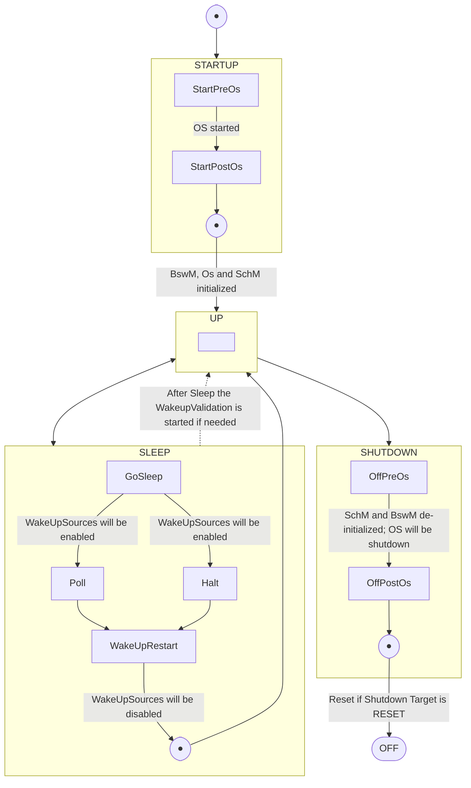
```mermaid
flowchart TD
    Start([●]) --> STARTUP
    
    subgraph STARTUP ["STARTUP"]
        StartPreOs["StartPreOs"]
        StartPreOs --> |OS started| StartPostOs["StartPostOs"]
        StartPostOs --> StartupEnd([●])
    end
    
    StartupEnd --> |BswM, Os and SchM initialized| UP
    
    subgraph UP ["UP"]
        UpState[" "]
    end
    
    UP --> SHUTDOWN
    UP <--> SLEEP
    
    subgraph SLEEP ["SLEEP"]
        GoSleep["GoSleep"] --> |WakeUpSources will be enabled| Poll["Poll"]
        GoSleep --> |WakeUpSources will be enabled| Halt["Halt"]
        Poll --> WakeUpRestart["WakeUpRestart"]
        Halt --> WakeUpRestart
        WakeUpRestart --> |WakeUpSources will be disabled| SleepEnd([●])
    end
    
    SleepEnd --> UP
    
    subgraph SHUTDOWN ["SHUTDOWN"]
        OffPreOs["OffPreOs"]
        OffPreOs --> |SchM and BswM de-initialized; OS will be shutdown| OffPostOs["OffPostOs"]
        OffPostOs --> ShutdownEnd([●])
    end
    
    ShutdownEnd --> |Reset if Shutdown Target is RESET| OFF
    
    OFF([OFF])
    
    SLEEP -.-> |After Sleep the WakeupValidation is started if needed| UP
```

**Figure 7.1: Phases of the ECU Manager**
-- page 31 --

### 7.1.1 STARTUP Phase

The purpose of the STARTUP phase is to initialize the basic software modules to the point where Generic Mode Management facilities are operational. For more details about the initialization see chapter 7.3.

### 7.1.2 UP Phase

Essentially, the UP phase starts when the BSW Scheduler has started and BswM_Init has been called. At that point, memory management is not initialized, there are no communication stacks, no SW-C support (RTE) and the SW-Cs have not started. Processing starts in a certain mode (the next one configured after Startup) with corresponding runnables, i.e. the BSW MainFunctions, and continues as an arbitrary combination of mode changes which cause the BswM to execute actions as well as triggering and disabling corresponding runnables.

From the ECU Manager Module perspective, the ECU is "up", however. The BSW Mode Manager Module then starts mode arbitration and all further BSW initialization, starting the RTE and (implicitly) starting SW-Cs becomes code executed in the BswM's action lists or driven by mode-dependent scheduling, effectively under the control of the integrator.

Initializing the NvM and calling NvM_Readall therefore also becomes integration code. This means that the integrator is responsible for triggering the initialization of Com, DEM and FIM at the end of NvM_ReadAll. The NvM will notify the BswM when NvM_ReadAll has finished.

Note that the RTE can be started after NvM and COM have been initialized. Note also that the communication stack need not be fully initialized before COM can be initialized.

These changes initialize BSW modules as well as starting SW-Cs in arbitrary order until the ECU reaches full capacity and the changes continue to determine the ECU capabilities thereafter as well.

Ultimately mode switches stop SW-Cs and de-initialize the BSW so that the Up phase ends when the ECU reaches a state where it can be powered off.

So, as far as the ECU Manager module is concerned, the BSW and SW-Cs run until they are ready for the ECU to be shut down or put to sleep.

Refer to the Guide to Mode Management [4] for guidance on how to design mode-driven ECU management and for configuring the BSW Mode Manager accordingly.
-- page 32 --

### 7.1.3 SHUTDOWN Phase

`[SWS_EcuM_03022]` The SHUTDOWN phase handles the controlled shutdown of basic software modules and finally results in the selected shutdown target OFF or RESET. `(SRS_ModeMgm_09072)`

### 7.1.4 SLEEP Phase

The ECU saves energy in the SLEEP phase. Typically, no code is executed but power is still supplied, and if configured accordingly, the ECU is wakeable in this state<sup>1</sup>. The ECU Manager module provides a configurable set of (hardware) sleep modes which typically are a trade off between power consumption and time to restart the ECU.

The ECU Manager module wakes the ECU up in response to intended or unintended wakeup events. Since unintended wakeup events should be ignored, the ECU Manager module provides a protocol to validate wakeup events. The protocol specifies a cooperative process between the driver which handles the wakeup source and the ECU Manager (see section 7.6.4 ).

### 7.1.5 OFF Phase

The ECU enters the OFF state when it is powered down. The ECU may be wakeable in this state but only for wakeup sources with integrated power control. In any case the ECU must be startable (e.g. by reset events).

<sup>1</sup>Some ECU designs actually do require code execution to implement a SLEEP state (and the wakeup capability). For these ECUs, the clock speed is typically dramatically reduced. These could be implemented with a small loop inside the SLEEP state.
-- page 33 --

## 7.2 Structural Description of the ECU Manager

[Complex architectural diagram showing ECU Manager Module Relationships with the following key elements:

Central «module» EcuM connected to various components:

Left side modules (with «realize» relationships):
- EcuM_GoDownHaltPoll
- EcuM_AL_DriverInitBswM_<x>
- EcuM_flex_Types  
- EcuM_Types_both
- EcuM_GetShutdownTarget
- EcuM_SetState
- EcuM_SelectShutdownTarget
- EcuM_StartCheckWakeup (marked «configurable»)
- EcuM_GetLastShutdownTarget
- EcuM_EndCheckWakeup (marked «configurable»)

Various BSW modules with «mandatory» relationships:
- BswM_Deinit
- SchM_Init
- SchM_Deinit
- Dem_Init
- Dem_PreInit
- Dem_Shutdown
- Mcu_GetResetReason
- Mcu_SetMode
- Mcu_PerformReset
- CanSM_EcuMWakeUpValidation
- Mcu_Init
- ComM_EcuM_WakeUpIndication
- BswM_EcuM_CurrentWakeup
- StartOS
- ShutdownOS
- GetResource
- ReleaseResource
- DisableAllInterrupts
- EnableAllInterrupts
- ComM_EcuM_PNCWakeUpIndication

Right side modules (with «optional» relationships):
- EcuM_Types
- Adc_Init
- Can_Init
- CanTrcv_Init
- Det_Init
- Det_ReportError
- EthTrcv_Init
- Eth_Init
- Fr_Init
- Fls_Init
- GetCoreID
- FrTrcv_Init
- Icu_Init
- Gpt_Init
- LinTrcv_Init
- IoHwAb_Init
- Port_Init
- Lin_Init
- Wdg_Init
- Pwm_Init
- Ocu_Init
- Spi_Init
- StartCore
- BswM_Init
- GetEvent
- ShutdownAllCores
- WdgM_PerformReset
- SetEvent
- EthSwt_Init]

**Figure 7.2: ECU Manager Module Relationships**

Figure 7.2 illustrates the ECU Manager module's relationship to the interfaces of other BSW modules. In most cases, the ECU Manager module is simply responsible for
-- page 34 --

initialization<sup>2</sup>. There are however some modules that have a functional relationship with the ECU Manager module, which is explained in the following paragraphs.

### 7.2.1 Standardized AUTOSAR Software Modules

Some Basic Software driver modules are initialized, shut down and re-initialized upon wakeup by the ECU Manager module.

The OS is initialized and shut down by the ECU Manager.

After the OS initialization, additional initialization steps are undertaken by the ECU Manager module before passing control to the BswM. The BswM hands execution control back to the ECU Manager module immediately before OS shutdown. Details are provided in the chapters 7.3 STARTUP and 7.4 SHUTDOWN .

### 7.2.2 Software Components

SW-Components contain the AUTOSAR ECU's application code.

A SW-C interacts with the ECU Manager module using AUTOSAR ports.

## 7.3 STARTUP Phase

See Chapter 7.1.1 for an overview description of the STARTUP phase.

<sup>2</sup>To be precise, "initialization" could also mean de-initialization.
-- page 35 --

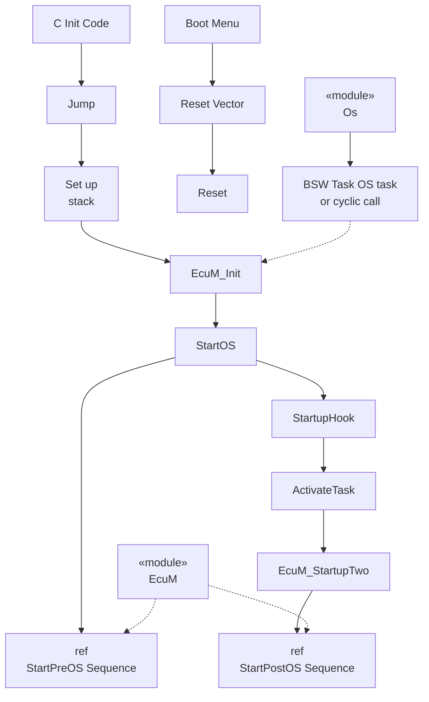
```mermaid
flowchart TD
    A[Boot Menu] --> B[Reset Vector]
    C[C Init Code] --> D[Jump]
    E[«module»<br/>Os] --> F[BSW Task OS task<br/>or cyclic call]
    G[«module»<br/>EcuM]
    
    B --> H[Reset]
    D --> I[Set up<br/>stack]
    
    I --> J[EcuM_Init]
    J --> K[StartOS]
    K --> L[ref<br/>StartPreOS Sequence]
    
    K --> M[StartupHook]
    M --> N[ActivateTask]
    N --> O[EcuM_StartupTwo]
    O --> P[ref<br/>StartPostOS Sequence]
    
    F -.-> J
    G -.-> L
    G -.-> P
```

**Figure 7.3: STARTUP Phase**

Figure 7.3 shows the startup behavior of the ECU. When invoked through EcuM_Init, the ECU Manager module takes control of the ECU startup procedure. With the call to StartOS, the ECU Manager module temporarily relinquishes control. To regain control, the Integrator has to implement an OS task that is automatically started and calls EcuM_StartupTwo as its first action.

### 7.3.1 Activities before EcuM_Init

The ECU Manager module assumes that before EcuM_Init (see [SWS_EcuM_02811] ) is called a minimal initialization of the MCU has taken place, so that a stack is set up and code can be executed, also that C initialization of variables has been performed.

### 7.3.2 Activities in StartPreOS Sequence

[SWS_EcuM_02411] ⌐Table StartPreOS Sequence shows the activities in StartPre OS Sequence and the order in which they shall be executed in EcuM_Init (see [SWS_EcuM_02811] ).⌐()
-- page 36 --

|StartPreOS Sequence<br/>Initialization Activity|StartPreOS Sequence<br/>Comment|StartPreOS Sequence<br/>Opt.|
|-|-|-|
|Callout \`EcuM\_AL\_SetProgrammableInterrupts\`|On ECUs with programmable interrupt priorities, these priorities must be set before the OS is started.<br/>Init block 0|yes|
|Callout \`EcuM\_AL\_DriverInitZero\`|This callout may only initialize BSW modules that do not use post-build configuration parameters. The callout may not only contain driver initialization but also any kind of pre-OS, low level initialization code. See 7.3.5 Driver Initialization|yes|
|Callout \`EcuM\_DeterminePbConfiguration\`|This callout is expected to return a pointer to a fully initialized \`EcuM\_ConfigType\` structure containing the post-build configuration data for the ECU Manager module and all other BSW modules.|no|
|Check consistency of configuration data|If check fails the \`EcuM\_ErrorHook\` is called. See 7.3.4 Checking Configuration Consistency for details on the consistency check.<br/>Init block I|no|
|Callout \`EcuM\_AL\_DriverInitOne\`|The callout may not only contain driver initialization but any kind of pre-OS, low level initialization code. See 7.3.5 Driver Initialization|yes|
|Get reset reason|The reset reason is derived from a call to \`Mcu\_GetResetReason\` and the mapping defined via the EcuMWakeupSource configuration containers. See 8.4.1.2 \`EcuM\_SetWakeupEvent\` and 8.3.5.3 \`EcuM\_GetValidatedWakeupEvents\` (see \[SWS\_EcuM\_02830] )|no|
|Select default shutdown target|See \[SWS\_EcuM\_02181]|no|
|Callout \`EcuM\_LoopDetection\`|If Loop Detection is enabled, this callout is called on every startup.|yes|
|Start OS|Start the AUTOSAR OS, see \[SWS\_EcuM\_02603]|no|


**Table 7.1: StartPreOS Sequence**

Note to column *Opt.* : Optional activities can be switched on or off by configuration. See section 10.1 Common Containers and configuration parameters for details.

**[SWS_EcuM_02623]** The ECU Manager module shall remember the wakeup source resulting from the reset reason translation (see table *StartPreOS Sequence* ).⌐()

Rationale for [SWS_EcuM_02623]: The wakeup sources must be validated by the `EcuM_MainFunction` (see section 7.6.4 Activities in the WakeupValidation Sequence).

**[SWS_EcuM_02684]** When activated through the `EcuM_Init` (see [SWS_EcuM_02811] ) function, the ECU Manager module shall perform the actions in the StartPreOS Sequence (see table *StartPreOS Sequence* ).⌐()
-- page 37 --

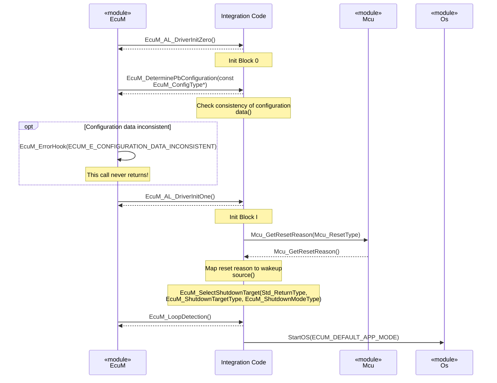
```mermaid
sequenceDiagram
    participant EcuM as «module»<br/>EcuM
    participant IC as Integration Code
    participant Mcu as «module»<br/>Mcu
    participant Os as «module»<br/>Os
    
    EcuM->>IC: EcuM_AL_DriverInitZero()
    IC-->>EcuM: 
    
    Note over IC: Init Block 0
    
    EcuM->>IC: EcuM_DeterminePbConfiguration(const<br/>EcuM_ConfigType*)
    IC-->>EcuM: 
    
    Note over IC: Check consistency of configuration<br/>data()
    
    opt Configuration data inconsistent
        EcuM->>EcuM: EcuM_ErrorHook(ECUM_E_CONFIGURATION_DATA_INCONSISTENT)
        Note over EcuM: This call never returns!
    end
    
    EcuM->>IC: EcuM_AL_DriverInitOne()
    IC-->>EcuM: 
    
    Note over IC: Init Block I
    
    IC->>Mcu: Mcu_GetResetReason(Mcu_ResetType)
    Mcu-->>IC: Mcu_GetResetReason()
    
    Note over IC: Map reset reason to wakeup<br/>source()
    
    Note over IC: EcuM_SelectShutdownTarget(Std_ReturnType,<br/>EcuM_ShutdownTargetType, EcuM_ShutdownModeType)
    
    EcuM->>IC: EcuM_LoopDetection()
    IC-->>EcuM: 
    
    IC->>Os: StartOS(ECUM_DEFAULT_APP_MODE)
```

**Figure 7.4: StartPreOS Sequence**
-- page 38 --

The StartPreOS Sequence is intended to prepare the ECU to initialize the OS and should be kept as short as possible. Drivers should be initialised in the UP phase when possible and the callouts should also be kept short. Interrupts should not be used during this sequence. If interrupts have to be used, only category I interrupts are allowed in the StartPreOS Sequence 1<sup>3</sup> .

Initialization of drivers and hardware abstraction modules is not strictly defined by the ECU Manager. Two callouts EcuM_AL_DriverInitZero (see [SWS_EcuM_02905] ) and EcuM_AL_DriverInitOne (see [SWS_EcuM_02907] ) are provided to define the init blocks 0 and I. These blocks contain the initialization activities associated with the StartPreOS sequence.

MCU_Init does not provide complete MCU initialization. Additionally, hardware dependent steps have to be executed and must be defined at system design time. These steps are supposed to be taken within the EcuM_AL_DriverInitZero (see EcuM_AL_DriverInitZero, [SWS_EcuM_02905] ) or EcuM_AL_DriverInitOne callouts (see EcuM_AL_DriverInitOne, [SWS_EcuM_02907] ). Details can be found in the Specification of MCU Driver [10].

[SWS_EcuM_02181] The ECU Manager module shall call EcuM_GetValidatedWakeupEvents with the configured default shutdown target (EcuMDefaultShutdownTarget).()

See section 7.7 Shutdown Targets.

[SWS_EcuM_02603] The StartPreOS Sequence shall initialize all basic software modules that are needed to start the OS.()

### 7.3.3 Activities in the StartPostOS Sequence

|Initialization Activity|StartPostOS SequenceComment|Opt.|
|-|-|-|
|Start BSW Scheduler||no|
|Init BSW Mode Manager||no|
|Init BSW Scheduler|Initialize the semaphores for critical sections used by BSW modules|no|
|Start Scheduler Timing|Start periodical events for BSW/SWCs|no|


Table 7.2: StartPostOS Sequence

Note to column Opt. : Optional activities can be switched on or off by configuration. See section 10.1 Common Containers and configuration parameters for details.

[SWS_EcuM_02932] When activated through the EcuM_StartupTwo (see [SWS_EcuM_02838] ) function, the ECU Manager module shall perform the actions in StartPostOS Sequence (see table 7.2).(SRS_ModeMgm_09113)

<sup>3</sup>Category II interrupts require a running OS while category I interrupts do not. AUTOSAR OS requires each interrupt vector to be exclusively put into one category.
-- page 39 --

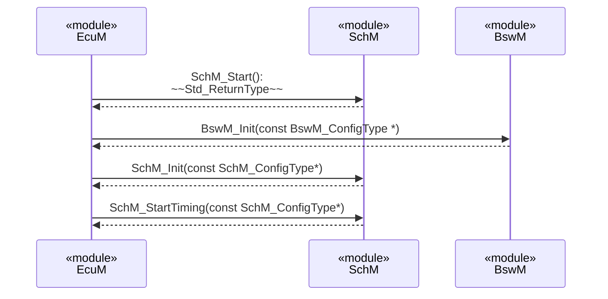
```mermaid
sequenceDiagram
    participant EcuM as «module»<br/>EcuM
    participant SchM as «module»<br/>SchM  
    participant BswM as «module»<br/>BswM
    
    EcuM->>SchM: SchM_Start():<br/>~~Std_ReturnType~~
    SchM-->>EcuM: 
    EcuM->>BswM: BswM_Init(const BswM_ConfigType *)
    BswM-->>EcuM: 
    EcuM->>SchM: SchM_Init(const SchM_ConfigType*)
    SchM-->>EcuM: 
    EcuM->>SchM: SchM_StartTiming(const SchM_ConfigType*)
    SchM-->>EcuM: 
```

**Figure 7.5: StartPostOS Sequence**

### 7.3.4 Checking Configuration Consistency

#### 7.3.4.1 The Necessity for Checking Configuration Consistency in the ECU Manager

In an AUTOSAR ECU several configuration parameters are set and put into the ECU at different times. Pre-compile parameters are set, inserted into the generated source code and compiled into object code. When the source code has been compiled, link-time parameters are set, compiled, and linked with the previously configured object code into an image that is put into the ECU. Finally, post-build parameters are set, compiled, linked, and put into the ECU at a different time. All these parameters must match to obtain a stable ECU.
-- page 40 --

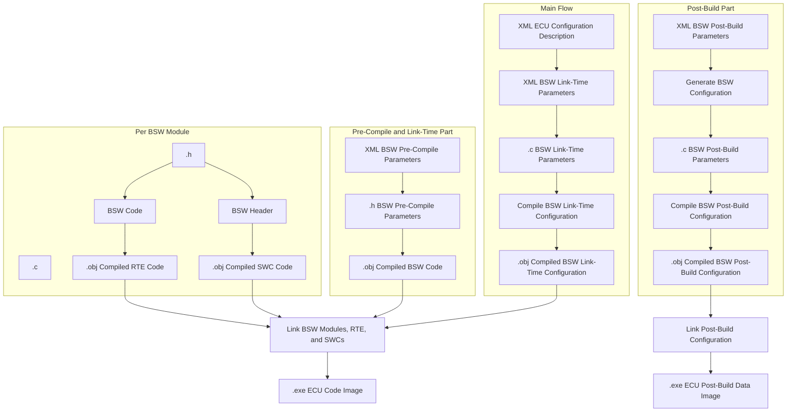
```mermaid
flowchart TD
    subgraph "Per BSW Module"
        C1[.c]
        H1[.h]
        H1 --> BSW_Code[BSW Code]
        H1 --> BSW_Header[BSW Header]
        BSW_Code --> OBJ1[.obj Compiled RTE Code]
        BSW_Header --> OBJ2[.obj Compiled SWC Code]
    end
    
    subgraph "Pre-Compile and Link-Time Part"
        XML1[XML BSW Pre-Compile Parameters] --> H2[.h BSW Pre-Compile Parameters]
        H2 --> OBJ3[.obj Compiled BSW Code]
    end
    
    subgraph "Main Flow"
        XML2[XML ECU Configuration Description] --> XML3[XML BSW Link-Time Parameters]
        XML3 --> C2[.c BSW Link-Time Parameters]
        C2 --> Compile1[Compile BSW Link-Time Configuration]
        Compile1 --> OBJ4[.obj Compiled BSW Link-Time Configuration]
    end
    
    subgraph "Post-Build Part"
        XML4[XML BSW Post-Build Parameters] --> Generate[Generate BSW Configuration]
        Generate --> C3[.c BSW Post-Build Parameters]
        C3 --> Compile2[Compile BSW Post-Build Configuration]
        Compile2 --> OBJ5[.obj Compiled BSW Post-Build Configuration]
    end
    
    OBJ1 --> Link1[Link BSW Modules, RTE, and SWCs]
    OBJ2 --> Link1
    OBJ3 --> Link1
    OBJ4 --> Link1
    Link1 --> EXE1[.exe ECU Code Image]
    
    OBJ5 --> Link2[Link Post-Build Configuration]
    Link2 --> EXE2[.exe ECU Post-Build Data Image]
```

**Figure 7.6: BSW Configuration Steps**

The configuration tool can check the consistency of configuration time parameters itself. The compiler may detect parameter errors at compilation time and the linker may find additional errors at link time. Unfortunately, finding configuration errors in post-build parameters is very difficult. This can only be achieved by checking that

• the pre-compile and link-time parameter settings used when compiling the code

are exactly the same as

• the pre-compile and link-time parameter settings used when configuring and compiling the post-build parameters.

This can only be done at run-time.

Explanation for [SWS_EcuM_02796]: The ECU Manager module checks the consistency once before initializing the first BSW module to avoid multiple checks scattered over the different BSW modules.

This also implies that:

[SWS_EcuM_02796] *The ECU Manager module shall not only check the consistency of its own parameters but of all post-build configurable BSW modules before initializing the first BSW module.* ()

The ECU Manager Configuration Tool must compute a hash value over all pre-compile and link-time configuration parameters of all BSW modules and store the value in the link-time ECUM_CONFIGCONSISTENCY_HASH (see EcuMConfigConsistencyHash) configuration parameter. The hash value is necessary for two reasons. First, the pre-compile and link-time parameters are not accessible at run-time. Second, the check
-- page 41 --

must be very efficient at run-time. Comparing hundreds of parameters would cause an unacceptable delay in the ECU startup process.

The ECU Manager module Configuration Tool must in turn put the computed `ECUM_CONFIGCONSISTENCY_HASH` value into the field in the `EcuM_ConfigType` structure which contains the root of all post-build configuration parameters.

[SWS_EcuM_02798] The ECU Manager module shall check in `EcuM_Init` (see [SWS_EcuM_02811] ) that the field in the structure is equal to the value of `ECUM_CONFIGCONSISTENCY_HASH` .()

By computing hash values at configuration time and comparing them at run-time the EcuM code can be very efficient and is furthermore independent of a particular hash computation algorithm. This allows the use of complex hash computation algorithms, e.g. cryptographically strong hash functions.

Note that the same hash algorithm can be used to produce the value for the post-build configuration identifier in the `EcuM_ConfigType` structure. Then the hash algorithm is applied to the post-build parameters instead of the pre-compile and link-time parameters.

[SWS_EcuM_02799] The hash computation algorithm used to compute a hash value over all pre-compile and link-time configuration parameters of all BSW modules shall always produce the same hash value for the same set of configuration data regardless of the order of configuration parameters in the XML files.()

#### 7.3.4.2 Example Hash Computation Algorithm

Note: This chapter is not normative. It describes one possible way to compute hash values.

A simple CRC over the values of configuration parameters will not serve as a good hash algorithm. It only detects global changes, e.g. one parameter has changed from 1 to 2. But if another parameter changed from 2 to 1, the CRC might stay the same.

Additionally, not only the values of the configuration parameters but also their names must be taken into account in the hash algorithm. One possibility is to build a text file that contains the names of the configuration parameters and containers, separate them from the values using a delimiter, e.g. a colon, and putting each parameter as a line into a text file.

If there are multiple containers of the same type, each container name can be appended with a number, e.g. "_0", "_1" and so on.

To make the hash value independent of the order in which the parameters are written into the text file, the lines in the file must now be sorted lexicographically.
-- page 42 --

Finally, a cryptographically strong hash function, e.g. MD5, can be run on the text file to produce the hash value. These hash functions produce completely different hash values for slightly changed input files.

### 7.3.5 Driver Initialization

A driver's location in the initialization process depends strongly on its implementation and the target hardware design.

Drivers can be initialized by the ECU Manager module in Init Block 0 or Init Block 1 of the STARTUP phase or re-initialized in the `EcuM_AL_DriverRestart` callout of the WakeupRestart Sequence. Drivers can also be initialized or re-initialized by the BswM during the UP phase.

This chapter applies to those AUTOSAR Basic Software drivers, other than SchM and BswM, whose initialization and re-initialization is handled by the ECU Manager module and not the BswM.

**[SWS_EcuM_02559]** The configuration of the ECU Manager module shall specify the order of initialization calls inside init block 0 and init block 1. (see `EcuMDriverInitListZero` and `EcuMDriverInitListOne`). (SRS_BSW_00416, SRS_ModeMgm_09234)

**[SWS_EcuM_02730]** The ECU Manager module shall call each driver's init function with the parameters derived from the driver's `EcuMModuleService` configuration container. (SRS_ModeMgm_09234)

**[SWS_EcuM_02947]** For re-initialization during WakeupRestart, the integrator shall integrate a restart block into the integration code for `EcuM_AL_DriverRestart` (see [SWS_EcuM_02923]) using the `EcuMDriverRestartList`. (SRS_ModeMgm_09234)

**[SWS_EcuM_02562]** `EcuMDriverRestartList` may contain drivers that serve as wakeup sources. `EcuM_AL_DriverRestart` shall re-arm the trigger mechanism of these drivers' 'wakeup detected' callback. ()

See Section 7.5.5 Activities in the WakeupRestart Sequence.

**[SWS_EcuM_02561]** The ECU Manager module shall initialize the drivers in `EcuMDriverRestartList` in the same order as in the combined list of init block 0 and init block 1. ()

Hint for [SWS_EcuM_02561]: `EcuMDriverRestartList` will typically only contain a subset of the combined list of init block 0 and init block 1 drivers.

Table 7.3 shows one possible (and recommended) sequence of activities for the Init Blocks 0 and I. Depending on hardware and software configuration, BSW modules may be added or left out and other sequences may also be possible.
-- page 43 --

|Initialization Activity|Recommended Init Block|Comment|
|-|-|-|
|Init Block 04|Default Error Tracer|This should always be the first module to be initialized, so that other modules can report development errors.|
||Diagnostic Event Manager|Pre-Initialization|
||Any drivers needed to access post-build configuration data|These drivers shall not depend on the post-build configuration or on OS features.|
||||
|Init Block I5|MCU Driver||
||Port Driver||
||General Purpose Timer||
||Watchdog Driver|Internal watchdogs only, external ones may need SPI|
||Watchdog Manager||
||ADC Driver||
||ICU Driver||
||PWM Driver||
||OCU Driver||


**Table 7.3: Driver Initialization Details, Sample Configuration**

### 7.3.6 BSW Initialization

The remaining BSW modules are initialized by the BSW Mode Manager, using a configured function of the ECU Manager (EcuMDriverInitCalloutName ECUC_EcuM_00227) created from the configured list of init functions ( `EcuMDriverInitListBswM` ).

[SWS_EcuM_04142] *The configuration of the ECU Manager module shall specify the order of initialization calls inside the BSW initialization (see `EcuMDriverInitListB-swM` ).*()

## 7.4 SHUTDOWN Phase

Refer to Section 7.1.3 SHUTDOWN Phase for an overview of the SHUTDOWN phase. `EcuM_GoDownHaltPoll` with shutdown target RESET or OFF initiates the SHUTDOWN Phase.

[SWS_EcuM_02756] *When a wakeup event occurs during the shutdown phase, the ECU Manager module shall complete the shutdown and restart immediately thereafter.*()

<sup>4</sup>Drivers in Init Block 0 are listed in the EcuMDriverInitListZero configuration container.
<sup>5</sup>Drivers in Init Block I are listed in the EcuMDriverInitListOne configuration container.
-- page 44 --

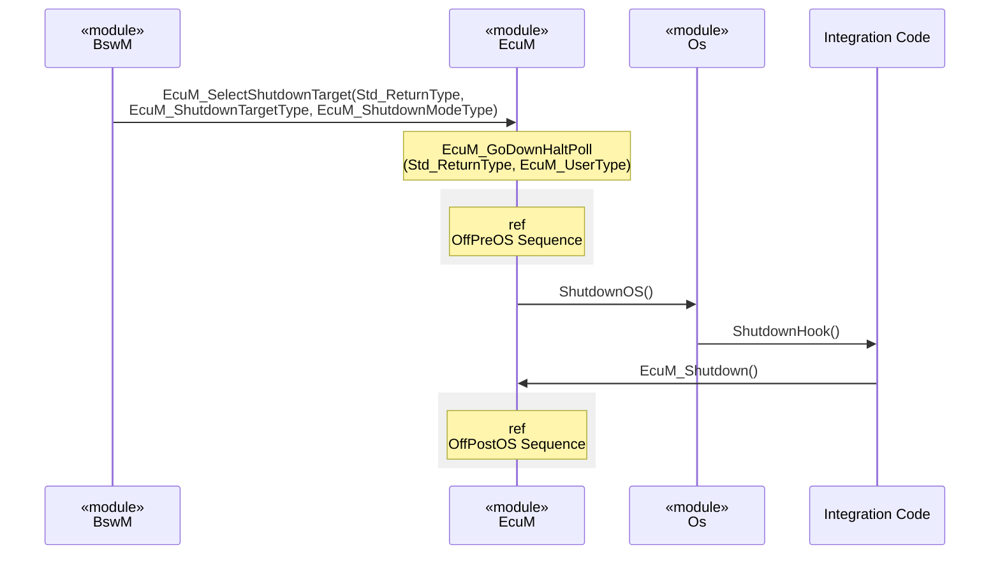
```mermaid
sequenceDiagram
    participant BswM as «module»<br/>BswM
    participant EcuM as «module»<br/>EcuM
    participant Os as «module»<br/>Os
    participant IC as Integration Code
    
    BswM->>EcuM: EcuM_SelectShutdownTarget(Std_ReturnType,<br/>EcuM_ShutdownTargetType, EcuM_ShutdownModeType)
    
    Note over EcuM: EcuM_GoDownHaltPoll<br/>(Std_ReturnType, EcuM_UserType)
    
    rect rgb(240, 240, 240)
        Note over EcuM: ref<br/>OffPreOS Sequence
    end
    
    EcuM->>Os: ShutdownOS()
    Os->>IC: ShutdownHook()
    IC->>EcuM: EcuM_Shutdown()
    
    rect rgb(240, 240, 240)
        Note over EcuM: ref<br/>OffPostOS Sequence
    end
```

**Figure 7.7: SHUTDOWN Phase**

### 7.4.1 Activities in the OffPreOS Sequence

**[SWS_EcuM_03021]** ⌈See 7.4⌉(*SRS_ModeMgm_09127*)

|OffPreOS Sequence<br/>Shutdown Activity|OffPreOS Sequence<br/>Comment|Opt.|
|-|-|-|
|De-init BSW Mode Manager||no|
|De-init BSW Scheduler||no|
|Check for pending wakeup events|Purpose is to detect wakeup events that occurred during shutdown|no|
|Set RESET as shutdown target, if wakeup events are pending (default reset mode of \`EcuMDefaultReset-ModeRef\` will be used)|This action shall only be carried out when pending wakeup events were detected to allow an immediate startup|no|
|ShutdownOS|Last operation in this OS task|no|


**Table 7.4: OffPreOs Sequence**

Note to column *Opt.* : Optional activities can be switched on or off by configuration. It shall be the system designers choice if a module is compiled in or not for an ECU design. See chapter 10.1 Common Containers and configuration parameters for details.

**[SWS_EcuM_02952]** ⌈As its last activity, the ECU Manager module shall call the ShutdownOS function.⌉(*SRS_ModeMgm_09104*)

The OS calls the shutdown hook at the end of its shutdown.
-- page 45 --

`[SWS_EcuM_02953]` The shutdown hook shall call `EcuM_Shutdown` (see `[SWS_EcuM_02812]`) to terminate the shutdown process. `EcuM_Shutdown`(see `[SWS_EcuM_02812]`) shall not return but switch off the ECU or issue a reset.(`SRS_ModeMgm_09104`)

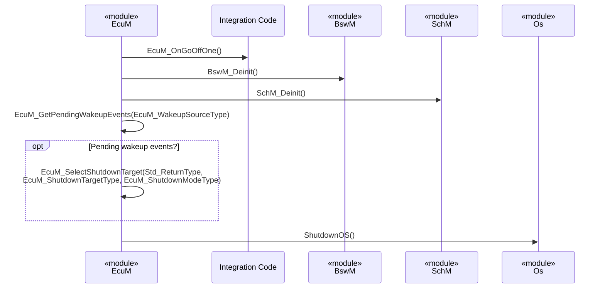
```mermaid
sequenceDiagram
    participant EcuM as «module»<br/>EcuM
    participant IC as Integration Code
    participant BswM as «module»<br/>BswM
    participant SchM as «module»<br/>SchM
    participant Os as «module»<br/>Os
    
    EcuM->>IC: EcuM_OnGoOffOne()
    EcuM->>BswM: BswM_Deinit()
    EcuM->>SchM: SchM_Deinit()
    EcuM->>EcuM: EcuM_GetPendingWakeupEvents(EcuM_WakeupSourceType)
    
    opt Pending wakeup events?
        EcuM->>EcuM: EcuM_SelectShutdownTarget(Std_ReturnType,<br/>EcuM_ShutdownTargetType, EcuM_ShutdownModeType)
    end
    
    EcuM->>Os: ShutdownOS()
```

**Figure 7.8: OffPreOS Sequence**

### 7.4.2 Activities in the OffPostOS Sequence

The OffPostOS sequence implements the final steps to reach the shutdown target after the OS has been shut down. `EcuM_Shutdown` (see `[SWS_EcuM_02812]`) initiates the sequence.


The shutdown target can be either ECUM_SHUTDOWN_TARGET_RESET or ECUM_SHUTDOWN_TARGET_OFF, whereby the specific reset modality is determined by the reset mode. See section 7.7 Shutdown Targets for details.

-- page 46 --

|Shutdown Activity|OffPostOS Sequence Comment|Opt.|
|-|-|-|
|Callout EcuM\_OnGoOffTwo|||
|Callout EcuM\_AL\_Reset or Callout EcuM\_AL\_SwitchOff|Depends on the selected shutdown target (RESET or OFF)|no|


**Table 7.5: OffPostOs Sequence**

Note to column *Opt.* : Optional activities can be switched on or off by configuration. It shall be the system designers choice if a module is compiled in or not for an ECU design. See chapter 10.1 Common Containers and configuration parameters for details.

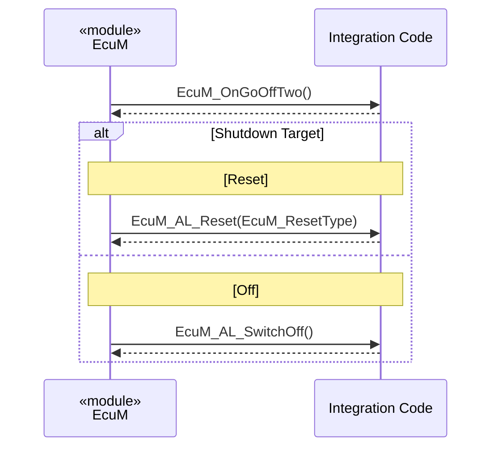
```mermaid
sequenceDiagram
    participant EcuM as «module»<br/>EcuM
    participant IC as Integration Code
    
    EcuM->>IC: EcuM_OnGoOffTwo()
    IC-->>EcuM: 
    
    alt Shutdown Target
        note over EcuM, IC: [Reset]
        EcuM->>IC: EcuM_AL_Reset(EcuM_ResetType)
        IC-->>EcuM: 
    else
        note over EcuM, IC: [Off]
        EcuM->>IC: EcuM_AL_SwitchOff()
        IC-->>EcuM: 
    end
```

**Figure 7.9: OffPostOS Sequence**

**[SWS_EcuM_04074]** When the shutdown target is RESET, the ECU Manager module shall call the EcuM_AL_Reset callout.

-- page 47 --

See section 8.5.3.4 `EcuM_AL_Reset` ([SWS_EcuM_04065] ) for details.

[SWS_EcuM_04075] dWhen the shutdown target is OFF, the ECU Manager module shall call the `EcuM_AL_SwitchOff` callout.c()

See section 8.5.3.3 `EcuM_AL_SwitchOff` ([SWS_EcuM_02920] ) for details.

## 7.5 SLEEP Phase

Refer to Section 7.1.4 SLEEP Phase for an overview of the SLEEP phase. `EcuM_GoDownHaltPoll` with shutdown target SLEEP initiate the SLEEP phase.

`EcuM_GoDownHaltPoll` with shutdown target SLEEP initiate two control streams, depending on the sleep mode selected (EcuMSleepModeSuspend parameter), that differ structurally in the mechanisms used to realize sleep. They share the sequences for preparing for and recovering from sleep, however.
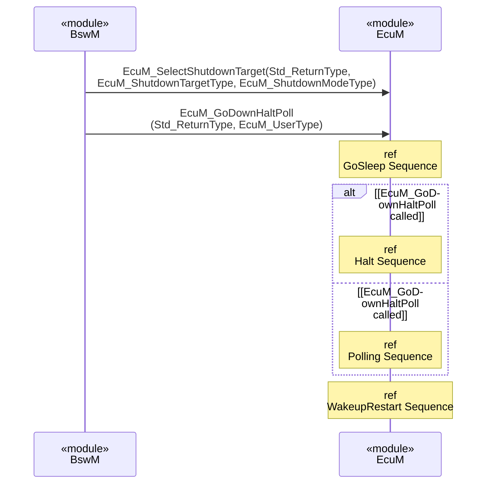
```mermaid
sequenceDiagram
    participant BswM as «module»<br/>BswM
    participant EcuM as «module»<br/>EcuM
    
    BswM->>EcuM: EcuM_SelectShutdownTarget(Std_ReturnType,<br/>EcuM_ShutdownTargetType, EcuM_ShutdownModeType)
    
    BswM->>EcuM: EcuM_GoDownHaltPoll<br/>(Std_ReturnType, EcuM_UserType)
    
    Note over EcuM: ref<br/>GoSleep Sequence
    
    alt [EcuM_GoDownHaltPoll called]
        Note over EcuM: ref<br/>Halt Sequence
    else [EcuM_GoDownHaltPoll called]
        Note over EcuM: ref<br/>Polling Sequence
    end
    
    Note over EcuM: ref<br/>WakeupRestart Sequence
```

**Figure 7.10: SLEEP Phase**

Another module, presumably the BswM, although it could be an SW-C as well, must ensure that an appropriate ECUM_STATE_SLEEP shutdown target has been selected before calling `EcuM_GoDownHaltPoll`.
### 7.5.1 Activities in the GoSleep Sequence

In the GoSleep sequence the ECU Manager module configures hardware for the upcoming sleep phase and sets the ECU up for the next wakeup event.

**[SWS_EcuM_02389]** ⌈To set the wakeup sources up for the next sleep mode, the ECU Manager module shall execute the `EcuM_EnableWakeupSources` callout (see [SWS_EcuM_02546] ) for each wakeup source that is configured in `EcuMWakeupSourceMask` for the target sleep mode.⌉(SRS_ModeMgm_09100)

**[SWS_EcuM_02951]** ⌈In contrast to the SHUTDOWN phase, the ECU Manager module shall not shut down the OS when entering the SLEEP phase. The sleep mode, i.e. combination of the EcuM SLEEP phase and the Mcu Mode, shall be transparent to the OS.⌉()

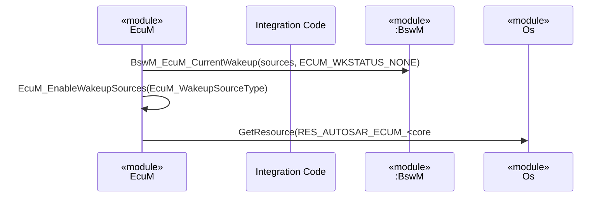
```mermaid
sequenceDiagram
    participant EcuM as «module»<br/>EcuM
    participant IC as Integration Code
    participant BswM as «module»<br/>:BswM
    participant Os as «module»<br/>Os
    
    EcuM->>BswM: BswM_EcuM_CurrentWakeup(sources, ECUM_WKSTATUS_NONE)
    EcuM->>EcuM: EcuM_EnableWakeupSources(EcuM_WakeupSourceType)
    EcuM->>Os: GetResource(RES_AUTOSAR_ECUM_<core#>)
```

**Figure 7.11: GoSleep Sequence**

**[SWS_EcuM_03010]** ⌈When operating on a multicore ECU ECUM shall reserve a dedicated resource (RES_AUTOSAR_ECUM) for each core, which is allocated during Go Sleep.⌉()

### 7.5.2 Activities in the Halt Sequence

**[SWS_EcuM_02960]** ⌈The ECU Manager module shall execute the Halt Sequence in sleep modes that halt the microcontroller. In these sleep modes the ECU Manager module does not execute any code.⌉()

**[SWS_EcuM_02863]** ⌈The ECU Manager module shall invoke the `EcuM_GenerateRamHash` (see [SWS_EcuM_02919] ) callout before halting the microcontroller the
-- page 50 --

`EcuM_CheckRamHash` (see [SWS_EcuM_02921] ) callout after the processor returns from halt.

In case of applied multi core and existence of "slave" EcuM(s) this check should be executed on the "master" EcuM only. The "master" EcuM generates the hash out of all data that lie within its reach. Private data of "slave" EcuMs are out of scope.()

Rationale for [SWS_EcuM_02863] : Ram memory may become corrupted when an ECU is held in sleep mode for a long time. The RAM memory's integrity should therefore be checked to prevent unforeseen behavior. The system designer may choose an adequate checksum algorithm to perform the check.
-- page 51 --

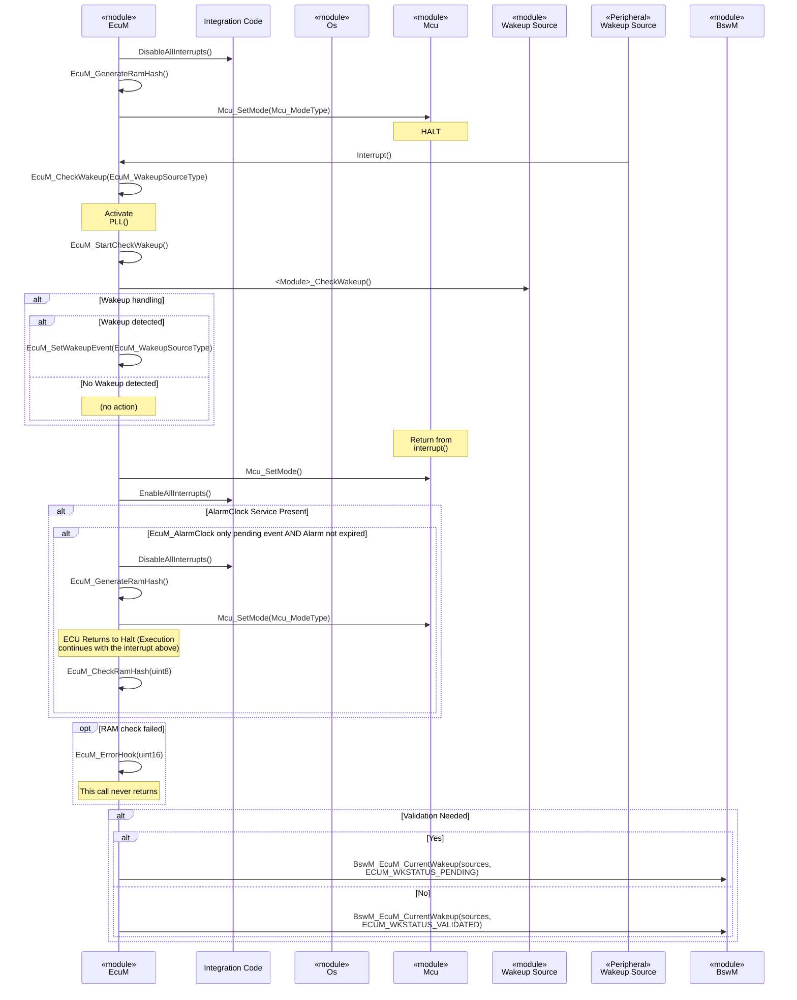
```mermaid
sequenceDiagram
    participant EcuM as «module»<br/>EcuM
    participant IntCode as Integration Code
    participant Os as «module»<br/>Os
    participant Mcu as «module»<br/>Mcu
    participant WakeupSrc as «module»<br/>Wakeup Source
    participant PeriphWakeup as «Peripheral»<br/>Wakeup Source
    participant BswM as «module»<br/>BswM

    EcuM->>IntCode: DisableAllInterrupts()
    EcuM->>EcuM: EcuM_GenerateRamHash()
    EcuM->>Mcu: Mcu_SetMode(Mcu_ModeType)
    
    Note over Mcu: HALT
    
    PeriphWakeup->>EcuM: Interrupt()
    EcuM->>EcuM: EcuM_CheckWakeup(EcuM_WakeupSourceType)
    Note over EcuM: Activate<br/>PLL()
    EcuM->>EcuM: EcuM_StartCheckWakeup()
    EcuM->>WakeupSrc: <Module>_CheckWakeup()
    
    alt Wakeup handling
        alt Wakeup detected
            EcuM->>EcuM: EcuM_SetWakeupEvent(EcuM_WakeupSourceType)
        else No Wakeup detected
            Note over EcuM: (no action)
        end
    end
    
    Note over Mcu: Return from<br/>interrupt()
    EcuM->>Mcu: Mcu_SetMode()
    EcuM->>IntCode: EnableAllInterrupts()
    
    alt AlarmClock Service Present
        alt EcuM_AlarmClock only pending event AND Alarm not expired
            EcuM->>IntCode: DisableAllInterrupts()
            EcuM->>EcuM: EcuM_GenerateRamHash()
            EcuM->>Mcu: Mcu_SetMode(Mcu_ModeType)
            Note over EcuM: ECU Returns to Halt (Execution<br/>continues with the interrupt above)
            EcuM->>EcuM: EcuM_CheckRamHash(uint8)
        end
    end
    
    opt RAM check failed
        EcuM->>EcuM: EcuM_ErrorHook(uint16)
        Note over EcuM: This call never returns
    end
    
    alt Validation Needed
        alt Yes
            EcuM->>BswM: BswM_EcuM_CurrentWakeup(sources,<br/>ECUM_WKSTATUS_PENDING)
        else No
            EcuM->>BswM: BswM_EcuM_CurrentWakeup(sources,<br/>ECUM_WKSTATUS_VALIDATED)
        end
    end
```

**Figure 7.12: Halt Sequence**
-- page 52 --

**[SWS_EcuM_02961]** The ECU Manager module shall invoke the `EcuM_GenerateRamHash` (see [SWS_EcuM_02919] ) where the system designer can place a RAM integrity check.()

### 7.5.3 Activities in the Poll Sequence

**[SWS_EcuM_02962]** The ECU Manager module shall execute the Poll Sequence in sleep modes that reduce the power consumption of the microcontroller but still execute code.()

**[SWS_EcuM_03020]** In the Poll sequence the EcuM shall call the callouts `EcuM_SleepActivity` and `EcuM_CheckWakeup()` in a blocking loop until a pending/validated wakeup event is reported.()
-- page 53 --

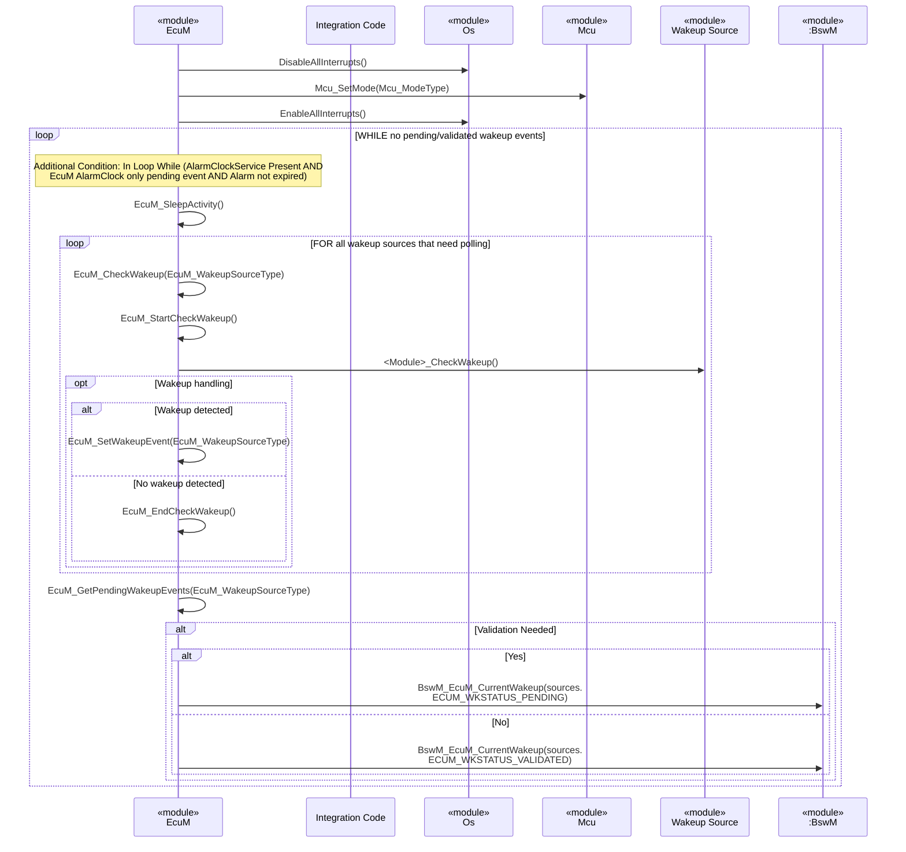
```mermaid
sequenceDiagram
    participant EcuM as «module»<br/>EcuM
    participant IC as Integration Code
    participant Os as «module»<br/>Os
    participant Mcu as «module»<br/>Mcu
    participant WS as «module»<br/>Wakeup Source
    participant BswM as «module»<br/>:BswM

    EcuM->>Os: DisableAllInterrupts()
    EcuM->>Mcu: Mcu_SetMode(Mcu_ModeType)
    EcuM->>Os: EnableAllInterrupts()
    
    loop WHILE no pending/validated wakeup events
        Note over EcuM: Additional Condition: In Loop While (AlarmClockService Present AND<br/>EcuM AlarmClock only pending event AND Alarm not expired)
        EcuM->>EcuM: EcuM_SleepActivity()
        
        loop FOR all wakeup sources that need polling
            EcuM->>EcuM: EcuM_CheckWakeup(EcuM_WakeupSourceType)
            EcuM->>EcuM: EcuM_StartCheckWakeup()
            EcuM->>WS: <Module>_CheckWakeup()
            
            opt Wakeup handling
                alt Wakeup detected
                    EcuM->>EcuM: EcuM_SetWakeupEvent(EcuM_WakeupSourceType)
                else No wakeup detected
                    EcuM->>EcuM: EcuM_EndCheckWakeup()
                end
            end
        end
        
        EcuM->>EcuM: EcuM_GetPendingWakeupEvents(EcuM_WakeupSourceType)
        
        alt Validation Needed
            alt Yes
                EcuM->>BswM: BswM_EcuM_CurrentWakeup(sources.<br/>ECUM_WKSTATUS_PENDING)
            else No
                EcuM->>BswM: BswM_EcuM_CurrentWakeup(sources.<br/>ECUM_WKSTATUS_VALIDATED)
            end
        end
    end
```

**Figure 7.13: Poll Sequence**
### 7.5.4 Leaving Halt or Poll

**[SWS_EcuM_02963]** ⌈If a wakeup event (e.g. toggling a wakeup line, communication on a CAN bus etc.) occurs while the ECU is in Halt or Poll, then the ECU Manager module shall regain control and exit the SLEEP phase by executing the WakeupRestart sequence.

An ISR may be invoked to handle the wakeup event, but this depends on the hardware and the driver implementation.⌉()

See section 7.5.5 Activities in the WakeupRestart Sequence.

**[SWS_EcuM_04001]** ⌈If irregular events (a hardware reset or a power cycle) occur while the ECU is in Halt or Poll, the ECU Manager module shall restart the ECU in the STARTUP phase.⌉()

### 7.5.5 Activities in the WakeupRestart Sequence

|Wakeup Activity|WakeupRestartComment|Opt.|
|-|-|-|
|Restore MCU normal mode|Selected MCU mode is configured in the configuration parameter EcuMNormalMcuModeRef||
|Get the pending wakeup sources|||
|Callout \`EcuM\_DisableWakeupSources\`|Disable currently pending wakeup source but leave the others armed so that later wakeups are possible.||
|Callout \`EcuM\_AL\_DriverRestart\`|Initialize drivers that need restarting||
|Unlock Scheduler|From this point on, all other tasks may run again.||


**Table 7.6: Wakeup Restart activities**

The ECU Manager module invokes the `EcuM_AL_DriverRestart` (see [SWS_EcuM_02923] ) callout which is intended for re-initializing drivers. Among others, drivers with wakeup sources typically require re-initialization. For more details on driver initialization refer to section 7.3.5 Driver Initialization.

During re-initialization, a driver must check if one of its assigned wakeup sources was the reason for the previous wakeup. If this test is true, the driver must invoke its 'wakeup detected' callback (see the Specification of CAN Transceiver Driver [11] for example), which in turn must call the `EcuM_SetWakeupEvent` (see [SWS_EcuM_02826] ) function.

The driver implementation should only invoke the wakeup callback once. Thereafter it should not invoke the wakeup callback again until it has been re-armed by an explicit function call. The driver must thus be re-armed to fire the callback again.
-- page 55 --

**[SWS_EcuM_02539]** ⌈If the ECU Manager module has a list of wakeup source candidates when the WakeupRestart Sequence has finished, the ECU Manager module shall validate these wakeup source candidates in `EcuM_MainFunction`.⌉()

See section 7.6.4 Activities in the WakeupValidation Sequence.

**[SWS_EcuM_04066]** ⌈

|«module»EcuM|Integration Code|«module»Os|«module»Mcu|
|-|-|-|-|
|||DisableAllInterrupts()||
||||Mcu\_SetMode(Mcu\_ModeType)|
|||EnableAllInterrupts()||
|EcuM\_GetPendingWakeupEvents(EcuM\_WakeupSourceType)||||
|EcuM\_DisableWakeupSources(EcuM\_WakeupSourceType)||||
||EcuM\_AL\_DriverRestart()|||
|||ReleaseResource(RES\_AUTOSAR\_ECUM\_)||


**Figure 7.14: WakeupRestart Sequence**

⌉

()
## 7.6 UP Phase

In the UP Phase, the `EcuM_MainFunction` is executed regularly and it has three major functions:

• To check if wakeup sources have woken up and to initiate wakeup validation, if necessary (see 7.6.4 Activities in the WakeupValidation Sequence)

• To update the Alarm Clock timer

• Arbitrate RUN and POST_RUN requests and releases.

### 7.6.1 Alarm Clock Handling

See section 7.8.2 EcuM Clock Time in the UP Phase for implementation details.

[SWS_EcuM_04002] ⌈When the Alarm Clock service is present (see `EcuMAlarmClockPresent`) the `EcuM_MainFunction` shall update the Alarm Clock Timer⌉()

### 7.6.2 Wakeup Source State Handling

Wakeup source are not only handled during wakeup but continuously, in parallel to all other EcuM activities. This functionality runs in the `EcuM_MainFunction` fully decoupled from the rest of ECU management via mode requests.

[SWS_EcuM_04091] ⌈The wakeup sources can be in the following states:

|State|Description|
|-|-|
|NONE|No wakeup event was detected or has been cleared.|
|PENDING|A wakeup event was detected but not yet validated.|
|VALIDATED|A wakeup event was detected and succesfully validated.|
|EXPIRED|A wakeup event was detected but validation failed.|


**Table 7.7: Wakeup sources**

⌉(SRS_ModeMgm_09136)

Figure 7.15 illustrates the relationship between the wakeup source states and the conditions functions that evoke state changes. The two super-states Disabled and Validation are only shown here for clarification and better understandability.
-- page 57 --

```mermaid
stateDiagram-v2
    [*] --> ECUM_WKSTATUS_NONE : Power On / Initial
    
    state ECUM_WKSTATUS_NONE {
        ECUM_WKSTATUS_NONE : entry / BswM_EcuM_CurrentWakeup(sources, NONE)
    }
    
    state ECUM_WKSTATUS_PENDING {
        ECUM_WKSTATUS_PENDING : entry / BswM_EcuM_CurrentWakeup(sources, PENDING)
        ECUM_WKSTATUS_PENDING : entry / EcuM_StartWakeupSources()
        ECUM_WKSTATUS_PENDING : do / exec. wakeup validation seq.
    }
    
    state ECUM_WKSTATUS_VALIDATED {
        ECUM_WKSTATUS_VALIDATED : entry / BswM_EcuM_CurrentWakeup(sources, VALIDATED)
        ECUM_WKSTATUS_VALIDATED : entry / ComM_EcuM_WakeUpIndication()
    }
    
    state ECUM_WKSTATUS_EXPIRED {
        ECUM_WKSTATUS_EXPIRED : entry / BswM_EcuM_CurrentWakeup(sources, EXPIRED)
        ECUM_WKSTATUS_EXPIRED : entry / EcuM_StopWakeupSources()
    }
    
    ECUM_WKSTATUS_NONE --> ECUM_WKSTATUS_PENDING : EcuM_SetWakeupEvent(sources)\n[No Validation]
    ECUM_WKSTATUS_NONE --> ECUM_WKSTATUS_PENDING : EcuM_SetWakeupEvent(sources)\n[With Validation]
    ECUM_WKSTATUS_PENDING --> ECUM_WKSTATUS_NONE : EcuM_ClearWakeupEvent(sources)
    ECUM_WKSTATUS_PENDING --> ECUM_WKSTATUS_VALIDATED : EcuM_ValidateWakeupEvent()
    ECUM_WKSTATUS_PENDING --> ECUM_WKSTATUS_EXPIRED : Timer Expired
    ECUM_WKSTATUS_VALIDATED --> ECUM_WKSTATUS_NONE : EcuM_SetWakeupEvent(sources)\n[With Validation]
    ECUM_WKSTATUS_EXPIRED --> ECUM_WKSTATUS_NONE : EcuM_SetWakeupEvent(sources)\n[With Validation]
```

**Figure 7.15: Wakeup Source States**

**[SWS_EcuM_04003]** When an ECU Manager action causes the state of a wakeup source to change, the ECU Manager module shall issue a mode request to the BswM to change the wakeup source's mode to the new the wakeup source state.()

For the communication of these wakeup source states the type `EcuM_WakeupStatusType` (see SWS_ECUM_04041) is used.

When the ECU Manager module is in the UP phase, wakeup events do not usually trigger state changes. They trigger the end of the Halt and Poll Sub-Phases, however. The ECU Manager module then executes the WakeupRestart Sequence automatically and returns thereafter to the UP phase.

It is up to the integrator to configure rules in the BswM so that the ECU reacts correctly to the wakeup events, as the reaction depends fully on the current ECU (not ECU Management) state.

If the wakeup source is valid, the BswM returns the ECU to its RUN state. If all wakeup events have gone back to NONE or EXPIRED, the BswM prepares the BSW for SLEEP or OFF again and invokes `EcuM_GoDownHaltPoll`.
Summarizing: every pending event is validated independently (if configured) and the EcuM publishes the result as a mode request to the BswM, which in turn can trigger state changes in the EcuM.

### 7.6.3 Internal Representation of Wakeup States

The EcuM manager module offers the following interfaces to ascertain the state of those wakeup sources:

* `EcuM_GetPendingWakeupEvents`
* `EcuM_GetValidatedWakeupEvents`
* `EcuM_GetExpiredWakeupEvents`

and manipulates the state of the wakeup sources through the following interfaces

* `EcuM_ClearWakeupEvent`
* `EcuM_SetWakeupEvent`
* `EcuM_ValidateWakeupEvent`
* `EcuM_CheckWakeup`
* `EcuM_DisableWakeupSources`
* `EcuM_EnableWakeupSources`
* `EcuM_StartWakeupSources`
* `EcuM_StopWakeupSources`

The ECU Manager module can manage up to 32 wakeup sources. The state of the wakeup sources is typically represented at the EcuM interfaces named above by means of an `EcuM_WakeupSourceType` bitmask where the individual wakeup sources correspond to a fixed bit position. There are 5 predefined bit positions and the rest can be assigned by configuration. See section 8.2.3 `EcuM_WakeupSourceType` for details.

On the one hand, the ECU Manager module manages the modes of each wakeup source. On the other hand, the ECU Manager module presupposes that there are "internal variables" (i.e. `EcuM_WakeupSourceType` instances) that track which wakeup sources are in a particular state (especially NONE (i.e. cleared), PENDING, VALIDATED and EXPIRED). The ECU Manager module uses these "internal variables" in the respective interface definitions to define the semantics of the interface.

Whether these "internal variables" are indeed implemented is therefore of secondary importance. They are simply used to explain the semantics of the interfaces.
### 7.6.4 Activities in the WakeupValidation Sequence

Since wakeup events can be generated unintentionally (e.g. EVM spike on CAN line), it is necessary to validate wakeups before the ECU resumes full operation.

The validation mechanism is the same for all wakeup sources. When a wakeup event occurs, the ECU is woken up from its SLEEP state and execution resumes within the MCU_SetMode service of the MCU driver<sup>7</sup>. When the WakeupRestart Sequence has finished, the ECU Manager module will have a list of pending wakeup events to be validated (see [SWS_EcuM_02539]). The ECU Manager module then releases the BSW Scheduler and all BSW MainFunctions; most notably in this case, the EcuM Main Function can resume processing.

Implementation hint: Since SchM will be running at the end of the StartPostOS and WakeupRestart sequences, there is the possibility that the EcuM_MainFunction will initiate validation for a source whose stack has not yet been initialized. The integrator should configure appropriate modes which indicate that the stack is not available and disable the EcuM_MainFunction accordingly (see [2]).

<sup>7</sup>Actually, the first code to be executed may be an ISR, e.g. a wakeup ISR. However, this is specific to hardware and/or driver implementation.
-- page 60 --

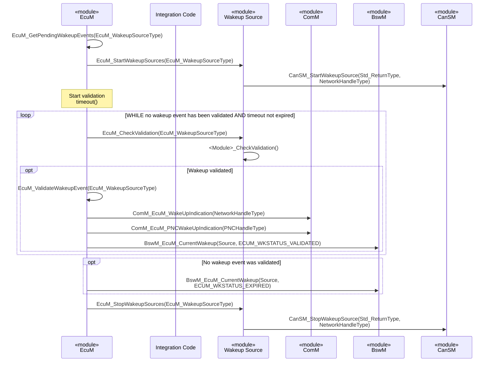
```mermaid
sequenceDiagram
    participant EcuM as «module»<br/>EcuM
    participant IC as Integration Code
    participant WS as «module»<br/>Wakeup Source
    participant ComM as «module»<br/>ComM
    participant BswM as «module»<br/>BswM
    participant CanSM as «module»<br/>CanSM

    EcuM->>EcuM: EcuM_GetPendingWakeupEvents(EcuM_WakeupSourceType)
    EcuM->>WS: EcuM_StartWakeupSources(EcuM_WakeupSourceType)
    WS->>CanSM: CanSM_StartWakeupSource(Std_ReturnType,<br/>NetworkHandleType)
    
    Note over EcuM: Start validation<br/>timeout()
    
    loop WHILE no wakeup event has been validated AND timeout not expired
        EcuM->>WS: EcuM_CheckValidation(EcuM_WakeupSourceType)
        WS->>WS: <Module>_CheckValidation()
        
        opt Wakeup validated
            EcuM->>EcuM: EcuM_ValidateWakeupEvent(EcuM_WakeupSourceType)
            EcuM->>ComM: ComM_EcuM_WakeUpIndication(NetworkHandleType)
            EcuM->>ComM: ComM_EcuM_PNCWakeUpIndication(PNCHandleType)
            EcuM->>BswM: BswM_EcuM_CurrentWakeup(Source, ECUM_WKSTATUS_VALIDATED)
        end
    end
    
    opt No wakeup event was validated
        EcuM->>BswM: BswM_EcuM_CurrentWakeup(Source,<br/>ECUM_WKSTATUS_EXPIRED)
    end
    
    EcuM->>WS: EcuM_StopWakeupSources(EcuM_WakeupSourceType)
    WS->>CanSM: CanSM_StopWakeupSource(Std_ReturnType,<br/>NetworkHandleType)
```

**Figure 7.16: The WakeupValidation Sequence**

[SWS_EcuM_02566] The ECU Manager module shall only invoke wakeup validation on those wakeup sources where it is required by configuration. If the validation protocol
is not configured (see `EcuMValidationTimeout`), then a call to `EcuM_SetWakeupEvent` shall also imply a call to `EcuM_ValidateWakeupEvent`.()

**[SWS_EcuM_02565]** The ECU Manager module shall start a validation timeout for each pending wakeup event that should be validated. The timeout shall be event-specific (see `EcuMValidationTimeout`).()

Implementation hint for [SWS_EcuM_02565]: It is sufficient for an implementation to provide only one timer, which is prolonged to the largest timeout when new wakeup events are reported.

**[SWS_EcuM_04081]** When the validation timeout expires for a pending wakeup event, the `EcuM_MainFunction` sets (OR-operation) set the bit in the internal expired wakeup events variable.()

See also section 7.6.3 Internal Representation of Wakeup States.

**[SWS_EcuM_04082]** When the validation timeout expires for a pending wakeup event, the `EcuM_MainFunction` shall invoke `BswM_EcuM_Current_Wakeup` with an `EcuM_WakeupSourceType` bitmask parameter with the bit corresponding to the wakeup event set and state value parameter set to ECUM_WKSTATUS_EXPIRED.()

The BswM will be configured to monitor the wakeup validation through mode switch requests coming from the EcuM as the wakeup sources are validated or the timers expire. If the last validation timeout (see [SWS_EcuM_02565]) expires without validation then the BswM shall consider wakeup validation to have failed. If at least one of the pending events is validated then the entire validation shall have passed.

Pending events are validated with a call of `EcuM_ValidateWakeupEvent` (see [SWS_EcuM_02829]). This call must be placed in the driver or the consuming stack on top of the driver (e.g. the handler). The best place to put this depends on hardware and software design. See also section 7.6.4.4 Requirements for Drivers with Wakeup Sources.

#### 7.6.4.1 Wakeup of Communication Channels

If a wakeup occurs on a communication channel, the corresponding bus transceiver driver must notify the ECU Manager module by invoking `EcuM_SetWakeupEvent` (see [SWS_EcuM_02826]) function. Requirements for this notification are described in section 5.2 Peripherals with Wakeup Capability.

**[SWS_EcuM_02479]** The ECU Manager module shall execute the Wakeup Validation Protocol upon the `EcuM_SetWakeupEvent` (see [SWS_EcuM_02826]) function call according to *Interaction of Wakeup Sources and the ECU Manager* later in this chapter.()

See also 7.6.4.2 Interaction of Wakeup Sources and the ECU Manager.
-- page 62 --

#### 7.6.4.2 Interaction of Wakeup Sources and the ECU Manager

The ECU Manager module shall treat all wakeup sources in the same way. The procedure shall be as follows:

When a wakeup event occurs, the corresponding driver shall notify the ECU Manager module of the wakeup. The most likely modalities for this notification are:

* After exiting the Halt or Poll sequences. In this scenario, the ECU Manager module invokes `EcuM_AL_DriverRestart` (see `[SWS_EcuM_02923]`) to re-initialize of the relevant drivers, which in turn get a chance to scan their hardware e.g. for pending wakeup interrupts.

* If the wakeup source is actually in sleep mode, the driver must scan autonomously for wakeup events; either by polling or by waiting for an interrupt.

`[SWS_EcuM_02975]` If a wakeup event requires validation then the ECU Manager module shall invoke the validation protocol.()

`[SWS_EcuM_02976]` If a wakeup event does not require validation, the ECU Manager module shall issue a mode switch request to set the event's mode to ECUM_WKSTATUS_VALIDATED.()

`[SWS_EcuM_02496]` If the wakeup event is validated (either immediately or by the wakeup validation protocol), the ECU Manager module shall make the information that it is a source of the current ECU wakeup through the `EcuM_GetValidatedWakeupEvents` (see `[SWS_EcuM_02830]`) function.()

#### 7.6.4.3 Wakeup Validation Timeout

`[SWS_EcuM_04004]` The ECU Manager Module shall either provide a single wakeup validation timeout timer or one timer per wakeup source.()

The following requirements apply:

`[SWS_EcuM_02709]` The ECU Manager module shall start the wakeup validation timeout timer when `EcuM_SetWakeupEvent` (see `[SWS_EcuM_02826]`) is called.()

`[SWS_EcuM_02710]` `EcuM_ValidateWakeupEvent` shall stop the wakeup validation timeout timer (see `[SWS_EcuM_02829]`).()

`[SWS_EcuM_02712]` If `EcuM_SetWakeupEvent` (see `[SWS_EcuM_02826]`) is called subsequently for the same wakeup source, the ECU Manager module shall not restart the wakeup validation timeout.()

If only one timer is used, the following approach is proposed:

If `EcuM_SetWakeupEvent` (see `[SWS_EcuM_02826]`) is called for a wakeup source that did not yet fire during the same wakeup cycle then the ECU Manager module should prolong the validation timeout of that wakeup source.
Wakeup timeouts are defined by configuration (see `EcuMValidationTimeout`).

#### 7.6.4.4 Requirements for Drivers with Wakeup Sources

The driver must invoke `EcuM_SetWakeupEvent` (see [SWS_EcuM_02826] ) once when the wakeup event is detected and supply a `EcuM_WakeupSourceType` parameter identifying the source of the wakeup (see [SWS_EcuM_02165], [SWS_EcuM_02166] ) as specified in the configuration (see `EcuMWakeupSourceId` ).

[SWS_EcuM_02572] ⌈The ECU Manager module shall detect wakeups that occurr prior to driver initialization, both from Halt/Poll or from OFF.⌉()

The driver must provide an API to configure the wakeup source for the SLEEP state, to enable or disable the wakeup source, and to put the related peripherals to sleep. This requirement only applies if hardware provides these capabilities.

The driver should enable the callback invocation in its initialization function.

### 7.6.5 Requirements for Wakeup Validation

If the wakeup source requires validation, this may be done by any but only by one appropriate module of the basic software. This may be a driver, an interface, a handler, or a manager.

Validation is done by calling the `EcuM_ValidateWakeupEvent` (see [SWS_EcuM_02829] ) function.

[SWS_EcuM_02601] ⌈If the EcuM cannot determine the reset reason returned by the Mcu driver, then the EcuM set a wakeup event for default wakeup source ECUM_WKSOURCE_RESET instead.⌉()

### 7.6.6 Wakeup Sources and Reset Reason

The ECU Manager module API only provides one type (`EcuM_WakeupSourceType`, see 8.2.3 `EcuM_WakeupSourceType` ), which can describe all reasons why the ECU starts or wakes up.

[SWS_EcuM_02625] ⌈The ECU Manager module shall never invoke validation for the following wakeup sources:

* ECUM_WKSOURCE_POWER
* ECUM_WKSOURCE_RESET
* ECUM_WKSOURCE_INTERNAL_RESET
* ECUM_WKSOURCE_INTERNAL_WDG
* ECUM_WKSOURCE_EXTERNAL_WDG.

]()

### 7.6.7 Wakeup Sources with Integrated Power Control

SLEEP can be realized by a system chip which controls the MCU's power supply. Typical examples are CAN transceivers with integrated power supplies which switch power off at application request and switch power on upon CAN activity.

The consequence is that SLEEP looks like OFF to the ECU Manager module on this type of hardware. This distinction is rather philosophical and not of practical importance.

The practical impact is that a passive wakeup on CAN looks like a power on reset to the ECU. Hence, the ECU will continue with the STARTUP sequence after a wakeup event. Wakeup validation is required nonetheless and the system designer must consider the following topics:

* The CAN transceiver is initialized during one of the driver initialization blocks (under BswM control by default). This is configured or generated code, i.e. code which is under control of the system designer.

* The CAN transceiver driver API provides functions to find out if it was the CAN transceiver which started the ECU due to a passive wakeup. It is the system designer's responsibility to check the CAN transceiver for wakeup reasons and pass this information on to the ECU Manager module by using the `EcuM_SetWakeupEvent` (see [SWS_EcuM_02826] ) and `EcuM_ClearWakeupEvents` (see [SWS_EcuM_02828] ) functions.

These principles can be applied to all wakeup sources with integrated power control. The CAN transceiver only serves as an example.

## 7.7 Shutdown Targets

"Shutdown Targets" is a descriptive term for all states ECU where no code is executed. They are called shutdown targets because they are the destination states where the state machine will drive to when the UP phase is left. The following states are shutdown targets:

* Off<sup>8</sup>
* Sleep

<sup>8</sup>The OFF state requires the capability of the ECU to switch off itself. This is not granted for all hardware designs.
* Reset

Note that the time at which a shutdown target is or can be determined is not necessarily the start of the shutdown. Since the BswM now controls most ECU resources, it will determine the time at which the shutdown target should be set and will set it, either directly or indirectly. The BswM must therefore ensure that, for example, the shutdown target must be changed from its default to ECUM_STATE_SLEEP before calling `EcuM_GoDownHaltPoll`.

In previous versions of the ECU Manager module, sleep targets were treated specially, as the sleep modes realized in the ECU depended on the capabilities of the ECU. These sleep modes depend on hardware and differ typically in clock settings or other low power features provided by the hardware. These different features are accessible through the MCU driver as so-called MCU modes (see [10] ). There are also various modalities for performing a reset which are controlled, or triggered, by different modules:

* Mcu_PerformReset
* WdgM_PerformReset
* Toggle I/O Pin via DIO / SPI

The ECU Manager module offers a facility to manage these reset modalities by to tracking the time and cause of previous resets. The various reset modalities will be treated as reset modes, using the same mode facitlities as sleep.

Refer to section 8.3.4 Shutdown Management for the shutdown management facility's interface definitions.

### 7.7.1 Sleep

[SWS_EcuM_02188] ⌈No wakeup event shall be missed in the SLEEP phase. The Halt or Poll Sequences shall not be entered if a wakeup event has occurred in the Go Sleep sequence.⌉()

[SWS_EcuM_02957] ⌈The ECU Manager module may define a configurable set of sleep modes (see `EcuMSleepMode` ) where each mode itself is a shutdown target.⌉()

[SWS_EcuM_02958] ⌈The ECU Manager module shall allow mapping the MCU sleep modes to ECU sleep modes and hence allow them to be addressed as shutdown targets.⌉()

[SWS_EcuM_04092] ⌈The ShutdownTarget Sleep shall put the all cores into sleep.⌉()
-- page 66 --

### 7.7.2 Reset

**[SWS_EcuM_04005]** The ECU Manager module shall define a configurable set of reset modes (see `EcuMResetMode` and `EcuM_ResetType`), where each mode itself is a shutdown target. The set will minimally contain targets for

* Mcu_PerformReset
* WdgM_PerformReset  
* Toggle I/O Pin via DIO / SPI

()

**[SWS_EcuM_04006]** The ECU Manager module shall allow defining aliases for reset targets (See EcuM180_Conf). ()

**[SWS_EcuM_04007]** The ECU Manager module shall define a configurable set of reset causes (see `EcuMShutdownCause` and `EcuM_ShutdownCauseType`). The set shall minimally contain targets for

* ECU state machine entered a shutdown state
* WdgM detected a failure
* DCM requests shutdown

and the time of the reset. ()

**[SWS_EcuM_04008]** The ECU Manager Module shall offer facilities to BSW modules and SW-Cs to

* Record a shutdown cause
* Get a set of recent shutdown causes

()

See also section 8.3.4 Shutdown Management.

## 7.8 Alarm Clock

The ECU Manager module provides an optional persistent clock service which remains "active" even during sleep. It thus guarantees that an ECU will be woken up at a certain time in the future (assuming that the hardware does not fail) and provides clock services for long-term activities (i.e. measured in hours to days, even years).

Generally, this service will be realized with timers in the ECU that can induce wakeups. In some cases, external devices can also use a regular interrupt line to periodically wake the ECU up, however. Whatever the mechanism used, the service uses one wakeup source privately.
-- page 67 --

The ECU Manager module maintains a master alarm clock whose value determines the time at which the ECU will be woken up. Moreover the ECU manager manages an internal clock, the EcuM clock, which is used to compare with the master alarm.

Note that the alarm wakeup mechanisms are only relevant to the SLEEP phase. SW-Cs and BSW modules can set and retrieve alarm values during the UP phase (and only during the UP phase), which will be respected during the SLEEP phase, however.

Compared to other timing/wakeup mechanisms that could be implemented using general ECU Manager module facilities, the Alarm Clock service will not initiate the WakeupRestart Sequence until the timer expires. When the ECU Module detects that its timer has caused a wakeup event, it increments its timer and returns immediately to sleep unless the clock time has exceeded the alarm time.

**[SWS_EcuM_04069]** When the Alarm Clock service is present (see `EcuMAlarmClockPresent`) the EcuM Manager module shall maintain an EcuM clock whose time shall be the time in seconds since battery connect.

**[SWS_EcuM_04086]** The EcuM clock shall track time in the UP and SLEEP phases.

**[SWS_EcuM_04087]** Hardware permitting, the EcuM clock time shall not be reset by an ECU reset.

**[SWS_EcuM_04088]** There shall be one and only one wakeup source assigned to the EcuM Clock (see `EcuMAlarmWakeupSource`).

### 7.8.1 Alarm Clocks and Users

SW-Cs and BSW modules can each maintain an alarm clock (user alarm clock). Each user alarm clock (see `EcuMAlarmClock`) is associated with an `EcuMAlarmClockUser` which identifies the respective SW-C or BSW module.

**[SWS_EcuM_04070]** Each EcuM User shall have at most one user alarm clock.

**[SWS_EcuM_04071]** An EcuM User shall not be able to set the value of another user's alarm clock.

**[SWS_EcuM_04072]** The ECU Manager module shall set always the master alarm clock value to the value of the earliest user alarm clock value.

This means as well that when an EcuM User issues an abort on its alarm clock and that user alarm clock determines the current master alarm clock value, the ECU Manager module shall set the master alarm clock value to the next earliest user alarm clock value.

**[SWS_EcuM_04073]** Only authorized EcuM Users can set the EcuM clock time (see `EcuMSetClockAllowedUsers`).
-- page 68 --

Rationale for `[SWS_EcuM_04073]`: Generally EcuM Users shall not be able to set the EcuM clock time. The EcuM clock time can be set to an arbitrary time to allow testing alarms that take days to expire.

### 7.8.2 EcuM Clock Time

`[SWS_EcuM_04089]` If the underlying hardware mechanism is tick based, the ECUM shall "correct" the time accordingly.()

#### 7.8.2.1 EcuM Clock Time in the UP Phase

The `EcuM_MainFunction` increments the EcuM clock during the UP Phase. It uses standard OS mechanisms (alarms / counters) to derive its time. Note the difference in granularity between the counters and EcuM time, which is measured in seconds (`[SWS_EcuM_04069]`).

#### 7.8.2.2 EcuM Clock Time in the Sleep Phase

There are two alternatives to increment the EcuM clock during sleep depending on which sleep mode was selected (EcuMSleepModeSuspend parameter)

Within the Halt Sequence (see `7.5.2` Activities in the Halt Sequence) the GPT Driver must be put in to a `GPT_MODE_SLEEP` to only configure those timer channels required for the time base. It also requires the GPT to enable the timer based wakeup channel using the `Gpt_EnableWakeup` API. Preferably the `Gpt_StartTimer` API will be set to 1 sec but if this value is not reachable the EcuM will need to be woken up more often to accumulate several timer wakeups until 1 sec has been accumulated to increment the clock value.

Within the Poll Sequence (see `7.5.3` Activities in the Poll Sequence) the EcuM clock can be periodically updated during the `EcuM_SleepActivity` function using the `EcuM_SetClock` function, assuming a notion of time is still available. The clock must only be incremented when 1 sec of time has been accumulated.

In both situations after the clock has been incremented during Sleep the ECU Manager module must evaluate if the master alarm has expired. If so the BswM will initiate a full startup or set the ECU in Sleep again.

`[SWS_EcuM_04009]` When leaving the Sleep state the ECU Manager Module will abort any active user alarm clock and the master alarm clock. This means that both clock induced and wakeups due to other events will result in clearing all alarms.(SRS_ModeMgm_09187)
**[SWS_EcuM_04010]** User alarms and the master alarm shall be cancelled during the StartPreOS Sequence, in the WakeupRestart Sequence and the OffPreOS Sequence. (SRS_ModeMgm_09188)

## 7.9 MultiCore

The distribution of BSW modules onto different partitions was introduced.

A partition can be seen as an independent section that is mapped on one core. So every core (both in single and in multi core architectures) contains at least one but also can contain arbitrary numbers of partitions. But no partition can span over more than one core.

The BSW modules can be distributed over different partitions and therefore over different cores. Some BSW modules as the BswM have to be included into every partition. Other modules like the OS or the EcuM have be included into one partition per core.

An example is shown in Figure 7.17.

|ECU|ECU|ECU|ECU|ECU|
|-|-|-|-|-|
|Core 0||Core 1|||
|Partition 0|Partition 1|Partition 2|Partition 3|Partition 4|
|Application Layer|||||
|RTE|||||
|BswM|BswM||BswM|BswM|
|EcuM|||EcuM||
|OS||OS|||
|Other<br/>BSW<br/>modules|Other<br/>BSW<br/>modules|Other<br/>BSW<br/>modules|Other<br/>BSW<br/>modules|Other<br/>BSW<br/>modules|
|Microcontroller (μC)|||||


**Figure 7.17: Partitions inside an ECU**

In a multi core architecture the EcuM has to be distributed in a way, that one instance per core exists.

There is one designated master core in which the boot loader starts the master EcuM via EcuM_Init. The master EcuM starts some drivers, determines the Post Build configuration and starts all remaining cores with all their satellite EcuMs.

Each EcuM now starts the core local OS and all core local BswMs (in every partition resides exactly one BswM).
If the same image of EcuM is executed on every core of the ECU, the ECU Manager's behavior has to differ on the different cores. This can be accomplished by the ECU Manager by testing first whether it is on a master or a slave core and act appropriately.

The ECU Manager module supports the same phases on a MultiCore ECU as are available on conventional ECUs (i.e. STARTUP, UP, SHUTDOWN and SLEEP).

If safety mechanisms are used, The ECU State Manager has to run with full trust level.

This section uses previous ECU Manager terms for various ECU states, notably Run/PostRun. With flexible ECU management, the system integrator determines the ECU's states' names and semantics. Methods to ensure a de-initialization phase must be upheld, however. The names used here are therefore not normative.

### 7.9.1 Master Core

There is one explicit master core. Which core the master core is, is determined by the boot loader. The EcuM of the master core gets started as first BSW module and performs initialization actions.

Then is starts all other cores with all other EcuMs.

When these are started, it initializes together with each satellite EcuM the core local OS and BswM.

### 7.9.2 Slave Core

On every slave core, one satellite EcuM has to run. If a core contains more than one partition, only on EcuM per core has to exist.

### 7.9.3 Master Core - Slave Core Signalling

This section discusses the general mechanisms with which BSW can communicate over cores. It presupposed general knowledge of the SchM, which is described and specified in the RTE.

#### 7.9.3.1 BSW Level

The Operating System provides a basic mechanism for synchronizing the starts of the operating systems on the master and slave cores. The Scheduler Manager provides basic mechanisms for communication of BSW modules across partition boundaries. One BSW Mode Manager per core is responsible for starting and stopping the RTE.
-- page 71 --

Refer to the Guide to Mode Management [23] for a more complete description of the solution approaches and for a discussion of the considerations in choosing between them.

#### 7.9.3.2 Example for Shutdown Synchronization

Before calling `ShutdownAllCores`, the "master" ECU Manager Module must start the shutdown of all "slave" ECU Manager Modules and has to wait until all modules have de-initialized the BSW modules for which they are responsible and successfully shutdown.

Therefore the master ECU Manager Module sets a shutdown flag which can be read by all slave modules. The EcuM activates afterwards tasks for every configured slave core. The slave modules read the flag inside the main routine and shutdown if requested. The task name is "EcuM_SlaveCore<X>_Task", where X is a number. The task need to be configured by the integrator. The number of tasks which need to be activated can be calculated by counting the instances of EcuMPartitionRef minus one, because one EcuMFlexPartionRef is used for the master.

Example: Three instances of EcuMPartitionRef are configured. Then during call of `EcuM_GoDownHaltPoll()` "EcuM_SlaveCore1_Task" and "EcuM_SlaveCore2_Task" would be started. The slave modules read the flag inside the main routine and shutdown if requested.

The Operating System extends the OSEK SetEvent function across cores. A task on one core can wait for an event set on another core. Figure 18 illustrates how this applies to the problem of synchronizing the cores before calling `ShutdownAllCores` (whereby the de-initialization details have been omitted). The Set/WaitEvent functions accept a bitmask which can be used to indicate shutdown-readiness on the individual slave cores. Each SetEvent call from a "slave" ECU Manager module will stop the "master" ECU Manager module's wait. The "master" ECU Manager module must therefore track the state of the individual slave cores and set the wait until all cores have registered their readiness.

The WaitEvent() function can be replaced by a GetEvent() loop if the caller already has taken a resource or spinlock.
-- page 72 --

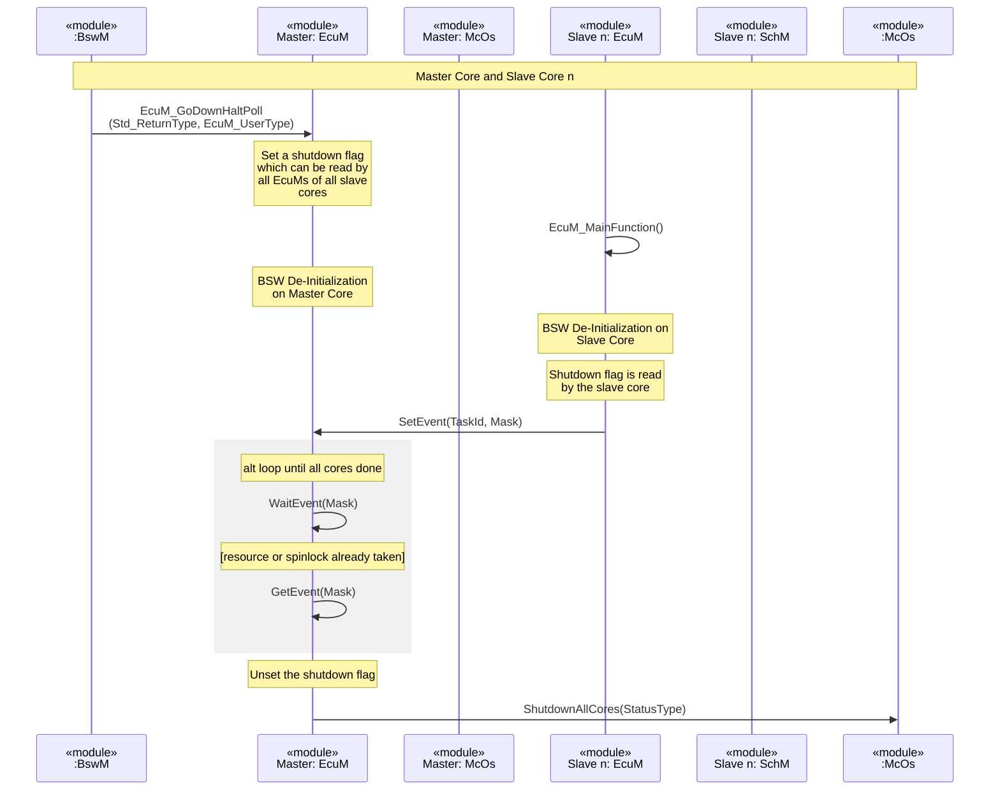
```mermaid
sequenceDiagram
    participant BswM as «module»<br/>:BswM
    participant MasterEcuM as «module»<br/>Master: EcuM
    participant MasterMcOs as «module»<br/>Master: McOs
    participant SlaveEcuM as «module»<br/>Slave n: EcuM
    participant SlaveSchM as «module»<br/>Slave n: SchM
    participant SlaveMcOs as «module»<br/>:McOs
    
    Note over BswM, SlaveMcOs: Master Core and Slave Core n
    
    BswM->>MasterEcuM: EcuM_GoDownHaltPoll<br/>(Std_ReturnType, EcuM_UserType)
    
    Note over MasterEcuM: Set a shutdown flag<br/>which can be read by<br/>all EcuMs of all slave<br/>cores
    
    SlaveEcuM->>SlaveEcuM: EcuM_MainFunction()
    
    Note over MasterEcuM: BSW De-Initialization<br/>on Master Core
    Note over SlaveEcuM: BSW De-Initialization on<br/>Slave Core
    
    Note over SlaveEcuM: Shutdown flag is read<br/>by the slave core
    
    SlaveEcuM->>MasterEcuM: SetEvent(TaskId, Mask)
    
    rect rgb(240, 240, 240)
        Note over MasterEcuM: alt loop until all cores done
        MasterEcuM->>MasterEcuM: WaitEvent(Mask)
        
        Note over MasterEcuM: [resource or spinlock already taken]
        MasterEcuM->>MasterEcuM: GetEvent(Mask)
    end
    
    Note over MasterEcuM: Unset the shutdown flag
    
    MasterEcuM->>SlaveMcOs: ShutdownAllCores(StatusType)
```

**Figure 7.18: Master / Slave Core Shutdown Synchronization (this is an example)**

Note: Figure 7.18 is an example of the logical control flow on the master core. The API `EcuM_GoDownHaltPoll` needs to be offered on every core managed by the EcuM. The behavior of this function on slave cores is implementation specific.

Integration note: If synchronization between master and slave cores is achieved by means `SetEvent/WaitEvent`, then `EcuM_GoDownHaltPoll` will be called by the
-- page 73 --

BswM in the context of its main function task (deferred processing of mode arbitration). This additionally requires that the main function task is an extended task.

### 7.9.4 UP Phase

From the hardware perspective, it is possible that wakeup interrupts could occur on all cores. Then the whole ECU gets woken up and the EcuM running on that processes the wakeup event.

**[SWS_EcuM_04011]** The `EcuM_MainFunction` shall run in all EcuM instances.()

**[SWS_EcuM_04012]** Each instance of the ECU Manager module shall process the wakeup events of its core.()

As in the single-core case, the BswM (as configured by the integrator) has the responsibility for controlling ECU resources, establishing that the local core can be powered down or halted as well as de-initializing the appropriate applications and BSW before handing control over to the EcuM of its core.

### 7.9.5 STARTUP Phase

The ECU Manager module functions nearly identically on all cores. That is, as for the single-core case, the ECU Manager module performs the steps specified for Startup; most importantly starting the OS, initializing the SchM and starting the core local BswMs.

The master EcuM activates all slave cores after calling InitBlock 1 and doing the reset / wakeup housekeeping. After being activated, the slave cores execute their startup routines, which call `EcuM_Init` on their core.

**[SWS_EcuM_04146]** If `EcuMEcucCoreDefinitionRef` is missing then the initialization call shall only be performed on the master core.()

Note: If you need to initialize a module on multiple cores you have to add the module for each core to the specific initialization list. Please be aware that in such cases the init() function might be called in parallel from different cores and init() functions are normally defined to be non-reentrant.

After each EcuM has called StartOs on its core, the OS synchronizes the cores before executing the core-individual startup hooks and synchronizes the cores again before executing the first tasks on each core.

StartPostOS is executed on each core and the SchM is initialized on each core. All core local BswMs are initialized by each EcuM.

One BswM on every partition has to start the RTE for that core.
-- page 74 --

**[SWS_EcuM_04093]** [The ECU Manager module shall start the SchM and the OS on every core.] ()

**[SWS_EcuM_04014]** [The ECU Manager module shall call `BswM_Init` for all core local BswMs on the master and all slave cores.] ()

#### 7.9.5.1 Master Core STARTUP

**[SWS_EcuM_04015]** [
-- page 75 --

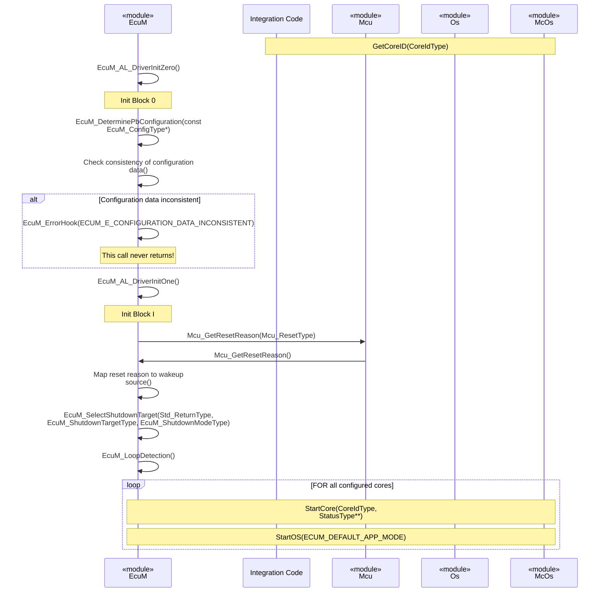
```mermaid
sequenceDiagram
    participant EcuM as «module»<br/>EcuM
    participant IC as Integration Code
    participant Mcu as «module»<br/>Mcu
    participant Os as «module»<br/>Os
    participant McOs as «module»<br/>McOs
    
    Note over IC,McOs: GetCoreID(CoreIdType)
    EcuM->>EcuM: EcuM_AL_DriverInitZero()
    Note over EcuM: Init Block 0
    EcuM->>EcuM: EcuM_DeterminePbConfiguration(const<br/>EcuM_ConfigType*)
    EcuM->>EcuM: Check consistency of configuration<br/>data()
    
    alt Configuration data inconsistent
        EcuM->>EcuM: EcuM_ErrorHook(ECUM_E_CONFIGURATION_DATA_INCONSISTENT)
        Note over EcuM: This call never returns!
    end
    
    EcuM->>EcuM: EcuM_AL_DriverInitOne()
    Note over EcuM: Init Block I
    EcuM->>Mcu: Mcu_GetResetReason(Mcu_ResetType)
    Mcu->>EcuM: Mcu_GetResetReason()
    EcuM->>EcuM: Map reset reason to wakeup<br/>source()
    EcuM->>EcuM: EcuM_SelectShutdownTarget(Std_ReturnType,<br/>EcuM_ShutdownTargetType, EcuM_ShutdownModeType)
    EcuM->>EcuM: EcuM_LoopDetection()
    
    loop FOR all configured cores
        Note over EcuM,McOs: StartCore(CoreIdType,<br/>StatusType**)
        Note over EcuM,McOs: StartOS(ECUM_DEFAULT_APP_MODE)
    end
```

**Figure 7.19: Master Core StartPreOS Sequence**

()

[SWS_EcuM_04016] []
-- page 76 --

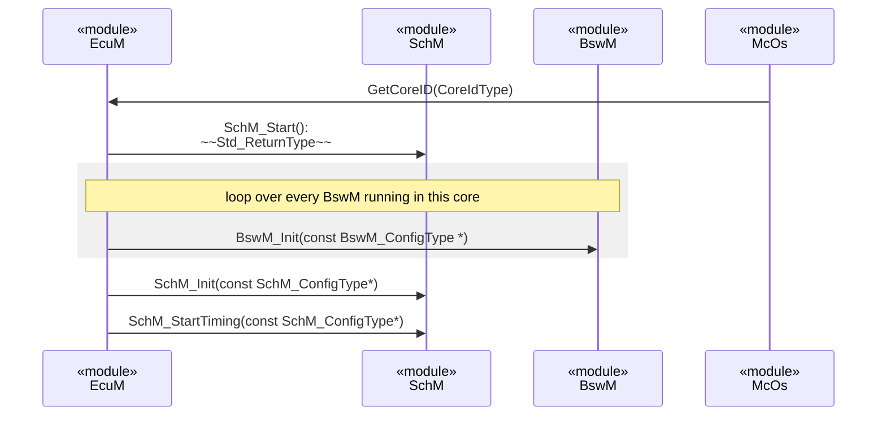
```mermaid
sequenceDiagram
    participant EcuM as «module»<br/>EcuM
    participant SchM as «module»<br/>SchM
    participant BswM as «module»<br/>BswM
    participant McOs as «module»<br/>McOs
    
    McOs->>EcuM: GetCoreID(CoreIdType)
    
    EcuM->>SchM: SchM_Start():<br/>~~Std_ReturnType~~
    
    rect rgb(240, 240, 240)
        note over EcuM, BswM: loop over every BswM running in this core
        EcuM->>BswM: BswM_Init(const BswM_ConfigType *)
    end
    
    EcuM->>SchM: SchM_Init(const SchM_ConfigType*)
    
    EcuM->>SchM: SchM_StartTiming(const SchM_ConfigType*)
```

**Figure 7.20: Master Core StartPostOS Sequence**

()

#### 7.9.5.2 Slave Core STARTUP

**[SWS_EcuM_04145]** The EcuM `EcuM_AL_DriverInitZero` and `EcuM_AL_DriverInitOne` functions shall be called by the `EcuM_Init` function on each core. The implementation of these callout functions shall ensure that only those MCAL modules are initialized that run on the currently active core.()

**[SWS_EcuM_04017]**
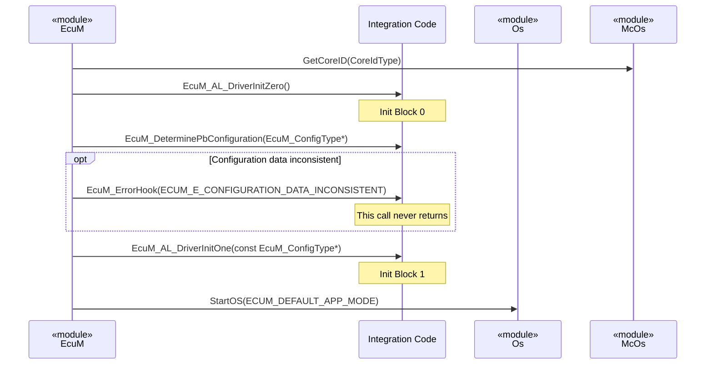
```mermaid
sequenceDiagram
    participant EcuM as «module»<br/>EcuM
    participant IC as Integration Code
    participant Os as «module»<br/>Os
    participant McOs as «module»<br/>McOs
    
    EcuM->>McOs: GetCoreID(CoreIdType)
    EcuM->>IC: EcuM_AL_DriverInitZero()
    Note over IC: Init Block 0
    EcuM->>IC: EcuM_DeterminePbConfiguration(EcuM_ConfigType*)
    
    opt Configuration data inconsistent
        EcuM->>IC: EcuM_ErrorHook(ECUM_E_CONFIGURATION_DATA_INCONSISTENT)
        Note over IC: This call never returns
    end
    
    EcuM->>IC: EcuM_AL_DriverInitOne(const EcuM_ConfigType*)
    Note over IC: Init Block 1
    EcuM->>Os: StartOS(ECUM_DEFAULT_APP_MODE)
```

**Figure 7.21: Slave Core StartPreOS Sequence**

()

[SWS_EcuM_04018] []
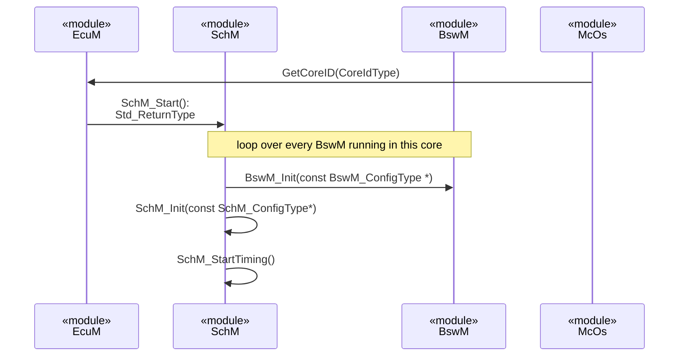
```mermaid
sequenceDiagram
    participant EcuM as «module»<br/>EcuM
    participant SchM as «module»<br/>SchM
    participant BswM as «module»<br/>BswM
    participant McOs as «module»<br/>McOs
    
    McOs->>EcuM: GetCoreID(CoreIdType)
    
    EcuM->>SchM: SchM_Start():<br/>Std_ReturnType
    
    Note over SchM, BswM: loop over every BswM running in this core
    SchM->>BswM: BswM_Init(const BswM_ConfigType *)
    
    SchM->>SchM: SchM_Init(const SchM_ConfigType*)
    
    SchM->>SchM: SchM_StartTiming()
```

**Figure 7.22: Slave Core StartPostOS Sequence**

()

### 7.9.6 SHUTDOWN Phase

Individual core shutdown (i.e. while the rest of the ECU continues to run) is currently not supported. All cores are shut down simultaneously.

When the ECU shall be shut down, the master ECU Manager module calls `ShutdownAllCores` rather than somehow calling `ShutdownOS` on the individual cores. The `ShutdownAllCores` stops the OS on all cores and stops all cores as well.

Since the master core could issue the `ShutdownAllCores` before all slave cores are finished processing, the cores must be synchronized before entering SHUTDOWN.

The BswM (which is distributed over all partitions) ascertains that the ECU should be shut down and synchronizes with each BwsM in the ECU. All BswMs induce de-initialization of all the partition's BSWs, SWCs and CDDs and send appropriate signals to the other BswMs to indicate their readiness to shut down.
-- page 79 --

For a shutdown of the ECU, the BswM (which lies in the same partition of the master EcuM) ultimately calls `GoOff` on the master core which distributes that request to all slave cores. The "master" EcuM de-initializes the BswM, and the SchM. The EcuMs on the slave cores de-initialize their SchM and BswM and then send a signal to indicate that the core is ready for `ShutdownOS` (again, see section section 7.9.3 Master Core - Slave Core Signalling for details).

The master EcuM waits for the signal from each slave core EcuM and then initiates shutdown as usual on the master core (the master EcuM calls `ShutdownAllCores`, and the ECU is put to bed with the global shutdown hook)
#### 7.9.6.1 Master Core SHUTDOWN

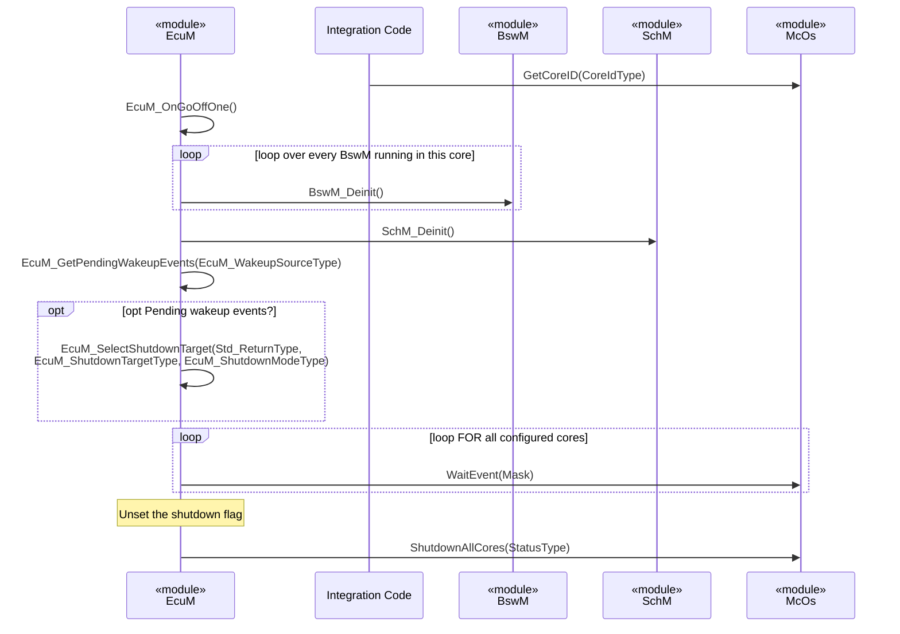
```mermaid
sequenceDiagram
    participant EcuM as «module»<br/>EcuM
    participant IC as Integration Code
    participant BswM as «module»<br/>BswM
    participant SchM as «module»<br/>SchM
    participant McOs as «module»<br/>McOs
    
    IC->>McOs: GetCoreID(CoreIdType)
    EcuM->>EcuM: EcuM_OnGoOffOne()
    
    loop loop over every BswM running in this core
        EcuM->>BswM: BswM_Deinit()
    end
    
    EcuM->>SchM: SchM_Deinit()
    
    EcuM->>EcuM: EcuM_GetPendingWakeupEvents(EcuM_WakeupSourceType)
    
    opt opt Pending wakeup events?
        EcuM->>EcuM: EcuM_SelectShutdownTarget(Std_ReturnType,<br/>EcuM_ShutdownTargetType, EcuM_ShutdownModeType)
    end
    
    loop loop FOR all configured cores
        EcuM->>McOs: WaitEvent(Mask)
    end
    
    Note over EcuM: Unset the shutdown flag
    
    EcuM->>McOs: ShutdownAllCores(StatusType)
```

**Figure 7.23: Master Core OffPreOS Sequence**
-- page 81 --

[SWS_EcuM_04020] d

```mermaid
sequenceDiagram
    participant EcuM as «module»<br/>EcuM
    participant IC as Integration Code
    participant McOs as «module»<br/>McOs
    
    IC->>McOs: GetCoreID(CoreIdType)
    McOs-->>IC: 
    IC->>EcuM: EcuM_OnGoOffTwo()
    EcuM-->>IC: 
    
    alt Shutdown Target
        alt [Reset]
            IC->>EcuM: EcuM_AL_Reset(EcuM_ResetType)
            EcuM-->>IC: 
        else [Off]
            IC->>EcuM: EcuM_AL_SwitchOff()
            EcuM-->>IC: 
        end
    end
```

**Figure 7.24: Master Core OffPostOS Sequence**

()
#### 7.9.6.2 Slave Core SHUTDOWN

```mermaid
sequenceDiagram
    participant EcuM as «module»<br/>EcuM
    participant IC as Integration Code
    participant BswM as «module»<br/>BswM
    participant SchM as «module»<br/>:SchM
    participant McOs as «module»<br/>McOs
    
    IC->>McOs: GetCoreID(CoreIdType)
    McOs-->>IC: 
    EcuM->>IC: EcuM_OnGoOffOne()
    IC-->>EcuM: 
    
    loop loop over every BswM running in this core
        IC->>BswM: BswM_Deinit()
        BswM-->>IC: 
    end
    
    IC->>SchM: SchM_Deinit()
    SchM-->>IC: 
    
    IC->>McOs: SetEvent(TaskId, Mask)
```

**Figure 7.25: Slave Core OffPreOS Sequence**

[SWS_EcuM_04022] ⌐
-- page 83 --

```mermaid
sequenceDiagram
    participant EcuM as «module»<br/>EcuM
    participant IC as Integration Code
    participant McOs as «module»<br/>McOs
    
    EcuM->>McOs: GetCoreID(CoreIdType)
    McOs-->>EcuM: 
    EcuM->>IC: EcuM_OnGoOffTwo()
    IC-->>EcuM: 
```

**Figure 7.26: Slave Core OffPostOS Sequence**

()

### 7.9.7 SLEEP Phase

When the shutdown target Sleep is requested, all cores are put to sleep simultaneously. The MCU must issue a halt for each core. As task timing and priority are local to a core in the OS, neither the scheduler nor the RTE must be synchronized after a halt. Because the master core could issue the MCU halt before all slave cores are finished processing, the cores must be synchronized before entering GoHalt.

The BswMs ascertain that sleep should be initiated and distribute an appropriate ECU mode to each core. The BSWs, SWCs and CDDs on the slave cores must be informed by their partition local BswM, de-initialize appropriately and send appropriate mode requests to the BswM to indicate their readiness.

If the ECU is put to sleep, the "halt"s must be synchronized so that all slave cores are halted before the master core computes the checksum. The ECU Manager module on the master core uses the same "signal" mechanism as for synchronizing cores on Go Off.

Similarly, the ECU Manager module on the master core must validate the checksum before releasing the slave cores from the "halt" state
#### 7.9.7.1 Master Core SLEEP

**[SWS_EcuM_04023]** ⌈

```mermaid
sequenceDiagram
    participant EcuM as «module»<br/>EcuM
    participant IC as Integration Code
    participant BswM as «module»<br/>:BswM
    participant Os as «module»<br/>Os
    
    IC->>Os: GetCoreID(CoreIdType)
    Os-->>IC: 
    IC->>BswM: BswM_EcuM_CurrentWakeup(sources, ECUM_WKSTATUS_NONE)
    BswM-->>IC: 
    IC->>EcuM: EcuM_EnableWakeupSources(EcuM_WakeupSourceType)
    EcuM-->>IC: 
    IC->>Os: GetResource(RES_AUTOSAR_ECUM_<core#>)
    Os-->>IC: 
```

**Figure 7.27: Master Core GoSleep Sequence**

⌈⌉

**[SWS_EcuM_04024]** ⌈
-- page 85 --

```mermaid
sequenceDiagram
    participant EcuM as «module»<br/>EcuM
    participant IC as Integration Code
    participant Os as «module»<br/>Os
    participant Mcu as «module»<br/>Mcu
    participant WS as «module»<br/>Wakeup Source
    participant PWS as «Peripheral»<br/>Wakeup Source
    participant BswM as «module»<br/>:BswM

    Note over EcuM,BswM: Wait for all SlaveCores to be ready to sleep()
    EcuM->>EcuM: DisableAllInterrupts()
    EcuM->>EcuM: EcuM_GenerateRamHash()
    EcuM->>Mcu: Mcu_SetMode(Mcu_ModeType)
    
    Note over Mcu: HALT
    
    PWS->>EcuM: Interrupt()
    EcuM->>WS: EcuM_CheckWakeup(EcuM_WakeupSourceType)
    Note over WS: Activate<br/>PLL()
    WS->>WS: <Module>_CheckWakeup()
    EcuM->>WS: EcuM_SetWakeupEvent(EcuM_WakeupSourceType)
    
    Note over PWS: Return from<br/>interrupt()
    EcuM->>Mcu: Mcu_SetMode()
    EcuM->>EcuM: EnableAllInterrupts()
    
    alt AlarmClock Service Present
        Note over EcuM,BswM: [EcuM_AlarmClock only pending event AND Alarm not expired]
        EcuM->>EcuM: DisableAllInterrupts()
        EcuM->>EcuM: EcuM_GenerateRamHash()
        EcuM->>Mcu: Mcu_SetMode(Mcu_ModeType)
        Note over Mcu,BswM: ECU Returns to Halt (Execution<br/>continues with the interrupt above)
        EcuM->>EcuM: EcuM_CheckRamHash(uint8)
    end
    
    opt RAM check failed
        EcuM->>EcuM: EcuM_ErrorHook(uint16)
        Note over EcuM: This call never returns!
    end
    
    alt Validation Needed
        Note over EcuM,BswM: [Yes]
        EcuM->>BswM: BswM_EcuM_CurrentWakeup(sources,<br/>ECUM_WKSTATUS_PENDING)
    else
        Note over EcuM,BswM: [No]
        EcuM->>BswM: BswM_EcuM_CurrentWakeup(Sources,<br/>ECUM_WKSTATUS_VALIDATED)
    end
    
    Note over EcuM: Signal all SlaveCores<br/>to continue()
```

**Figure 7.28: Master Core Halt Sequence**
(SRS_ModeMgm_09239)

**[SWS_EcuM_04025]** ⌈

```mermaid
sequenceDiagram
    participant EcuM as «module»<br/>EcuM
    participant IC as Integration Code
    participant Os as «module»<br/>Os
    participant Mcu as «module»<br/>Mcu
    participant WS as «module»<br/>Wakeup Source
    participant BswM as «module»<br/>:BswM

    EcuM->>IC: DisableAllInterrupts()
    EcuM->>Mcu: Mcu_SetMode<br/>(Mcu_ModeType)
    EcuM->>IC: EnableAllInterrupts()

    loop WHILE no pending/validated events
        Note over EcuM: Additional Condition is: Loop-While (AlarmClockService Present AND<br/>EcuM AlarmClock only pending event AND Alarm not expired)
        EcuM->>EcuM: EcuM_SleepActivity()

        loop FOR all wakeup sources that need polling
            EcuM->>EcuM: EcuM_CheckWakeup(EcuM_WakeupSourceType)
            EcuM->>WS: <Module>_CheckWakeup()

            opt Wakeup detected
                EcuM->>EcuM: EcuM_SetWakeupEvent(EcuM_WakeupSourceType)
            end
        end

        EcuM->>EcuM: EcuM_GetPendingWakeupEvents(EcuM_WakeupSourceType)
    end

    alt
        Note over BswM: [Yes]
        BswM->>BswM: BswM_EcuM_CurrentWakeup(sources,<br/>ECUM_WKSTATUS_PENDING)
    else
        Note over BswM: [No]
        BswM->>BswM: BswMEcuM_CurrentWakeup(sources,<br/>ECUM_WKSTATUS_VALIDATED)
    end

    EcuM->>EcuM: Signal SlaveCores to<br/>continue()
```

**Figure 7.29: Master Core Poll Sequence**

()

**[SWS_EcuM_04026]** ⌈
-- page 87 --

```mermaid
sequenceDiagram
    participant EcuM as «module»<br/>EcuM
    participant IC as Integration Code
    participant Os as «module»<br/>Os
    participant Mcu as «module»<br/>Mcu
    
    EcuM->>IC: DisableAllInterrupts()
    IC->>Os: 
    IC->>Mcu: Mcu_SetMode(Mcu_ModeType)
    EcuM->>IC: EnableAllInterrupts()
    IC->>Os: 
    EcuM->>EcuM: EcuM_GetPendingWakeupEvents(EcuM_WakeupSourceType)
    EcuM->>EcuM: EcuM_DisableWakeupSources(EcuM_WakeupSourceType)
    EcuM->>IC: EcuM_AL_DriverRestart()
    EcuM->>IC: ReleaseResource(RES_AUTOSAR_ECUM_<core#>)
```

**Figure 7.30: Master Core WakeupRestart Sequence**

()

#### 7.9.7.2 Slave Core SLEEP

[SWS_EcuM_04027] ⌐
-- page 88 --

```mermaid
sequenceDiagram
    participant EcuM as «module»<br/>EcuM
    participant IC as Integration Code
    participant BswM as «module»<br/>:BswM
    participant Os as «module»<br/>Os
    
    IC->>Os: GetCoreID(CoreIdType)
    Os-->>IC: 
    
    IC->>BswM: BswM_EcuM_CurrentWakeup(sources, ECUM_WKSTATUS_NONE)
    BswM-->>IC: 
    
    IC->>EcuM: EcuM_EnableWakeupSources(EcuM_WakeupSourceType)
    EcuM-->>IC: 
    
    IC->>Os: GetResource(RES_AUTOSAR_ECUM_<core#>)
    Os-->>IC: 
```

**Figure 7.31: Slave Core GoSleep Sequence**

()

`[SWS_EcuM_04028]` []
-- page 89 --

```mermaid
sequenceDiagram
    participant EcuM as «module»<br/>EcuM
    participant IC as Integration Code
    participant Os as «module»<br/>Os
    participant Mcu as «module»<br/>Mcu
    participant WS as «module»<br/>Wakeup Source
    participant PWS as «Peripheral»<br/>Wakeup Source
    participant BswM as «module»<br/>:BswM

    EcuM->>IC: Signal MasterCore that Slave is ready to sleep()
    IC->>IC: DisableAllInterrupts()
    IC->>Mcu: Mcu_SetMode(Mcu_ModeType)
    
    Note over Mcu: HALT
    
    PWS->>IC: Interrupt()
    IC->>EcuM: EcuM_CheckWakeup(EcuM_WakeupSourceType)
    EcuM->>WS: <Module>_CheckWakeup()
    EcuM->>IC: EcuM_SetWakeupEvent(EcuM_WakeupSourceType)
    
    Note over IC: Return from<br/>interrupt()
    
    IC->>Mcu: Mcu_SetMode()
    IC->>IC: EnableAllInterrupts()
    
    alt Validation Needed
        IC->>BswM: [Yes] BswM_EcuM_CurrentState(ECUM_WKSTATUS_PENDING)
    else
        IC->>BswM: [No] BswM_EcuM_CurrentWakeup(Sources, ECUM_WKSTATUS_VALIDATED)
    end
    
    IC->>IC: Wait for MasterCore to continue()
```

**Figure 7.32: Slave Core Halt Sequence**

()

[SWS_EcuM_04029] ⌐
-- page 90 --

```mermaid
sequenceDiagram
    participant EcuM as «module»<br/>EcuM
    participant IC as Integration Code
    participant Os as «module»<br/>Os
    participant Mcu as «module»<br/>Mcu
    participant WS as «module»<br/>Wakeup Source
    participant BswM as «module»<br/>BswM

    EcuM->>IC: DisableAllInterrupts()
    EcuM->>Mcu: Mcu_SetMode(Mcu_ModeType)
    EcuM->>IC: EnableAllInterrupts()
    
    loop WHILE no pending/validated events
        Note over EcuM: Additional Conditions to Loop:<br/>While (AlarmClockService Present<br/>AND EcuM.AlarmClock only pending event<br/>AND Alarm not expired)
        EcuM->>EcuM: EcuM_SleepActivity()
        
        loop FOR all wakeup sources that need polling
            EcuM->>WS: EcuM_CheckWakeup(EcuM_WakeupSourceType)
            WS->>WS: <Module>_CheckWakeup()
            
            opt Wakeup detected
                WS->>EcuM: EcuM_SetWakeupEvent(EcuM_WakeupSourceType)
            end
        end
        
        EcuM->>EcuM: EcuM_GetPendingWakeupEvents(EcuM_WakeupSourceType)
    end
    
    alt 
        EcuM->>BswM: [Yes] BswM_EcuM_CurrentWakeup(sources, ECUM_WKSTATUS_PENDING)
    else
        EcuM->>BswM: [No] BswM_EcuM_CurrentWakeup(sources, ECUM_WKSTATUS_VALIDATED)
    end
    
    Note over EcuM: Wait for signal from MasterCore to continue()
```

**Figure 7.33: Slave Core Poll Sequence**

()

**[SWS_EcuM_04030]** ⌐
```mermaid
sequenceDiagram
    participant EcuM as «module»<br/>EcuM
    participant IC as Integration Code
    participant Os as «module»<br/>Os
    participant Mcu as «module»<br/>Mcu
    
    EcuM->>Os: DisableAllInterrupts()
    Os-->>EcuM: 
    EcuM->>Mcu: Mcu_SetMode(Mcu_ModeType)
    Mcu-->>EcuM: 
    EcuM->>Os: EnableAllInterrupts()
    Os-->>EcuM: 
    EcuM->>EcuM: EcuM_DisableWakeupSources(EcuM_WakeupSourceType)
    EcuM->>Os: ReleaseResource(RES_AUTOSAR_ECUM_<core#>)
    Os-->>EcuM: 
```

**Figure 7.34: Slave Core WakeupRestart Sequence**

()

### 7.9.8 Runnables and Entry points

#### 7.9.8.1 Internal behavior

`[SWS_EcuM_03018]` ⌈The definition of the internal behavior of the the ECU Manager module shall be as follows. This detailed description is only needed for the configuration of the local RTE.

```
InternalBehavior EcuStateManager {

  // Runnable entities of the EcuStateManager
  RunnableEntity SelectShutdownTarget
   symbol "EcuM_SelectShutdownTarget"
   canbeInvokedConcurrently = TRUE
  RunnableEntity GetShutdownTarget
```
```
       symbol "EcuM_GetShutdownTarget"
       canbeInvokedConcurrently  = TRUE
      RunnableEntity GetLastShutdownTarget
       symbol "EcuM_GetLastShutdownTarget"
       canbeInvokedConcurrently  = TRUE
      RunnableEntity SelectShutdownCause
       symbol "EcuM_SelectShutdownCause"
       canbeInvokedConcurrently  = TRUE
      RunnableEntity GetShutdownCause
       symbol "EcuM_GetShutdownCause"
       canbeInvokedConcurrently  = TRUE
      RunnableEntity SelectBootTarget
       symbol "EcuM_SelectBootTarget"
       canbeInvokedConcurrently  = TRUE
      RunnableEntity GetBootTarget
       symbol "EcuM_GetBootTarget"
       canbeInvokedConcurrently  = TRUE
      RunnableEntity SetRelWakeupAlarm
       symbol "EcuM_SetRelWakeupAlarm"
       canbeInvokedConcurrently  = TRUE
      RunnableEntity SetAbsWakeupAlarm
       symbol "EcuM_SetAbsWakeupAlarm"
       canbeInvokedConcurrently  = TRUE
      RunnableEntity AbortWakeupAlarm
       symbol "EcuM_AbortWakeupAlarm"
       canbeInvokedConcurrently  = TRUE
      RunnableEntity GetCurrentTime
       symbol "EcuM_GetCurrentTime"
       canbeInvokedConcurrently  = TRUE
      RunnableEntity GetWakeupTime
       symbol "EcuM_GetWakeupTime"
       canbeInvokedConcurrently  = TRUE
      RunnableEntity SetClock
       symbol "EcuM_SetClock"
       canbeInvokedConcurrently  = TRUE
      RunnableEntity RequestRUN
       symbol "EcuM_RequestRUN"
       canbeInvokedConcurrently  = TRUE
      RunnableEntity ReleaseRUN
       symbol "EcuM_ReleaseRUN"
       canbeInvokedConcurrently  = TRUE
      RunnableEntity RequestPOSTRUN
       symbol "EcuM_RequestPOST_RUN"
       canbeInvokedConcurrently  = TRUE
      RunnableEntity ReleasePOSTRUN
       symbol "EcuM_ReleasePOST_RUN"
       canbeInvokedConcurrently  = TRUE

      // Port present for each user. There are NU users
      SR000.RequestRUN -> RequestRUN
      SR000.ReleaseRUN -> ReleaseRUN
      SR000.RequestPOSTRUN -> RequestPOSTRUN
      SR000.ReleasePOSTRUN -> RequestPOSTRUN
      PortArgument {port=SR000, value.type=EcuM_UserType,

                 value.value=EcuMUser[0].User }
```
```
(...)
SRnnn.RequestRUN -> RequestRUN
SRnnn.ReleaseRUN -> ReleaseRUN
SRnnn.RequestPOSTRUN -> RequestPOSTRUN
SRnnn.ReleasePOSTRUN -> RequestPOSTRUN
PortArgument {port=SRnnn, value.type=EcuM_UserType,
             value.value=EcuMUser[nnn].User }

shutDownTarget.SelectShutdownTarget -> SelectShutdownTarget
shutDownTarget.GetShutdownTarget -> GetShutdownTarget
shutDownTarget.GetLastShutdownTarget -> GetLastShutdownTarget
shutDownTarget.SelectShutdownCause -> SelectShutdownCause
shutDownTarget.GetShutdownCause -> GetShutdownCause
bootTarget.SelectBootTarget -> SelectBootTarget
bootTarget.GetBootTarget -> GetBootTarget
alarmClock.SetRelWakeupAlarm-> SetRelWakeupAlarm
alarmClock.SetAbsWakeupAlarm -> SetAbsWakeupAlarm
alarmClock.AbortWakeupAlarm -> AbortWakeupAlarm
alarmClock.GetCurrentTime -> GetCurrentTime
alarmClock.GetWakeupTime -> GetWakeupTime
alarmClock.SetClock -> SetClock
};

c()
```

## 7.10 EcuM Mode Handling

The ECU State Manager provides interfaces for SW-Cs to request and release the modes RUN and POST_RUN optionally.

EcuMFlex arbitrates the requests and releases made by SW-Cs and propagates the result to BswM. The cooperation between EcuM and BswM is necessary as only the BswM can decide when a transition to a different mode can be made. Due to the fact that the EcuM does not have an own state machine, the EcuM relies on the state transitions made by BswM. Therefore the EcuM does not request a state. Furthermore it notifies the BswM about the current arbitration of all requests. And the BswM is notified when the RTE has executed all Runnables belonging to a certain mode.

ArchitecturalComponentsofECUModeHandling
-- page 94 --

```mermaid
graph TB
    SWC1["SWC 1<br/>EcuM User"] --> EcuMMode["EcuM Mode"]
    SWC2["SWC 2"] --> EcuMMode
    
    subgraph RTE["RTE"]
        EcuMMode
    end
    
    subgraph EcuM["EcuM"]
        RunReq["RUN<br/>Request<br/>Protocol"]
        STARTUP
        RUN
        POST_RUN
        SHUTDOWN
        SLEEP
    end
    
    subgraph BswM["BswM"]
        AvailActions["Available Actions:<br/>- Set EcuM State"]
        Notifications["Notifications:<br/>- EcuM_CurrentState<br/>- EcuM_RequestedState"]
    end
    
    EcuM -->|CurrentState(STATE)| BswM
    EcuM -->|RequestedState(STATE, STATUS)| BswM
    BswM -->|EcuM_SetState(STATE)| EcuM
```

**Figure 7.35: Architectural Components of ECU Mode Handling**

Figure 7.35 illustrates the architectural components of ECU Mode Handling.

**[SWS_EcuM_04115]** ⌈ECU Mode Handling shall be applied when EcuMModeHandling is configured to true.⌉(SRS_ModeMgm_09116)

**[SWS_EcuM_04116]** ⌈When the BswM sets a state of the EcuM by EcuM_SetState, the EcuM shall indicate the corresponding mode to the RTE.⌉(SRS_ModeMgm_09116)

**[SWS_EcuM_04117]** ⌈When the last RUN request has been released, ECU State Manager module shall indicate this to BswM using the API BswM_EcuM_RequestedState(ECUM_STATE_APP_RUN, ECUM_RUNSTATUS_RELEASED).⌉(SRS_ModeMgm_09116)

If a SW-C needs post run activity during POST_RUN (e.g. shutdown preparation), then it must request POST_RUN before releasing the RUN request. Otherwise it is not guaranteed that this SW-C will get a chance to run its POST_RUN code.

**[SWS_EcuM_04118]** ⌈When the ECU State Manager is not in the state which is requested by a SWC, it shall inform BswM about requested states using the BswM_EcuM_RequestedState API.⌉(SRS_ModeMgm_09116)

POST_RUN state provides a post run phase for SW-C's and allows them to save important data or switch off peripherals.

**[SWS_EcuM_04144]** ⌈When the first RUN or POST_RUN request has been received, ECU State Manager module shall indicate this to BswM using BswM_EcuM_RequestedState(ECUM_STATE_APP_RUN, ECUM_RUNSTATUS_REQUESTED).⌉()

**[SWS_EcuM_04119]** ⌈When the last POST_RUN request has been released, ECU State Manager module shall indicate this to BswM using the API BswM_EcuM_RequestedState(ECUM_STATE_APP_POST_RUN, ECUM_RUNSTATUS_RELEASED).⌉(SRS_ModeMgm_09116)
Hint: To prevent, that the mode machine instance of ECU Mode lags behind and the states EcuM and the RTE get out of phase, the EcuM can use acknowledgement feedback for the mode switch notification.

Note that EcuM only requests Modes from and to RUN and POST_RUN, the SLEEP Mode has to be set by BswM, as the EcuM has no information about when this Mode can be entered.

|State|Description|
|-|-|
|STARTUP|Initial value. Set by Rte when Rte\_Start() has been called.|
|RUN|As soon as all necessary BSW modules are initialized, BswM switches to this Mode.|
|POST\_RUN|EcuM requests POST\_RUN, when no RUN requests are available.|
|SLEEP|EcuM requests SLEEP Mode when no RUN and POST\_RUN requests are available and Shutdown Target is set to SLEEP.|
|SHUTDOWN|EcuM requests SHUTDOWN Mode when no RUN and POST\_RUN requests are available and Shutdown Target is set to SHUTDOWN.|


**Table 7.8: EcuM Modes**

**[SWS_EcuM_04143]** ⌈EcuM shall notify BswM about the current State by calling the interface `BswM_EcuM_CurrentState(EcuM_StateType State)`. A new state shall be set by EcuM when RTE has given its feedback via the acknowledgement port.⌉()

## 7.11 Advanced Topics

### 7.11.1 Relation to Bootloader

The Bootloader is not part of AUTOSAR. Still, the application needs an interface to activate the bootloader. For this purpose, two functions are provided: `EcuM_SelectBootTarget` and `EcuM_GetBootTarget`.
-- page 96 --

```mermaid
flowchart LR
    Reset([Reset]) --> BootMenu[Boot Menu]
    BootMenu --> BootTarget{Boot Target}
    BootTarget --> Application[Application]
    BootTarget --> Bootloader[Bootloader]
    BootTarget --> SSBootloader[SS Bootloader]
```

**Figure 7.36: Selection of Boot Targets**

Bootloader, system supplier bootloader and application are separate program images, which in many cases even can be flashed separately. The only way to get from one image to another is through reset. The boot menu will branch into the one or other image depending on the selected boot target.

### 7.11.2 Relation to Complex Drivers

If a complex driver handles a wakeup source, it must follow the protocol for handling wakeup events specified in this document.

### 7.11.3 Handling Errors during Startup and Shutdown

**[SWS_EcuM_02980]** [The ECU Manager module shall ignore all types of errors that occur during initialization, e.g. values returned by init functions] ()

Initialization is a configuration issue (see `EcuMDriverInitListZero`, `EcuMDriverInitListOne` and `EcuMDriverRestartList`) and therefore cannot be standardized.

BSW modules are responsible themselves for reporting errors occurring during their initialization directly to the DEM module or the DET module, as specified in their SWSs. The ECU Manager module does not report the errors. The BSW module is also responsible for taking any special measures to react to errors occurring during their initialization.

## 7.12 ErrorHook

**[SWS_EcuM_04033]** [In the unrecoverable error situations defined in the first column of Table in [SWS_EcuM_04032], the ECU Manager module shall call the `EcuM_ErrorHook` callout with the parameter value set to the corresponding related error code.] ()
-- page 97 --

Clarification to [SWS_EcuM_04033]: EcuM shall assume that the `EcuM_ErrorHook` will not return (integrator's code).

Clarification to [SWS_EcuM_04033]: In case a Dem error is needed, it is integrator's responsibility to define a strategy to handle it (e.g.: As EcuM does not directly call Dem, set the Dem error after a reset recovery).

[SWS_EcuM_04139] ⌈If an OS function call fails and no other fault reaction is defined, the EcuM shall not change the requested state. In such cases an error reporting via `EcuM_ErrorHook` shall be performed.⌉()

Note: The exact error code used when calling `EcuM_ErrorHook` depends on the OS function and their return value and is not standardized.

## 7.13 Error classification

Section "Error Handling" of the document [6] describes the error handling of the Basic Software in detail. Above all, it constitutes a classification scheme consisting of five error types which may occur in BSW modules.

Based on this foundation, the following section specifies particular errors arranged in the respective subsections below.

AUTOSAR BSW modules normally report their errors to Det (development errors) or Dem (production errors).

The EcuM handles errors differently and does not report its errors to Dem/Det.

If a reporting of errors to Dem/Det is needed the user can perform these actions in the `EcuM_ErrorHook`.

The following subchapters contains all error codes which might be reported from the EcuM (besides those individual error codes defined by the integrator).

### 7.13.1 Development Errors

[SWS_EcuM_04032] ⌈

|Type of error|Related error code|Error value|
|-|-|-|
|Multiple requests by the same user were detected|ECUM\_E\_MULTIPLE\_RUN\_REQUESTS|Assigned by Implementation|
|A function was called which was disabled by configuration|ECUM\_E\_SERVICE\_DISABLED|Assigned by Implementation|
|A service was called prior to initialization|ECUM\_E\_UNINIT|Assigned by Implementation|


∇
-- page 98 --

|Type of error|Related error code|Error value|
|-|-|-|
|An unknown wakeup source was passed as a parameter to an API|ECUM\_E\_UNKNOWN\_WAKEUP\_SOURCE|Assigned by Implementation|
|The initialization failed|ECUM\_E\_INIT\_FAILED|Assigned by Implementation|
|A state, passed as an argument to a service, was out of range (specific parameter test)|ECUM\_E\_STATE\_PAR\_OUT\_OF\_RANGE|Assigned by Implementation|
|A parameter was invalid (unspecific)|ECUM\_E\_INVALID\_PAR|Assigned by Implementation|
|A invalid pointer was passed as an argument|ECUM\_E\_PARAM\_POINTER|Assigned by Implementation|
|A previous matching request for the provided user was not found|ECUM\_E\_MISMATCHED\_RUN\_RELEASE|Assigned by Implementation|


⌐(SRS_BSW_00327, SRS_BSW_00337, SRS_BSW_00350, SRS_BSW_00385)

### 7.13.2 Runtime Errors

**[SWS_EcuM_91003]** ⌐

|Type of error|Related error code|Error value|
|-|-|-|
|Postbuild configuration data is inconsistent|ECUM\_E\_CONFIGURATION\_DATA\_INCONSISTENT|Assigned by Implementation|
|The RAM check during wakeup failed|ECUM\_E\_RAM\_CHECK\_FAILED|Assigned by Implementation|


⌐()

### 7.13.3 Transient Faults

There are no transient faults.

### 7.13.4 Production Errors

There are no production errors.

### 7.13.5 Extended Production Errors

There are no extended production errors.
-- page 99 --

# 8. API specification

## 8.1 Imported Types

This section lists all types imported by the ECU Manager module from the corresponding AUTOSAR modules.

`[SWS_EcuM_02810]` ⌐

|Module|Header File|Imported Type|
|-|-|-|
|Adc|Adc.h|Adc\_ConfigType|
|BswM|BswM.h|BswM\_ConfigType|
|Can|Can.h|Can\_ConfigType|
|CanTrcv|CanTrcv.h|CanTrcv\_ConfigType|
|ComStack\_Types|ComStack\_Types.h|NetworkHandleType|
||ComStack\_Types.h|PNCHandleType|
|Dem|Dem.h|Dem\_ConfigType|
|Det|Det.h|Det\_ConfigType|
|Eth|Eth.h|Eth\_ConfigType|
|EthSwt|EthSwt.h|EthSwt\_ConfigType|
|EthTrcv|EthTrcv.h|EthTrcv\_ConfigType|
|Fls|Fls.h|Fls\_ConfigType|
|Fr|Fr.h|Fr\_ConfigType|
|FrTrcv|FrTrcv.h|FrTrcv\_ConfigType|
|Gpt|Gpt.h|Gpt\_ConfigType|
|Icu|Icu.h|Icu\_ConfigType|
|IoHwAb|IoHwAb.h|IoHwAb\<Init\_Id>\_ConfigType|
|Lin|Lin.h|Lin\_ConfigType|
|LinTrcv|LinTrcv.h|LinTrcv\_ConfigType|
|McOs|Os.h|AppModeType|
||Os.h|CoreIdType|
|Mcu|Mcu.h|Mcu\_ConfigType|
||Mcu.h|Mcu\_ModeType|
||Mcu.h|Mcu\_ResetType|
|Ocu|Ocu.h|Ocu\_ConfigType|
|Os|Os.h|StatusType|
|Port|Port.h|Port\_ConfigType|
|Pwm|Pwm.h|Pwm\_ConfigType|
|SchM|SchM.h|SchM\_ConfigType|
|Spi|Spi.h|Spi\_ConfigType|
|Std|Std\_Types.h|Std\_ReturnType|
||Std\_Types.h|Std\_VersionInfoType|
|Wdg|Wdg.h|Wdg\_ConfigType|


⌐()
**[SWS_EcuM_03019]** ⌈ECUM_E_EARLIER_ACTIVE and ECUM_E_PAST shall be of type Std_ReturnType and represent the following values

• ECUM_E_EARLIER_ACTIVE = 3
• ECUM_E_PAST = 4

⌉()

## 8.2 Type definitions

### 8.2.1 EcuM_ConfigType

**[SWS_EcuM_04038]** ⌈

|**Name**|EcuM\_ConfigType||
|-|-|-|
|**Kind**|Structure||
|**Elements**|||
||*Type*|–|
||*Comment*|The content of this structure depends on the post-build configuration of EcuM.|
|**Description**|A pointer to such a structure shall be provided to the ECU State Manager initialization routine for configuration.||
|**Available via**|EcuM.h||


⌉()

**[SWS_EcuM_02801]** ⌈The structure defined by type EcuM_ConfigType shall hold the post-build configuration parameters for the ECU Manager module as well as pointers to all ConfigType structures of modules that are initialized by the ECU Manager module.⌉()

The ECU Manager module Configuration Tool must generate the structure defined by the EcuM_ConfigType type specifically for a given set of basic software modules that comprise the ECU configuration. The set of basic software modules is derived from the corresponding EcuM parameters

**[SWS_EcuM_02794]** ⌈The structure defined in the EcuM_ConfigType type shall contain an additional post-build configuration variant identifier (uint8/uint16/uint32 depending on algorithm to compute the identifier).⌉()

See also Chapter 7.3.4 Checking Configuration Consistency.

**[SWS_EcuM_02795]** ⌈The structure defined by the EcuM_ConfigType type shall contain an additional hash code that is tested against the configuration parameter EcuM-ConfigConsistencyHash for checking consistency of the configuration data.⌉()

See also section 7.3.4 Checking Configuration Consistency.
For each given ECU configuration, the ECU Manager module Configuration Tool must generate an instance of this structure that is filled with the post-build configuration parameters of the ECU Manager module as well as pointers to instances of configuration structures for the modules mentioned above. The pointers are derived from the corresponding EcuM parameters.

### 8.2.2 EcuM_RunStatusType

`[SWS_EcuM_04120]` ⌐

|Name|EcuM\_RunStatusType|||
|-|-|-|-|
|Kind|Type|||
|Derived from|uint8|||
|Range|ECUM\_RUNSTATUS\_UNKNOWN|0|Unknown status. Init Value.|
||ECUM\_RUNSTATUS\_REQUESTED|1|Status requested from EcuM|
||ECUM\_RUNSTATUS\_RELEASED|2|Status released from EcuM.|
|Description|Result of the Run Request Protocol sent to BswM|||
|Available via|EcuM.h|||


⌐(*SRS_ModeMgm_09116*)

`[SWS_EcuM_04121]` ⌐The ECU Manager module shall inform BswM about the state of the Run Request Protocol as listed in the EcuM_RunStatusType.⌐(*SRS_ModeMgm_09116*)

### 8.2.3 EcuM_WakeupSourceType

`[SWS_EcuM_04040]` ⌐

|Name|EcuM\_WakeupSourceType|||
|-|-|-|-|
|Kind|Type|||
|Derived from|uint32|||
||ECUM\_WKSOURCE\_POWER|0x01|Power cycle (bit 0)|
||ECUM\_WKSOURCE\_RESET (default)|0x02|Hardware reset (bit 1). If the Mcu driver cannot distinguish between a power cycle and a reset reason, then this shall be the default wakeup source.|


∇
△

|ECUM\_WKSOURCE\_INTERNAL\_RESET|0x04|Internal reset of μC (bit 2)<br/><br/>The internal reset typically only resets the μC core but not peripherals or memory controllers. The exact behavior is hardware specific. This source may also indicate an unhandled exception.|
|-|-|-|
|ECUM\_WKSOURCE\_INTERNAL\_WDG|0x08|Reset by internal watchdog (bit 3)|
|ECUM\_WKSOURCE\_EXTERNAL\_WDG|0x10|Reset by external watchdog (bit 4), if detection supported by hardware|
|**Description**|EcuM\_WakeupSourceType defines a bitfield with 5 pre-defined positions (see Range). The bitfield provides one bit for each wakeup source.<br/><br/>In WAKEUP, all bits cleared indicates that no wakeup source is known.<br/><br/>In STARTUP, all bits cleared indicates that no reason for restart or reset is known. In this case, ECUM\_WKSOURCE\_RESET shall be assumed.||
|**Available via**|EcuM.h||


⌐()

**[SWS_EcuM_02165]** ⌐Additional wakeup sources (to the pre-defined sources) shall be assigned individually to bitfield positions 5 to 31 by configuration. The bit assignment shall be done by the configuration tool.⌐()

**[SWS_EcuM_02166]** ⌐The EcuMWakeupSourceId (see ECUC_EcuM_00151) field in the EcuMWakeupSource container shall define the position corresponding to that wakeup source in all instances the EcuM_WakeupSourceType bitfield.⌐()

### 8.2.4 EcuM_WakeupStatusType

**[SWS_EcuM_04041]** ⌐

|**Name**|EcuM\_WakeupStatusType|||
|-|-|-|-|
|**Kind**|Type|||
|**Derived from**|uint8|||
|**Range**|ECUM\_WKSTATUS\_NONE|0|No pending wakeup event was detected|
||ECUM\_WKSTATUS\_PENDING|1|The wakeup event was detected but not yet validated|
||ECUM\_WKSTATUS\_VALIDATED|2|The wakeup event is valid|
||ECUM\_WKSTATUS\_EXPIRED|3|The wakeup event has not been validated and has expired therefore|
|**Description**|The type describes the possible states of a wakeup source.|||
|**Available via**|EcuM.h|||


⌐() **NOTE:** This declaration has to be changed to a mode. The name has to be changed.
### 8.2.5 EcuM_ResetType

**[SWS_EcuM_04044]** ⌐

|Name|EcuM\_ResetType|EcuM\_ResetType|EcuM\_ResetType|
|-|-|-|-|
|Kind|Type|||
|Derived from|uint8|||
|Range|ECUM\_RESET\_MCU|0|Microcontroller reset via Mcu\_PerformReset|
||ECUM\_RESET\_WDG|1|Watchdog reset via WdgM\_PerformReset|
||ECUM\_RESET\_IO|2|Reset by toggeling an I/O line.|
|Description|This type describes the reset mechanisms supported by the ECU State Manager. It can be extended by configuration.|||
|Available via|EcuM.h|||


⌐()

### 8.2.6 EcuM_StateType

**[SWS_EcuM_91005]** ⌐

|Name|EcuM\_StateType|EcuM\_StateType|EcuM\_StateType|
|-|-|-|-|
|Kind|Type|||
|Derived from|uint8|||
|Range|ECUM\_SUBSTATE\_MASK|0x0f|–|
||ECUM\_STATE\_STARTUP|0x10|–|
||ECUM\_STATE\_RUN|0x32|–|
||ECUM\_STATE\_POST\_RUN|0x33|–|
||ECUM\_STATE\_SHUTDOWN|0x40|–|
||ECUM\_STATE\_SLEEP|0x50|–|
|Description|ECU State Manager states.|||
|Available via|EcuM.h|||


⌐(SRS_BSW_00331)

**[SWS_EcuM_02664]** ⌐The ECU Manager module shall define all states as listed in the EcuM_StateType.⌐()

## 8.3 Function Definitions

This is a list of functions provided for upper layer modules.
### 8.3.1 General

#### 8.3.1.1 EcuM_GetVersionInfo

**[SWS_EcuM_02813]** ⌈

|Service Name|EcuM\_GetVersionInfo||
|-|-|-|
|Syntax|void EcuM\_GetVersionInfo (<br/>Std\_VersionInfoType\* versioninfo<br/>)||
|Service ID \[hex]|0x00||
|Sync/Async|Synchronous||
|Reentrancy|Reentrant||
|Parameters (in)|None||
|Parameters (inout)|None||
|Parameters (out)|versioninfo|Pointer to where to store the version information of this module.|
|Return value|None||
|Description|Returns the version information of this module.||
|Available via|EcuM.h||


⌉(SRS_BSW_00407, SRS_BSW_00411)

### 8.3.2 Initialization and Shutdown Sequences

#### 8.3.2.1 EcuM_GoDownHaltPoll

**[SWS_EcuM_91002]** ⌈

|Service Name|EcuM\_GoDownHaltPoll||
|-|-|-|
|Syntax|Std\_ReturnType EcuM\_GoDownHaltPoll (<br/>EcuM\_UserType UserID<br/>)||
|Service ID \[hex]|0x2c||
|Sync/Async|Synchronous||
|Reentrancy|Reentrant||
|Parameters (in)|UserID|Id of the user calling this API. Only configured users are allowed to call this function.|
|Parameters (inout)|None||
|Parameters (out)|None||
|Return value|Std\_ReturnType|E\_NOT\_OK: The request was not accepted.<br/>E\_OK: If the ShutdownTargetType is SLEEP the call successfully returns, the ECU has left the sleep again.<br/><br/>If the ShutdownTargetType is RESET or OFF this call will not return.|
|Description|Instructs the ECU State Manager module to go into a sleep mode, Reset or OFF depending on the previously selected shutdown target.||


⌉

|Available via|EcuM.h|
|-|-|


]()

#### 8.3.2.2 EcuM_Init

**[SWS_EcuM_02811]** ⌐

|**Service Name**|EcuM\_Init|
|-|-|
|**Syntax**|void EcuM\_Init (<br/>void<br/>)|
|**Service ID \[hex]**|0x01|
|**Sync/Async**|Synchronous|
|**Reentrancy**|Reentrant|
|**Parameters (in)**|None|
|**Parameters (inout)**|None|
|**Parameters (out)**|None|
|**Return value**|None|
|**Description**|Initializes the ECU state manager and carries out the startup procedure. The function will never return (it calls StartOS)|
|**Available via**|EcuM.h|


](SRS_BSW_00358, SRS_BSW_00414, SRS_BSW_00101)

#### 8.3.2.3 EcuM_StartupTwo

**[SWS_EcuM_02838]** ⌐

|**Service Name**|EcuM\_StartupTwo|
|-|-|
|**Syntax**|void EcuM\_StartupTwo (<br/>void<br/>)|
|**Service ID \[hex]**|0x1a|
|**Sync/Async**|Synchronous|
|**Reentrancy**|Non Reentrant|
|**Parameters (in)**|None|
|**Parameters (inout)**|None|
|**Parameters (out)**|None|
|**Return value**|None|
|**Description**|This function implements the STARTUP II state.|


∇
-- page 106 --

|Available via|EcuM.h|
|-|-|


}()

[SWS_EcuM_02806] ⌐Caveats of EcuM_StartupTwo: This function must be called from a task, which is started directly as a consequence of StartOS. I.e. either the EcuM_StartupTwo function must be called from an autostart task or the EcuM_Startup Two function must be called from a task, which is explicitly started.⌐()

Clarification to [SWS_EcuM_02806] : The OS offers different mechanisms to activate a task on startup. Normally EcuM_StartupTwo would be configured as an autostart task in the default application mode.

The integrator can configure the OS to activate the EcuM_StartupTwo task by any mechanism, as long as it is started immediately after StartOS is called. The task can also be activated from within another task and this other task could be an autostart task.

Starting EcuM_StartupTwo as an autostart task is an implicit activation. The other mechanisms would be an explicit activation.

#### 8.3.2.4 EcuM_Shutdown

[SWS_EcuM_02812] ⌐

|Service Name|EcuM\_Shutdown|
|-|-|
|Syntax|void EcuM\_Shutdown (<br/>void<br/>)|
|Service ID \[hex]|0x02|
|Sync/Async|Synchronous|
|Reentrancy|Reentrant|
|Parameters (in)|None|
|Parameters (inout)|None|
|Parameters (out)|None|
|Return value|None|
|Description|Typically called from the shutdown hook, this function takes over execution control and will carry out GO OFF II activities.|
|Available via|EcuM.h|


⌐(SRS_ModeMgm_09114)
-- page 107 --

△

### 8.3.3 State Management

#### 8.3.3.1 EcuM_SetState

**[SWS_EcuM_04122]** ⌈

|Service Name|EcuM\_SetState||
|-|-|-|
|Syntax|void EcuM\_SetState (<br/>EcuM\_StateType state<br/>)||
|Service ID \[hex]|0x2b||
|Sync/Async|Synchronous||
|Reentrancy|Reentrant||
|Parameters (in)|state|State indicated by BswM.|
|Parameters (inout)|None||
|Parameters (out)|None||
|Return value|None||
|Description|Function called by BswM to notify about State Switch.||
|Available via|EcuM.h||


⌉()

**[SWS_EcuM_04123]** ⌈The EcuM_SetState function shall set the EcuM State to the value of the State parameter.

If the State parameter is not a valid value, the EcuM_SetState function shall not change the State and if Development Error Reporting is turned on, the EcuM_SetState function shall additionally send an ECUM_E_STATE_PAR_OUT_OF_RANGE error message to the DET module.⌉(SRS_ModeMgm_09116)

#### 8.3.3.2 EcuM_RequestRUN

**[SWS_EcuM_04124]** ⌈

|Service Name|EcuM\_RequestRUN||
|-|-|-|
|Syntax|Std\_ReturnType EcuM\_RequestRUN (<br/>EcuM\_UserType user<br/>)||
|Service ID \[hex]|0x03||
|Sync/Async|Synchronous||
|Reentrancy|Reentrant||
|Parameters (in)|user|ID of the entity requesting the RUN state.|
|Parameters (inout)|None||
|Parameters (out)|None||


▽
-- page 108 --

|Return value|Std\_ReturnType|E\_OK: The request was accepted by EcuM.<br/>E\_NOT\_OK: The request was not accepted by EcuM|
|-|-|-|
|Description|Places a request for the RUN state. Requests can be placed by every user made known to the state manager at configuration time.||
|Available via|EcuM.h||


⌋()

**[SWS_EcuM_04125]** ⌈Requests of EcuM_RequestRUN cannot be nested, i.e. one user can only place one request but not more. Additional or duplicate user requests by the same user shall be reported to DET. Of course the DET will only be notified under development conditions.⌋(SRS_ModeMgm_09116)

**[SWS_EcuM_04126]** ⌈An implementation must track requests for each user known on the ECU. Run requests are specific to the user.⌋(SRS_ModeMgm_09116)

**[SWS_EcuM_03024]** ⌈If development error detection is enabled and there are multiple requests by the same user detected by `EcuM_RequestRUN` the function shall report `ECUM_E_MULTIPLE_RUN_REQUESTS` to Det.⌋()

#### 8.3.3.3 EcuM_ReleaseRUN

**[SWS_EcuM_04127]** ⌈

|Service Name|EcuM\_ReleaseRUN||
|-|-|-|
|Syntax|Std\_ReturnType EcuM\_ReleaseRUN (<br/>EcuM\_UserType user<br/>)||
|Service ID \[hex]|0x04||
|Sync/Async|Synchronous||
|Reentrancy|Reentrant||
|Parameters (in)|user|ID of the entity releasing the RUN state.|
|Parameters (inout)|None||
|Parameters (out)|None||
|Return value|Std\_ReturnType|E\_OK: The release request was accepted by EcuM<br/>E\_NOT\_OK: The release request was not accepted by EcuM|
|Description|Releases a RUN request previously done with a call to EcuM\_RequestRUN. The service is intended for implementing AUTOSAR ports.||
|Available via|EcuM.h||


⌋(SRS_ModeMgm_09116)

**[SWS_EcuM_03023]** ⌈If development error detection is enabled and `EcuM_ReleaseRUN` did not find a previous matching request for the provided user, then the function shall report `ECUM_E_MISMATCHED_RUN_RELEASE` to Det.⌋()

Configuration of EcuM_ReleaseRUN: Refer to EcuM_UserType for more information about user IDs and their generation.

-- page 109 --

#### 8.3.3.4 EcuM_RequestPOST_RUN

**[SWS_EcuM_04128]** ⌈

|Service Name|EcuM\_RequestPOST\_RUN||
|-|-|-|
|Syntax|Std\_ReturnType EcuM\_RequestPOST\_RUN (<br/>EcuM\_UserType user<br/>)||
|Service ID \[hex]|0x0a||
|Sync/Async|Synchronous||
|Reentrancy|Reentrant||
|Parameters (in)|user|ID of the entity requesting the POST RUN state.|
|Parameters (inout)|None||
|Parameters (out)|None||
|Return value|Std\_ReturnType|E\_OK: The request was accepted by EcuM<br/>E\_NOT\_OK: The request was not accepted by EcuM|
|Description|Places a request for the POST RUN state. Requests can be placed by every user made known to the state manager at configuration time. Requests for RUN and POST RUN must be tracked independently (in other words: two independent variables). The service is intended for implementing AUTOSAR ports.||
|Available via|EcuM.h||


⌉(SRS_ModeMgm_09116)

**[SWS_EcuM_03025]** ⌈If development error detection is enabled and there are multiple requests by the same user detected by `EcuM_RequestPOST_RUN` the function shall report `ECUM_E_MULTIPLE_RUN_REQUESTS` to Det.⌉()

All requirements of 8.3.3.2 EcuM_RequestRUN apply accordingly to the function EcuM_RequestPOST_RUN.

Configuration of EcuM_RequestPOST_RUN: Refer to EcuM_UserType for more information about user IDs and their generation.

#### 8.3.3.5 EcuM_ReleasePOST_RUN

**[SWS_EcuM_04129]** ⌈

|Service Name|EcuM\_ReleasePOST\_RUN|
|-|-|
|Syntax|Std\_ReturnType EcuM\_ReleasePOST\_RUN (<br/>EcuM\_UserType user<br/>)|
|Service ID \[hex]|0x0b|
|Sync/Async|Synchronous|
|Reentrancy|Reentrant|


∇

-- page 109 --

|Parameters (in)|user|ID of the entity releasing the POST RUN state.|
|-|-|-|
|Parameters (inout)|None||
|Parameters (out)|None||
|Return value|Std\_ReturnType|E\_OK: The release request was accepted by EcuM<br/>E\_NOT\_OK: The release request was not accepted by EcuM|
|Description|Releases a POST RUN request previously done with a call to EcuM\_RequestPOST\_RUN. The service is intended for implementing AUTOSAR ports.||
|Available via|EcuM.h||


⌐(SRS_ModeMgm_09116)

[SWS_EcuM_03026] ⌐If development error detection is enabled and `EcuM_ReleasePOST_RUN` did not find a previous matching request for the provided user, then the function shall report `ECUM_E_MISMATCHED_RUN_RELEASE` to Det.⌐()

Configuration of EcuM_ReleasePOST_RUN: Refer to EcuM_UserType for more information about user IDs and their generation.

### 8.3.4 Shutdown Management

#### 8.3.4.1 EcuM_SelectShutdownTarget

[SWS_EcuM_02822] ⌐

|Service Name|EcuM\_SelectShutdownTarget||
|-|-|-|
|Syntax|Std\_ReturnType EcuM\_SelectShutdownTarget (<br/>EcuM\_ShutdownTargetType shutdownTarget,<br/>EcuM\_ShutdownModeType shutdownMode<br/>)||
|Service ID \[hex]|0x06||
|Sync/Async|Synchronous||
|Reentrancy|Reentrant||
|Parameters (in)|shutdownTarget|The selected shutdown target.|
||shutdownMode|The identifier of a sleep mode (if target is ECUM\_SHUTDOWN\_TARGET\_SLEEP) or a reset mechanism (if target is ECUM\_SHUTDOWN\_TARGET\_RESET) as defined by configuration.|
|Parameters (inout)|None||
|Parameters (out)|None||
|Return value|Std\_ReturnType|E\_OK: The new shutdown target was set<br/>E\_NOT\_OK: The new shutdown target was not set|
|Description|EcuM\_SelectShutdownTarget selects the shutdown target. EcuM\_SelectShutdownTarget is part of the ECU Manager Module port interface.||
|Available via|EcuM.h||


⌐(SRS_ModeMgm_09114, SRS_ModeMgm_09128, SRS_ModeMgm_09235)

-- page 110 --
**[SWS_EcuM_00624]** The EcuM_SelectShutdownTarget function shall set the shutdown target to the value of the shutdownTarget parameter. (*SRS_ModeMgm_09114, SRS_ModeMgm_09235*)

**[SWS_EcuM_02185]** The parameter mode of the function EcuM_SelectShutdownTarget shall be the identifier of a sleep or reset mode. The mode parameter shall only be used if the target parameter equals ECUM_SHUTDOWN_TARGET_SLEEP or ECUM_SHUTDOWN_TARGET_RESET. In all other cases, it shall be ignored. Only sleep or reset modes that are defined at configuration time and are stored in the EcuMCommonConfiguration container (see ECUC_EcuM_00181) are allowed as parameters. (*SRS_ModeMgm_09114*)

**[SWS_EcuM_02585]** EcuM_SelectShutdownTarget shall not initiate any setup activities but only store the value for later use in the SHUTDOWN or SLEEP phase. (*SRS_ModeMgm_09114*)

Implementation hint: The ECU Manager module does not define any mechanism to resolve conflicts arising from requests from different sources. The shutdown target is always the last value set.

#### 8.3.4.2 EcuM_GetShutdownTarget

**[SWS_EcuM_02824]**

|**Service Name**|EcuM\_GetShutdownTarget||
|-|-|-|
|**Syntax**|Std\_ReturnType EcuM\_GetShutdownTarget (<br/>EcuM\_ShutdownTargetType\* shutdownTarget,<br/>EcuM\_ShutdownModeType\* shutdownMode<br/>)||
|**Service ID \[hex]**|0x09||
|**Sync/Async**|Synchronous||
|**Reentrancy**|Reentrant||
|**Parameters (in)**|None||
|**Parameters (inout)**|None||
|**Parameters (out)**|shutdownTarget|One of these values is returned: ECUM\_SHUTDOWN\_TARGET\_SLEEP ECUM\_SHUTDOWN\_TARGET\_RESET ECUM\_SHUTDOWN\_TARGET\_OFF|
||shutdownMode|If the out parameter "shutdownTarget" is ECUM\_SHUTDOWN\_TARGET\_SLEEP, sleepMode tells which of the configured sleep modes was actually chosen. If "shutdownTarget" is ECUM\_SHUTDOWN\_TARGET\_RESET, sleepMode tells which of the configured reset modes was actually chosen.|
|**Return value**|Std\_ReturnType|E\_OK: The service has succeeded<br/>E\_NOT\_OK: The service has failed, e.g. due to NULL pointer being passed|
|**Description**|EcuM\_GetShutdownTarget returns the currently selected shutdown target as set by EcuM\_SelectShutdownTarget. EcuM\_GetShutdownTarget is part of the ECU Manager Module port interface.||


-- page 111 --

|Available via|EcuM.h|
|-|-|


] (`SRS_ModeMgm_09128`, `SRS_ModeMgm_09235`)

**[SWS_EcuM_02788]** [If the pointer to the shutdownMode parameter is NULL, `EcuM_GetShutdownTarget` shall simply ignore the shutdownMode parameter. If Development Error Detection is activated, `EcuM_GetShutdownTarget` shall send the ECUM_E_PARAM_POINTER development error to the DET module.] ()

#### 8.3.4.3 EcuM_GetLastShutdownTarget

**[SWS_EcuM_02825]** [

|Service Name|EcuM\_GetLastShutdownTarget||
|-|-|-|
|Syntax|Std\_ReturnType EcuM\_GetLastShutdownTarget (<br/>EcuM\_ShutdownTargetType\* shutdownTarget,<br/>EcuM\_ShutdownModeType\* shutdownMode<br/>)||
|Service ID \[hex]|0x08||
|Sync/Async|Synchronous||
|Reentrancy|Reentrant||
|Parameters (in)|None||
|Parameters (inout)|None||
|Parameters (out)|shutdownTarget|One of these values is returned: ECUM\_SHUTDOWN\_TARGET\_SLEEP ECUM\_SHUTDOWN\_TARGET\_RESET ECUM\_SHUTDOWN\_TARGET\_OFF|
||shutdownMode|If the out parameter "shutdownTarget" is ECUM\_SHUTDOWN\_TARGET\_SLEEP, sleepMode tells which of the configured sleep modes was actually chosen. If "shutdownTarget" is ECUM\_SHUTDOWN\_TARGET\_RESET, sleepMode tells which of the configured reset modes was actually chosen.|
|Return value|Std\_ReturnType|E\_OK: The service has succeeded<br/>E\_NOT\_OK: The service has failed, e.g. due to NULL pointer being passed|
|Description|EcuM\_GetLastShutdownTarget returns the shutdown target of the previous shutdown process. EcuM\_GetLastShutdownTarget is part of the ECU Manager Module port interface.||
|Available via|EcuM.h||


] (`SRS_ModeMgm_09128`, `SRS_ModeMgm_09235`)

**[SWS_EcuM_02156]** [`EcuM_GetLastShutdownTarget` shall return the ECU state from which the last wakeup or power up occurred in the shutdownTarget parameter. `EcuM_GetLastShutdownTarget` shall always return the same value until the next shutdown.] (`SRS_ModeMgm_09235`)

**[SWS_EcuM_02336]** [If the call of GetLastShutdownTarget() passes ECU_STATE_SLEEP in the parameter shutdownTarget, in the parameter shutdownMode it returns which of the configured sleep modes was actually chosen.

-- page 112 --
If the call of GetLastShutdownTarget() passes ECU_STATE_RESET in the parameter shutdownTarget, in the parameter sleepMode it returns which of the configured reset modes was actually chosen.⌐()

**[SWS_EcuM_02337]** ⌐If the pointer to the shutdownMode parameter is NULL, EcuM_GetLastShutdownTarget shall simply ignore the shutdownMode parameter and return the last shutdown target regardless of whether it was SLEEP or not. If Development Error Detection is activated, EcuM_GetShutdownTarget shall send the ECUM_E_PARAM_POINTER development error to the DET module.⌐()

**[SWS_EcuM_02157]** ⌐EcuM_GetLastShutdownTarget may return a shutdown target in a STARTUP phase that set late in a previous SHUTDOWN phase. If so, implementation specific limitations shall be clearly documented.⌐()

Rationale for **[SWS_EcuM_02157]**

The `EcuM_GetLastShutdownTarget` function is intended primarily for use in the ECU STARTUP or RUN states. To simplify implementation, it is acceptable if the value is set in late shutdown phase for use during the next startup.

#### 8.3.4.4 EcuM_SelectShutdownCause

**[SWS_EcuM_04050]** ⌐

|Service Name|EcuM\_SelectShutdownCause||
|-|-|-|
|Syntax|Std\_ReturnType EcuM\_SelectShutdownCause (<br/>EcuM\_ShutdownCauseType target<br/>)||
|Service ID \[hex]|0x1b||
|Sync/Async|Synchronous||
|Reentrancy|Reentrant||
|Parameters (in)|target|The selected shutdown cause.|
|Parameters (inout)|None||
|Parameters (out)|None||
|Return value|Std\_ReturnType|E\_OK: The new shutdown cause was set<br/>E\_NOT\_OK: The new shutdown cause was not set|
|Description|EcuM\_SelectShutdownCause elects the cause for a shutdown. EcuM\_SelectShutdownCause is part of the ECU Manager Module port interface.||
|Available via|EcuM.h||


⌐()

#### 8.3.4.5 EcuM_GetShutdownCause

**[SWS_EcuM_04051]** ⌐

-- page 113 --

|Service Name|EcuM\_GetShutdownCause||
|-|-|-|
|Syntax|Std\_ReturnType EcuM\_GetShutdownCause (<br/>EcuM\_ShutdownCauseType\* shutdownCause<br/>)||
|Service ID \[hex]|0x1c||
|Sync/Async|Synchronous||
|Reentrancy|Reentrant||
|Parameters (in)|None||
|Parameters (inout)|None||
|Parameters (out)|shutdownCause|The selected cause of the next shutdown.|
|Return value|Std\_ReturnType|E\_OK: The service has succeeded<br/>E\_NOT\_OK: The service has failed, e.g. due to NULL pointer being passed|
|Description|EcuM\_GetShutdownCause returns the selected shutdown cause as set by EcuM\_SelectShutdownCause. EcuM\_GetShutdownCause is part of the ECU Manager Module port interface.||
|Available via|EcuM.h||


⌋()

### 8.3.5 Wakeup Handling

#### 8.3.5.1 EcuM_GetPendingWakeupEvents

**[SWS_EcuM_02827]** ⌋

|Service Name|EcuM\_GetPendingWakeupEvents||
|-|-|-|
|Syntax|EcuM\_WakeupSourceType EcuM\_GetPendingWakeupEvents (<br/>void<br/>)||
|Service ID \[hex]|0x0d||
|Sync/Async|Synchronous||
|Reentrancy|Non-Reentrant, Non-Interruptible||
|Parameters (in)|None||
|Parameters (inout)|None||
|Parameters (out)|None||
|Return value|EcuM\_WakeupSourceType|All wakeup events|
|Description|Gets pending wakeup events.||
|Available via|EcuM.h||


⌋(SRS_ModeMgm_09126)

**[SWS_EcuM_01156]** ⌋`EcuM_GetPendingWakeupEvents` shall return wakeup events which have been set to pending but not yet validated as bits set in a `EcuM_WakeupSourceType` bitmask.⌋()

-- page 114 --
**[SWS_EcuM_02172]** `EcuM_GetPendingWakeupEvents` shall be callable from interrupt context, from OS context and an OS-free context.

**[SWS_EcuM_03003]** Caveat of `EcuM_GetPendingWakeupEvents`: This function only returns the wakeup events with status ECUM_WKSTATUS_PENDING.

#### 8.3.5.2 EcuM_ClearWakeupEvent

**[SWS_EcuM_02828]** []

|**Service Name**|EcuM\_ClearWakeupEvent|
|-|-|
|**Syntax**|void EcuM\_ClearWakeupEvent (<br/>EcuM\_WakeupSourceType sources<br/>)|
|**Service ID \[hex]**|0x16|
|**Sync/Async**|Synchronous|
|**Reentrancy**|Non-Reentrant, Non-Interruptible|
|**Parameters (in)**|sources Events to be cleared|
|**Parameters (inout)**|None|
|**Parameters (out)**|None|
|**Return value**|None|
|**Description**|Clears wakeup events.|
|**Available via**|EcuM.h|


](SRS_ModeMgm_09126)

**[SWS_EcuM_02683]** EcuM_ClearWakeupEvent clears all pending events passed as a bit set in the sources in parameter (EcuM_WakeupSourceType bitmask) from the internal pending wakeup events variable, the internal validated events variable and the internal expired events variable.

See also section 7.6.3 Internal Representation of Wakeup States.

**[SWS_EcuM_02807]** EcuM_ClearWakeupEvent shall be callable from interrupt context, from OS context and an OS-free context.

Integration note: The clearing of wakeup sources shall take place during ECU shutdown prior to the call of Dem_Shutdown() and NvM_WriteAll(). This can be achieved by configuring BswMRules in the BswM module containing BswMActions of type BswMUserCallout with their BswMUserCalloutFunction parameter set to "EcuM_Clear WakeupEvents(<sources>)". Hereby <sources> needs to be derived from the Ecu MWakeupSourceIds in the EcuM configuration. These BswMRules must then be configured in a way that they get triggered during ECU shutdown prior to the call of Dem_Shutdown() and NvM_WriteAll().

115 of 210
#### 8.3.5.3 EcuM_GetValidatedWakeupEvents

[SWS_EcuM_02830] ⌐

|Service Name|EcuM\_GetValidatedWakeupEvents||
|-|-|-|
|Syntax|EcuM\_WakeupSourceType EcuM\_GetValidatedWakeupEvents (<br/>void<br/>)||
|Service ID \[hex]|0x15||
|Sync/Async|Synchronous||
|Reentrancy|Non-Reentrant, Non-Interruptible||
|Parameters (in)|None||
|Parameters (inout)|None||
|Parameters (out)|None||
|Return value|EcuM\_WakeupSource<br/>Type|All wakeup events|
|Description|Gets validated wakeup events.||
|Available via|EcuM.h||


⌐(SRS_ModeMgm_09126)

[SWS_EcuM_02533] ⌐EcuM_GetValidatedWakeupEvent shall return wakeup events which have been set to validated in the internal validated events variable as bits set in a EcuM_WakeupSourceType bitmask.⌐()

See also section 7.6.3 Internal Representation of Wakeup States.

[SWS_EcuM_02532] ⌐EcuM_GetValidatedWakeupEvent shall be callable from interrupt context, from OS context and an OS-free context.⌐()

#### 8.3.5.4 EcuM_GetExpiredWakeupEvents

[SWS_EcuM_02831] ⌐

|Service Name|EcuM\_GetExpiredWakeupEvents|
|-|-|
|Syntax|EcuM\_WakeupSourceType EcuM\_GetExpiredWakeupEvents (<br/>void<br/>)|
|Service ID \[hex]|0x19|
|Sync/Async|Synchronous|
|Reentrancy|Non-Reentrant, Non-Interruptible|
|Parameters (in)|None|
|Parameters (inout)|None|
|Parameters (out)|None|


∇

-- page 116 --

|Return value|EcuM\_WakeupSourceType|All wakeup events: Returns all events that have been set and for which validation has failed. Events which do not need validation must never be reported by this function.|
|-|-|-|
|Description|Gets expired wakeup events.||
|Available via|EcuM.h||


⌐(*SRS_ModeMgm_09126*)

**[SWS_EcuM_04076]** ⌐`EcuM_GetExpiredWakeupEvents` shall return wakeup events which have been set to validated in the internal expired events variable as bits set in a `EcuM_WakeupSourceType` bitmask.⌐()

See also section 7.6.3 Internal Representation of Wakeup States.

**[SWS_EcuM_02589]** ⌐`EcuM_GetExpiredWakeupEvents` shall be callable from interrupt context, from OS context and an OS-free context.⌐()

### 8.3.6 Alarm Clock

#### 8.3.6.1 EcuM_SetRelWakeupAlarm

**[SWS_EcuM_04054]** ⌐

|Service Name|EcuM\_SetRelWakeupAlarm||
|-|-|-|
|Syntax|Std\_ReturnType EcuM\_SetRelWakeupAlarm (<br/>EcuM\_UserType user,<br/>EcuM\_TimeType time<br/>)||
|Service ID \[hex]|0x22||
|Sync/Async|Synchronous||
|Reentrancy|Reentrant||
|Parameters (in)|user|The user that wants to set the wakeup alarm.|
||time|Relative time from now in seconds.|
|Parameters (inout)|None||
|Parameters (out)|None||
|Return value|Std\_ReturnType|E\_OK: The service has succeeded<br/>E\_NOT\_OK: The service failed<br/>ECUM\_E\_EARLIER\_ACTIVE: An earlier alarm is already set|
|Description|EcuM\_SetRelWakeupAlarm sets a user's wakeup alarm relative to the current point in time. EcuM\_SetRelWakeupAlarm is part of the ECU Manager Module port interface.||
|Available via|EcuM.h||


⌐(*SRS_ModeMgm_09186, SRS_ModeMgm_09190*)

**[SWS_EcuM_04055]** ⌐If the relative time from now is earlier than the current wakeup time, `EcuM_SetRelWakeupAlarm` shall update the wakeup time.⌐(*SRS_ModeMgm_09186*)

-- page 117 --
**[SWS_EcuM_04056]** ⌈If the relative time from now is later than the current wakeup time, `EcuM_SetRelWakeupAlarm` shall not update the wakeup time and shall return ECUM_E_EARLIER_ACTIVE.⌉(*SRS_ModeMgm_09186*)

#### 8.3.6.2 EcuM_SetAbsWakeupAlarm

**[SWS_EcuM_04057]** ⌈

|**Service Name**|EcuM\_SetAbsWakeupAlarm||
|-|-|-|
|**Syntax**|Std\_ReturnType EcuM\_SetAbsWakeupAlarm (<br/>EcuM\_UserType user,<br/>EcuM\_TimeType time<br/>)||
|**Service ID \[hex]**|0x23||
|**Sync/Async**|Synchronous||
|**Reentrancy**|Reentrant||
|**Parameters (in)**|user|The user that wants to set the wakeup alarm.|
||time|Absolute time in seconds. Note that, absolute alarms use knowledge of the current time.|
|**Parameters (inout)**|None||
|**Parameters (out)**|None||
|**Return value**|Std\_ReturnType|E\_OK: The service has succeeded<br/>E\_NOT\_OK: The service failed<br/>ECUM\_E\_EARLIER\_ACTIVE: An earlier alarm is already set<br/>ECUM\_E\_PAST: The given point in time has already passed|
|**Description**|EcuM\_SetAbsWakeupAlarm sets the user's wakeup alarm to an absolute point in time. EcuM\_SetAbsWakeupAlarm is part of the ECU Manager Module port interface.||
|**Available via**|EcuM.h||


⌉(*SRS_ModeMgm_09186, SRS_ModeMgm_09199*)

**[SWS_EcuM_04058]** ⌈If the time parameter is earlier than the current wakeup time, `EcuM_SetAbsWakeupAlarm` shall update the wakeup time.⌉(*SRS_ModeMgm_09186*)

**[SWS_EcuM_04059]** ⌈If the time parameter is later than the current wakeup time, `EcuM_SetAbsWakeupAlarm` shall not update the wakeup time and shall return ECUM_E_EARLIER_ACTIVE.⌉(*SRS_ModeMgm_09186*)

**[SWS_EcuM_04060]** ⌈If the time parameter is earlier than now, `EcuM_SetAbsWakeupAlarm` shall not update the wakeup time and shall return ECUM_E_PAST.⌉(*SRS_ModeMgm_09186*)

#### 8.3.6.3 EcuM_AbortWakeupAlarm

**[SWS_EcuM_04061]** ⌈

-- page 118 --

|**Service Name**|EcuM\_AbortWakeupAlarm||
|-|-|-|
|**Syntax**|Std\_ReturnType EcuM\_AbortWakeupAlarm (<br/>EcuM\_UserType user<br/>)||
|**Service ID \[hex]**|0x24||
|**Sync/Async**|Synchronous||
|**Reentrancy**|Reentrant||
|**Parameters (in)**|user|The user that wants to cancel the wakeup alarm.|
|**Parameters (inout)**|None||
|**Parameters (out)**|None||
|**Return value**|Std\_ReturnType|E\_OK: The service has succeeded<br/>E\_NOT\_OK: The service failed<br/>ECUM\_E\_NOT\_ACTIVE: No owned alarm found|
|**Description**|Ecum\_AbortWakeupAlarm aborts the wakeup alarm previously set by this user. EcuM\_AbortWakeupAlarm is part of the ECU Manager Module port interface.||
|**Available via**|EcuM.h||


⌋()

#### 8.3.6.4 EcuM_GetCurrentTime

**[SWS_EcuM_04062]** ⌋

|**Service Name**|EcuM\_GetCurrentTime||
|-|-|-|
|**Syntax**|Std\_ReturnType EcuM\_GetCurrentTime (<br/>EcuM\_TimeType\* time<br/>)||
|**Service ID \[hex]**|0x25||
|**Sync/Async**|Synchronous||
|**Reentrancy**|Reentrant||
|**Parameters (in)**|None||
|**Parameters (inout)**|None||
|**Parameters (out)**|time|Absolute time in seconds since battery connect.|
|**Return value**|Std\_ReturnType|E\_OK: The service has succeeded<br/>E\_NOT\_OK: time points to NULL or the module is not initialized|
|**Description**|EcuM\_GetCurrentTime returns the current value of the EcuM clock (i.e. the time since battery connect). EcuM\_GetCurrentTime is part of the ECU Manager Module port interface.||
|**Available via**|EcuM.h||


⌋()

#### 8.3.6.5 EcuM_GetWakeupTime

**[SWS_EcuM_04063]** ⌋

-- page 119 --

|Service Name|EcuM\_GetWakeupTime||
|-|-|-|
|Syntax|Std\_ReturnType EcuM\_GetWakeupTime (<br/>EcuM\_TimeType\* time<br/>)||
|Service ID \[hex]|0x26||
|Sync/Async|Synchronous||
|Reentrancy|Reentrant||
|Parameters (in)|None||
|Parameters (inout)|None||
|Parameters (out)|time|Absolute time in seconds for next wakeup. 0xFFFFFFFF means no active alarm.|
|Return value|Std\_ReturnType|E\_OK: The service has succeeded<br/>E\_NOT\_OK: time points to NULL or the module is not initialized|
|Description|EcuM\_GetWakeupTime returns the current value of the master alarm clock (the minimum absolute time of all user alarm clocks). EcuM\_GetWakeupTime is part of the ECU Manager Module port interface.||
|Available via|EcuM.h||


⌋()

#### 8.3.6.6 EcuM_SetClock

**[SWS_EcuM_04064]** ⌈

|Service Name|EcuM\_SetClock||
|-|-|-|
|Syntax|Std\_ReturnType EcuM\_SetClock (<br/>EcuM\_UserType user,<br/>EcuM\_TimeType time<br/>)||
|Service ID \[hex]|0x27||
|Sync/Async|Synchronous||
|Reentrancy|Reentrant||
|Parameters (in)|user|User that wants to set the clock|
||time|Absolute time in seconds since battery connect.|
|Parameters (inout)|None||
|Parameters (out)|None||
|Return value|Std\_ReturnType|E\_OK: The service has succeeded<br/>E\_NOT\_OK: The service failed|
|Description|EcuM\_SetClock sets the EcuM clock time to the provided value. This API is useful for testing the alarm services; Alarms that take days to expire can be tested. EcuM\_SetClock is part of the ECU Manager Module port interface.||
|Available via|EcuM.h||


⌋(SRS_ModeMgm_09194)

-- page 120 --
### 8.3.7 Miscellaneous

#### 8.3.7.1 EcuM_SelectBootTarget

**[SWS_EcuM_02835]** ⌐

|Service Name|EcuM\_SelectBootTarget||
|-|-|-|
|Syntax|Std\_ReturnType EcuM\_SelectBootTarget (<br/>EcuM\_BootTargetType target<br/>)||
|Service ID \[hex]|0x12||
|Sync/Async|Synchronous||
|Reentrancy|Reentrant||
|Parameters (in)|target|The selected boot target.|
|Parameters (inout)|None||
|Parameters (out)|None||
|Return value|Std\_ReturnType|E\_OK: The new boot target was accepted by EcuM<br/>E\_NOT\_OK: The new boot target was not accepted by EcuM|
|Description|EcuM\_SelectBootTarget selects a boot target. EcuM\_SelectBootTarget is part of the ECU Manager Module port interface.||
|Available via|EcuM.h||


⌐()

**[SWS_EcuM_02247]** ⌐The service `EcuM_SelectBootTarget` shall store the selected target in a way that is compatible with the boot loader.⌐()

Explanation for [SWS_EcuM_02247]: This may mean format AND location. The implementer must ensure that the boot target information is placed at a safe location which then can be evaluated by the boot manager after a reset.

**[SWS_EcuM_03000]** ⌐Caveat for the function `EcuM_SelectBootTarget`: This service may depend on the boot loader used. This service is only intended for use by SW-C's related to diagnostics (boot management).⌐()

#### 8.3.7.2 EcuM_GetBootTarget

**[SWS_EcuM_02836]** ⌐

|Service Name|EcuM\_GetBootTarget|
|-|-|
|Syntax|Std\_ReturnType EcuM\_GetBootTarget (<br/>EcuM\_BootTargetType \* target<br/>)|
|Service ID \[hex]|0x13|


∇

-- page 121 --

|Sync/Async|Synchronous||
|-|-|-|
|Reentrancy|Reentrant||
|Parameters (in)|None||
|Parameters (inout)|None||
|Parameters (out)|target|The currently selected boot target.|
|Return value|Std\_ReturnType|E\_OK: The service always succeeds.|
|Description|EcuM\_GetBootTarget returns the current boot target - see EcuM\_SelectBootTarget. EcuM\_GetBootTarget is part of the ECU Manager Module port interface.||
|Available via|EcuM.h||


⌐(SRS_BSW_00172)

## 8.4 Callback Definitions

### 8.4.1 Callbacks from Wakeup Sources

#### 8.4.1.1 EcuM_CheckWakeup

See `EcuM_StartCheckWakeup` ([SWS_EcuM_02929]) for a description of the `EcuM_CheckWakeup` function.

This service `EcuM_CheckWakeup` is a Callout of the ECU Manager module as well as a Callback that wakeup sources invoke when they process wakeup interrupts.

#### 8.4.1.2 EcuM_SetWakeupEvent

[SWS_EcuM_02826] ⌐

|Service Name|EcuM\_SetWakeupEvent||
|-|-|-|
|Syntax|void EcuM\_SetWakeupEvent (<br/>EcuM\_WakeupSourceType sources<br/>)||
|Service ID \[hex]|0x0c||
|Sync/Async|Synchronous||
|Reentrancy|Non-Reentrant, Non-Interruptible||
|Parameters (in)|sources|Value to be set|
|Parameters (inout)|None||
|Parameters (out)|None||
|Return value|None||
|Description|Sets the wakeup event.||
|Available via|EcuM.h||


⌐(SRS_BSW_00359, SRS_BSW_00360, SRS_BSW_00440, SRS_ModeMgm_09098)

-- page 122 --
**[SWS_EcuM_01117]** `EcuM_SetWakeupEvent` sets (OR-operation) all events passed as a bit set in the sources in parameter (`EcuM_WakeupSourceType` bitmask) in the internal pending wakeup events variable.()

See also section 7.6.3 Internal Representation of Wakeup States.

**[SWS_EcuM_02707]** `EcuM_SetWakeupEvent` shall start the wakeup validation timeout timer according to *Wakeup Validation Timeout*.()

See section 7.6.4.3 Wakeup Validation Timeout.

**[SWS_EcuM_02867]** If Development Error Reporting is turned on and parameter "sources" contains an unknown (unconfigured) wakeup source, `EcuM_SetWakeupEvent` shall not update its internal variable and shall send the ECUM_E_UNKNOWN_WAKEUP_SOURCE error message to the DET module instead.()

**[SWS_EcuM_02171]** `EcuM_SetWakeupEvent` must be callable from interrupt context, from OS context and an OS-free context.(SRS_BSW_00333)

**[SWS_EcuM_04138]** `EcuM_SetWakeupEvent` shall ignore all events passed in the sources parameter that are not associated to the selected sleep mode.()

#### 8.4.1.3 EcuM_ValidateWakeupEvent

**[SWS_EcuM_02829]** 

|**Service Name**|EcuM\_ValidateWakeupEvent|
|-|-|
|**Syntax**|void EcuM\_ValidateWakeupEvent (<br/>EcuM\_WakeupSourceType sources<br/>)|
|**Service ID \[hex]**|0x14|
|**Sync/Async**|Synchronous|
|**Reentrancy**|Reentrant|
|**Parameters (in)**|sources Events that have been validated|
|**Parameters (inout)**|None|
|**Parameters (out)**|None|
|**Return value**|None|
|**Description**|After wakeup, the ECU State Manager will stop the process during the WAKEUP VALIDATION state/sequence to wait for validation of the wakeup event.This API service is used to indicate to the ECU Manager module that the wakeup events indicated in the sources parameter have been validated.|
|**Available via**|EcuM.h|


(SRS_BSW_00359, SRS_BSW_00360, SRS_BSW_00440)

**[SWS_EcuM_04078]** `EcuM_ValidateWakeupEvent` sets (OR-operation) all events passed as a bit set in the sources in parameter (`EcuM_WakeupSourceType` bitmask) in the internal validated wakeup events variable.()

See also section 7.6.3 Internal Representation of Wakeup States.

-- page 123 --
**[SWS_EcuM_04079]** `EcuMValidateWakeupEvent` shall invoke BswM_EcuM_Current Wakeup with its sources parameter and state value ECUM_WKSTATUS_VALIDATED.⌋()

**[SWS_EcuM_02645]** `EcuM_ValidateWakeupEvent` shall invoke ComM_EcuM_ WakeUpIndication for each wakeup event if the EcuMComMChannelRef parameter (see ECUC_EcuM_00101) in the EcuMWakeupSource configuration container for the corresponding wakeup source is configured.⌋()

**[SWS_EcuM_02868]** ⌈If Development Error Reporting is turned on and the sources parameter contains an unknown (unconfigured) wakeup source, `EcuM_Validate-WakeupEvent` shall ignore the call and send the ECUM_E_UNKNOWN_WAKEUP_ SOURCE error message to the DET module.⌋()

**[SWS_EcuM_02345]** `EcuM_ValidateWakeupEvent` shall be callable from interrupt context and task context.⌋(SRS_BSW_00333)

**[SWS_EcuM_02790]** `EcuM_ValidateWakeupEvent` shall return without effect for all sources except communication channels when called while the ECU Manager module is in the RUN state.⌋()

**[SWS_EcuM_02791]** `EcuM_ValidateWakeupEvent` shall have full effect in any ECU Phase for those sources that correspond to a communication channel (see [SWS_EcuM_02645]).⌋()

**[SWS_EcuM_04140]** `EcuM_ValidateWakeupEvent` shall invoke ComM_EcuM_ PNCWakeUpIndication for each wakeup event and for every referenced PNC if at least one EcuMComMPNCRef parameter (see ECUC_EcuM_00228) in the EcuMWakeup Source configuration container for the corresponding wakeup source is configured.⌋()

## 8.5 Callout Definitions

Callouts are code fragments that must be added to the ECU Manager module during ECU integration. The content of most callouts is hand-written code. The ECU Manager module configuration tool generates a default implementation for some callouts which is edited manually by the integrator. Conceptually, these callouts belong to the ECU integration code.

### 8.5.1 Generic Callouts

#### 8.5.1.1 EcuM_ErrorHook

**[SWS_EcuM_02904]** ⌈

-- page 124 --

|Service Name|EcuM\_ErrorHook||
|-|-|-|
|Syntax|void EcuM\_ErrorHook (<br/>uint16 reason<br/>)||
|Service ID \[hex]|0x30||
|Sync/Async|Synchronous||
|Reentrancy|Non Reentrant||
|Parameters (in)|reason|Reason for calling the error hook|
|Parameters (inout)|None||
|Parameters (out)|None||
|Return value|None||
|Description|The ECU State Manager will call the error hook if the error codes "ECUM\_E\_RAM\_CHECK\_FAILED" or "ECUM\_E\_CONFIGURATION\_DATA\_INCONSISTENT" occur. In this situation it is not possible to continue processing and the ECU must be stopped. The integrator may choose the modality how the ECU is stopped, i.e. reset, halt, restart, safe state etc.||
|Available via|EcuM\_Externals.h||


⌐() The ECU Manager module can invoke `EcuM_ErrorHook`: in all phases

Class of `EcuM_ErrorHook`: Mandatory

`EcuM_ErrorHook` is integration code and the integrator is free to define additional individual error codes to be passed as the reason parameter. These codes shall not conflict with the development and production error codes as defined in Table 7.1 and Table 7.13.1 nor with the standard error codes, i.e. E_OK, E_NOT_OK, etc.

### 8.5.2 Callouts from the STARTUP Phase

#### 8.5.2.1 EcuM_AL_SetProgrammableInterrupts

**[SWS_EcuM_04085]** ⌐

|Service Name|EcuM\_AL\_SetProgrammableInterrupts|
|-|-|
|Syntax|void EcuM\_AL\_SetProgrammableInterrupts (<br/>void<br/>)|
|Service ID \[hex]|0x4A|
|Sync/Async|Asynchronous|
|Reentrancy|Non Reentrant|
|Parameters (in)|None|
|Parameters (inout)|None|
|Parameters (out)|None|
|Return value|None|


∇

-- page 125 --

|Description|If the configuration parameter EcuMSetProgrammableInterrupts is set to true, this callout EcuM\_AL\_SetProgrammableInterrupts is executed and shall set the interrupts on ECUs with programmable interrupts.|
|-|-|
|Available via|EcuM\_Externals.h|


`c()`

#### 8.5.2.2 EcuM_AL_DriverInitZero

**[SWS_EcuM_02905]** ⌄

|Service Name|EcuM\_AL\_DriverInitZero|
|-|-|
|Syntax|void EcuM\_AL\_DriverInitZero (<br/>void<br/>)|
|Service ID \[hex]|0x31|
|Sync/Async|Synchronous|
|Reentrancy|Non Reentrant|
|Parameters (in)|None|
|Parameters (inout)|None|
|Parameters (out)|None|
|Return value|None|
|Description|This callout shall provide driver initialization and other hardware-related startup activities for loading the post-build configuration data. Beware: Here only pre-compile and link-time configurable modules may be used.|
|Available via|EcuM\_Externals.h|


`c()` The ECU Manager module invokes `EcuM_AL_DriverInitZero` early in the Pre OS Sequence (see section 7.3.2 Activities in StartPreOS Sequence)

The ECU Manager module configuration tool must generate a default implementation of the `EcuM_AL_DriverInitZero` callout ([SWS_EcuM_02905]) from the sequence of modules defined in the EcuMDriverInitListZero configuration container (see ECUC_EcuM_00114). See also [SWS_EcuM_02559] and [SWS_EcuM_02730].

#### 8.5.2.3 EcuM_DeterminePbConfiguration

**[SWS_EcuM_02906]** ⌄

-- page 126 --

|Service Name|EcuM\_DeterminePbConfiguration|
|-|-|
|Syntax|const EcuM\_ConfigType\* EcuM\_DeterminePbConfiguration (<br/>void<br/>)|
|Service ID \[hex]|0x32|
|Sync/Async|Synchronous|
|Reentrancy|Non Reentrant|
|Parameters (in)|None|
|Parameters (inout)|None|
|Parameters (out)|None|
|Return value|const EcuM\_ConfigType\* \| Pointer to the EcuM post-build configuration which contains pointers to all other BSW module post-build configurations.|
|Description|This callout should evaluate some condition, like port pin or NVRAM value, to determine which post-build configuration shall be used in the remainder of the startup process. It shall load this configuration data into a piece of memory that is accessible by all BSW modules and shall return a pointer to the EcuM post-build configuration as a base for all BSW module post-build configurations.|
|Available via|EcuM\_Externals.h|


⌐()

The ECU Manager module invokes `EcuM_DeterminePbConfiguration` early in the PreOS Sequence (see section 7.3.2 Activities in StartPreOS Sequence)

#### 8.5.2.4 EcuM_AL_DriverInitOne

**[SWS_EcuM_02907]** ⌐

|Service Name|EcuM\_AL\_DriverInitOne|
|-|-|
|Syntax|void EcuM\_AL\_DriverInitOne (<br/>void<br/>)|
|Service ID \[hex]|0x33|
|Sync/Async|Synchronous|
|Reentrancy|Non Reentrant|
|Parameters (in)|None|
|Parameters (inout)|None|
|Parameters (out)|None|
|Return value|None|
|Description|This callout shall provide driver initialization and other hardware-related startup activities in case of a power on reset.|
|Available via|EcuM\_Externals.h|


⌐()

The ECU Manager module invokes EcuM_AL_DriverInitOne in the PreOS Sequence (see section 7.3.2 Activities in StartPreOS Sequence)

-- page 127 --
The ECU Manager module configuration tool must generate a default implementation of the EcuM_AL_DriverInitOne callout from the sequence of modules defined in the EcuMDriverInitListOne configuration container (see ECUC_EcuM_00111). See also [SWS_EcuM_02559] and [SWS_EcuM_02730].

Besides driver initialization, the following initialization sequences should be considered in this block: MCU initialization according to AUTOSAR_SWS_Mcu_Driver chapter 9.1.

#### 8.5.2.5 EcuM_LoopDetection

[SWS_EcuM_04137] ⌐

|Service Name|EcuM\_LoopDetection|
|-|-|
|Syntax|void EcuM\_LoopDetection (<br/>void<br/>)|
|Service ID \[hex]|0x4B|
|Sync/Async|Synchronous|
|Reentrancy|Non Reentrant|
|Parameters (in)|None|
|Parameters (inout)|None|
|Parameters (out)|None|
|Return value|None|
|Description|If the configuration parameter EcuMResetLoopDetection is set to true, this callout EcuM\_Loop Detection is called on every startup.|
|Available via|EcuM\_Externals.h|


c()

### 8.5.3 Callouts from the SHUTDOWN Phase

#### 8.5.3.1 EcuM_OnGoOffOne

[SWS_EcuM_02916] ⌐

|Service Name|EcuM\_OnGoOffOne|
|-|-|
|Syntax|void EcuM\_OnGoOffOne (<br/>void<br/>)|
|Service ID \[hex]|0x3C|
|Sync/Async|Synchronous|
|Reentrancy|Non Reentrant|


-- page 128 --

|Parameters (in)|None|
|-|-|
|Parameters (inout)|None|
|Parameters (out)|None|
|Return value|None|
|Description|This call allows the system designer to notify that the GO OFF I state is about to be entered.|
|Available via|EcuM\_Externals.h|


⌐()

The ECU Manager module invokes EcuM_OnGoOffOne on entry to the OffPreOS Sequence (see section 7.4.1 Activities in the OffPreOS Sequence).

#### 8.5.3.2 EcuM_OnGoOffTwo

[SWS_EcuM_02917] ⌐

|Service Name|EcuM\_OnGoOffTwo|
|-|-|
|Syntax|void EcuM\_OnGoOffTwo (<br/>void<br/>)|
|Service ID \[hex]|0x3D|
|Sync/Async|Synchronous|
|Reentrancy|Non Reentrant|
|Parameters (in)|None|
|Parameters (inout)|None|
|Parameters (out)|None|
|Return value|None|
|Description|This call allows the system designer to notify that the GO OFF II state is about to be entered.|
|Available via|EcuM\_Externals.h|


⌐()

The ECU Manager module invokes EcuM_OnGoOffTwo on entry to the OffPostOS Sequence (see section 7.4.2 Activities in the OffPostOS Sequence).

#### 8.5.3.3 EcuM_AL_SwitchOff

[SWS_EcuM_02920] ⌐

-- page 129 --

|Service Name|EcuM\_AL\_SwitchOff|
|-|-|
|Syntax|void EcuM\_AL\_SwitchOff (<br/>void<br/>)|
|Service ID \[hex]|0x3E|
|Sync/Async|Synchronous|
|Reentrancy|Non Reentrant|
|Parameters (in)|None|
|Parameters (inout)|None|
|Parameters (out)|None|
|Return value|None|
|Description|This callout shall take the code for shutting off the power supply of the ECU. If the ECU cannot unpower itself, a reset may be an adequate reaction.|
|Available via|EcuM\_Externals.h|


c()

The ECU Manager module invokes EcuM_AL_SwitchOff as the last activity in the Off PostOS Sequence (see section 7.4.2 Activities in the OffPostOS Sequence).

Note: In some cases of HW/SW concurrency, it may happen that during the power down in EcuM_AL_SwitchOff (endless loop) some hardware (e.g. a CAN transceiver) switches on the ECU again. In this case the ECU may be in a deadlock until the hardware watchdog resets the ECU. To reduce the time until the hardware watchdog fixes this deadlock, the integrator code in EcuM_AL_SwitchOff as last action can limit the endless loop and after a sufficient long time reset the ECU using Mcu_Perform Reset().

#### 8.5.3.4 EcuM_AL_Reset

[SWS_EcuM_04065] d

|Service Name|EcuM\_AL\_Reset||
|-|-|-|
|Syntax|void EcuM\_AL\_Reset (<br/>EcuM\_ResetType reset<br/>)||
|Service ID \[hex]|0x4C||
|Sync/Async|Synchronous||
|Reentrancy|Non Reentrant||
|Parameters (in)|reset|Type of reset to be performed.|
|Parameters (inout)|None||
|Parameters (out)|None||
|Return value|None||


∇

-- page 130 --

|Description|This callout shall take the code for resetting the ECU.|
|-|-|
|Available via|EcuM\_Externals.h|


] ()

### 8.5.4 Callouts from the SLEEP Phase

#### 8.5.4.1 EcuM_EnableWakeupSources

**[SWS_EcuM_02918]** ⌈

|Service Name|EcuM\_EnableWakeupSources|
|-|-|
|Syntax|void EcuM\_EnableWakeupSources (<br/>EcuM\_WakeupSourceType wakeupSource<br/>)|
|Service ID \[hex]|0x3F|
|Sync/Async|Synchronous|
|Reentrancy|Non Reentrant|
|Parameters (in)|wakeupSource –|
|Parameters (inout)|None|
|Parameters (out)|None|
|Return value|None|
|Description|The ECU Manager Module calls EcuM\_EnableWakeupSource to allow the system designer to notify wakeup sources defined in the wakeupSource bitfield that SLEEP will be entered and to adjust their source accordingly.|
|Available via|EcuM\_Externals.h|


] ()

The ECU Manager module invokes EcuM_EnableWakeupSources in the GoSleep Sequence (see section 7.5.1 Activities in the GoSleep Sequence)

**[SWS_EcuM_02546]** ⌈The ECU Manager module shall derive the wakeup sources to be enabled (and used as the wakeupSource parameter) from the EcuMWakeupSource (see ECUC_EcuM_00152) bitfield configured for the current sleep mode.⌉ ()

#### 8.5.4.2 EcuM_GenerateRamHash

**[SWS_EcuM_02919]** ⌈

131 of 210

|Service Name|EcuM\_GenerateRamHash|
|-|-|
|Syntax|void EcuM\_GenerateRamHash (<br/>void<br/>)|
|Service ID \[hex]|0x40|
|Sync/Async|Synchronous|
|Reentrancy|Non Reentrant|
|Parameters (in)|None|
|Parameters (inout)|None|
|Parameters (out)|None|
|Return value|None|
|Description|see EcuM\_CheckRamHash|
|Available via|EcuM\_Externals.h|


⌐()

The ECU Manager module invokes EcuM_GenerateRamHash: in the Halt Sequence just before putting the ECU physically to sleep (see section 7.5.2 Activities in the Halt Sequence).

#### 8.5.4.3 EcuM_SleepActivity

**[SWS_EcuM_02928]** ⌐

|Service Name|EcuM\_SleepActivity|
|-|-|
|Syntax|void EcuM\_SleepActivity (<br/>void<br/>)|
|Service ID \[hex]|0x41|
|Sync/Async|Synchronous|
|Reentrancy|Non Reentrant|
|Parameters (in)|None|
|Parameters (inout)|None|
|Parameters (out)|None|
|Return value|None|
|Description|This callout is invoked periodically in all reduced clock sleep modes. It is explicitely allowed to poll wakeup sources from this callout and to call wakeup notification functions to indicate the end of the sleep state to the ECU State Manager.|
|Available via|EcuM\_Externals.h|


⌐()

The ECU Manager module invokes EcuM_SleepActivity periodically during the Poll Sequence (see section 7.5.3 Activities in the Poll Sequence) if the MCU is not halted (i.e. clock is reduced).

-- page 132 --
Note: If called from the Poll sequence the EcuMcalls this callout functions in a blocking loop at maximum frequency. The callout implementation must ensure by other means if callout code shall be executed with a lower period. The integrator may choose any method to control this, e.g. with the help of OS counters, OS alarms, or Gpt timers.

#### 8.5.4.4 EcuM_StartCheckWakeup

[SWS_EcuM_04096] ⌐

|Service Name|EcuM\_StartCheckWakeup||
|-|-|-|
|Syntax|void EcuM\_StartCheckWakeup (<br/>EcuM\_WakeupSourceType WakeupSource<br/>)||
|Service ID \[hex]|0x00||
|Sync/Async|Synchronous||
|Reentrancy|Non Reentrant||
|Parameters (in)|WakeupSource|For this wakeup source the corresponding CheckWakeupTimer shall be started.|
|Parameters (inout)|None||
|Parameters (out)|None||
|Return value|None||
|Description|This API is called by the ECU Firmware to start the CheckWakeupTimer for the corresponding WakeupSource. If EcuMCheckWakeupTimeout > 0 the CheckWakeupTimer for the Wakeup Source is started. If EcuMCheckWakeupTimeout <= 0 the API call is ignored by the EcuM.||
|Available via|EcuM\_Externals.h||


⌐()

#### 8.5.4.5 EcuM_CheckWakeup

[SWS_EcuM_02929] ⌐

|Service Name|EcuM\_CheckWakeup||
|-|-|-|
|Syntax|void EcuM\_CheckWakeup (<br/>EcuM\_WakeupSourceType wakeupSource<br/>)||
|Service ID \[hex]|0x42||
|Sync/Async|Synchronous||
|Reentrancy|Non Reentrant||
|Parameters (in)|wakeupSource|–|
|Parameters (inout)|None||
|Parameters (out)|None||
|Return value|None||


∇

|Description|This callout is called by the EcuM to poll a wakeup source. It shall also be called by the ISR of a wakeup source to set up the PLL and check other wakeup sources that may be connected to the same interrupt.|
|-|-|
|Available via|EcuM\_Externals.h|


⌋()

**[SWS_EcuM_04098]** ⌈If `EcuM_SetWakeupEvent` is called for the corresponding wakeup source the CheckWakeupTimer is cancelled.⌋()

#### 8.5.4.6 EcuM_EndCheckWakeup

**[SWS_EcuM_02927]** ⌈

|Service Name|EcuM\_EndCheckWakeup||
|-|-|-|
|Syntax|void EcuM\_EndCheckWakeup (<br/>EcuM\_WakeupSourceType WakeupSource<br/>)||
|Service ID \[hex]|0x00||
|Sync/Async|Synchronous||
|Reentrancy|Non Reentrant||
|Parameters (in)|WakeupSource|For this wakeup source the corresponding CheckWakeupTimer shall be canceled.|
|Parameters (inout)|None||
|Parameters (out)|None||
|Return value|None||
|Description|This API is called by any SW Module whose wakeup source is checked asynchronously (e.g. asynchronous Can Trcv Driver) and the Check of the Wakeup returns a negative Result (no Wakeup by this Source). The API cancels the CheckWakeupTimer for the WakeupSource. If the correponding CheckWakeupTimer is canceled the check of this wakeup source is finished.||
|Available via|EcuM\_Externals.h||


⌋()

The ECU Manager module invokes EcuM_CheckWakeup periodically during the Poll Sequence (see section 7.5.3 Activities in the Poll Sequence) if the MCU is not halted, or when handling a wakeup interrupt.

Note: If called from the Poll sequence the EcuMcalls this callout functions in a blocking loop at maximum frequency. The callout implementation must ensure by other means if callout code shall be executed with a lower period. The integrator may choose any method to control this, e.g. with the help of OS counters, OS alarms, or Gpt timers.

**[SWS_EcuM_04080]** ⌈The ECU Manager module shall derive the wakeup sources to be checked (and used as the wakeupSource parameter) from the EcuMWakeup Source (see ECUC_EcuM_00152) bitfield configured for the current sleep mode. The integration code used for this callout must determine which wakeup sources must be checked.⌋()

-- page 134 --
#### 8.5.4.7 EcuM_CheckRamHash

**[SWS_EcuM_02921]** ⌐

|Service Name|EcuM\_CheckRamHash||
|-|-|-|
|Syntax|uint8 EcuM\_CheckRamHash (<br/>void<br/>)||
|Service ID \[hex]|0x43||
|Sync/Async|Synchronous||
|Reentrancy|Non Reentrant||
|Parameters (in)|None||
|Parameters (inout)|None||
|Parameters (out)|None||
|Return value|uint8|0: RAM integrity test failed<br/>else: RAM integrity test passed|
|Description|This callout is intended to provide a RAM integrity test. The goal of this test is to ensure that after a long SLEEP duration, RAM contents is still consistent. The check does not need to be exhaustive since this would consume quite some processing time during wakeups. A well designed check will execute quickly and detect RAM integrity defects with a sufficient probability. This specification does not make any assumption about the algorithm chosen for a particular ECU. The areas of RAM which will be checked have to be chosen carefully. It depends on the check algorithm itself and the task structure. Stack contents of the task executing the RAM check e.g. very likely cannot be checked. It is good practice to have the hash generation and checking in the same task and that this task is not preemptible and that there is only little activity between hash generation and hash check. The RAM check itself is provided by the system designer. In case of applied multi core and existence of Satellite-Ecu M(s): this API will be called by the Master-EcuM only.||
|Available via|EcuM\_Externals.h||


⌐()

The ECU Manager module invokes EcuM_CheckRamHash early in the WakeupRestart Sequence (see section 7.5.5 Activities in the WakeupRestart Sequence)

**[SWS_EcuM_02987]** ⌐When the RAM check fails on wakeup the ECU Manager module shall invoke `EcuM_ErrorHook` with the parameter `ECUM_E_RAM_CHECK_FAILED`. It is left integrator's discretion to allow `EcuM_ErrorHook` to relay the error to the DEM when he judges that the DEM will not write damaged NVRAM blocks.⌐(*SRS_BSW_-00339*)

See also section 7.5.2 Activities in the Halt Sequence.

#### 8.5.4.8 EcuM_DisableWakeupSources

**[SWS_EcuM_02922]** ⌐

-- page 135 --

|Service Name|EcuM\_DisableWakeupSources||
|-|-|-|
|Syntax|void EcuM\_DisableWakeupSources (<br/>EcuM\_WakeupSourceType wakeupSource<br/>)||
|Service ID \[hex]|0x44||
|Sync/Async|Synchronous||
|Reentrancy|Non Reentrant||
|Parameters (in)|wakeupSource|–|
|Parameters (inout)|None||
|Parameters (out)|None||
|Return value|None||
|Description|The ECU Manager Module calls EcuM\_DisableWakeupSources to set the wakeup source(s) defined in the wakeupSource bitfield so that they are not able to wake the ECU up.||
|Available via|EcuM\_Externals.h||


⌐()

The ECU Manager module invokes EcuM_DisableWakeupSources in the Wakeup Restart Sequence (see section 7.5.5 Activities in the WakeupRestart Sequence)

**[SWS_EcuM_04084]** ⌐The ECU Manager module shall derive the wakeup sources to be disabled (and used as the wakeupSource parameter) from the internal pending events variable (NOT operation). The integration code used for this callout must determine which wakeup sources must be disabled.⌐()

#### 8.5.4.9 EcuM_AL_DriverRestart

**[SWS_EcuM_02923]** ⌐

|Service Name|EcuM\_AL\_DriverRestart|
|-|-|
|Syntax|void EcuM\_AL\_DriverRestart (<br/>void<br/>)|
|Service ID \[hex]|0x45|
|Sync/Async|Synchronous|
|Reentrancy|Non Reentrant|
|Parameters (in)|None|
|Parameters (inout)|None|
|Parameters (out)|None|
|Return value|None|
|Description|This callout shall provide driver initialization and other hardware-related startup activities in the wakeup case.|
|Available via|EcuM\_Externals.h|


⌐()

-- page 136 --
The ECU Manager module invokes EcuM_EcuM_AL_DriverRestart in the Wakeup Restart Sequence (see section 7.5.5 Activities in the WakeupRestart Sequence)

The ECU Manager module Configuration Tool shall generate a default implementation of the EcuM_AL_DriverRestart callout from the sequence of modules defined in the EcuMDriverRestartList configuration container (see ECUC_EcuM_00115). See also [SWS_EcuM_02561], [SWS_EcuM_02559] and [SWS_EcuM_02730].

### 8.5.5 Callouts from the UP Phase

#### 8.5.5.1 EcuM_StartWakeupSources

[SWS_EcuM_02924] ⌐

|**Service Name**|EcuM\_StartWakeupSources||
|-|-|-|
|**Syntax**|void EcuM\_StartWakeupSources (<br/>EcuM\_WakeupSourceType wakeupSource<br/>)||
|**Service ID \[hex]**|0x46||
|**Sync/Async**|Synchronous||
|**Reentrancy**|Non Reentrant||
|**Parameters (in)**|wakeupSource|–|
|**Parameters (inout)**|None||
|**Parameters (out)**|None||
|**Return value**|None||
|**Description**|The callout shall start the given wakeup source(s) so that they are ready to perform wakeup validation.||
|**Available via**|EcuM\_Externals.h||


⌐()

The EcuM Manager module invokes EcuM_StartWakeupSources in the WakeupValidation Sequence (see section 7.6.4 Activities in the WakeupValidation Sequence).

#### 8.5.5.2 EcuM_CheckValidation

[SWS_EcuM_02925] ⌐

|**Service Name**|EcuM\_CheckValidation|
|-|-|
|**Syntax**|void EcuM\_CheckValidation (<br/>EcuM\_WakeupSourceType wakeupSource<br/>)|
|**Service ID \[hex]**|0x47|


∇

-- page 137 --

|Sync/Async|Synchronous||
|-|-|-|
|Reentrancy|Non Reentrant||
|Parameters (in)|wakeupSource|–|
|Parameters (inout)|None||
|Parameters (out)|None||
|Return value|None||
|Description|This callout is called by the EcuM to validate a wakeup source. If a valid wakeup has been detected, it shall be reported to EcuM via EcuM\_ValidateWakeupEvent().||
|Available via|EcuM\_Externals.h||


⌐()

The EcuM Manager module invokes EcuM_CheckValidation in the WakeupValidation Sequence (see section 7.6.4 Activities in the WakeupValidation Sequence).

#### 8.5.5.3 EcuM_StopWakeupSources

[SWS_EcuM_02926] ⌐

|Service Name|EcuM\_StopWakeupSources||
|-|-|-|
|Syntax|void EcuM\_StopWakeupSources (<br/>EcuM\_WakeupSourceType wakeupSource<br/>)||
|Service ID \[hex]|0x48||
|Sync/Async|Synchronous||
|Reentrancy|Non Reentrant||
|Parameters (in)|wakeupSource|–|
|Parameters (inout)|None||
|Parameters (out)|None||
|Return value|None||
|Description|The callout shall stop the given wakeup source(s) after unsuccessful wakeup validation.||
|Available via|EcuM\_Externals.h||


⌐()

The EcuM Manager module invokes EcuM_StopWakeupSources in the WakeupValidation Sequence (see section 7.6.4 Activities in the WakeupValidation Sequence).

## 8.6 Scheduled Functions

These functions are directly called by Basic Software Scheduler. The following functions shall have no return value and no parameter. All functions shall be non reentrant.

-- page 138 --
### 8.6.1 EcuM_MainFunction

**[SWS_EcuM_02837]** ⌐

|Service Name|EcuM\_MainFunction|
|-|-|
|Syntax|void EcuM\_MainFunction (<br/>void<br/>)|
|Service ID \[hex]|0x18|
|Description|The purpose of this service is to implement all activities of the ECU State Manager while the OS is up and running.|
|Available via|SchM\_EcuM.h|


⌐(SRS_BSW_00425, SRS_BSW_00373) To determine the period, the system designer should consider:

• The function will perform wakeup validation (see 7.8 Wakeup Validation Protocol). The shortest validation timeout typically should limit the period.

• As a rule of thumb, the period of this function should be approximately half as long as the shortest validation timeout.

EcuM_MainFunction should not be called from tasks that may invoke runnable entities.

## 8.7 Expected Interfaces

In this chapter all interfaces required from other modules are listed.

This chapter defines all interfaces which are required to fulfill the core functionality of the module.

**[SWS_EcuM_02858]** ⌐

|API Function|Header File|Description|
|-|-|-|
|BswM\_Deinit|BswM.h|Deinitializes the BSW Mode Manager.|
|BswM\_EcuM\_CurrentWakeup|BswM\_EcuM.h|Function called by EcuM to indicate the current state of a wakeup source.|
|BswM\_Init|BswM.h|Initializes the BSW Mode Manager.|
|CanSM\_StartWakeupSource|CanSM.h|This function shall be called by EcuM when a wakeup source shall be started.|
|CanSM\_StopWakeupSource|CanSM.h|This function shall be called by EcuM when a wakeup source shall be stopped.|
|ComM\_EcuM\_PNCWakeUpIndication|ComM\_EcuM.h|Notification of a wake up on the corresponding partial network cluster.|
|ComM\_EcuM\_WakeUpIndication|ComM\_EcuM.h|Notification of a wake up on the corresponding channel.|


∇

-- page 139 --

|API Function|Header File|Description|
|-|-|-|
|Dem\_Init|Dem.h|Initializes or reinitializes this module.|
|Dem\_PreInit|Dem.h|Initializes the internal states necessary to process events reported by BSW-modules.|
|Dem\_Shutdown|Dem.h|Shuts down this module.|
|GetResource|Os.h|–|
|Mcu\_GetResetReason|Mcu.h|The service reads the reset type from the hardware, if supported.|
|Mcu\_Init|Mcu.h|This service initializes the MCU driver.|
|Mcu\_PerformReset|Mcu.h|The service performs a microcontroller reset.|
|Mcu\_SetMode|Mcu.h|This service activates the MCU power modes.|
|ReleaseResource|Os.h|–|
|SchM\_Deinit|SchM.h|SchM\_Deinit is used to finalize Basic Software Scheduler part of the RTE of the core on which it is called. This service releases all system resources allocated by the Basic Software Scheduler part on that core.|
|SchM\_Init|SchM.h|SchM\_Init is intended to allocate and initialize system resources used by the Basic Software Scheduler part of the RTE for the core on which it is called.|
|ShutdownOS|Os.h|–|
|StartOS|Os.h|–|


c()

### 8.7.1 Optional Interfaces

This chapter defines all interfaces which are required to fulfill an optional functionality of the module.

[SWS_EcuM_02859] ⌐

|API Function|Header File|Description|
|-|-|-|
|Adc\_Init|Adc.h|Initializes the ADC hardware units and driver.|
|Can\_Init|Can.h|This function initializes the module.|
|CanTrcv\_Init|CanTrcv.h|Initializes the CanTrcv module.|
|Det\_Init|Det.h|Service to initialize the Default Error Tracer.|
|Det\_ReportError|Det.h|Service to report development errors.|
|Eth\_Init|Eth.h|Initializes the Ethernet Driver|
|EthSwt\_Init|EthSwt.h|Initializes the Ethernet Switch Driver|
|EthTrcv\_Init|EthTrcv.h|Initializes the Ethernet Transceiver Driver|
|Fls\_Init|Fls.h|Initializes the Flash Driver.|
|Fr\_Init|Fr.h|Initializes the Fr.|
|FrTrcv\_Init|FrTrcv.h|This service initializes the FrTrcv.|
|GetCoreID|Os.h|The function returns a unique core identifier.|


-- page 140 --

|API Function|Header File|Description|
|-|-|-|
|Gpt\_Init|Gpt.h|Initializes the GPT driver.|
|Icu\_Init|Icu.h|This function initializes the driver.|
|IoHwAb\_Init\<Init\_Id>|IoHwAb.h|Initializes either all the IO Hardware Abstraction software or is a part of the IO Hardware Abstraction.|
|Lin\_Init|Lin.h|Initializes the LIN module.|
|LinTrcv\_Init|LinTrcv.h|Initializes the Lin Transceiver Driver module.|
|Ocu\_Init|Ocu.h|Service for OCU initialization.|
|Port\_Init|Port.h|Initializes the Port Driver module.|
|Pwm\_Init|Pwm.h|Service for PWM initialization.|
|ShutdownAllCores|Os.h|After this service the OS on all AUTOSAR cores is shut down. Allowed at TASK level and ISR level and also internally by the OS. The function will never return. The function will force other cores into a shutdown.|
|Spi\_Init|Spi.h|Service for SPI initialization.|
|StartCore|Os.h|It is not supported to call this function after Start OS(). The function starts the core specified by the parameter CoreID. The OUT parameter allows the caller to check whether the operation was successful or not. If a core is started by means of this function StartOS shall be called on the core.|
|Wdg\_Init|Wdg.h|Initializes the module.|
|WdgM\_PerformReset|WdgM.h|Instructs the Watchdog Manager to cause a watchdog reset.|


c()

### 8.7.2 Configurable interfaces

#### 8.7.2.1 Callbacks from the STARTUP phase

**[SWS_EcuM_91001]** ⌐

|Service Name|EcuM\_AL\_DriverInitBswM\_\<x>|
|-|-|
|Syntax|void EcuM\_AL\_DriverInitBswM\_\<x> (<br/>void<br/>)|
|Service ID \[hex]|0x28|
|Sync/Async|Synchronous|
|Reentrancy|Non Reentrant|
|Parameters (in)|None|
|Parameters (inout)|None|
|Parameters (out)|None|
|Return value|None|
|Description|This callback shall provide BSW module initializations to be called by the BSW Mode Manager.|


▽

-- page 141 --
△

|Available via|EcuM.h|
|-|-|


⌐()

The EcuM_AL_DriverInitBswM_<x> callbacks are called by the BSW Mode Manager during initialization. The ECU Manager module configuration tool must generate a default implementation of the EcuM_AL_DriverInitBswM_<x> callbacks from the sequence of modules defined in the EcuMDriverInitListBswM configuration container (see ECUC_EcuM_00226). See also [SWS_EcuM_04142].

[SWS_EcuM_04114] ⌐EcuM_AL_DriverInitBswM_<x> is generated for every configured EcuMDriverInitListBswM. The name of the generated functions shall be EcuM_AL_DriverInitBswM_<x>, where <x> represents the short name of the EcuMDriverInit ListBswM container.⌐()

## 8.8 Specification of the Port Interfaces

This chapter specifies the port interfaces and ports needed to access the ECU Manager module over the VFB.

### 8.8.1 Ports and Port Interface for EcuM_ShutdownTarget Interface

#### 8.8.1.1 General Approach

The EcuM_ShutdownTarget client-server interface allows an SW-C to select a shutdown target which will be respected during the next shutdown phase. Note that the ECU Manager module does not offer a port interface to allow a SW-C to initiate shutdown, however.

#### 8.8.1.2 Service Interfaces

[SWS_EcuM_03011] ⌐

|Name|EcuM\_ShutdownTarget|||
|-|-|-|-|
|Comment|A SW-C can select a shutdown target using this interface|||
|IsService|true|||
|Variation|–|||
|Possible Errors|0|E\_OK|Operation successful|
||1|E\_NOT\_OK|Operation failed|


-- page 142 --

|**Operation**|GetLastShutdownTarget|
|-|-|
|**Comment**|Returns the shutdown target of the previous shutdown|
|**Variation**|–|
|**Parameters**|shutdownTarget|
||**Type**|
||EcuM\_ShutdownTargetType|
||**Direction**|
||OUT|
||**Comment**|
||The shutdown target of the previous shutdown|
||**Variation**|
||–|
||shutdownMode|
||**Type**|
||EcuM\_ShutdownModeType|
||**Direction**|
||OUT|
||**Comment**|
||The sleep mode (if target is ECUM\_SHUTDOWN\_TARGET\_SLEEP) or the reset mechanism (if target is ECUM\_SHUTDOWN\_TARGET\_RESET) of the shutdown|
||**Variation**|
||–|
|**Possible Errors**|E\_OK|
||E\_NOT\_OK|


|**Operation**|GetShutdownCause|
|-|-|
|**Comment**|Returns the selected shutdown cause as set by the operation SelectShutdownCause.|
|**Variation**|–|
|**Parameters**|shutdownCause|
||**Type**|
||EcuM\_ShutdownCauseType|
||**Direction**|
||OUT|
||**Comment**|
||The selected cause of the next shutdown|
||**Variation**|
||–|
|**Possible Errors**|E\_OK|
||E\_NOT\_OK|


|**Operation**|GetShutdownTarget|
|-|-|
|**Comment**|Returns the currently selected shutdown target for the next shutdown as set by the operation SelectShutdownTarget.|
|**Variation**|–|
|**Parameters**|shutdownTarget|
||**Type**|
||EcuM\_ShutdownTargetType|
||**Direction**|
||OUT|
||**Comment**|
||The shutdown target of the next shutdown|
||**Variation**|
||–|
||shutdownMode|
||**Type**|
||EcuM\_ShutdownModeType|
||**Direction**|
||OUT|
||**Comment**|
||The sleep mode (if target is ECUM\_SHUTDOWN\_TARGET\_SLEEP) or the reset mechanism (if target is ECUM\_SHUTDOWN\_TARGET\_RESET) of the shutdown|
||**Variation**|
||–|


-- page 143 --
△

|**Possible Errors**|E\_OK<br/>E\_NOT\_OK|
|-|-|


|**Operation**|SelectShutdownCause|
|-|-|
|**Comment**|–|
|**Variation**|–|
|**Parameters**|shutdownCause|
||**Type** EcuM\_ShutdownCauseType|
||**Direction** IN|
||**Comment** The selected shutdown cause|
||**Variation** –|
|**Possible Errors**|E\_OK<br/>E\_NOT\_OK|


|**Operation**|SelectShutdownTarget|
|-|-|
|**Comment**|The SW-C selects the cause corresponding to the next shutdown target|
|**Variation**|–|
|**Parameters**|shutdownTarget|
||**Type** EcuM\_ShutdownTargetType|
||**Direction** IN|
||**Comment** The selected shutdown cause|
||**Variation** –|
||shutdownMode|
||**Type** EcuM\_ShutdownModeType|
||**Direction** IN|
||**Comment** The identifier of a sleep mode (if shutdownTarget is ECUM\_SHUTDOWN\_TARGET\_SLEEP) or a reset mechanism (if shutdownTarget is ECUM\_SHUTDOWN\_TARGET\_RESET) as defined by configuration.|
||**Variation** –|
|**Possible Errors**|E\_OK<br/>E\_NOT\_OK|


⌐()

**[SWS_EcuM_02979]** ⌐The shutdownMode parameter shall determine the specific sleep or reset mode (see ECUC_EcuM_00132) relevant to SelectShutdownTarget, GetShutdownTarget and GetLastShutdownTarget. The ECU Manager module shall only use the shutdownMode parameter is if the shutdownTarget parameter is equal to ECUM_SHUTDOWN_TARGET_SLEEP or ECUM_SHUTDOWN_TARGET_RESET, otherwise it shall be ignored.⌐()

144 of 210
### 8.8.2 Port Interface for EcuM_BootTarget Interface

#### 8.8.2.1 General Approach

A SW-C that wants to select a boot target must require the client-server interface EcuM_BootTarget.

#### 8.8.2.2 Service Interfaces

**[SWS_EcuM_03012]** ⌐

|**Name**|EcuM\_BootTarget|||
|-|-|-|-|
|**Comment**|A SW-C that wants to select a boot target must use the client-server interface EcuM\_BootTarget.|||
|**IsService**|true|||
|**Variation**|–|||
|**Possible Errors**|0|E\_OK|Operation successful|
||1|E\_NOT\_OK|Operation failed|


|**Operation**|GetBootTarget||
|-|-|-|
|**Comment**|Returns the current boot target||
|**Variation**|–||
|**Parameters**|target||
||**Type**|EcuM\_BootTargetType|
||**Direction**|OUT|
||**Comment**|The currently selected boot target|
||**Variation**|–|
|**Possible Errors**|E\_OK||


|**Operation**|SelectBootTarget||
|-|-|-|
|**Comment**|Selects a boot target||
|**Variation**|–||
|**Parameters**|target||
||**Type**|EcuM\_BootTargetType|
||**Direction**|IN|
||**Comment**|The selected boot target|
||**Variation**|–|
|**Possible Errors**|E\_OK||
||E\_NOT\_OK||


⌐()

-- page 145 --
### 8.8.3 Port Interface for EcuM_AlarmClock Interface

#### 8.8.3.1 General Approach

A SW-C that wants to use an alarm clock must require the client-server interface EcuM_AlarmClock. The EcuM_AlarmClock interface uses port-defined argument values to identify the user that manages its alarm clock. See [SWS_Rte_1350] in the Specification of RTE [2] for a description of port-defined argument values.

#### 8.8.3.2 Service Interfaces

**[SWS_EcuM_04105]** ⌈

|**Name**|EcuM\_AlarmClock|||
|-|-|-|-|
|**Comment**|A SW-C that wants to use an alarm clock must use the client-server interface EcuM\_AlarmClock.|||
|**IsService**|true|||
|**Variation**|{ecuc(EcuM/EcuMFlexGeneral/EcuMAlarmClockPresent)} == True|||
|**Possible Errors**|0|E\_OK|Operation successful|
||1|E\_NOT\_OK|Operation failed|
||3|ECUM\_E\_EARLIER\_ACTIVE|An earlier alarm is already set|
||4|ECUM\_E\_PAST|The desired point in time has already passed|
||5|ECUM\_E\_NOT\_ACTIVE|No active alarm found|


|**Operation**|AbortWakeupAlarm|
|-|-|
|**Comment**|Aborts the wakeup alarm previously set by this user|
|**Variation**|–|
|**Possible Errors**|E\_OK|
||E\_NOT\_OK|
||ECUM\_E\_NOT\_ACTIVE|


|**Operation**|SetAbsWakeupAlarm||
|-|-|-|
|**Comment**|Sets the user's wakeup alarm to an absolute point in time||
|**Variation**|–||
|**Parameters**|time||
||**Type**|EcuM\_TimeType|
||**Direction**|IN|
||**Comment**|Absolute time in seconds. Note that, absolute alarms use knowledge of the current time|
||**Variation**|–|
|**Possible Errors**|E\_OK||
||E\_NOT\_OK||
||ECUM\_E\_EARLIER\_ACTIVE||
||ECUM\_E\_PAST||


-- page 146 --

|**Operation**|SetClock||
|-|-|-|
|**Comment**|Sets the EcuM clock time to the provided value||
|**Variation**|–||
|**Parameters**|time||
||**Type**|EcuM\_TimeType|
||**Direction**|IN|
||**Comment**|Absolute time in seconds since battery connect|
||**Variation**|–|
|**Possible Errors**|E\_OK<br/>E\_NOT\_OK||


|**Operation**|SetRelWakeupAlarm||
|-|-|-|
|**Comment**|Sets a user's wakeup alarm relative to the current point in time||
|**Variation**|–||
|**Parameters**|time||
||**Type**|EcuM\_TimeType|
||**Direction**|IN|
||**Comment**|Relative time from now in seconds|
||**Variation**|–|
|**Possible Errors**|E\_OK<br/>E\_NOT\_OK<br/>ECUM\_E\_EARLIER\_ACTIVE||


⌐()

### 8.8.4 Port Interface for EcuM_Time Interface

#### 8.8.4.1 General Approach

A SW-C that wants to use the time functionality of the EucM must require the client-server interface EcuM_Time.

#### 8.8.4.2 Data Types

The EcuM_Time service does not have any specific data types.

#### 8.8.4.3 Service Interfaces

[SWS_EcuM_04109] ⌐

-- page 147 --

|Name|EcuM\_Time|||
|-|-|-|-|
|Comment|–|||
|IsService|true|||
|Variation|–|||
|Possible Errors|0|E\_OK|Operation successful|
||1|E\_NOT\_OK|Operation failed|


|Operation|GetCurrentTime||
|-|-|-|
|Comment|Returns the current value of the EcuM clock (i.e. the time in seconds since battery connect)||
|Variation|–||
|Parameters|time||
||Type|EcuM\_TimeType|
||Direction|OUT|
||Comment|Absolute time in seconds since battery connect|
||Variation|–|
|Possible Errors|E\_OK||
||E\_NOT\_OK||


|Operation|GetWakeupTime||
|-|-|-|
|Comment|Returns the current value of the master alarm clock (the minimum absolute time of all user alarm clocks)||
|Variation|–||
|Parameters|time||
||Type|EcuM\_TimeType|
||Direction|OUT|
||Comment|Absolute time in seconds for next wakeup. 0xFFFFFFFF means no active alarm.|
||Variation|–|
|Possible Errors|E\_OK||
||E\_NOT\_OK||


⌐()

### 8.8.5 Port Interface for EcuM_StateRequest Interface

`[SWS_EcuM_04130]` ⌐The ECU State Manager module shall provide System Services for the following functionalities when the container EcuMModeHandling (see 10.2.1) is available:

• requesting RUN

• releasing RUN

• requesting POST_RUN

• releasing POST_RUN

⌐(`SRS_ModeMgm_09116`)

-- page 148 --
#### 8.8.5.1 General Approach

A SW-C which needs to keep the ECU alive or needs to execute any operations before the ECU is shut down shall require the client-server interface EcuM_StateRequest. This interface uses port-defined argument values to identify the user that requests modes. See [SWS_Rte_1350] for a description of port-defined argument values.

#### 8.8.5.2 Data Types

No data types are needed for this interface.

#### 8.8.5.3 Service Interfaces

[SWS_EcuM_04131] ⌈

|**Name**|EcuM\_StateRequest|||
|-|-|-|-|
|**Comment**|Interface to request a specific ECU state|||
|**IsService**|true|||
|**Variation**|–|||
|**Possible Errors**|0<br/>1|E\_OK<br/>E\_NOT\_OK|Operation successful<br/>Operation failed|
|**Operation**|ReleasePOSTRUN|||
|**Comment**|–|||
|**Variation**|–|||
|**Possible Errors**|E\_OK<br/>E\_NOT\_OK|||
|**Operation**|ReleaseRUN|||
|**Comment**|–|||
|**Variation**|–|||
|**Possible Errors**|E\_OK<br/>E\_NOT\_OK|||
|**Operation**|RequestPOSTRUN|||
|**Comment**|–|||
|**Variation**|–|||
|**Possible Errors**|E\_OK<br/>E\_NOT\_OK|||


-- page 149 --

|**Operation**|RequestRUN|
|-|-|
|**Comment**|–|
|**Variation**|–|
|**Possible Errors**|E\_OK<br/>E\_NOT\_OK|


]()

### 8.8.6 Port Interface for EcuM_CurrentMode Interface

#### 8.8.6.1 General Approach

**[SWS_EcuM_04132]** The mode port of the ECU State Manager module shall declare the following modes:

• STARTUP
• RUN
• POST_RUN
• SLEEP
• SHUTDOWN

](SRS_ModeMgm_09116)

This definition is a simplified view of ECU Modes that applications do need to know. It does not restrict or limit in any way how application modes could be defined. Applications modes are completely handled by the application itself.

**[SWS_EcuM_04133]** Mode changes shall be notified to SW-Cs through the RTE mode ports when the mode change occurs.

This specification assumes that the port name is currentMode and that the direct API of RTE will be used. Under these conditions mode changes signaled by invoking

```
Rte_StatusType Rte_Switch_currentMode_currentMode(
Rte_ModeType_EcuM_Mode mode)
```

where mode is the new mode to be notified. The value range is specified by the previous requirement. The return value shall be ignored.

A SW-C which wants to be notified of mode changes should require the mode switch interface EcuM_CurrentMode.]()

-- page 150 --
#### 8.8.6.2 Data Types

The mode declaration group EcuM_Mode represents the modes of the ECU State Manager module that will be notified to the SW-Cs.

```
ModeDeclarationGroup EcuM_Mode {
{ STARTUP, RUN, POST_RUN, SLEEP, SHUTDOWN }
initialMode = STARTUP
};
```

`[SWS_EcuM_04107]` ⌐

|Name|EcuM\_Mode||
|-|-|-|
|Kind|ModeDeclarationGroup||
|Category|ALPHABETIC\_ORDER||
|Initial mode|STARTUP||
|On transition value|–||
|Modes|POST\_RUN|–|
||RUN|–|
||SHUTDOWN|–|
||SLEEP|–|
||STARTUP|–|
|Description|–||


⌐()

#### 8.8.6.3 Service Interfaces

`[SWS_EcuM_04108]` ⌐

|Name|EcuM\_CurrentMode||
|-|-|-|
|Comment|Interface to read the current ECU mode||
|IsService|true||
|Variation|–||
|ModeGroup|currentMode|EcuM\_Mode|


⌐()

### 8.8.7 Definition of the ECU Manager Service

This section provides guidance on the definition of the ECU Manager module Service. Note that these definitions can only be completed during ECU configuration (since certain ECU Manager module configuration parameters determine the number of ports

-- page 151 --
provided by the ECU Manager module service). Also note a SW-C's implementation does not depend on these definitions.

In an AUTOSAR system, there are ports both above and below the RTE. The ECU Manager module service description defines ports provided to the RTE and the descriptions of every SW-C that uses this service must contain "service ports" which required these ECU Manager module ports from the RTE.

The EcuM provides the following ports:

**[SWS_EcuM_04111]** ⌐

|Name|ShutdownTarget\_{UserName}|||
|-|-|-|-|
|Kind|ProvidedPort|Interface|EcuM\_ShutdownTarget|
|Description|Provides an interface to SW-Cs to select a new shutdown target and query the current shutdown target.|||
|Variation|UserName = \`{ecuc(EcuM/EcuMConfiguration/EcuMFlexConfiguration/EcuMFlexUserConfig/EcuMFlexUser.SHORT-NAME)}\`|||


⌐()

**[SWS_EcuM_04110]** ⌐

|Name|BootTarget\_{UserName}|||
|-|-|-|-|
|Kind|ProvidedPort|Interface|EcuM\_BootTarget|
|Description|Provides an interface to SW-Cs to select a new boot target and query the current boot target.|||
|Variation|UserName = \`{ecuc(EcuM/EcuMConfiguration/EcuMFlexConfiguration/EcuMFlexUserConfig/EcuMFlexUser.SHORT-NAME)}\`|||


⌐()

**[SWS_EcuM_03017]** ⌐

|Name|AlarmClock\_{UserName}|||
|-|-|-|-|
|Kind|ProvidedPort|Interface|EcuM\_AlarmClock|
|Description|Provides to SW-Cs an alarm clock. The EcuM\_AlarmClock port uses port-defined argument values to identify the user that manages its alarm clock.|||
|Port Defined Argument Value(s)|Type|EcuM\_UserType||
||Value|\`{ecuc(EcuM/EcuMConfiguration/EcuMFlexConfiguration/EcuMFlexUserConfig/EcuMFlexUser.value)}\`||
|Variation|\`{ecuc(EcuM/EcuMFlexGeneral/EcuMAlarmClockPresent)}\` == true<br/>UserName = \`{ecuc(EcuM/EcuMConfiguration/EcuMFlexConfiguration/EcuMAlarmClock.SHORT-NAME)}\`|||


⌐()

**[SWS_EcuM_04113]** ⌐

-- page 152 --

|**Name**|time|||
|-|-|-|-|
|**Kind**|ProvidedPort|**Interface**|EcuM\_Time|
|**Description**|Provides the EcuM's time service to SWCs|||
|**Variation**|–|||


⌐()

**[SWS_EcuM_04135]** ⌐

|**Name**|StateRequest\_{UserName}|||
|-|-|-|-|
|**Kind**|ProvidedPort|**Interface**|EcuM\_StateRequest|
|**Description**|Provides an interface to SW-Cs to request state changes of the ECU state. The port uses port-defined argument values to identify the user.|||
|**Port Defined Argument Value(s)**|**Type**|EcuM\_UserType||
||**Value**|{ecuc(EcuM/EcuMConfiguration/EcuMFlexConfiguration/EcuMFlexUser Config/EcuMFlexUser.value)}||
|**Variation**|UserName = {ecuc(EcuM/EcuMConfiguration/EcuMFlexConfiguration/EcuMFlexUserConfig/Ecu MFlexUser.SHORT-NAME)}|||


⌐()

**[SWS_EcuM_04112]** ⌐

|**Name**|currentMode|||
|-|-|-|-|
|**Kind**|ProvidedPort|**Interface**|EcuM\_CurrentMode|
|**Description**|–|||
|**Variation**|–|||


⌐()

The EcuM provides the following types:

**[SWS_EcuM_91004]** ⌐

|**Name**|EcuM\_UserType|
|-|-|
|**Kind**|Type|
|**Derived from**|uint8|
|**Description**|Unique value for each user.|
|**Variation**|–|
|**Available via**|Rte\_EcuM\_Type.h|


⌐()

**[SWS_EcuM_04102]** ⌐

-- page 153 --

|**Name**|EcuM\_TimeType|
|-|-|
|**Kind**|Type|
|**Derived from**|uint32|
|**Description**|This data type represents the time of the ECU Manager module.|
|**Variation**|–|
|**Available via**|Rte\_EcuM\_Type.h|


⌐()

[] ⌐

|**Name**|EcuM\_BootTargetType|||
|-|-|-|-|
|**Kind**|Type|||
|**Derived from**|uint8|||
|**Range**|ECUM\_BOOT\_TARGET\_APP|0|The ECU will boot into the application|
||ECUM\_BOOT\_TARGET\_OEM\_BOOTLOADER|1|The ECU will boot into the OEM bootloader|
||ECUM\_BOOT\_TARGET\_SYS\_BOOTLOADER|2|The ECU will boot into the system supplier bootloader|
|**Description**|This type represents the boot targets the ECU Manager module can be configured with. The default boot target is ECUM\_BOOT\_TARGET\_OEM\_BOOTLOADER.|||
|**Variation**|–|||
|**Available via**|Rte\_EcuM\_Type.h|||


⌐()

**[SWS_EcuM_04045]** ⌐

|**Name**|EcuM\_ShutdownCauseType|||
|-|-|-|-|
|**Kind**|Type|||
|**Derived from**|uint8|||
|**Range**|ECUM\_CAUSE\_UNKNOWN|0|No cause was set.|
||ECUM\_CAUSE\_ECU\_STATE|1|ECU state machine entered a state for shutdown|
||ECUM\_CAUSE\_WDGM|2|Watchdog Manager detected a failure|
||ECUM\_CAUSE\_DCM|3|Diagnostic Communication Manager requests a shutdown due to a service request|
|**Description**|This type describes the cause for a shutdown by the ECU State Manager. It can be extended by configuration.|||
|**Variation**|–|||
|**Available via**|Rte\_EcuM\_Type.h|||


⌐()

**[SWS_EcuM_04101]** ⌐

-- page 154 --

|**Name**|EcuM\_ShutdownModeType|||
|-|-|-|-|
|**Kind**|Type|||
|**Derived from**|uint16|||
|**Range**|{ecuc(EcuM/EcuMConfiguration/EcuMFlexConfiguration/EcuMResetMode.SHORT-NAME)}|{256 + ecuc(EcuM/EcuMConfiguration/EcuMFlexConfiguration/EcuMResetMode.EcuMResetModeId)}|Configured Reset Modes|
||{ecuc(EcuM/EcuMConfiguration/EcuMCommonConfiguration/EcuMSleepMode.SHORT-NAME)}|{ecuc(EcuM/ EcuMConfiguration/EcuMCommonConfiguration/EcuMSleepMode.EcuMSleepModeId)}|Configured Sleep Modes|
|**Description**|This data type represents the modes of the ECU Manager module.|||
|**Variation**|–|||
|**Available via**|Rte\_EcuM\_Type.h|||


} ()

**[SWS_EcuM_04136]** ⌈

|**Name**|EcuM\_ShutdownTargetType|||
|-|-|-|-|
|**Kind**|Type|||
|**Derived from**|uint8|||
|**Range**|ECUM\_SHUTDOWN\_TARGET\_SLEEP|0x0|–|
||ECUM\_SHUTDOWN\_TARGET\_RESET|0x1|–|
||ECUM\_SHUTDOWN\_TARGET\_OFF|0x2|–|
|**Description**|–|||
|**Variation**|–|||
|**Available via**|Rte\_EcuM\_Type.h|||


} ()

**[SWS_EcuM_04094]** ⌈In the case of a MultiCore ECU, the EcuM AUTOSAR service (Standardized AUTOSAR Interfaces) may be offered on one or more cores.⌉ ()

Although the EcuM service interfaces are available on every core (see section 7.9 Multi Core for details), the EcuC allows the provided ports to be bound to the interface on a particular partition, and therefore to a particular core (see the Specification of ECU Configuration [5]) and only that port will be visible to the VFB. In the case of Multi-Core, this should be bound to the master core. SW-Cs and CDDs on the ECU that need to access EcuM Services can access the master core via the IOC as generated by the RTE.

**[SWS_EcuM_04095]** ⌈In the case of a MultiCore ECU, the EcuM C-API Interfaces (Standardized Interfaces) which are used by other BSW modules shall be offered in every partition a EcuM runs in.⌉ ()

-- page 155 --

|Name|EcuM\_ShutdownModeType|||
|-|-|-|-|
|Kind|Type|||
|Derived from|uint16|||
|Range|{ecuC(EcuM/EcuMConfiguration/EcuMFlexConfiguration/EcuMResetMode.SHORT-NAME)}|{256 + ecuC(EcuM/EcuMConfiguration/EcuMFlexConfiguration/EcuMResetMode.EcuMResetModeId)}|Configured Reset Modes|
||{ecuC(EcuM/EcuMConfiguration/EcuMCommonConfiguration/EcuMSleepMode.SHORT-NAME)}|{ecuC(EcuM/ EcuMConfiguration/EcuMCommon Configuration/EcuMSleepMode.EcuMSleepModeId)}|Configured Sleep Modes|
|Description|This data type represents the modes of the ECU Manager module.|||
|Variation|–|||
|Available via|Rte\_EcuM\_Type.h|||


] ()

**[SWS_EcuM_04136]** []

|Name|EcuM\_ShutdownTargetType|||
|-|-|-|-|
|Kind|Type|||
|Derived from|uint8|||
|Range|ECUM\_SHUTDOWN\_TARGET\_SLEEP|0x0|–|
||ECUM\_SHUTDOWN\_TARGET\_RESET|0x1|–|
||ECUM\_SHUTDOWN\_TARGET\_OFF|0x2|–|
|Description|–|||
|Variation|–|||
|Available via|Rte\_EcuM\_Type.h|||


] ()

**[SWS_EcuM_04094]** []In the case of a MultiCore ECU, the EcuM AUTOSAR service (Standardized AUTOSAR Interfaces) may be offered on one or more cores.] ()

Although the EcuM service interfaces are available on every core (see section 7.9 Multi Core for details), the EcuC allows the provided ports to be bound to the interface on a particular partition, and therefore to a particular core (see the Specification of ECU Configuration [5]) and only that port will be visible to the VFB. In the case of Multi-Core, this should be bound to the master core. SW-Cs and ODDs on the ECU that need to access EcuM Services can access the master core via the IOC as generated by the RTE.

**[SWS_EcuM_04095]** []In the case of a MultiCore ECU, the EcuM C-API Interfaces (Standardized Interfaces) which are used by other BSW modules shall be offered in every partition a EcuM runs in.] ()

The C-API interfaces which are used by other BSW module to communicate with the EcuM are offered by every EcuM instance because every EcuM instance can do some independent actions. If BSW modules want to use the EcuM but are inside partitions that contain no own EcuM instance. These modules can use the SchM functions to cross partition boundaries.

## 8.9 API Parameter Checking

**[SWS_EcuM_03009]** []If Development Error Detection is enabled for this module, then all functions shall test input parameters and running conditions and use the following error codes in an adequate way:

• ECUM_E_UNINIT
• ECUM_E_SERVICE_DISABLED
• ECUM_E_PARAM_POINTER
• ECUM_E_INVALID_PAR

Specific development errors are listed in the functions, where they apply.] (*SRS_BSW_00323*)

-- page 156 --
# 9. Sequence Charts

## 9.1 State Sequences

Sequence charts showing the behavior of the ECU Manager module in various states are contained in the flow of the specification text. The following list shows all sequence charts presented in this specification.

* Figure 7.3 - STARTUP Phase
* Figure 7.4 - StartPreOS Sequence
* Figure 7.5 - StartPostOS Sequence
* Figure 7.7 - SHUTDOWN Phase
* Figure 7.8 - OffPreOS Sequence
* Figure 7.9 - OffPostOS Sequence
* Figure 7.10 - SLEEP Phase
* Figure 7.11 - GoSleep Sequence
* Figure 7.12 - Halt Sequence
* Figure 7.13 - Poll Sequence
* Figure 7.14 - WakeupRestart Sequence
* Figure 7.16 - The WakeupValidation Sequence

## 9.2 Wakeup Sequences

The Wake-up Sequences show how a number of modules cooperate to put the ECU into a sleep state to be able to wake up and startup the ECU when a wake up event has occurred.

### 9.2.1 GPT Wakeup Sequences

The General Purpose Timer (GPT) is one of the possible wake up sources. Usually the GPT is started before the ECU is put to sleep and the hardware timer causes an interrupt when it expires. The interrupt wakes the microcontroller, and executes the interrupt handler in the GPT module. It informs the ECU State Manager module that a GPT wake up has occurred. In order to distinguish different GPT channels that caused the wake up, the integrator can assign a different wake up source identifier to each GPT channel. Figure 9.1 shows the corresponding sequence of calls.

-- page 157 --
```mermaid
sequenceDiagram
    participant EcuM as «module»<br/>EcuM
    participant IC as Integration Code
    participant Os as «module»<br/>Os
    participant Mcu as «module»<br/>Mcu
    participant Gpt as «module»<br/>Gpt
    participant GPT as «Peripheral»<br/>GPT Hardware

    Note over EcuM: GOSLEEP
    
    EcuM->>EcuM: EcuM_EnableWakeupSources(EcuM_WakeupSourceType)
    EcuM->>Gpt: Gpt_EnableWakeup(Gpt_ChannelType)
    Gpt->>GPT: Gpt_EnableWakeup()
    EcuM->>Gpt: Gpt_StartTimer(Gpt_ChannelType, Gpt_ValueType)
    EcuM->>Gpt: Gpt_SetMode(Gpt_ModeType)
    EcuM->>EcuM: EcuM_EnableWakeupSources()
    EcuM->>IC: GetResource(RES_AUTOSAR_ECUM_<core#>)
    IC->>IC: GetResource()
    
    Note right of IC: If no Scheduler will not be acquired as resource it is not ensured that the program flow continues after HALT instruction because no scheduling takes place after occurrence of an ISR Cat 2.
    
    Note over EcuM: SLEEP
    
    EcuM->>IC: DisableAllInterrupts()
    EcuM->>Mcu: Mcu_SetMode(Mcu_ModeType)
    
    Note over Mcu: HALT
    
    GPT->>EcuM: Wakeup interrupt()
    EcuM->>EcuM: EcuM_CheckWakeup(EcuM_WakeupSourceType)
    EcuM->>Gpt: Gpt_CheckWakeup(EcuM_WakeupSourceType)
    EcuM->>EcuM: EcuM_SetWakeupEvent(EcuM_WakeupSourceType)
    EcuM->>EcuM: EcuM_SetWakeupEvent()
    Gpt->>Gpt: Gpt_CheckWakeup()
    EcuM->>EcuM: EcuM_CheckWakeup()
    
    Note right of GPT: Return from interrupt()
    Note right of GPT: Execution continues after HALT instruction.
    
    EcuM->>Mcu: Mcu_SetMode()
    EcuM->>IC: EnableAllInterrupts()
    
    Note over EcuM: WAKEUP
    
    EcuM->>IC: DisableAllInterrupts()
    EcuM->>Mcu: Mcu_SetMode(Mcu_ModeType)
    Mcu->>Mcu: Mcu_SetMode()
    EcuM->>IC: EnableAllInterrupts()
    EcuM->>EcuM: EcuM_DisableWakeupSources(EcuM_WakeupSourceType)
    EcuM->>Gpt: Gpt_DisableWakeup(Gpt_ChannelType)
    Gpt->>GPT: Gpt_DisableWakeup()
    EcuM->>Gpt: Gpt_SetMode(Gpt_ModeType)
    EcuM->>EcuM: EcuM_DisableWakeupSources()
    EcuM->>IC: ReleaseResource(RES_AUTOSAR_ECUM_<core#>)
    IC->>IC: ReleaseResource()
    
    Note right of IC: Release Scheduler resource to allow other tasks to run.
```

**Figure 9.1: GPT wake up by interrupt**

If the GPT hardware is capable of latching timer overruns, it is also possible to poll the GPT for wake ups as shown in Figure 9.2 .

-- page 158 --
```mermaid
sequenceDiagram
    participant EcuM as «module»<br/>EcuM
    participant IC as Integration Code
    participant Os as «module»<br/>Os
    participant Mcu as «module»<br/>Mcu
    participant Gpt as «module»<br/>Gpt
    participant GPT as «Peripheral»<br/>GPT Hardware

    Note over EcuM: GOSLEEP
    
    EcuM->>EcuM: EcuM_EnableWakeupSources(EcuM_WakeupSourceType)
    EcuM->>Gpt: Gpt_EnableWakeup(Gpt_ChannelType)
    Gpt-->>EcuM: Gpt_EnableWakeup()
    
    EcuM->>Gpt: Gpt_StartTimer(Gpt_ChannelType, Gpt_ValueType)
    EcuM->>Gpt: Gpt_SetMode(Gpt_ModeType)
    
    EcuM->>EcuM: EcuM_EnableWakeupSources()
    
    EcuM->>IC: GetResource(RES_AUTOSAR_ECUM_<core#>)
    IC-->>EcuM: GetResource()
    
    Note right of EcuM: Acquire the Scheduler to prevent other tasks from running.
    
    Note over EcuM: SLEEP
    
    EcuM->>EcuM: DisableAllInterrupts()
    
    EcuM->>Mcu: Mcu_SetMode(Mcu_ModeType)
    Mcu-->>EcuM: Mcu_SetMode()
    
    Note right of Mcu: Mcu_SetMode() puts the microcontroller in some power saving mode. In this mode software execution continues, but with reduced clock speed.
    
    EcuM->>EcuM: EnableAllInterrupts()
    
    rect rgb(240, 240, 240)
        Note over EcuM: loop WHILE no pending/validated events
        EcuM->>EcuM: EcuM_SleepActivity()
        EcuM->>EcuM: EcuM_SleepActivity()
        
        EcuM->>Gpt: EcuM_CheckWakeup(EcuM_WakeupSourceType)
        Gpt->>Gpt: Gpt_CheckWakeup(EcuM_WakeupSourceType)
        
        opt Wakeup detected
            Gpt->>EcuM: EcuM_SetWakeupEvent(EcuM_WakeupSourceType)
            EcuM-->>Gpt: EcuM_SetWakeupEvent()
            
            Gpt-->>EcuM: Gpt_CheckWakeup()
            EcuM->>EcuM: EcuM_CheckWakeup()
    end
    
    Note over EcuM: WAKEUP
    
    EcuM->>EcuM: DisableAllInterrupts()
    
    EcuM->>Mcu: Mcu_SetMode(Mcu_ModeType)
    Mcu-->>EcuM: Mcu_SetMode()
    
    EcuM->>EcuM: EnableAllInterrupts()
    
    EcuM->>Gpt: EcuM_DisableWakeupSources(EcuM_WakeupSourceType)
    Gpt->>Gpt: Gpt_DisableWakeup(Gpt_ChannelType)
    Gpt-->>EcuM: Gpt_DisableWakeup()
    
    EcuM->>Gpt: Gpt_SetMode(Gpt_ModeType)
    
    EcuM->>EcuM: EcuM_DisableWakeupSources()
    
    EcuM->>IC: ReleaseResource(RES_AUTOSAR_ECUM_<core#>)
    IC-->>EcuM: ReleaseResource()
    
    Note right of EcuM: Release Scheduler resource to allow other tasks to run.
```

**Figure 9.2: GPT wake up by polling**

-- page 159 --
### 9.2.2 ICU Wakeup Sequences

The Input Capture Unit (ICU) is another wake up source. In contrast to GPT, the ICU driver is not itself the wake up source. It is just the module that processes the wake up interrupt. Therefore, only the driver of the wake up source can tell if it was responsible for that wake up. This makes it necessary for EcuM_CheckWakeup (see [SWS_EcuM_02929]) to ask the module that is the actual wake up source. In order to know which module to ask, the ICU has to pass the identifier of the wake up source to EcuM_CheckWakeup. For shared interrupts the Integration Code may have to check multiple wake up sources within EcuM_CheckWakeup (see [SWS_EcuM_02929]). To this end, the ICU has to pass the identifiers of all wake up sources that may have caused this interrupt to EcuM_CheckWakeup. Note that, EcuM_WakeupSourceType (see 8.2.3 EcuM_WakeupSourceType) contains one bit for each wake up source, so that multiple wake up sources can be passed in one call. Figure 9.3 shows the resulting sequence of calls. Since the ICU is only responsible for processing the wake up interrupt, polling the ICU is not sensible. For polling the wake up sources have to be checked directly as shown in Figure 38.
```mermaid
sequenceDiagram
    participant EcuM as «module»<br/>EcuM
    participant IC as Integration Code
    participant Os as «module»<br/>Os
    participant Mcu as «module»<br/>Mcu
    participant WS as «module»<br/>Wakeup Source
    participant Icu as «module»<br/>Icu
    participant ICU as «Peripheral»<br/>ICU Hardware

    Note over EcuM: GOSLEEP
    
    EcuM->>EcuM: EcuM_EnableWakeupSources(EcuM_WakeupSourceType)
    EcuM->>Icu: Icu_EnableWakeup(Icu_ChannelType)
    Icu->>ICU: Icu_EnableWakeup()
    EcuM->>EcuM: EcuM_EnableWakeupSources()
    EcuM->>IC: GetResource(RES_AUTOSAR_ECUM_<core#>)
    IC->>IC: GetResource()
    
    Note over EcuM: SLEEP
    
    EcuM->>EcuM: DisableAllInterrupts()
    EcuM->>Mcu: Mcu_SetMode(Mcu_ModeType)
    
    Note over Mcu: HALT
    Note right of Mcu: If the Scheduler will not be acquired as resource it is not assured that the program flow continues after<br/>HALT instruction because re-scheduling takes place after occurrence of an ISR Cat 2.
    
    ICU->>WS: EcuM_CheckWakeup(EcuM_WakeupSourceType)
    Note right of ICU: Wakeup<br/>interrupt()
    
    WS->>WS: activate<br/>PLL()
    WS->>WS: <Module>_CheckWakeup<br/>(EcuM_WakeupSourceType)
    WS->>EcuM: EcuM_SetWakeupEvent(EcuM_WakeupSourceType)
    EcuM->>EcuM: EcuM_SetWakeupEvent()
    EcuM->>WS: <Module>_CheckWakeup()
    WS->>EcuM: EcuM_CheckWakeup()
    Note right of ICU: Return from<br/>interrupt()
    Note right of Mcu: Execution continues after HALT instruction.
    
    Mcu->>Mcu: Mcu_SetMode()
    EcuM->>EcuM: EnableAllInterrupts()
    
    Note over EcuM: WAKEUP I
    
    EcuM->>EcuM: DisableAllInterrupts()
    EcuM->>Mcu: Mcu_SetMode(Mcu_ModeType)
    Mcu->>Mcu: Mcu_SetMode()
    EcuM->>EcuM: EnableAllInterrupts()
    EcuM->>EcuM: EcuM_DisableWakeupSources(EcuM_WakeupSourceType)
    EcuM->>Icu: Icu_DisableWakeup(Icu_ChannelType)
    Icu->>ICU: Icu_DisableWakeup()
    EcuM->>EcuM: EcuM_DisableWakeupSources()
    EcuM->>IC: ReleaseResource(RES_AUTOSAR_ECUM_<core#>)
    IC->>IC: ReleaseResource()
    Note right of IC: Release Scheduler resource to allow other tasks to run.
```

**Figure 9.3: ICU wake up by interrupt**

-- page 161 --
### 9.2.3 CAN Wakeup Sequences

On CAN a wake up can be detected by the transceiver or the communication controller using either an interrupt or polling. Wake up source identifiers should be shared between transceiver and controller as the ECU State Manager module only needs to know the network that has woken up and passes that on to the Communication Manager module.

In interrupt case or in shared interrupt case it is not clear which specific wake up source (CAN controller, CAN transceiver, LIN controller etc.) detected the wake up. Therefore the integrator has to assign the derived wakeupSource of EcuM_CheckWakeup(wakeupSource), which could stand for a shared interrupt or just for an interrupt channel, to specific wake up sources which are passed to CanIf_CheckWakeup(WakeupSource). So here the parameters wakeupSource from EcuM_CheckWakeup() could be different to WakeupSource of CanIf_CheckWakeup or they could equal. It depends on the hardware topology and the implementation in the integrator code of EcuM_CheckWakeup().

During CanIf_CheckWakeup(WakeupSource) the CAN Interface module (CanIf) will check if any device (CAN communication controller or transceiver) is configured with the value of "WakeupSource". If this is the case, the device is checked for wake up via the corresponding device driver module. If the device detected a wake up, the device driver informs EcuM via EcuM_SetWakeupEvent(sources). The parameter "sources" is set to the configured value at the device. Thus it is set to the value CanIf_CheckWakeup() was called with.

Multiple devices might be configured with the same wake up source value. But if devices are connected to different bus medium and they are wake-able, it makes sense to configure them with different wake up sources.

The following CAN Wake-up Sequences are partly optional, because there is no specification for the "Integration Code". Thus it is implementation specific if e.g. during EcuM_CheckWakeup() the CanIf is called to check the wake up source.

-- page 162 --
```mermaid
sequenceDiagram
    participant EcuM as «module»<br/>EcuM
    participant IntCode as Integration<br/>Code
    participant Os as «module»<br/>Os
    participant Mcu as «module»<br/>Mcu
    participant Icu as «module»<br/>Icu
    participant CanIf as «module»<br/>CanIf
    participant Can as «module»<br/>Can
    participant CanTrcv as «module»<br/>CanTrcv
    participant CanController as «Peripheral»<br/>CanController
    participant Hardware as «Peripheral»<br/>CAN Transceiver<br/>Hardware

    Note over EcuM: GOSLEEP
    
    EcuM->>CanIf: EcuM_EnableWakeupSources(EcuM_WakeupSourceType)
    CanIf->>CanTrcv: CanIf_SetTrcvWakeupMode(uint8,<br/>CanTrcv_TrcvWakeupModeType)
    CanTrcv->>Hardware: CanTrcv_SetWakeupMode(uint8,<br/>CanTrcv_TrcvWakeupModeType)
    
    EcuM->>Icu: Icu_EnableWakeup(Icu_ChannelType)
    
    EcuM->>Os: GetResource(uint8)
    
    Note over EcuM: SLEEP
    
    EcuM->>IntCode: DisableAllInterrupts()
    
    EcuM->>Mcu: Mcu_SetMode<br/>(Mcu_ModeType)
    Mcu->>Mcu: HALT
    
    Note right of Hardware: Wakeup<br/>interrupt()
    Hardware->>EcuM: EcuM_CheckWakeup(EcuM_WakeupSourceType)
    
    EcuM->>IntCode: activate<br/>PLL()
    
    EcuM->>CanIf: CanIf_CheckWakeup(EcuM_WakeupSourceType):<br/>Std_ReturnType
    CanIf->>CanTrcv: CanTrcv_CheckWakeup(uint8):<br/>Std_ReturnType
    
    CanTrcv->>EcuM: EcuM_SetWakeupEvent(EcuM_WakeupSourceType)
    
    Note right of Hardware: Return from<br/>interrupt()
    
    EcuM->>Mcu: Mcu_SetMode()
    
    EcuM->>IntCode: EnableAllInterrupts()
    
    Note over EcuM: WAKEUP I
    
    EcuM->>IntCode: DisableAllInterrupts()
    
    EcuM->>Mcu: Mcu_SetMode<br/>(Mcu_ModeType)
    
    EcuM->>IntCode: EnableAllInterrupts()
    
    EcuM->>Icu: EcuM_DisableWakeupSources(EcuM_WakeupSourceType)
    EcuM->>Icu: Icu_DisableWakeup(Icu_ChannelType)
    
    EcuM->>CanIf: CanIf_SetTrcvWakeupMode(uint8,<br/>CanTrcv_TrcvWakeupModeType)
    CanIf->>CanTrcv: CanTrcv_SetWakeupMode(uint8,<br/>CanTrcv_TrcvWakeupModeType)
    
    EcuM->>Os: ReleaseResource(uint8)
    
    Note over EcuM: WAKEUP<br/>VALIDATION
```

**Figure 9.4: CAN transceiver wake up by interrupt**

-- page 163 --
Figure 9.4 shows the CAN transceiver wakeup via interrupt. The interrupt is usually handled by the ICU Driver as described in Chapter 9.2.2.

A CAN controller wakeup by interrupt works similar to the GPT wakeup. Here the interrupt handler and the CheckWakeup functionality are both encapsulated in the CAN Driver module, as shown in Figure 9.5.

```mermaid
sequenceDiagram
    participant EcuM as «module»<br/>EcuM
    participant IntCode as Integration<br/>Code
    participant Os as «module»<br/>Os
    participant Mcu as «module»<br/>Mcu
    participant Icu as «module»<br/>Icu
    participant CanIf as «module»<br/>CanIf
    participant Can as «module»<br/>Can
    participant CanTrcv as «module»<br/>CanTrcv
    participant CanController as «Peripheral»<br/>CanController
    participant Hardware as «Peripheral»<br/>CAN Transceiver<br/>Hardware

    Note over EcuM: GOSLEEP
    EcuM->>EcuM: EcuM_EnableWakeupSources(EcuM_WakeupSourceType)
    EcuM->>Os: GetResource(uint8)
    
    Note over EcuM: SLEEP
    EcuM->>IntCode: DisableAllInterrupts()
    EcuM->>Mcu: Mcu_SetMode<br/>(Mcu_ModeType)
    
    Note over Mcu: HALT
    Note right of Hardware: Wakeup<br/>interrupt()
    Hardware->>EcuM: EcuM_CheckWakeup(EcuM_WakeupSourceType)
    EcuM->>IntCode: activate<br/>PLL()
    EcuM->>CanIf: CanIf_CheckWakeup(EcuM_WakeupSourceType):<br/>Std_ReturnType
    CanIf->>Can: Can_CheckWakeup(Std_ReturnType, uint8)
    EcuM->>EcuM: EcuM_SetWakeupEvent(EcuM_WakeupSourceType)
    
    Note right of Hardware: Return from<br/>interrupt()
    EcuM->>Mcu: Mcu_SetMode()
    EcuM->>IntCode: EnableAllInterrupts()
    
    Note over EcuM: WAKEUP I
    EcuM->>IntCode: DisableAllInterrupts()
    EcuM->>Mcu: Mcu_SetMode<br/>(Mcu_ModeType)
    EcuM->>EcuM: EcuM_DisableWakeupSources(EcuM_WakeupSourceType)
    EcuM->>Os: ReleaseResource(uint8)
    
    Note over EcuM: WAKEUP<br/>VALIDATION
```
**Figure 9.5: CAN controller wake up by interrupt**

-- page 164 --
Wake up by polling is possible both for CAN transceiver and controller. The ECU State Manager module will regularly check the CAN Interface module, which in turn asks either the CAN Driver module or the CAN Transceiver Driver module depending on the wake up source parameter passed to the CAN Interface module, as shown in Figure 9.6 .

-- page 165 --
```mermaid
sequenceDiagram
    participant EcuM as «module»<br/>EcuM
    participant IntCode as Integration Code
    participant Os as «module»<br/>Os
    participant Mcu as «module»<br/>Mcu
    participant Icu as «module»<br/>Icu
    participant CanIf as «module»<br/>CanIf
    participant Can as «module»<br/>Can
    participant CanTrcv as «module»<br/>CanTrcv
    participant CanController as «Peripheral»<br/>CanController
    participant CANTransceiver as «Peripheral»<br/>CAN Transceiver<br/>Hardware

    Note over EcuM: GOSLEEP
    EcuM->>EcuM: EcuM_EnableWakeupSources(EcuM_WakeupSourceType)
    
    EcuM->>Os: GetResource(uint8)
    Note over EcuM: CanSM will have called Can_T_SetControllerMode and Can_T_SetTransceiverMode when going to sleep.
    
    Note over EcuM: SLEEP
    Note over EcuM: Acquire the Scheduler to prevent other tasks from running.
    
    EcuM->>EcuM: DisableAllInterrupts()
    
    EcuM->>Mcu: Mcu_SetMode<br/>(Mcu_ModeType)
    Note over Mcu: Mcu_SetMode() puts the microcontroller in<br/>some power saving mode. In this mode<br/>software execution continues but with<br/>reduced clock speed.
    
    EcuM->>EcuM: EnableAllInterrupts()
    
    loop WHILE no pending/validated events
        EcuM->>EcuM: EcuM_SleepActivity()
        
        EcuM->>CanIf: EcuM_CheckWakeup(EcuM_WakeupSourceType)
        CanIf->>CanIf: CanIf_CheckWakeup(EcuM_WakeupSourceType):<br/>Std_ReturnType
        
        alt WakeupSource parameter of CanIf_CheckWakeup()
            Note over CanIf: [CAN Controller]
            opt Wakeup Detected
                CanIf->>Can: Can_CheckWakeup(Std_ReturnType, uint8)
                CanIf->>EcuM: EcuM_SetWakeupEvent(EcuM_WakeupSourceType)
            end
            
            Note over CanIf: [CAN Transceiver]
            opt Wakeup Detected
                CanIf->>CanTrcv: CanTrcv_CheckWakeup(Std_ReturnType, uint8)
                CanIf->>EcuM: EcuM_SetWakeupEvent(EcuM_WakeupSourceType)
            end
        end
    end
    
    Note over EcuM: WAKEUP I
    
    EcuM->>EcuM: DisableAllInterrupts()
    
    EcuM->>Mcu: Mcu_SetMode<br/>(Mcu_ModeType)
    Mcu->>Mcu: Mcu_SetMode()
    
    EcuM->>EcuM: EnableAllInterrupts()
    
    EcuM->>EcuM: EcuM_DisableWakeupSources(EcuM_WakeupSourceType)
    
    EcuM->>Os: ReleaseResource(uint8)
    Note over Os: Release Scheduler resource to allow other tasks to run.
    
    Note over EcuM: WAKEUP<br/>VALIDATION
```

**Figure 9.6: CAN controller or transceiver wake up by polling**

-- page 166 --
After the detection of a wake up event from the CAN transceiver or controller by either interrupt or polling, the wake up event can be validated (see [SWS_EcuM_02566]). This is done by switching on the corresponding CAN transceiver and controller in EcuM_StartWakeupSources (see [SWS_EcuM_02924]). It depends on the used CAN transceivers and controllers, which function calls in Integrator Code EcuM_Start WakeupSource are necessary. In Figure 9.7 e.g. the needed function calls to start and stop the wake up sources from CAN state manager module are mentioned.

Note that, although controller and transceiver are switched on, no CAN message will be forwarded by the CAN interface module (CanIf) to any upper layer module.

Only when the corresponding PDU channel modes of the CanIf are set to "Online", it will forward CAN messages.

The CanIf recognizes the successful reception of at least one message and records it as a successful validation. During validation the ECU State Manager module regularly checks the CanIf in Integrator Code EcuM_CheckValidation (see [SWS_EcuM_02925]).

The ECU State Manager module will, after successful validation, continue the normal startup of the CAN network via the Communication Manager module.

Otherwise, it will shutdown the CAN controller and transceiver in EcuM_StopWakeup Sources (see [SWS_EcuM_02926]) and go back to sleep.

The resulting sequence is shown in Figure 9.7 .

-- page 167 --
```mermaid
sequenceDiagram
    participant EcuM as «module»<br/>EcuM
    participant IC as Integration Code
    participant CanSM as «module»<br/>CanSM
    participant Mcu as «module»<br/>Mcu
    participant Icu as «module»<br/>Icu
    participant CanIf as «module»<br/>CanIf
    
    Note over EcuM: WAKEUP<br/>VALIDATION
    
    EcuM->>IC: EcuM_StartWakeupSources(EcuM_WakeupSourceType)
    IC->>CanSM: CanSM_StartWakeupSource(Std_ReturnType,<br/>NetworkHandleType)
    
    Note over EcuM: Start validation<br/>timeout()
    
    rect rgb(240, 240, 240)
        Note over EcuM, CanIf: loop Validate Wakeup Event
        
        EcuM->>IC: EcuM_CheckValidation(EcuM_WakeupSourceType)
        IC->>CanIf: CanIf_CheckValidation(EcuM_WakeupSourceType)
        
        alt Check Validation Result
            Note over EcuM, CanIf: [SUCCESSFUL VALIDATION]
            IC->>EcuM: EcuM_ValidateWakeupEvent(EcuM_WakeupSourceType)
            
            Note over EcuM: Stop validation<br/>timeout()
            Note over CanIf: On CAN successful validation is indicated by<br/>a correctly received message
            
        else [NO VALIDATION YET]
            Note over EcuM, CanIf: 
            
        else [VALIDATION TIMEOUT]
            Note over EcuM: Detect validation<br/>timeout()
            
            EcuM->>IC: EcuM_StopWakeupSources(EcuM_WakeupSourceType)
            IC->>CanSM: CanSM_StopWakeupSource(Std_ReturnType,<br/>NetworkHandleType)
            
            Note over EcuM: GOSLEEP
        end
    end
```

**Figure 9.7: CAN wake up validation**

-- page 168 --
### 9.2.4 LIN Wakeup Sequences

Figure 9.8 shows the LIN transceiver wakeup via interrupt. The interrupt is usually handled by the ICU Driver as described in Chapter 9.2.2 .
```mermaid
sequenceDiagram
    participant EcuM as «module»<br/>EcuM
    participant IC as Integration<br/>Code
    participant Os as «module»<br/>Os
    participant Mcu as «module»<br/>Mcu
    participant Icu as «module»<br/>Icu
    participant LinIf as «module»<br/>LinIf
    participant Lin as «module»<br/>Lin
    participant LinTrcv as «module»<br/>LinTrcv
    participant Hardware as «Peripher...»<br/>Lin Transceiver<br/>Hardware

    Note over EcuM: GOSLEEP
    EcuM->>EcuM: EcuM_EnableWakeupSources(EcuM_WakeupSourceType)
    EcuM->>Icu: Icu_EnableWakeup(Icu_ChannelType)
    EcuM->>IC: GetResource(uint8)
    
    Note over EcuM: SLEEP
    Note right of LinIf: LinSM will already have called LinIf_GotoSleep when changing to NO_COM state<br/>in Sleep state the LIN Controller is wakeable or not by configuration.
    Note right of Icu: If the Scheduler will not be activated as required it is not assured that the program flow continues after<br/>HALT instruction because re-scheduling takes place after occurrence of an ISR Cat 2.
    
    EcuM->>IC: DisableAllInterrupts()
    EcuM->>Mcu: Mcu_SetMode(Mcu_ModeType)
    
    Note over Mcu: HALT
    
    Hardware->>Hardware: Wakeup<br/>interrupt()
    Hardware->>EcuM: EcuM_CheckWakeup(EcuM_WakeupSourceType)
    EcuM->>IC: Activate<br/>PLL()
    EcuM->>LinIf: LinIf_CheckWakeup(EcuM_WakeupSourceType)
    LinIf->>LinTrcv: LinTrcv_CheckWakeup(uint8)
    LinTrcv->>EcuM: EcuM_SetWakeupEvent(EcuM_WakeupSourceType)
    
    Hardware->>Hardware: Return from<br/>interrupt()
    
    EcuM->>Mcu: Mcu_SetMode()
    Note right of Mcu: Execution continues after HALT instruction
    EcuM->>IC: EnableAllInterrupts()
    
    Note over EcuM: WAKEUP I
    EcuM->>IC: DisableAllInterrupts()
    EcuM->>Mcu: Mcu_SetMode(Mcu_ModeType)
    EcuM->>IC: EnableAllInterrupts()
    EcuM->>EcuM: EcuM_DisableWakeupSources(EcuM_WakeupSourceType)
    EcuM->>Icu: Icu_DisableWakeup(Icu_ChannelType)
    EcuM->>IC: ReleaseResource(uint8)
    
    Note right of IC: Release Scheduler resource to allow other tasks to run
```

**Figure 9.8: LIN transceiver wake up by interrupt**

-- page 170 --
As shown in Figure 9.9, the LIN controller wake up by interrupt works similar to the CAN controller wake up by interrupt. In both cases the Driver module encapsulates the interrupt handler.

```mermaid
sequenceDiagram
    participant EcuM as «module»<br/>EcuM
    participant IntCode as Integration Code
    participant Os as «module»<br/>Os
    participant Mcu as «module»<br/>Mcu
    participant Icu as «module»<br/>Icu
    participant LinIf as «module»<br/>LinIf
    participant Lin as «module»<br/>Lin
    participant LinTrcv as «module»<br/>LinTrcv
    participant LinCtrl as «Peripheral»<br/>LinController/UART

    Note over EcuM: GOSLEEP
    EcuM->>EcuM: EcuM_EnableWakeupSources(EcuM_WakeupSourceType)
    Note right of LinIf: LinSM will already have called LinIf_GotoSleep when changing to NO_COM state.<br/>In Sleep state the LIN Controller is wakeable or not by configuration.
    EcuM->>Icu: Icu_EnableWakeup(Icu_ChannelType)
    EcuM->>IntCode: GetResource(RES_AUTOSAR_ECUM_<core#>)
    Note right of IntCode: If the Scheduler will not be acquired as resource it is not assured that the program flow continues after<br/>HALT instruction because re-scheduling takes place after occurrence of an ISR Cat 2.

    Note over EcuM: SLEEP
    EcuM->>EcuM: DisableAllInterrupts()
    EcuM->>Mcu: Mcu_SetMode(Mcu_ModeType)

    Note over Mcu: HALT
    Note right of LinCtrl: Wakeup<br/>interrupt()
    LinCtrl->>EcuM: EcuM_CheckWakeup(EcuM_WakeupSourceType)
    EcuM->>EcuM: Activate<br/>PLL()
    EcuM->>LinIf: LinIf_CheckWakeup(EcuM_WakeupSourceType)
    LinIf->>Lin: Lin_CheckWakeup(uint8)
    EcuM->>EcuM: EcuM_SetWakeupEvent(EcuM_WakeupSourceType)
    Note right of LinCtrl: Return from<br/>interrupt()

    EcuM->>Mcu: Mcu_SetMode()
    Note right of Mcu: Execution continues after HALT instruction.
    EcuM->>EcuM: EnableAllInterrupts()

    Note over EcuM: WAKEUP I
    EcuM->>EcuM: DisableAllInterrupts()
    EcuM->>Mcu: Mcu_SetMode(Mcu_ModeType)
    EcuM->>EcuM: EnableAllInterrupts()
    EcuM->>EcuM: EcuM_DisableWakeupSources(EcuM_WakeupSourceType)
    EcuM->>Icu: Icu_DisableWakeup(Icu_ChannelType)
    EcuM->>IntCode: ReleaseResource(RES_AUTOSAR_ECUM_<core#>)
    Note right of IntCode: Release Scheduler resource to allow other tasks to run.
    Note right of EcuM: EcuM will later inform ComM about the wakeup which in turn will inform<br/>LinSM which will then call LinIf_Wakeup.
```

**Figure 9.9: LIN controller wake up by interrupt**

-- page 171 --
Wake up by polling is possible for LIN transceiver and controller. The ECU State Manager module will regularly check the LIN Interface module, which in turn asks either the LIN Driver module or the LIN Transceiver Driver module, as shown in Figure 9.10.

```mermaid
sequenceDiagram
    participant Os as «module»<br/>Os
    participant EcuM as «module»<br/>EcuM
    participant Integration as Integration Code
    participant Mcu as «module»<br/>Mcu
    participant Icu as «module»<br/>Icu
    participant LinIf as «module»<br/>LinIf
    participant Lin as «module»<br/>Lin
    participant LinTrcv as «module»<br/>LinTrcv
    participant Hardware as «Peripheral»<br/>Lin Transceiver<br/>Hardware

    Note over Os,Hardware: GOSLEEP
    
    EcuM->>EcuM: EcuM_EnableWakeupSources(EcuM_WakeupSourceType)
    Note right of EcuM: LinSM will already have called LinIf_GotoSleep when changing to NO_COM state.<br/>In Sleep state the LIN Controller is wakeable or not by configuration.<br/><br/>Nothing to be done in this callout.
    
    EcuM->>Os: GetResource(uint8)
    Note right of Os: Acquire the Scheduler to prevent other tasks from running.
    
    Note over Os,Hardware: SLEEP
    
    EcuM->>Mcu: Mcu_SetMode(Mcu_ModeType)
    Note right of Mcu: Mcu_SetMode sets the microcontroller to<br/>some power saving mode. In this mode<br/>software execution continues but with<br/>reduced clock speed.
    
    loop WHILE no pending/validated events
        EcuM->>LinIf: EcuM_CheckWakeup(EcuM_WakeupSourceType)
        LinIf->>Lin: LinIf_CheckWakeup(EcuM_WakeupSourceType)
        
        alt WakeupSource parameter of LinIf_CheckWakeup()
            Lin->>EcuM: Lin_CheckWakeup(uint8)
            EcuM->>EcuM: EcuM_SetWakeupEvent(EcuM_WakeupSourceType)
        else
            LinTrcv->>EcuM: LinTrcv_CheckWakeup(uint8)
            EcuM->>EcuM: EcuM_SetWakeupEvent(EcuM_WakeupSourceType)
        end
    end
    
    Note over Os,Hardware: WAKEUP I
    
    EcuM->>Mcu: Mcu_SetMode(Mcu_ModeType)
    
    EcuM->>EcuM: EcuM_DisableWakeupSources(EcuM_WakeupSourceType)
    
    EcuM->>Os: ReleaseResource(uint8)
    Note right of Os: Release Scheduler resource to allow other tasks to run.
```

**Figure 9.10: LIN controller or transceiver wake up by polling**

Note that LIN does not require wakeup validation.
### 9.2.5 FlexRay Wakeup Sequences

For FlexRay a wake up is only possible via the FlexRay transceivers. There are two transceivers for the two different channels in a FlexRay cluster. They are treated as belonging to one network and thus, there should be only one wake up source identifier configured for both channels. Figure 9.11 shows the FlexRay transceiver wakeup via interrupt. The interrupt is usually handled by the ICU Driver as described in Chapter 9.2.2.


```mermaid
sequenceDiagram
    participant EcuM as «module»<br/>EcuM
    participant IntCode as Integration<br/>Code
    participant Os as «module»<br/>Os
    participant Mcu as «module»<br/>Mcu
    participant Icu as «module»<br/>Icu
    participant FrIf as «module»<br/>FrIf
    participant Fr as «module»<br/>Fr
    participant FrTrcv as «module»<br/>FrTrcv
    participant FlexRayCtrl as «Peripheral»<br/>FlexRay<br/>Controller
    participant FlexRayHW as «Peripheral»<br/>FlexRay Transceiver<br/>Hardware

    Note over EcuM: GOSLEEP
    EcuM->>EcuM: EcuM_EnableWakeupSources(EcuM_WakeupSourceType)
    EcuM->>Icu: Icu_EnableWakeup(Icu_ChannelType)
    Icu->>Icu: Icu_EnableWakeup()
    EcuM->>EcuM: EcuM_EnableWakeupSources()
    
    EcuM->>Os: GetResource(RES_AUTOSAR_ECUM_<core#>)
    Os->>Os: GetResource()
    
    Note over EcuM: SLEEP
    EcuM->>EcuM: DisableAllInterrupts()
    EcuM->>Mcu: Mcu_SetMode(Mcu_ModeType)
    
    Note over Mcu: HALT
    
    Note right of FlexRayHW: Wakeup<br/>interrupt()
    FlexRayHW->>EcuM: EcuM_CheckWakeup(EcuM_WakeupSourceType)
    EcuM->>EcuM: activate<br/>PLL()
    EcuM->>FrIf: FrIf_CheckWakeupByTransceiver(uint8,<br/>Fr_ChannelType)
    FrIf->>FrTrcv: FrTrcv_CheckWakeupByTransceiver(uint8)
    
    opt Wakeup detected
        FrTrcv->>EcuM: EcuM_SetWakeupEvent(EcuM_WakeupSourceType)
        EcuM->>EcuM: EcuM_SetWakeupEvent()
        FrTrcv->>FrIf: FrTrcv_CheckWakeupByTransceiver()
        FrIf->>EcuM: FrIf_CheckWakeupByTransceiver()
        EcuM->>EcuM: EcuM_CheckWakeup()
        Note right of FlexRayHW: Return from<br/>interrupt()
    end
    
    EcuM->>Mcu: Mcu_SetMode()
    EcuM->>EcuM: EnableAllInterrupts()
    
    Note over EcuM: WAKEUP I
    EcuM->>EcuM: DisableAllInterrupts()
    EcuM->>Mcu: Mcu_SetMode(Mcu_ModeType)
    Mcu->>Mcu: Mcu_SetMode()
    EcuM->>EcuM: EnableAllInterrupts()
    
    EcuM->>EcuM: EcuM_DisableWakeupSources(EcuM_WakeupSourceType)
    EcuM->>Icu: Icu_DisableWakeup(Icu_ChannelType)
    Icu->>Icu: Icu_DisableWakeup()
    EcuM->>EcuM: EcuM_DisableWakeupSources()
    
    EcuM->>Os: ReleaseResource(RES_AUTOSAR_ECUM_<core#>)
    Os->>Os: ReleaseResource()
```

**Figure 9.11: FlexRay transceiver wake up by interrupt**

-- page 174 --
Note that in EcuM_CheckWakeup (see [SWS_EcuM_02929]) there need to be two separate calls to FrIf_WakeupByTransceiver, one for each FlexRay channel.

```mermaid
sequenceDiagram
    participant EcuM as «module»<br/>EcuM
    participant IntCode as Integration<br/>Code
    participant Os as «module»<br/>Os
    participant Mcu as «module»<br/>Mcu
    participant Icu as «module»<br/>Icu
    participant FrIf as «module»<br/>FrIf
    participant Fr as «module»<br/>Fr
    participant FrTrcv as «module»<br/>FrTrcv
    participant FlexRayCtrl as «Peripheral»<br/>FlexRay<br/>Controller
    participant FlexRayHW as «Peripheral»<br/>FlexRay Transceiver<br/>Hardware

    Note over EcuM: GOSLEEP
    
    EcuM->>EcuM: EcuM_EnableWakeupSources(EcuM_WakeupSourceType)
    
    EcuM->>Os: GetResource(RES_AUTOSAR_ECUM_<core#>)
    Os->>Os: GetResource()
    
    Note over EcuM: SLEEP
    
    EcuM->>EcuM: DisableAllInterrupts()
    
    EcuM->>Mcu: Mcu_SetMode(Mcu_ModeType)
    Mcu->>Mcu: Mcu_SetMode()
    Note right of Mcu: Mcu_SetMode() puts the microcontroller in<br/>some power saving mode. In this mode<br/>software execution continues, but with<br/>reduced clock speed.
    
    EcuM->>EcuM: EnableAllInterrupts()
    
    Note over EcuM: loop WHILE no pending/validated events
    
    EcuM->>EcuM: EcuM_SleepActivity()
    
    EcuM->>FrIf: EcuM_CheckWakeup(EcuM_WakeupSourceType)
    Note right of FrIf: This call has to be repeated for both FlexRay channels on<br/>the same network (i.e. FlexRay cluster).
    
    FrIf->>Fr: FrIf_CheckWakeupByTransceiver(uint8,<br/>Fr_ChannelType)
    Fr->>FrTrcv: FrTrcv_CheckWakeupByTransceiver(uint8)
    
    opt Wakeup detected
        FrIf->>EcuM: EcuM_SetWakeupEvent(EcuM_WakeupSourceType)
        EcuM->>EcuM: EcuM_SetWakeupEvent()
    end
    
    FrTrcv->>Fr: FrTrcv_CheckWakeupByTransceiver()
    Fr->>FrIf: FrIf_CheckWakeupByTransceiver()
    
    EcuM->>EcuM: EcuM_CheckWakeupEvent()
    
    Note over EcuM: WAKEUP I
    
    EcuM->>EcuM: DisableAllInterrupts()
    
    EcuM->>Mcu: Mcu_SetMode(Mcu_ModeType)
    Mcu->>Mcu: Mcu_SetMode()
    
    EcuM->>EcuM: EnableAllInterrupts()
    
    EcuM->>EcuM: EcuM_DisableWakeupSources(EcuM_WakeupSourceType)
    
    EcuM->>Os: ReleaseResource(RES_AUTOSAR_ECUM_<core#>)
    Os->>Os: ReleaseResource()
    Note right of Os: Release Scheduler resource to allow other tasks to run.
```

**Figure 9.12: FlexRay transceiver wake up by polling**

-- page 175 --
# 10. Configuration specification

In general, this chapter defines configuration parameters and their clustering into containers.

Chapters 10.1 and 10.2 specify the structure (containers) and the parameters of the module ECU Manager.

Chapter 10.3 specifies published information of the module ECU State Manager.

## 10.1 Common Containers and configuration parameters

The following chapters summarize all configuration parameters. The detailed meanings of the parameters describe Chapters 7 and Chapter 8.

The following containers contain various references to initialization structures of BSW modules. NULL shall be a valid reference meaning 'no configuration data available' but only if the implementation of the initialized BSW module supports this.

-- page 176 --
### 10.1.1 EcuM

|Component|Type|Relationship|Target|Multiplicity|
|-|-|-|-|-|
|EcuM|EcucModuleDef|+container|EcuMGeneral: EcucParamConfContainerDef|upperMultiplicity = 1<br/>lowerMultiplicity = 0|
|||+container|EcuMFlexGeneral: EcucParamConfContainerDef|lowerMultiplicity = 0<br/>upperMultiplicity = 1|
|||+container|EcuMConfiguration: EcucParamConfContainerDef|lowerMultiplicity = 1<br/>upperMultiplicity = 1|
|EcuMConfiguration||+subContainer|EcuMCommonConfiguration: EcucParamConfContainerDef|lowerMultiplicity = 1<br/>upperMultiplicity = 1|
|||+subContainer|EcuMFlexConfiguration: EcucParamConfContainerDef|lowerMultiplicity = 0<br/>upperMultiplicity = 1|
|EcuMFlexConfiguration||+subContainer|EcuMFlexUserConfig: EcucParamConfContainerDef|lowerMultiplicity = 1<br/>upperMultiplicity = 256|
|||+reference|EcuMFlexEcucPartitionRef: EcucReferenceDef|lowerMultiplicity = 0<br/>upperMultiplicity = 1|


**Figure 10.1: EcuM configuration overview**

|Module SWS Item|ECUC\_EcuM\_00225|ECUC\_EcuM\_00225||
|-|-|-|-|
|Module Name|EcuM|||
|Module Description|Configuration of the EcuM (ECU State Manager) module.|||
|Post-Build Variant Support|true|||
|Supported Config Variants|VARIANT-POST-BUILD, VARIANT-PRE-COMPILE|||
|Included Containers|**Container Name**|**Multiplicity**|**Scope / Dependency**|
||EcuMConfiguration|1|This container contains the configuration (parameters) of the ECU State Manager.|
||EcuMFlexGeneral|0..1|This container holds the general, pre-compile configuration parameters for the EcuMFlex.<br/><br/>Only applicable if EcuMFlex is implemented.|
||EcuMGeneral|1|This container holds the general, pre-compile configuration parameters.|


-- page 177 --
### 10.1.2 EcuMGeneral

```mermaid
graph LR
    A[EcuMGeneral:<br/>EcucParamConfContainerDef] --> B[EcuMMainFunctionPeriod:<br/>EcucFloatParamDef<br/>min = 0<br/>max = INF]
    A --> C[EcuMDevErrorDetect:<br/>EcucBooleanParamDef<br/>defaultValue = false]
    A --> D[EcuMVersionInfoApi:<br/>EcucBooleanParamDef<br/>defaultValue = false]
```

**Figure 10.2: EcuMGeneral configuration overview**

|**SWS Item**|\[ECUC\_EcuM\_00116]|
|-|-|
|**Container Name**|EcuMGeneral|
|**Parent Container**|EcuM|
|**Description**|This container holds the general, pre-compile configuration parameters.|
|**Configuration Parameters**||


|**Name**|EcuMDevErrorDetect \[ECUC\_EcuM\_00108]|||
|-|-|-|-|
|**Parent Container**|EcuMGeneral|||
|**Description**|Switches the development error detection and notification on or off.<br/>• true: detection and notification is enabled.<br/>• false: detection and notification is disabled.|||
|**Multiplicity**|1|||
|**Type**|EcucBooleanParamDef|||
|**Default Value**|false|||
|**Post-Build Variant Value**|false|||
|**Value Configuration Class**|**Pre-compile time**|**X**|**All Variants**|
||**Link time**|**–**||
||**Post-build time**|**–**||
|**Scope / Dependency**|scope: local|||


|**Name**|EcuMMainFunctionPeriod \[ECUC\_EcuM\_00121]|
|-|-|
|**Parent Container**|EcuMGeneral|
|**Description**|This parameter defines the schedule period of EcuM\_MainFunction.<br/><br/>Unit: \[s]|
|**Multiplicity**|1|
|**Type**|EcucFloatParamDef|
|**Range**|]0 .. INF\[|
|**Default Value**||


-- page 178 --

|Post-Build Variant Value|false|||
|-|-|-|-|
|Value Configuration Class|Pre-compile time<br/>Link time<br/>Post-build time|X<br/>–<br/>–|All Variants|
|Scope / Dependency|scope: ECU|||


|Name|EcuMVersionInfoApi \[ECUC\_EcuM\_00149]|||
|-|-|-|-|
|Parent Container|EcuMGeneral|||
|Description|Switches the version info API on or off|||
|Multiplicity|1|||
|Type|EcucBooleanParamDef|||
|Default Value|false|||
|Post-Build Variant Value|false|||
|Value Configuration Class|Pre-compile time<br/>Link time<br/>Post-build time|X<br/>–<br/>–|All Variants|
|Scope / Dependency|scope: local|||


**No Included Containers**

-- page 179 --
### 10.1.3 EcuMConfiguration

|Component|Type|Multiplicity|Relationships|Connected To|
|-|-|-|-|-|
|EcuMConfiguration|EcucParamConfContainerDef|lowerMultiplicity = 1<br/>upperMultiplicity = 1|+subContainer|EcuMCommonConfiguration|
|EcuMCommonConfiguration|EcucParamConfContainerDef|lowerMultiplicity = 1<br/>upperMultiplicity = 1|+parameter<br/>+reference<br/>+subContainer|EcuMConfigConsistencyHash<br/>EcuMDefaultAppMode<br/>EcuMWakeupSource|
|EcuMConfigConsistencyHash|EcucIntegerParamDef|lowerMultiplicity = 0<br/>upperMultiplicity = 1|||
|EcuMDefaultAppMode|EcucReferenceDef||+destination|OsAppMode|
|OsAppMode|EcucParamConfContainerDef|upperMultiplicity = \*<br/>lowerMultiplicity = 1|||
|EcuMDefaultShutdownTarget|EcucParamConfContainerDef|upperMultiplicity = 1<br/>lowerMultiplicity = 1|+subContainer||
|EcuMWakeupSource|EcucParamConfContainerDef|lowerMultiplicity = 1<br/>upperMultiplicity = 32|+subContainer|EcuMSleepMode|
|EcuMSleepMode|EcucParamConfContainerDef|lowerMultiplicity = 1<br/>upperMultiplicity = 256|||
|EcuMOSResource|EcucReferenceDef|lowerMultiplicity = 1<br/>upperMultiplicity = \*|+reference<br/>+destination|OsResource|
|OsResource|EcucParamConfContainerDef|upperMultiplicity = \*<br/>lowerMultiplicity = 0|||
|EcuMDriverRestartList|EcucParamConfContainerDef|upperMultiplicity = 1<br/>lowerMultiplicity = 0|+subContainer|EcuMDriverInitItem|
|EcuMDriverInitItem|EcucParamConfContainerDef|upperMultiplicity = \*<br/>lowerMultiplicity = 1<br/>requiresIndex = true|||
|EcuMDriverInitListOne|EcucParamConfContainerDef|upperMultiplicity = 1<br/>lowerMultiplicity = 0|+subContainer||
|EcuMDriverInitListZero|EcucParamConfContainerDef|upperMultiplicity = 1<br/>lowerMultiplicity = 0|+subContainer||


**Figure 10.3: EcuMConfiguration configuration overview**

|SWS Item|\[ECUC\_EcuM\_00103]|
|-|-|
|Container Name|EcuMConfiguration|
|Parent Container|EcuM|
|Description|This container contains the configuration (parameters) of the ECU State Manager.|
|Configuration Parameters||


**Included Containers**

|Container Name|Multiplicity|Scope / Dependency|
|-|-|-|
|EcuMCommonConfiguration|1|This container contains the common configuration (parameters) of the ECU State Manager.|


-- page 180 --

|EcuMFlexConfiguration|0..1|This container contains the configuration (parameters) of the EcuMFlex.<br/><br/>Only applicable if EcuMFlex is implemented.|
|-|-|-|


### 10.1.4 EcuMCommonConfiguration

|**SWS Item**|\[ECUC\_EcuM\_00181]|
|-|-|
|**Container Name**|EcuMCommonConfiguration|
|**Parent Container**|EcuMConfiguration|
|**Description**|This container contains the common configuration (parameters) of the ECU State Manager.|
|**Configuration Parameters**||


|**Name**|EcuMConfigConsistencyHash \[ECUC\_EcuM\_00102]|||
|-|-|-|-|
|**Parent Container**|EcuMCommonConfiguration|||
|**Description**|In the pre-compile and link-time configuration phase a hash value is generated across all pre-compile and link-time parameters of all BSW modules.<br/><br/>In the post-build phase a hash value is generated across all pre-compile and link-time parameters, except for parameters located in EcucParamConfContainerDef instances or subContainers which have been introduced at post-build configuration time.<br/><br/>This hash value is compared against each other and allows checking the consistency of the entire configuration.<br/><br/>Note: In systems which do not make use of post-build configurations this parameter can be omitted.|||
|**Multiplicity**|0..1|||
|**Type**|EcucIntegerParamDef|||
|**Range**|0 ..<br/>18446744073709551615|||
|**Default Value**||||
|**Post-Build Variant Multiplicity**|false|||
|**Post-Build Variant Value Multiplicity**|false|||
|**Configuration Class**|**Pre-compile time**|**X**|**All Variants**|
||**Link time**|**–**||
||**Post-build time**|**–**||
|**Value Configuration Class**|**Pre-compile time**|**X**|**VARIANT-PRE-COMPILE**|
||**Link time**|**–**||
||**Post-build time**|**X**|**VARIANT-POST-BUILD**|
|**Scope / Dependency**|scope: local|||


-- page 181 --

|Name|EcuMDefaultAppMode \[ECUC\_EcuM\_00104]|||
|-|-|-|-|
|Parent Container|EcuMCommonConfiguration|||
|Description|The default application mode loaded when the ECU comes out of reset.|||
|Multiplicity|1|||
|Type|Reference to OsAppMode<br/>true|||
|Post-Build Variant Value||||
|Value Configuration Class|Pre-compile time|X|VARIANT-PRE-COMPILE|
||Link time|–||
||Post-build time|X|VARIANT-POST-BUILD|
|Scope / Dependency|scope: local|||


|Name|EcuMOSResource \[ECUC\_EcuM\_00183]|||
|-|-|-|-|
|Parent Container|EcuMCommonConfiguration|||
|Description|This parameter is a reference to a OS resource which is used to bring the ECU into sleep mode.<br/><br/>In case of multi core each core shall have an own OsResource.|||
|Multiplicity|1..\*|||
|Type|Reference to OsResource|||
|Post-Build Variant Multiplicity|false|||
|Post-Build Variant Value|false|||
|Multiplicity Configuration Class|Pre-compile time|X|All Variants|
||Link time|–||
||Post-build time|–||
|Value Configuration Class|Pre-compile time|X|All Variants|
||Link time|–||
||Post-build time|–||
|Scope / Dependency|scope: local|||


|**Included Containers**|||
|-|-|-|
|**Container Name**|**Multiplicity**|**Scope / Dependency**|
|EcuMDefaultShutdownTarget|1|This container describes the default shutdown target to be selected by EcuM. The actual shutdown target may be overridden by the EcuM\_SelectShutdownTarget service.|
|EcuMDriverInitListOne|0..1|Container for Init Block I.<br/><br/>This container holds a list of modules to be initialized. Each module in the list will be called for initialization in the list order.<br/><br/>All modules in this list are initialized before the OS is started and so these modules require no OS support.|


-- page 182 --

|EcuMDriverInitListZero|0..1|Container for Init Block 0. This container holds a list of modules to be initialized. Each module in the list will be called for initialization in the list order. All modules in this list are initialized before the post-build configuration has been loaded and the OS is initialized. Therefore, these modules may not use post-build configuration.|
|-|-|-|
|EcuMDriverRestartList|0..1|List of modules to be initialized.|
|EcuMSleepMode|1..256|These containers describe the configured sleep modes. The names of these containers specify the symbolic names of the different sleep modes.|
|EcuMWakeupSource|1..32|These containers describe the configured wakeup sources.|


### 10.1.5 EcuMDefaultShutdownTarget

|Element|Type|Multiplicity|Description|Relationships|
|-|-|-|-|-|
|EcuMDefaultShutdownTarget|EcucParamConfContainerDef|upperMultiplicity = 1<br/>lowerMultiplicity = 1|Main container|Contains parameter and references|
|EcuMDefaultShutdownTarget|EcucEnumerationParamDef|-|Parameter|Has literals: EcuMShutdownTargetSleep, EcuMShutdownTargetOff, EcuMShutdownTargetReset|
|EcuMDefaultSleepModeRef|EcucReferenceDef|lowerMultiplicity = 0<br/>upperMultiplicity = 1<br/>requiresSymbolicNameValue = true|Reference|Destination: EcuMSleepMode (lowerMultiplicity = 1, upperMultiplicity = 256)|
|EcuMDefaultResetModeRef|EcucReferenceDef|lowerMultiplicity = 0<br/>upperMultiplicity = 1<br/>requiresSymbolicNameValue = true|Reference|Destination: EcuMResetMode (lowerMultiplicity = 1, upperMultiplicity = 256)|


**Figure 10.4: EcuMDefaultShutdownTarget configuration overview**

|**SWS Item**|\[ECUC\_EcuM\_00105]|
|-|-|
|**Container Name**|EcuMDefaultShutdownTarget|
|**Parent Container**|EcuMCommonConfiguration|
|**Description**|This container describes the default shutdown target to be selected by EcuM. The actual shutdown target may be overridden by the EcuM\_SelectShutdownTarget service.|
|**Configuration Parameters**||


-- page 183 --

|Name|EcuMDefaultShutdownTarget \[ECUC\_EcuM\_00107]|
|-|-|
|Parent Container|EcuMDefaultShutdownTarget|
|Description|This parameter describes the state part of the default shutdown target selected when the ECU comes out of reset. If EcuMShutdownTargetSleep is selected, the parameter EcuMDefaultSleepModeRef selects the specific sleep mode.|
|Multiplicity|1|
|Type|EcucEnumerationParamDef|
|Range|EcuMShutdownTargetOff<br/>Corresponds to ECUM\_SHUTDOWN\_TARGET\_OFF in EcuM\_ShutdownTargetType.|
||EcuMShutdownTargetReset<br/>Corresponds to ECUM\_SHUTDOWN\_TARGET\_RESET in EcuM\_ShutdownTargetType. This literal is only be applicable for EcuMFlex.|
||EcuMShutdownTargetSleep<br/>Corresponds to ECUM\_SHUTDOWN\_TARGET\_SLEEP in EcuM\_ShutdownTargetType.|
|Post-Build Variant Value|true|
|Value Configuration Class|Pre-compile time: X VARIANT-PRE-COMPILE|
||Link time: –|
||Post-build time: X VARIANT-POST-BUILD|
|Scope / Dependency|scope: local|


|Name|EcuMDefaultResetModeRef \[ECUC\_EcuM\_00205]|
|-|-|
|Parent Container|EcuMDefaultShutdownTarget|
|Description|If EcuMDefaultShutdownTarget is EcuMShutdownTargetReset, this parameter selects the default reset mode. Otherwise this parameter may be ignored.|
|Multiplicity|0..1|
|Type|Symbolic name reference to EcuMResetMode|
|Post-Build Variant Multiplicity|true|
|Post-Build Variant Value|true|
|Multiplicity Configuration Class|Pre-compile time: X VARIANT-PRE-COMPILE|
||Link time: –|
||Post-build time: X VARIANT-POST-BUILD|
|Value Configuration Class|Pre-compile time: X VARIANT-PRE-COMPILE|
||Link time: –|
||Post-build time: X VARIANT-POST-BUILD|
|Scope / Dependency|scope: local|


-- page 184 --

|Name|EcuMDefaultSleepModeRef \[ECUC\_EcuM\_00106]|||
|-|-|-|-|
|Parent Container|EcuMDefaultShutdownTarget|||
|Description|If EcuMDefaultShutdownTarget is EcuMShutdownTargetSleep, this parameter selects the default sleep mode. Otherwise this parameter may be ignored.|||
|Multiplicity|0..1|||
|Type|Symbolic name reference to EcuMSleepMode|||
|Post-Build Variant Multiplicity|true|||
|Post-Build Variant Value|true|||
|Multiplicity Configuration Class|Pre-compile time|X|VARIANT-PRE-COMPILE|
||Link time|–||
||Post-build time|X|VARIANT-POST-BUILD|
|Value Configuration Class|Pre-compile time|X|VARIANT-PRE-COMPILE|
||Link time|–||
||Post-build time|X|VARIANT-POST-BUILD|
|Scope / Dependency|scope: local|||


**No Included Containers**

### 10.1.6 EcuMDriverInitListOne

|Container|Relationship|Target Container|Properties|
|-|-|-|-|
|EcuMCommonConfiguration: EcucParamConfContainerDef|+subContainer|EcuMDriverInitListZero: EcucParamConfContainerDef|upperMultiplicity = 1<br/>lowerMultiplicity = 0|
||+subContainer|EcuMDriverInitListOne: EcucParamConfContainerDef|upperMultiplicity = 1<br/>lowerMultiplicity = 0|
|EcuMDriverInitListZero|+subContainer|EcuMDriverInitItem: EcucParamConfContainerDef|upperMultiplicity = \*<br/>lowerMultiplicity = 1<br/>requiresIndex = true|
|EcuMDriverInitListOne|+subContainer|EcuMDriverInitItem: EcucParamConfContainerDef|upperMultiplicity = \*<br/>lowerMultiplicity = 1<br/>requiresIndex = true|


**Figure 10.5: EcuMInitLists configuration overview**

|SWS Item|\[ECUC\_EcuM\_00111]|
|-|-|
|Container Name|EcuMDriverInitListOne|
|Parent Container|EcuMCommonConfiguration|
|Description|Container for Init Block I.<br/><br/>This container holds a list of modules to be initialized. Each module in the list will be called for initialization in the list order.<br/><br/>All modules in this list are initialized before the OS is started and so these modules require no OS support.|
|Post-Build Variant Multiplicity|false|


-- page 185 --

|Multiplicity Configuration Class|Pre-compile time|X|All Variants|
|-|-|-|-|
||Link time|–||
||Post-build time|–||
|Configuration Parameters||||


|Included Containers|||
|-|-|-|
|Container Name|Multiplicity|Scope / Dependency|
|EcuMDriverInitItem|1..\*|These containers describe the entries in a driver init list.|


### 10.1.7 EcuMDriverInitListZero

|SWS Item|\[ECUC\_EcuM\_00114]|||
|-|-|-|-|
|Container Name|EcuMDriverInitListZero|||
|Parent Container|EcuMCommonConfiguration|||
|Description|Container for Init Block 0.<br/><br/>This container holds a list of modules to be initialized. Each module in the list will be called for initialization in the list order.<br/><br/>All modules in this list are initialized before the post-build configuration has been loaded and the OS is initialized. Therefore, these modules may not use post-build configuration.|||
|Post-Build Variant Multiplicity|false|||
|Multiplicity Configuration Class|Pre-compile time|X|All Variants|
||Link time|–||
||Post-build time|–||
|Configuration Parameters||||


|Included Containers|||
|-|-|-|
|Container Name|Multiplicity|Scope / Dependency|
|EcuMDriverInitItem|1..\*|These containers describe the entries in a driver init list.|


### 10.1.8 EcuMDriverRestartList

|SWS Item|\[ECUC\_EcuM\_00115]|||
|-|-|-|-|
|Container Name|EcuMDriverRestartList|||
|Parent Container|EcuMCommonConfiguration|||
|Description|List of modules to be initialized.|||
|Post-Build Variant Multiplicity|false|||
|Multiplicity Configuration Class|Pre-compile time|X|All Variants|
||Link time|–||
||Post-build time|–||


-- page 186 --

|Configuration Parameters|
|-|


|Included Containers|||
|-|-|-|
|Container Name|Multiplicity|Scope / Dependency|
|EcuMDriverInitItem|1..\*|These containers describe the entries in a driver init list.|


### 10.1.9 EcuMDriverInitItem

[UML diagram showing EcuMDriverInitItem configuration overview with the following components:

- EcuMDriverInitItem: EcucParamConfContainerDef (upperMultiplicity = *, lowerMultiplicity = 1, requiresIndex = true)
- Connected via +parameter to EcuMModuleService: EcucStringParamDef (lowerMultiplicity = 0, upperMultiplicity = 1)
- Connected via +reference to EcuMModuleRef: EcucForeignReferenceDef (lowerMultiplicity = 1, upperMultiplicity = 1, destinationType = ECUC-MODULE-CONFIGURATION-VALUES)
- EcucModuleConfigurationValues (ARElement) with attributes: ecucDefEdition: RevisionLabelString [0..1], implementationConfigVariant: EcucConfigurationVariantEnum [0..1], postBuildVariantUsed: Boolean [0..1]
- EcuMModuleParameter: EcucEnumerationParamDef (lowerMultiplicity = 1, upperMultiplicity = 1) connected to three literals: POSTBUILD_PTR, NULL_PTR, and VOID (all EcucEnumerationLiteralDef)
- EcuMEcucCoreDefinitionRef: EcucReferenceDef (lowerMultiplicity = 0, upperMultiplicity = 1) connected to EcucCoreDefinition: EcucParamConfContainerDef (lowerMultiplicity = 0, upperMultiplicity = *)]

**Figure 10.6: EcuMDriverInitItem configuration overview**

|SWS Item|\[ECUC\_EcuM\_00110]|||
|-|-|-|-|
|Container Name|EcuMDriverInitItem|||
|Parent Container|EcuMDriverInitListBswM, EcuMDriverInitListOne, EcuMDriverInitList Zero, EcuMDriverRestartList|||
|Description|These containers describe the entries in a driver init list.|||
||Attributes:<br/>requiresIndex=true|||
||false|||
|Post-Build Variant||||
|Multiplicity||||
|Multiplicity Configuration Class|Pre-compile time|X|All Variants|
||Link time|–||
||Post-build time|–||


-- page 187 --
|Configuration Parameters|
|-|

|Name|EcuMModuleParameter \[ECUC\_EcuM\_00224]|
|-|-|
|Parent Container|EcuMDriverInitItem|
|Description|Definition of the function prototype and the parameter passed to the function.|
|Multiplicity|1|
|Type|EcucEnumerationParamDef|
|Range|NULL\_PTR - If NULL\_PTR is configured EcuM expects as prototype: void \`\_(const \_ConfigType\* \_Config)\`. EcuM shall call this function with NULL Pointer: \`\_(NULL)\`.|
||POSTBUILD\_PTR - If POSTBUILD\_PTR is configured EcuM expects as prototype: void \`\_(const \_ConfigType\* \_Config)\`. EcuM shall call this function with a valid pointer: \`\_ (&\_Config \[Predefinedvariant.shortName])\`.|
||VOID - If VOID is configured EcuM expects as prototype: void \`\_(void)\`. EcuM will call \`\_()\`.|
|Post-Build Variant Value|false|
|Value Configuration Class|Pre-compile time - X - All Variants|
||Link time - –|
||Post-build time - –|
|Scope / Dependency|scope: local|


|Name|EcuMModuleService \[ECUC\_EcuM\_00124]|
|-|-|
|Parent Container|EcuMDriverInitItem|
|Description|The service to be called to initialize that module, e.g. Init, PreInit, Start etc. If nothing is defined "Init" is taken by default.|
|Multiplicity|0..1|
|Type|EcucStringParamDef|
|Default Value||
|Regular Expression||
|Post-Build Variant Multiplicity|false|
|Post-Build Variant Value|false|


-- page 188 --

|Multiplicity Configuration Class|Pre-compile time|X|All Variants|
|-|-|-|-|
||Link time|–||
||Post-build time|–||
|Value Configuration Class|Pre-compile time|X|All Variants|
||Link time|–||
||Post-build time|–||
|Scope / Dependency|scope: local|||


|Name|EcuMEcucCoreDefinitionRef \[ECUC\_EcuM\_00229]|||
|-|-|-|-|
|Parent Container|EcuMDriverInitItem|||
|Description|Reference denotes the core the EcuM AUTOSAR services shall be offered on.|||
|Multiplicity|0..1|||
|Type|Reference to EcucCoreDefinition|||
|Post-Build Variant Multiplicity|false|||
|Post-Build Variant Value|false|||
|Multiplicity Configuration Class|Pre-compile time|X|All Variants|
||Link time|–||
||Post-build time|–||
|Value Configuration Class|Pre-compile time|X|All Variants|
||Link time|–||
||Post-build time|–||
|Scope / Dependency|scope: local|||


|Name|EcuMModuleRef \[ECUC\_EcuM\_00223]|||
|-|-|-|-|
|Parent Container|EcuMDriverInitItem|||
|Description|Foreign reference to the configuration of a module instance which shall be initialized by EcuM|||
|Multiplicity|1|||
|Type|Foreign reference to ECUC-MODULE-CONFIGURATION-VALUES|||
|Post-Build Variant Value|false|||
|Value Configuration Class|Pre-compile time|X|All Variants|
||Link time|–||
||Post-build time|–||
|Scope / Dependency|scope: local|||


**No Included Containers**

-- page 189 --
### 10.1.10 EcuMSleepMode

|Component|Type|Properties|
|-|-|-|
|EcuMSleepMode|EcucParamConfContainerDef|lowerMultiplicity = 1<br/>upperMultiplicity = 256|
|EcuMSleepModeId|EcucIntegerParamDef|max = 255<br/>min = 0<br/>symbolicNameValue = true|
|EcuMSleepModeMcuModeRef|EcucReferenceDef|requiresSymbolicNameValue = true<br/>destination: McuModeSettingConf (EcucParamConfContainerDef)<br/>lowerMultiplicity = 1<br/>upperMultiplicity = \*|
|EcuMSleepModeSuspend|EcucBooleanParamDef||
|EcuMWakeupSourceMask|EcucReferenceDef|lowerMultiplicity = 1<br/>upperMultiplicity = \*<br/>requiresSymbolicNameValue = true<br/>destination: EcuMWakeupSource (EcucParamConfContainerDef)<br/>lowerMultiplicity = 1<br/>upperMultiplicity = 32|


**Figure 10.7: EcuMSleepMode configuration overview**

|SWS Item|\[ECUC\_EcuM\_00131]|\[ECUC\_EcuM\_00131]|\[ECUC\_EcuM\_00131]|
|-|-|-|-|
|Container Name|EcuMSleepMode|||
|Parent Container|EcuMCommonConfiguration|||
|Description|These containers describe the configured sleep modes.<br/><br/>The names of these containers specify the symbolic names of the different sleep modes.|||
|Post-Build Variant Multiplicity|false|||
|Multiplicity Configuration Class|Pre-compile time|X|All Variants|
||Link time|–||
||Post-build time|–||
|**Configuration Parameters**||||


|Name|EcuMSleepModeId \[ECUC\_EcuM\_00132]|EcuMSleepModeId \[ECUC\_EcuM\_00132]|EcuMSleepModeId \[ECUC\_EcuM\_00132]|
|-|-|-|-|
|Parent Container|EcuMSleepMode|||
|Description|This ID identifies this sleep mode in services like EcuM\_SelectShutdownTarget.|||
|Multiplicity|1|||
|Type|EcucIntegerParamDef (Symbolic Name generated for this parameter)|||
|Range|0 .. 255|||
|Default Value||||
|Post-Build Variant Value|false|||
|Value Configuration Class|Pre-compile time|X|All Variants|
||Link time|–||
||Post-build time|–||
|Scope / Dependency|scope: ECU|||


-- page 190 --

|Name|EcuMSleepModeSuspend \[ECUC\_EcuM\_00136]|||
|-|-|-|-|
|Parent Container|EcuMSleepMode|||
|Description|Flag, which is set true, if the CPU is suspended, halted, or powered off in the sleep mode. If the CPU keeps running in this sleep mode, then this flag must be set to false.|||
|Multiplicity|1|||
|Type|EcucBooleanParamDef|||
|Default Value||||
|Post-Build Variant Value|false|||
|Value Configuration Class|Pre-compile time|X|All Variants|
||Link time|–||
||Post-build time|–||
|Scope / Dependency|scope: local|||


|Name|EcuMSleepModeMcuModeRef \[ECUC\_EcuM\_00133]|||
|-|-|-|-|
|Parent Container|EcuMSleepMode|||
|Description|This parameter is a reference to the corresponding MCU mode for this sleep mode.|||
|Multiplicity|1|||
|Type|Symbolic name reference to McuModeSettingConf|||
|Post-Build Variant Value|false|||
|Value Configuration Class|Pre-compile time|X|All Variants|
||Link time|–||
||Post-build time|–||
|Scope / Dependency|scope: local|||


|Name|EcuMWakeupSourceMask \[ECUC\_EcuM\_00152]|||
|-|-|-|-|
|Parent Container|EcuMSleepMode|||
|Description|These parameters are references to the wakeup sources that shall be enabled for this sleep mode.|||
|Multiplicity|1..\*|||
|Type|Symbolic name reference to EcuMWakeupSource|||
|Post-Build Variant Multiplicity|false|||
|Post-Build Variant Value|false|||
|Multiplicity Configuration Class|Pre-compile time|X|All Variants|
||Link time|–||
||Post-build time|–||
|Value Configuration Class|Pre-compile time|X|All Variants|
||Link time|–||
||Post-build time|–||
|Scope / Dependency|scope: local|||


-- page 191 --
| No Included Containers |
|------------------------|

### 10.1.11 EcuMWakeupSource

|**EcuMWakeupSource:**<br/>EcucParamConfContainerDef<br/>lowerMultiplicity = 1<br/>upperMultiplicity = 32||||
|-|-|-|-|
|+parameter|**EcuMWakeupSourceId:**<br/>EcucIntegerParamDef|min = 5<br/>max = 31<br/>symbolicNameValue = true||
||**EcuMValidationTimeout:**<br/>EcucFloatParamDef|min = 0<br/>max = INF<br/>lowerMultiplicity = 0<br/>upperMultiplicity = 1||
||**EcuMWakeupSourcePolling:**<br/>EcucBooleanParamDef|||
||**EcuMCheckWakeupTimeout:**<br/>EcucFloatParamDef|min = 0.0<br/>max = 10.0<br/>lowerMultiplicity = 0<br/>upperMultiplicity = 1<br/>defaultValue = 0.0||
||+reference|**EcuMResetReasonRef:**<br/>EcucReferenceDef|+destination: **McuResetReasonConf:**<br/>EcucParamConfContainerDef<br/>lowerMultiplicity = 0<br/>upperMultiplicity = \*<br/>requiresSymbolicNameValue = true<br/>lowerMultiplicity = 1<br/>upperMultiplicity = \*|
|||**EcuMComMChannelRef:**<br/>EcucReferenceDef|+destination: **ComMChannel:**<br/>EcucParamConfContainerDef<br/>lowerMultiplicity = 0<br/>upperMultiplicity = \*<br/>requiresSymbolicNameValue = true<br/>lowerMultiplicity = 1<br/>upperMultiplicity = 256|
|||**EcuMComMPNCRef:**<br/>EcucReferenceDef|+destination: **ComMPnc:**<br/>EcucParamConfContainerDef<br/>lowerMultiplicity = 0<br/>upperMultiplicity = \*<br/>requiresSymbolicNameValue = true<br/>lowerMultiplicity = 0<br/>upperMultiplicity = 504|


**Figure 10.8: EcuMWakeupSource configuration overview**

|**SWS Item**|\[ECUC\_EcuM\_00150]|||
|-|-|-|-|
|**Container Name**|EcuMWakeupSource|||
|**Parent Container**|EcuMCommonConfiguration|||
|**Description**|These containers describe the configured wakeup sources.|||
|**Post-Build Variant**|true|||
|**Multiplicity**||||
|**Multiplicity Configuration Class**|**Pre-compile time**|**X**|**VARIANT-PRE-COMPILE**|
||**Link time**|**–**||
||**Post-build time**|**X**|**VARIANT-POST-BUILD**|
|**Configuration Parameters**||||


-- page 192 --

|Name|EcuMCheckWakeupTimeout \[ECUC\_EcuM\_00208]|||
|-|-|-|-|
|Parent Container|EcuMWakeupSource|||
|Description|This Parameter is the initial Value for the Time of the EcuM to delay shut down of the ECU if the check of the Wakeup Source is done asynchronously (CheckWakeupTimer).<br/><br/>The unit is in seconds.|||
|Multiplicity|0..1|||
|Type|EcucFloatParamDef|||
|Range|\[0 .. 10]|||
|Default Value|0|||
|Post-Build Variant Multiplicity|false|||
|Post-Build Variant Value|false|||
|Multiplicity Configuration Class|Pre-compile time|X|All Variants|
||Link time|–||
||Post-build time|–||
|Value Configuration Class|Pre-compile time|X|All Variants|
||Link time|–||
||Post-build time|–||
|Scope / Dependency|scope: local|||


|Name|EcuMValidationTimeout \[ECUC\_EcuM\_00148]|||
|-|-|-|-|
|Parent Container|EcuMWakeupSource|||
|Description|The validation timeout (period for which the ECU State Manager will wait for the validation of a wakeup event) can be defined for each wakeup source independently. The timeout is specified in seconds.<br/><br/>When the timeout is not instantiated, there is no validation routine and the ECU Manager shall not validate the wakeup source.|||
|Multiplicity|0..1|||
|Type|EcucFloatParamDef|||
|Range|\[0 .. INF]|||
|Default Value||||
|Post-Build Variant Multiplicity|false|||
|Post-Build Variant Value|false|||
|Multiplicity Configuration Class|Pre-compile time|X|All Variants|
||Link time|–||
||Post-build time|–||
|Value Configuration Class|Pre-compile time|X|All Variants|
||Link time|–||
||Post-build time|–||
|Scope / Dependency|scope: local|||


-- page 193 --

|Name|EcuMWakeupSourceId \[ECUC\_EcuM\_00151]|||
|-|-|-|-|
|Parent Container|EcuMWakeupSource|||
|Description|This parameter defines the identifier of this wakeup source. The first five bits are reserved values from the EcuM\_WakeupSourceType.|||
|Multiplicity|1|||
|Type|EcucIntegerParamDef (Symbolic Name generated for this parameter)|||
|Range|5 .. 31|||
|Default Value||||
|Post-Build Variant Value|false|||
|Value Configuration Class|Pre-compile time|X|All Variants|
||Link time|–||
||Post-build time|–||
|Scope / Dependency|scope: ECU|||


|Name|EcuMWakeupSourcePolling \[ECUC\_EcuM\_00153]|||
|-|-|-|-|
|Parent Container|EcuMWakeupSource|||
|Description|This parameter describes if the wakeup source needs polling.|||
|Multiplicity|1|||
|Type|EcucBooleanParamDef|||
|Default Value||||
|Post-Build Variant Value|false|||
|Value Configuration Class|Pre-compile time|X|All Variants|
||Link time|–||
||Post-build time|–||
|Scope / Dependency|scope: local|||


|Name|EcuMComMChannelRef \[ECUC\_EcuM\_00101]|||
|-|-|-|-|
|Parent Container|EcuMWakeupSource|||
|Description|This parameter could reference multiple Networks (channels) defined in the Communication Manager. No reference indicates that the wakeup source is not a communication channel.|||
|Multiplicity|0..\*|||
|Type|Symbolic name reference to ComMChannel|||
|Post-Build Variant Multiplicity|false|||
|Post-Build Variant Value|false|||
|Multiplicity Configuration Class|Pre-compile time|X|All Variants|
||Link time|–||
||Post-build time|–||
|Value Configuration Class|Pre-compile time|X|All Variants|
||Link time|–||
||Post-build time|–||
|Scope / Dependency|scope: local|||


-- page 194 --

|**Name**|EcuMComMPNCRef \[ECUC\_EcuM\_00228]|||
|-|-|-|-|
|**Parent Container**|EcuMWakeupSource|||
|**Description**|This is a reference to a one or more PNC's defined in the Communication Manager.<br/><br/>No reference indicates that the wakeup source is not assigned to a partial network.|||
|**Multiplicity**|0..\*|||
|**Type**|Symbolic name reference to ComMPnc|||
|**Post-Build Variant Multiplicity**|true|||
|**Post-Build Variant Value**|false|||
|**Multiplicity Configuration Class**|Pre-compile time|X|All Variants|
||Link time|–||
||Post-build time|–||
|**Value Configuration Class**|Pre-compile time|X|All Variants|
||Link time|–||
||Post-build time|–||
|**Scope / Dependency**|scope: local|||


|**Name**|EcuMResetReasonRef \[ECUC\_EcuM\_00128]|||
|-|-|-|-|
|**Parent Container**|EcuMWakeupSource|||
|**Description**|This parameter describes the mapping of reset reasons detected by the MCU driver into wakeup sources.|||
|**Multiplicity**|0..\*|||
|**Type**|Symbolic name reference to McuResetReasonConf|||
|**Post-Build Variant Multiplicity**|false|||
|**Post-Build Variant Value**|false|||
|**Multiplicity Configuration Class**|Pre-compile time|X|All Variants|
||Link time|–||
||Post-build time|–||
|**Value Configuration Class**|Pre-compile time|X|All Variants|
||Link time|–||
||Post-build time|–||
|**Scope / Dependency**|scope: local|||


**No Included Containers**

-- page 195 --
## 10.2 EcuM-Flex Containers and configuration parameters

```mermaid
graph TD
    A[EcuM: EcucModuleDef<br/>upperMultiplicity = 1<br/>lowerMultiplicity = 0] --> B[EcuMGeneral:<br/>EcucParamConfContainerDef]
    A --> C[EcuMFlexGeneral:<br/>EcucParamConfContainerDef<br/>lowerMultiplicity = 0<br/>upperMultiplicity = 1]
    A --> D[EcuMConfiguration:<br/>EcucParamConfContainerDef<br/>lowerMultiplicity = 1<br/>upperMultiplicity = 1]
    D --> E[EcuMCommonConfiguration:<br/>EcucParamConfContainerDef<br/>lowerMultiplicity = 1<br/>upperMultiplicity = 1]
    D --> F[EcuMFlexConfiguration:<br/>EcucParamConfContainerDef<br/>lowerMultiplicity = 0<br/>upperMultiplicity = 1]
```

**Figure 10.9: EcuMFlex configuration overview**

### 10.2.1 EcuMFlexGeneral

```mermaid
graph TD
    A[EcuMFlexGeneral:<br/>EcucParamConfContainerDef<br/>lowerMultiplicity = 0<br/>upperMultiplicity = 1] --> B[EcuMResetLoopDetection:<br/>EcucBooleanParamDef<br/>lowerMultiplicity = 0<br/>upperMultiplicity = 1]
    A --> C[EcuMAlarmClockPresent:<br/>EcucBooleanParamDef]
    A --> D[EcuMAlarmWakeupSource:<br/>EcucReferenceDef<br/>lowerMultiplicity = 0<br/>upperMultiplicity = 1<br/>requiresSymbolicNameValue = true]
    D --> E[EcuMWakeupSource:<br/>EcucParamConfContainerDef<br/>lowerMultiplicity = 1<br/>upperMultiplicity = 32]
    A --> F[EcuMSetProgrammableInterrupts:<br/>EcucBooleanParamDef<br/>lowerMultiplicity = 0<br/>upperMultiplicity = 1]
    A --> G[EcuMModeHandling:<br/>EcucBooleanParamDef<br/>lowerMultiplicity = 0<br/>upperMultiplicity = 1]
```

**Figure 10.10: EcuMFlexGeneral configuration overview**

|**SWS Item**|\[ECUC\_EcuM\_00168]|
|-|-|
|**Container Name**|EcuMFlexGeneral|
|**Parent Container**|EcuM|
|**Description**|This container holds the general, pre-compile configuration parameters for the EcuMFlex.<br/><br/>Only applicable if EcuMFlex is implemented.|
|**Post-Build Variant Multiplicity**|false|


-- page 196 --

|Multiplicity Configuration Class|Pre-compile time|X|All Variants|
|-|-|-|-|
||Link time|–||
||Post-build time|–||
|Configuration Parameters||||


|Name|EcuMAlarmClockPresent \[ECUC\_EcuM\_00199]|||
|-|-|-|-|
|Parent Container|EcuMFlexGeneral|||
|Description|This flag indicates whether the optional AlarmClock feature is present.|||
|Multiplicity|1|||
|Type|EcucBooleanParamDef|||
|Default Value||||
|Post-Build Variant Value|false|||
|Value Configuration Class|Pre-compile time|X|All Variants|
||Link time|–||
||Post-build time|–||
|Scope / Dependency|scope: local|||


|Name|EcuMModeHandling \[ECUC\_EcuM\_00221]|||
|-|-|-|-|
|Parent Container|EcuMFlexGeneral|||
|Description|If false, Run Request Protocol is not performed.|||
|Multiplicity|0..1|||
|Type|EcucBooleanParamDef|||
|Default Value||||
|Post-Build Variant Multiplicity|false|||
|Post-Build Variant Value|false|||
|Multiplicity Configuration Class|Pre-compile time|X|All Variants|
||Link time|–||
||Post-build time|–||
|Value Configuration Class|Pre-compile time|X|All Variants|
||Link time|–||
||Post-build time|–||
|Scope / Dependency|scope: local|||


|Name|EcuMResetLoopDetection \[ECUC\_EcuM\_00171]|
|-|-|
|Parent Container|EcuMFlexGeneral|
|Description|If false, no reset loop detection is performed. If this configuration parameter exists and is set to true, the callout "EcuM\_LoopDetection" is called during startup of EcuM (during StartPreOS).|
|Multiplicity|0..1|
|Type|EcucBooleanParamDef|
|Default Value||


-- page 197 --

|Post-Build Variant Multiplicity|false|||
|-|-|-|-|
|Post-Build Variant Value|false|||
|Multiplicity Configuration Class|Pre-compile time|X|All Variants|
||Link time|–||
||Post-build time|–||
|Value Configuration Class|Pre-compile time|X|All Variants|
||Link time|–||
||Post-build time|–||
|Scope / Dependency|scope: local|||


|Name|EcuMSetProgrammableInterrupts \[ECUC\_EcuM\_00210]|||
|-|-|-|-|
|Parent Container|EcuMFlexGeneral|||
|Description|If this configuration parameter exists and is to true, the callout "EcuM\_AL\_SetProgrammableInterrupts" is called during startup of EcuM (during StartPreOS).|||
|Multiplicity|0..1|||
|Type|EcucBooleanParamDef|||
|Default Value||||
|Post-Build Variant Multiplicity|false|||
|Post-Build Variant Value|false|||
|Multiplicity Configuration Class|Pre-compile time|X|All Variants|
||Link time|–||
||Post-build time|–||
|Value Configuration Class|Pre-compile time|X|All Variants|
||Link time|–||
||Post-build time|–||
|Scope / Dependency|scope: local|||


|Name|EcuMAlarmWakeupSource \[ECUC\_EcuM\_00200]|
|-|-|
|Parent Container|EcuMFlexGeneral|
|Description|This parameter describes the reference to the EcuMWakeupSource being used for the EcuM AlarmClock.|
|Multiplicity|0..1|
|Type|Symbolic name reference to EcuMWakeupSource|
|Post-Build Variant Multiplicity|false|
|Post-Build Variant Value|false|


-- page 198 --

|Multiplicity Configuration Class|Pre-compile time|X|All Variants|
|-|-|-|-|
||Link time|–||
||Post-build time|–||
|Value Configuration Class|Pre-compile time|X|All Variants|
||Link time|–||
||Post-build time|–||
|Scope / Dependency|scope: local|||


**No Included Containers**

-- page 199 --
### 10.2.2 EcuMFlexConfiguration

```mermaid
flowchart TD
    A[EcuMFlexConfiguration:<br/>EcucParamConfContainerDef<br/>lowerMultiplicity = 0<br/>upperMultiplicity = 1]
    
    B[EcuMResetMode:<br/>EcucParamConfContainerDef<br/>lowerMultiplicity = 1<br/>upperMultiplicity = 256]
    
    C[EcuMResetModeId:<br/>EcucIntegerParamDef<br/>min = 0<br/>max = 255<br/>symbolicNameValue = true]
    
    D[EcuMShutdownCause:<br/>EcucParamConfContainerDef<br/>lowerMultiplicity = 1<br/>upperMultiplicity = 256]
    
    E[EcuMShutdownCauseId:<br/>EcucIntegerParamDef<br/>min = 0<br/>max = 255<br/>symbolicNameValue = true]
    
    F[EcuMNormalMcuModeRef:<br/>EcucReferenceDef<br/>requiresSymbolicNameValue = true]
    
    G[McuModeSettingConf:<br/>EcucParamConfContainerDef<br/>lowerMultiplicity = 1<br/>upperMultiplicity = *]
    
    H[EcuMPartitionRef:<br/>EcucReferenceDef<br/>lowerMultiplicity = 0<br/>upperMultiplicity = *]
    
    I[EcucPartition:<br/>EcucParamConfContainerDef<br/>lowerMultiplicity = 0<br/>upperMultiplicity = *]
    
    J[EcuMAlarmClock:<br/>EcucParamConfContainerDef<br/>lowerMultiplicity = 0<br/>upperMultiplicity = *]
    
    K[EcuMAlarmClockId:<br/>EcucIntegerParamDef<br/>min = 0<br/>max = 255<br/>symbolicNameValue = true]
    
    L[EcuMAlarmClockTimeOut:<br/>EcucFloatParamDef<br/>min = 0<br/>max = INF]
    
    M[EcuMAlarmClockUser:<br/>EcucReferenceDef<br/>requiresSymbolicNameValue = true]
    
    N[EcuMFlexUserConfig:<br/>EcucParamConfContainerDef<br/>lowerMultiplicity = 1<br/>upperMultiplicity = 256]
    
    O[EcuMSetClockAllowedUsers:<br/>EcucParamConfContainerDef<br/>lowerMultiplicity = 0<br/>upperMultiplicity = 1]
    
    P[EcuMSetClockAllowedUserRef:<br/>EcucReferenceDef<br/>lowerMultiplicity = 1<br/>upperMultiplicity = *<br/>requiresSymbolicNameValue = true]
    
    Q[EcuMGoDownAllowedUsers:<br/>EcucParamConfContainerDef<br/>lowerMultiplicity = 0<br/>upperMultiplicity = 1]
    
    R[EcuMGoDownAllowedUserRef:<br/>EcucReferenceDef<br/>lowerMultiplicity = 1<br/>upperMultiplicity = *<br/>requiresSymbolicNameValue = true]
    
    A -->|+subContainer| B
    B -->|+parameter| C
    A -->|+subContainer| D
    D -->|+parameter| E
    A -->|+reference| F
    F -->|+destination| G
    A -->|+reference| H
    H -->|+destination| I
    A -->|+subContainer| J
    J -->|+parameter| K
    J -->|+parameter| L
    J -->|+reference| M
    M -->|+destination| N
    A -->|+subContainer| O
    O -->|+reference| P
    P -->|+destination| N
    A -->|+subContainer| Q
    Q -->|+reference| R
    R -->|+destination| N
```

**Figure 10.11: EcuMFlexConfiguration configuration overview**

|**SWS Item**|\[ECUC\_EcuM\_00167]|
|-|-|
|**Container Name**|EcuMFlexConfiguration|
|**Parent Container**|EcuMConfiguration|
|**Description**|This container contains the configuration (parameters) of the EcuMFlex.<br/><br/>Only applicable if EcuMFlex is implemented.|


-- page 200 --

|Post-Build Variant Multiplicity|false|||
|-|-|-|-|
|Multiplicity Configuration Class|Pre-compile time|X|All Variants|
||Link time|–||
||Post-build time|–||
|**Configuration Parameters**||||


|**Name**|EcuMNormalMcuModeRef \[ECUC\_EcuM\_00204]|||
|-|-|-|-|
|**Parent Container**|EcuMFlexConfiguration|||
|**Description**|This parameter is a reference to the normal MCU mode to be restored after a sleep.|||
|**Multiplicity**|1|||
|**Type**|Symbolic name reference to McuModeSettingConf|||
|**Post-Build Variant Value**|false|||
|**Value Configuration Class**|Pre-compile time|X|All Variants|
||Link time|–||
||Post-build time|–||
|**Scope / Dependency**|scope: local|||


|**Name**|EcuMPartitionRef \[ECUC\_EcuM\_00217]|||
|-|-|-|-|
|**Parent Container**|EcuMFlexConfiguration|||
|**Description**|Reference denotes the partition a EcuM shall run inside. Please note that in case of a multicore ECU this reference is mandatory.|||
|**Multiplicity**|0..\*|||
|**Type**|Reference to EcucPartition|||
|**Post-Build Variant Multiplicity**|false|||
|**Post-Build Variant Value**|false|||
|**Multiplicity Configuration Class**|Pre-compile time|X|All Variants|
||Link time|–||
||Post-build time|–||
|**Value Configuration Class**|Pre-compile time|X|All Variants|
||Link time|–||
||Post-build time|–||
|**Scope / Dependency**|scope: local|||


|**Included Containers**|||
|-|-|-|
|**Container Name**|**Multiplicity**|**Scope / Dependency**|
|EcuMAlarmClock|0..\*|These containers describe the configured alarm clocks.<br/><br/>The name of these conatiners allows giving a symbolic name to one alarm clock.|


-- page 201 --

|EcuMDriverInitListBswM|0..\*|This container holds a list of modules to be initialized by the BswM.|
|-|-|-|
|EcuMFlexUserConfig|1..256|These containers describe the identifiers that are needed to refer to a software component or another appropriate entity in the system which uses the EcuMFlex Interfaces.|
|EcuMGoDownAllowed Users|0..1|This container describes the collection of allowed users which are allowed to call the EcuM\_GoDownHaltPoll API (only applies in the case that the previously set shutdown target is TARGET\_RESET or TARGET\_OFF).|
|EcuMResetMode|1..256|These containers describe the configured reset modes. The name of these containers allows one of the following symbolic names to be given to the different reset modes:- ECUM\_RESET\_MCU
- ECUM\_RESET\_WDG
- ECUM\_RESET\_IO.|
|EcuMSetClockAllowed Users|0..1|This container describes the collection of allowed users which are allowed to call the EcuM\_SetClock API.|
|EcuMShutdownCause|1..256|These containers describe the configured shut down or reset causes. The name of these containers allows to give one of the following symbolic names to the different shut down causes:- ECUM\_CAUSE\_ECU\_STATE - ECU state machine entered a state for shutdown,
- ECUM\_CAUSE\_WDGM - WdgM detected failure,
- ECUM\_CAUSE\_DCM - Dcm requests shutdown (split into UDS services?),
- and values from configuration.|


### 10.2.3 EcuMAlarmClock

|**SWS Item**|\[ECUC\_EcuM\_00184]|||
|-|-|-|-|
|**Container Name**|EcuMAlarmClock|||
|**Parent Container**|EcuMFlexConfiguration|||
|**Description**|These containers describe the configured alarm clocks. The name of these conatiners allows giving a symbolic name to one alarm clock.|||
|**Post-Build Variant Multiplicity**|false|||
|**Multiplicity Configuration Class**|Pre-compile time|X|All Variants|
||Link time|–||
||Post-build time|–||
|**Configuration Parameters**||||


-- page 202 --

|Name|EcuMAlarmClockId \[ECUC\_EcuM\_00186]|||
|-|-|-|-|
|Parent Container|EcuMAlarmClock|||
|Description|This ID identifies this alarmclock.|||
|Multiplicity|1|||
|Type|EcucIntegerParamDef (Symbolic Name generated for this parameter)|||
|Range|0 .. 255|||
|Default Value||||
|Post-Build Variant Value|false|||
|Value Configuration Class|Pre-compile time|X|All Variants|
||Link time|–||
||Post-build time|–||
|Scope / Dependency|scope: local|||


|Name|EcuMAlarmClockTimeOut \[ECUC\_EcuM\_00188]|||
|-|-|-|-|
|Parent Container|EcuMAlarmClock|||
|Description|This parameter allows to define a timeout for this alarm clock.|||
|Multiplicity|1|||
|Type|EcucFloatParamDef|||
|Range|\[0 .. INF]|||
|Default Value||||
|Post-Build Variant Value|false|||
|Value Configuration Class|Pre-compile time|X|All Variants|
||Link time|–||
||Post-build time|–||
|Scope / Dependency|scope: local|||


|Name|EcuMAlarmClockUser \[ECUC\_EcuM\_00195]|||
|-|-|-|-|
|Parent Container|EcuMAlarmClock|||
|Description|This parameter allows an alarm to be assigned to a user.|||
|Multiplicity|1|||
|Type|Symbolic name reference to EcuMFlexUserConfig|||
|Post-Build Variant Value|false|||
|Value Configuration Class|Pre-compile time|X|All Variants|
||Link time|–||
||Post-build time|–||
|Scope / Dependency|scope: local|||


**No Included Containers**

-- page 203 --
### 10.2.4 EcuMDriverInitListBswM

[Configuration diagram showing EcuMFlexUserConfig with EcucParamConfContainerDef (lowerMultiplicity = 1, upperMultiplicity = 256) connected via +parameter to EcuMFlexUser: EcucIntegerParamDef (min = 0, max = 255, symbolicNameValue = true), and via +reference to EcuMFlexEcucPartitionRef: EcucReferenceDef (lowerMultiplicity = 0, upperMultiplicity = 1) which has +destination to EcucPartition: EcucParamConfContainerDef (lowerMultiplicity = 0, upperMultiplicity = *)]

**Figure 10.12: EcuMFlexUserConfig configuration overview**

|SWS Item|\[ECUC\_EcuM\_00201]|||
|-|-|-|-|
|Container Name|EcuMFlexUserConfig|||
|Parent Container|EcuMFlexConfiguration|||
|Description|These containers describe the identifiers that are needed to refer to a software component or another appropriate entity in the system which uses the EcuMFlex Interfaces.|||
|Post-Build Variant Multiplicity|false|||
|Multiplicity Configuration Class|Pre-compile time|X|All Variants|
||Link time|–||
||Post-build time|–||
|Configuration Parameters||||


|Name|EcuMFlexUser \[ECUC\_EcuM\_00146]|||
|-|-|-|-|
|Parent Container|EcuMFlexUserConfig|||
|Description|Parameter used to identify one user.|||
|Multiplicity|1|||
|Type|EcucIntegerParamDef (Symbolic Name generated for this parameter)|||
|Range|0 .. 255|||
|Default Value||||
|Post-Build Variant Value|false|||
|Value Configuration Class|Pre-compile time|X|All Variants|
||Link time|–||
||Post-build time|–||
|Scope / Dependency|scope: local|||


|Name|EcuMFlexEcucPartitionRef \[ECUC\_EcuM\_00203]|
|-|-|
|Parent Container|EcuMFlexUserConfig|
|Description|Denotes in which "EcucPartition" the user of the EcuM is executed.|
|Multiplicity|0..1|
|Type|Reference to EcucPartition|
|Post-Build Variant Multiplicity|false|


-- page 204 --

|Post-Build Variant Value|false|||
|-|-|-|-|
|Multiplicity Configuration Class|Pre-compile time|X|All Variants|
||Link time|–||
||Post-build time|–||
|Value Configuration Class|Pre-compile time|X|All Variants|
||Link time|–||
||Post-build time|–||
|Scope / Dependency|scope: local|||


**No Included Containers**

```mermaid
graph TD
    A[EcuMFlexConfiguration:<br/>EcucParamConfContainerDef<br/>lowerMultiplicity = 0<br/>upperMultiplicity = 1] 
    
    B[EcuMDriverInitItem:<br/>EcucParamConfContainerDef<br/>upperMultiplicity = *<br/>lowerMultiplicity = 1<br/>requiresIndex = true]
    
    C[EcuMModuleService:<br/>EcucStringParamDef<br/>lowerMultiplicity = 0<br/>upperMultiplicity = 1]
    
    D[EcuMDriverInitListBswM:<br/>EcucParamConfContainerDef<br/>lowerMultiplicity = 0<br/>upperMultiplicity = *]
    
    E[EcuMModuleRef: EcucForeignReferenceDef<br/>lowerMultiplicity = 1<br/>upperMultiplicity = 1<br/>destinationType = ECUC-MODULE-CONFIGURATION-VALUES]
    
    F[ARElement<br/>EcucModuleConfigurationValues<br/>+ ecucDefEdition: RevisionLabelString [0..1]<br/>+ implementationConfigVariant: EcucConfigurationVariantEnum [0..1]<br/>+ postBuildVariantUsed: Boolean [0..1]]
    
    G[EcuMModuleParameter:<br/>EcucEnumerationParamDef<br/>lowerMultiplicity = 1<br/>upperMultiplicity = 1]
    
    H[POSTBUILD_PTR:<br/>EcucEnumerationLiteralDef]
    
    I[NULL_PTR:<br/>EcucEnumerationLiteralDef]
    
    J[VOID:<br/>EcucEnumerationLiteralDef]
    
    A -->|+subContainer| D
    B -->|+parameter| C
    D -->|+reference| E
    E --> F
    D -->|+subContainer| K[subContainer]
    K -->|+parameter| G
    G -->|+literal| H
    G -->|+literal| I
    G -->|+literal| J
```

**Figure 10.13: EcuMFlexDriverInitListBswM configuration overview**

|SWS Item|\[ECUC\_EcuM\_00226]|||
|-|-|-|-|
|Container Name|EcuMDriverInitListBswM|||
|Parent Container|EcuMFlexConfiguration|||
|Description|This container holds a list of modules to be initialized by the BswM.|||
|Post-Build Variant Multiplicity|false|||
|Multiplicity Configuration Class|Pre-compile time|X|All Variants|
||Link time|–||
||Post-build time|–||
|Configuration Parameters||||


-- page 205 --

|Included Containers|||
|-|-|-|
|Container Name|Multiplicity|Scope / Dependency|
|EcuMDriverInitItem|1..\*|These containers describe the entries in a driver init list.|


### 10.2.5 EcuMGoDownAllowedUsers

|SWS Item|\[ECUC\_EcuM\_00206]|||
|-|-|-|-|
|Container Name|EcuMGoDownAllowedUsers|||
|Parent Container|EcuMFlexConfiguration|||
|Description|This container describes the collection of allowed users which are allowed to call the EcuM\_GoDownHaltPoll API (only applies in the case that the previously set shutdown target is TARGET\_RESET or TARGET\_OFF).|||
|Post-Build Variant|false|||
|Multiplicity||||
|Multiplicity Configuration Class|Pre-compile time|X|All Variants|
||Link time|–||
||Post-build time|–||
|Configuration Parameters||||


|Name|EcuMGoDownAllowedUserRef \[ECUC\_EcuM\_00207]|||
|-|-|-|-|
|Parent Container|EcuMGoDownAllowedUsers|||
|Description|This references an allowed user.|||
|Multiplicity|1..\*|||
|Type|Symbolic name reference to EcuMFlexUserConfig|||
|Post-Build Variant|false|||
|Multiplicity||||
|Post-Build Variant Value|false|||
|Multiplicity Configuration Class|Pre-compile time|X|All Variants|
||Link time|–||
||Post-build time|–||
|Value Configuration Class|Pre-compile time|X|All Variants|
||Link time|–||
||Post-build time|–||
|Scope / Dependency|scope: local|||


**No Included Containers**

### 10.2.6 EcuMResetMode

|SWS Item|\[ECUC\_EcuM\_00172]|
|-|-|


-- page 206 --

|Container Name|EcuMResetMode|||
|-|-|-|-|
|Parent Container|EcuMFlexConfiguration|||
|Description|These containers describe the configured reset modes. The name of these containers allows one of the following symbolic names to be given to the different reset modes:- ECUM\_RESET\_MCU
- ECUM\_RESET\_WDG
- ECUM\_RESET\_IO.|||
|Post-Build Variant Multiplicity|false|||
|Multiplicity Configuration Class|Pre-compile time|X|All Variants|
||Link time|–||
||Post-build time|–||
|Configuration Parameters||||


|Name|EcuMResetModeId \[ECUC\_EcuM\_00173]|||
|-|-|-|-|
|Parent Container|EcuMResetMode|||
|Description|This ID identifies this reset mode in services like EcuM\_SelectShutdownTarget.|||
|Multiplicity|1|||
|Type|EcucIntegerParamDef (Symbolic Name generated for this parameter)|||
|Range|0 .. 255|||
|Default Value||||
|Post-Build Variant Value|false|||
|Value Configuration Class|Pre-compile time|X|All Variants|
||Link time|–||
||Post-build time|–||
|Scope / Dependency|scope: local|||


**No Included Containers**

### 10.2.7 EcuMSetClockAllowedUsers

|SWS Item|\[ECUC\_EcuM\_00175]|
|-|-|
|Container Name|EcuMShutdownCause|
|Parent Container|EcuMFlexConfiguration|


-- page 207 --

|Description|These containers describe the configured shut down or reset causes. The name of these containers allows to give one of the following symbolic names to the different shut down causes:- ECUM\_CAUSE\_ECU\_STATE - ECU state machine entered a state for shutdown,
- ECUM\_CAUSE\_WDGM - WdgM detected failure,
- ECUM\_CAUSE\_DCM - Dcm requests shutdown (split into UDS services?),
- and values from configuration.|||
|-|-|-|-|
|Post-Build Variant Multiplicity|false|||
|Multiplicity Configuration Class|Pre-compile time|X|All Variants|
||Link time|–||
||Post-build time|–||
|Configuration Parameters||||


|Name|EcuMShutdownCauseId \[ECUC\_EcuM\_00176]|||
|-|-|-|-|
|Parent Container|EcuMShutdownCause|||
|Description|This ID identifies this shut down cause.|||
|Multiplicity|1|||
|Type|EcucIntegerParamDef (Symbolic Name generated for this parameter)|||
|Range|0 .. 255|||
|Default Value||||
|Post-Build Variant Value|false|||
|Value Configuration Class|Pre-compile time|X|All Variants|
||Link time|–||
||Post-build time|–||
|Scope / Dependency|scope: local|||


**No Included Containers**

|SWS Item|\[ECUC\_EcuM\_00197]|||
|-|-|-|-|
|Container Name|EcuMSetClockAllowedUsers|||
|Parent Container|EcuMFlexConfiguration|||
|Description|This container describes the collection of allowed users which are allowed to call the EcuM\_SetClock API.|||
|Post-Build Variant Multiplicity|false|||
|Multiplicity Configuration Class|Pre-compile time|X|All Variants|
||Link time|–||
||Post-build time|–||
|Configuration Parameters||||


-- page 208 --

|Name|EcuMSetClockAllowedUserRef \[ECUC\_EcuM\_00198]|||
|-|-|-|-|
|Parent Container|EcuMSetClockAllowedUsers|||
|Description|These parameters describe the references to the users which are allowed to call the EcuM\_SetClock API.|||
|Multiplicity|1..\*|||
|Type|Symbolic name reference to EcuMFlexUserConfig|||
|Post-Build Variant Multiplicity|false|||
|Post-Build Variant Value|false|||
|Multiplicity Configuration Class|Pre-compile time|X|All Variants|
||Link time|–||
||Post-build time|–||
|Value Configuration Class|Pre-compile time|X|All Variants|
||Link time|–||
||Post-build time|–||
|Scope / Dependency|scope: local|||


**No Included Containers**

## 10.3 Published Information

Currently there exists no published information except the ones specified in SWS BSW General.

-- page 209 --
# A. Not applicable requirements

[SWS_EcuM_NA_00000] dThese requirements are not applicable to this specification.c(SRS_BSW_00159, SRS_BSW_00167, SRS_BSW_00406, SRS_BSW_00437, SRS_BSW_00168, SRS_BSW_00426, SRS_BSW_00427, SRS_BSW_00432, SRS_BSW_00417, SRS_BSW_00422, SRS_BSW_00161, SRS_BSW_00162, SRS_BSW_00005, SRS_BSW_00415, SRS_BSW_00325, SRS_BSW_00164, SRS_BSW_00160, SRS_BSW_00453, SRS_BSW_00413, SRS_BSW_00347, SRS_BSW_00307, SRS_BSW_00450, SRS_BSW_00410, SRS_BSW_00314, SRS_BSW_00348, SRS_BSW_00353, SRS_BSW_00361, SRS_BSW_00439, SRS_BSW_00449, SRS_BSW_00308, SRS_BSW_00309, SRS_BSW_00330, SRS_BSW_00010, SRS_BSW_00341, SRS_BSW_00334)

-- page 210 --


