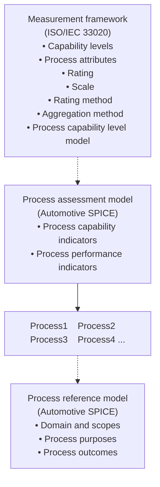
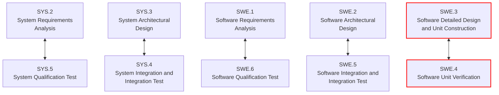
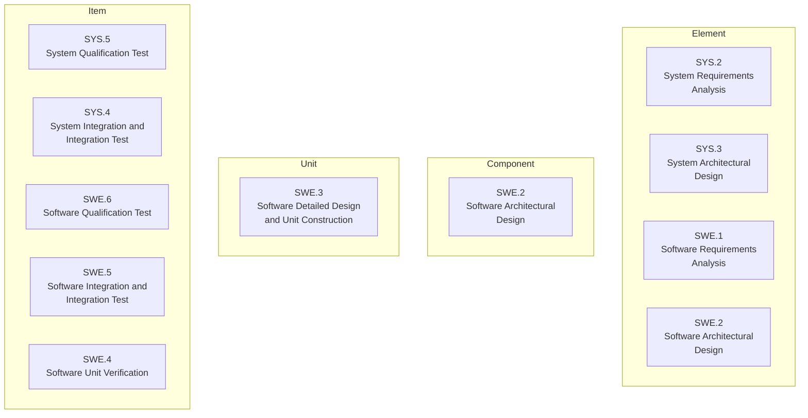
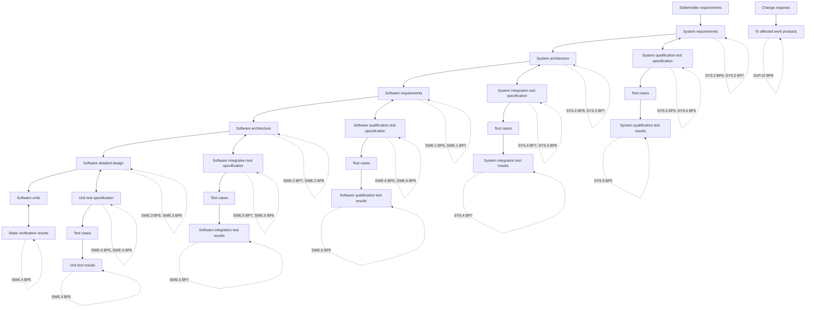
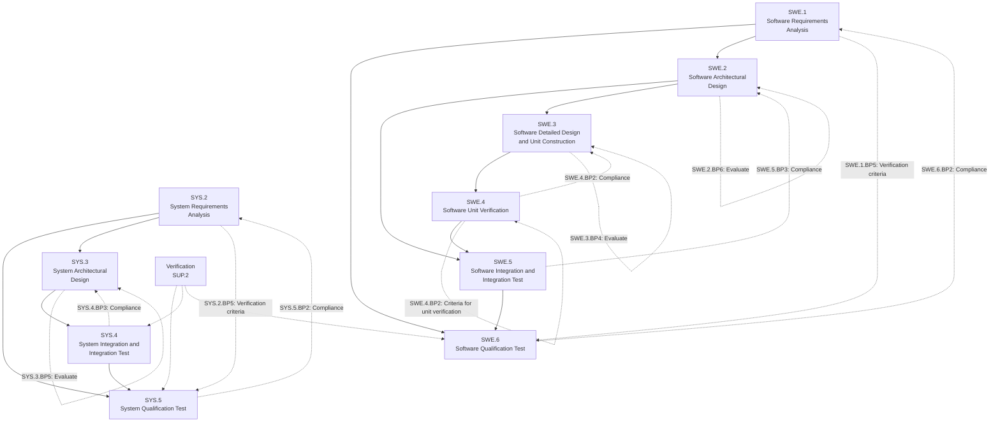
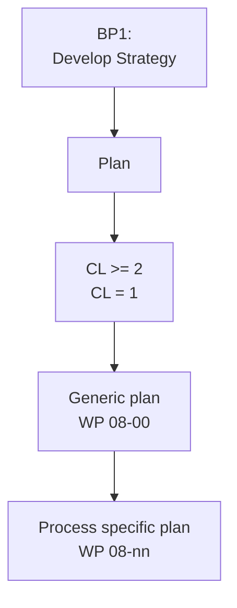

-- page 8 --

# 1. Introduction

## 1.1. Scope

Process assessment is a disciplined evaluation of an organizational unit's processes against a process assessment model.

The Automotive SPICE process assessment model (PAM) is intended for use when performing conformant assessments of the process capability on the development of embedded automotive systems. It was developed in accordance with the requirements of ISO/IEC 33004.

Automotive SPICE has its own process reference model (PRM), which was developed based on the Automotive SPICE process reference model 4.5. It was further developed and tailored considering the specific needs of the automotive industry. If processes beyond the scope of Automotive SPICE are needed, appropriate processes from other process reference models such as ISO/IEC 12207 or ISO/IEC 15288 may be added based on the business needs of the organization.

The PRM is incorporated in this document and is used in conjunction with the Automotive SPICE process assessment model when performing an assessment.

This Automotive SPICE process assessment model contains a set of indicators to be considered when interpreting the intent of the Automotive SPICE process reference model. These indicators may also be used when implementing a process improvement program subsequent to an assessment.
-- page 9 --

## 1.2. Terminology

Automotive SPICE follows the following precedence for use of terminology:

a) ISO/IEC 33001 for assessment related terminology
b) ISO/IEC/IEEE 24765 and ISO/IEC/IEEE 29119 terminology (as contained in Annex C)
c) Terms introduced by Automotive SPICE (as contained in Annex C)

## 1.3. Abbreviations

|AS|Automotive SPICE|
|-|-|
|BP|Base Practice|
|CAN|Controller Area Network|
|CASE|Computer-Aided Software Engineering,|
|CCB|Change Control Board|
|CFP|Call For Proposals|
|CPU|Central Processing Unit|
|ECU|Electronic Control Unit|
|EEPROM|Electrically Erasable Programmable Read-Only Memory|
|GP|Generic Practice|
|GR|Generic Resource|
|IEC|International Electrotechnical Commission|
|IEEE|Institute of Electrical and Electronics Engineers|
|I/O|Input / Output|
|ISO|International Organization for Standardization|
|ITT|Invitation To Tender|
|LIN|Local Interconnect Network|
|MISRA|Motor Industry Software Reliability Association|
|MOST|Media Oriented Systems Transport|
|PA|Process Attribute|
|PAM|Process Assessment Model|
|PRM|Process Reference Model|
|PWM|Pulse Width Modulation|
|RAM|Random Access Memory|
|ROM|Read Only Memory|
|SPICE|Software Process Improvement and Capability dEtermination|
|SUG|Spice User Group|
|USB|Universal Serial Bus|
|WP|Work Product|
|WPC|Work Product Characteristic|

Table 1 — Abbreviation List

# 2. Statement of compliance

The Automotive SPICE process assessment model and process reference model is conformant with the ISO/IEC 33004, and can be used as the basis for conducting an assessment of process capability.
-- page 10 --

ISO/IEC 33020 is used as an ISO/IEC 33003 compliant Measurement Framework.

A statement of compliance of the process assessment model and process reference model with the requirements of ISO/IEC 33004 is provided in Annex A.
-- page 11 --

# 3. Process capability determination

The concept of process capability determination by using a process assessment model is based on a two-dimensional framework. The first dimension is provided by processes defined in a process reference model (process dimension). The second dimension consists of capability levels that are further subdivided into process attributes (capability dimension). The process attributes provide the measurable characteristics of process capability.

The process assessment model selects processes from a process reference model and supplements with indicators. These indicators support the collection of objective evidence which enable an assessor to assign ratings for processes according to the capability dimension.

The relationship is shown in Figure 1:

Figure 1 — Process assessment model relationship
-- page 12 --

## 3.1. Process reference model

Processes are grouped by process category and at a second level into process groups according to the type of activity they address.

There are 3 process categories: Primary life cycle processes, Organizational life cycle processes and Supporting life cycle processes.

Each process is described in terms of a purpose statement. The purpose statement contains the unique functional objectives of the process when performed in a particular environment. For each purpose statement a list of specific outcomes is associated, as a list of expected positive results of the process performance.

For the process dimension, the Automotive SPICE process reference model provides the set of processes shown in Figure 2.

|Acquisition Process Group (ACQ)|System Engineering Process Group (SYS)|System Engineering Process Group (SYS)|System Engineering Process Group (SYS)|System Engineering Process Group (SYS)|Management Process Group (MAN)|
|-|-|-|-|-|-|
|ACQ.3 Contract Agreement|SYS.1 Requirements Elicitation||SYS.5 System Qualification Test||MAN.3 Project Management|
|ACQ.4 Supplier Monitoring|SYS.2 System Requirements Analysis||||MAN.5 Risk Management|
|ACQ.11 Technical Requirements|SYS.3 System Architectural Design||SYS.4 System Integration and Integration Test||MAN.6 Measurement|
|ACQ.12 Legal and Administrative Requirements|Software Engineering Process Group (SWE)|||||
|ACQ.13 Project Requirements|SWE.1 Software Requirements Analysis||SWE.6 Software Qualification Test|||
|ACQ.14 Request for Proposals|SWE.2 Software Architectural Design||SWE.5 Software Integration and Integration Test|||
|ACQ.15 Supplier Qualification|SWE.3 Software Detailed Design and Unit Construction|SWE.4 Software Unit Verification|||Reuse Process Group (REU)  REU.2 Reuse Program Management|
|Supply Process Group (SPL)|Supporting Process Group (SUP)||||Process Improvement Process Group (PIM)|
|SPL.1 Supplier Tendering|SUP.1 Quality Assurance|SUP.2 Verification|SUP.4 Joint Review|SUP.7 Documentation|PIM.3 Process Improvement|
|SPL.2 Product Release|SUP.8 Configuration Management|SUP.9 Problem Resolution Management|SUP.10 Change Request Management|||
|Primary Life Cycle Processes||Organizational Life Cycle Processes||Supporting Life Cycle Processes||

Figure 2 — Automotive SPICE process reference model - Overview
-- page 13 --

### 3.1.1. Primary life cycle processes category

The primary life cycle processes category consists of processes that may be used by the customer when acquiring products from a supplier, and by the supplier when responding and delivering products to the customer including the engineering processes needed for specification, design, development, integration and testing.

The primary life cycle processes category consists of the following groups:

* the Acquisition process group;
* the Supply process group;
* the System engineering process group;
* the Software engineering process group.

The Acquisition process group (ACQ) consists of processes that are performed by the customer, or by the supplier when acting as a customer for its own suppliers, in order to acquire a product and/or service.

|ACQ.3|Contract Agreement|
|-|-|
|ACQ.4|Supplier Monitoring|
|ACQ.11|Technical Requirements|
|ACQ.12|Legal and Administrative Requirements|
|ACQ.13|Project Requirements|
|ACQ.14|Request for Proposals|
|ACQ.15|Supplier Qualification|

**Table 2 — Primary life cycle processes – ACQ process group**

The Supply process group (SPL) consists of processes performed by the supplier in order to supply a product and/or a service.

|SPL.1|Supplier Tendering|
|-|-|
|SPL.2|Product Release|

**Table 3 — Primary life cycle processes – SPL process group**

The System Engineering process group (SYS) consists of processes addressing the elicitation and management of customer and internal requirements, the definition of the system architecture and the integration and testing on the system level.

|SYS.1|Requirements Elicitation|
|-|-|
|SYS.2|System Requirements Analysis|
|SYS.3|System Architectural Design|
|SYS.4|System Integration and Integration Test|
|SYS.5|System Qualification Test|

**Table 4 — Primary life cycle processes – SYS process group**

The Software Engineering process group (SWE) consists of processes addressing the management of software requirements derived from the system requirements, the development of the
-- page 14 --

corresponding software architecture and design as well as the implementation, integration and testing of the software.

|SWE.1|Software Requirements Analysis|
|-|-|
|SWE.2|Software Architectural Design|
|SWE.3|Software Detailed Design and Unit Construction|
|SWE.4|Software Unit Verification|
|SWE.5|Software Integration and Integration Test|
|SWE.6|Software Qualification Test|

Table 5 — Primary life cycle processes – SWE process group

### 3.1.2. Supporting life cycle processes category

The supporting life cycle processes category consists of processes that may be employed by any of the other processes at various points in the life cycle.

|SUP.1|Quality Assurance|
|-|-|
|SUP.2|Verification|
|SUP.4|Joint Review|
|SUP.7|Documentation|
|SUP.8|Configuration Management|
|SUP.9|Problem Resolution Management|
|SUP.10|Change Request Management|

Table 6 — Supporting life cycle processes - SUP process group

### 3.1.3. Organizational life cycle processes category

The organizational life cycle processes category consists of processes that develop process, product, and resource assets which, when used by projects in the organization, will help the organization achieve its business goals.

The organizational life cycle processes category consists of the following groups:

* the Management process group;
* the Process Improvement process group;
* the Reuse process group.

The Management process group (MAN) consists of processes that may be used by anyone who manages any type of project or process within the life cycle.

|MAN.3|Project Management|
|-|-|
|MAN.5|Risk Management|
|MAN.6|Measurement|

Table 7 — Organizational life cycle processes - MAN process group
-- page 15 --

The Process Improvement process group (PIM) covers one process that contains practices to improve the processes performed in the organizational unit.

**PIM.3**        Process Improvement

Table 8 — Organizational life cycle processes - PIM process group

The Reuse process group (REU) covers one process to systematically exploit reuse opportunities in organization's reuse programs.

**REU.2**        Reuse Program Management

Table 9 — Organizational life cycle processes - REU process group

## 3.2. Measurement framework

The measurement framework provides the necessary requirements and rules for the capability dimension. It defines a schema which enables an assessor to determine the capability level of a given process. These capability levels are defined as part of the measurement framework.

To enable the rating, the measurement framework provides process attributes defining a measurable property of process capability. Each process attribute is assigned to a specific capability level. The extent of achievement of a certain process attribute is represented by means of a rating based on a defined rating scale. The rules from which an assessor can derive a final capability level for a given process are represented by a process capability level model.

Automotive SPICE 3.1 uses the measurement framework defined in ISO/IEC 33020:2015.

> **NOTE:** *Text incorporated from ISO/IEC 33020 within this chapter is written in italic font and marked with a left side bar.*

### 3.2.1. Process capability levels and process attributes

The process capability levels and process attributes are identical to those defined in ISO/IEC 33020 clause 5.2. The detailed descriptions of the capability levels and the corresponding process attributes can be found in chapter 5.

Process attributes are features of a process that can be evaluated on a scale of achievement, providing a measure of the capability of the process. They are applicable to all processes.

A capability level is a set of process attribute(s) that work together to provide a major enhancement in the capability to perform a process. Each attribute addresses a specific aspect of the capability level. The levels constitute a rational way of progressing through improvement of the capability of any process.

According to ISO/IEC 33020 there are six capability levels, incorporating nine process attributes:

|**Level 0: Incomplete process**|*The process is not implemented, or fails to achieve its process purpose.*|
|-|-|
|**Level 1: Performed process**|*The implemented process achieves its process purpose*|
|**Level 2: Managed process**|*The previously described performed process is now implemented in a managed fashion (planned, monitored and adjusted) and its work products are appropriately established, controlled and maintained.*|

-- page 16 --

|**Level 3: Established process**|The previously described managed process is now implemented using a defined process that is capable of achieving its process outcomes.|
|-|-|
|**Level 4: Predictable process**|The previously described established process now operates predictively within defined limits to achieve its process outcomes. Quantitative management needs are identified, measurement data are collected and analyzed to identify assignable causes of variation. Corrective action is taken to address assignable causes of variation.|
|**Level 5: Innovating process**|The previously described predictable process is now continually improved to respond to organizational change.|

**Table 10 — Process capability levels according to ISO/IEC 33020**

Within this process assessment model, the determination of capability is based upon the nine process attributes (PA) defined in ISO/IEC 33020 and listed in Table 11.

|Attribute ID|Process Attributes|
|-|-|
|**Level 0: Incomplete process**||
|**Level 1: Performed process**||
|PA 1.1|Process performance process attribute|
|**Level 2: Managed process**||
|PA 2.1|Performance management process attribute|
|PA 2.2|Work product management process attribute|
|**Level 3: Established process**||
|PA 3.1|Process definition process attribute|
|PA 3.2|Process deployment process attribute|
|**Level 4: Predictable process**||
|PA 4.1|Quantitative analysis process attribute|
|PA 4.2|Quantitative control process attribute|
|**Level 5: Innovating process**||
|PA 5.1|Process innovation process attribute|
|PA 5.2|Process innovation implementation process attribute|

**Table 11 — Process attributes according to ISO/IEC 33020**

### 3.2.2. Process attribute rating

To support the rating of process attributes, the ISO/IEC 33020 measurement framework provides a defined rating scale with an option for refinement, different rating methods and different aggregation methods depending on the class of the assessment (e.g. required for organizational maturity assessments).

**Rating scale**

> *Within this process measurement framework, a process attribute is a measureable property of process capability. A process attribute rating is a judgement of the degree of achievement of the process attribute for the assessed process.*

The rating scale is defined by ISO/IEC 33020 as shown in table 12.
-- page 17 --

|**N**|**Not achieved**|There is little or no evidence of achievement of the defined process attribute in the assessed process.|
|-|-|-|
|**P**|**Partially achieved**|There is some evidence of an approach to, and some achievement of, the defined process attribute in the assessed process. Some aspects of achievement of the process attribute may be unpredictable.|
|**L**|**Largely achieved**|There is evidence of a systematic approach to, and significant achievement of, the defined process attribute in the assessed process. Some weaknesses related to this process attribute may exist in the assessed process.|
|**F**|**Fully achieved**|There is evidence of a complete and systematic approach to, and full achievement of, the defined process attribute in the assessed process. No significant weaknesses related to this process attribute exist in the assessed process.|

**Table 12 — Rating scale according to ISO/IEC 33020**

> The ordinal scale defined above shall be understood in terms of percentage achievement of a process attribute.
> 
> The corresponding percentages shall be:

|**N**|**Not achieved**|**0 to ≤ 15% achievement**|
|-|-|-|
|**P**|**Partially achieved**|**> 15% to ≤ 50% achievement**|
|**L**|**Largely achieved**|**> 50% to ≤ 85% achievement**|
|**F**|**Fully achieved**|**> 85% to ≤ 100% achievement**|

**Table 13 — Rating scale percentage values according to ISO/IEC 33020**

> The ordinal scale may be further refined for the measures P and L as defined below.

|**P-**|**Partially achieved:**|There is some evidence of an approach to, and some achievement of, the defined process attribute in the assessed process. Many aspects of achievement of the process attribute may be unpredictable.|
|-|-|-|
|**P+**|**Partially achieved:**|There is some evidence of an approach to, and some achievement of, the defined process attribute in the assessed process. Some aspects of achievement of the process attribute may be unpredictable.|
|**L-**|**Largely achieved:**|There is evidence of a systematic approach to, and significant achievement of, the defined process attribute in the assessed process. Many weaknesses related to this process attribute may exist in the assessed process.|
|**L+**|**Largely achieved:**|There is evidence of a systematic approach to, and significant achievement of, the defined process attribute in the assessed process. Some weaknesses related to this process attribute may exist in the assessed process.|

**Table 14 — Refinement of rating scale according to ISO/IEC 33020**
-- page 18 --

The corresponding percentages shall be:

|P-|Partially achieved -|> 15% to ≤ 32.5% achievement|
|-|-|-|
|P+|Partially achieved +|> 32.5 to ≤ 50% achievement|
|L-|Largely achieved -|> 50% to ≤ 67.5% achievement|
|L+|Largely achieved +|> 67.5% to ≤ 85% achievement|

**Table 15 — Refined rating scale percentage values according to ISO/IEC 33020**

**Rating and aggregation method**

ISO/IEC 33020 provides the following definitions:

> A process outcome is the observable result of successful achievement of the process purpose.
>
> A process attribute outcome is the observable result of achievement of a specified process attribute.
>
> Process outcomes and process attribute outcomes may be characterised as an intermediate step to providing a process attribute rating.
>
> When performing rating, the rating method employed shall be specified relevant to the class of assessment. The following rating methods are defined.
>
> The use of rating method may vary according to the class, scope and context of an assessment. The lead assessor shall decide which (if any) rating method to use. The selected rating method(s) shall be specified in the assessment input and referenced in the assessment report.

ISO/IEC 33020 provides the following 3 rating methods:

> **Rating method R1**
>
> The approach to process attribute rating shall satisfy the following conditions:
>
> a) Each process outcome of each process within the scope of the assessment shall be characterized for each process instance, based on validated data;
>
> b) Each process attribute outcome of each process attribute for each process within the scope of the assessment shall be characterised for each process instance, based on validated data;
>
> c) Process outcome characterisations for all assessed process instances shall be aggregated to provide a process performance attribute achievement rating;
>
> d) Process attribute outcome characterisations for all assessed process instances shall be aggregated to provide a process attribute achievement rating.
>
> **Rating method R2**
>
> The approach to process attribute rating shall satisfy the following conditions:
>
> a) Each process attribute for each process within the scope of the assessment shall be characterized for each process instance, based on validated data;
>
> b) Process attribute characterisations for all assessed process instances shall be aggregated to provide a process attribute achievement rating.
>
> **Rating method R3**
>
> Process attribute rating across assessed process instances shall be made without aggregation.
-- page 19 --

In principle the three rating methods defined in ISO/IEC 33020 depend on

a) whether the rating is made only on process attribute level (Rating method 3 and 2) or – with more level of detail – both on process attribute and process attribute outcome level (Rating method 1); and

b) the type of aggregation ratings across the assessed process instances for each process

If a rating is performed for both process attributes and process attribute outcomes (Rating method 1), the result will be a process performance attribute outcome rating on level 1 and a process attribute achievement rating on higher levels.

Depending on the class, scope and context of the assessment an aggregation within one process (one-dimensional, vertical aggregation), across multiple process instances (one-dimensional, horizontal aggregation) or both (two-dimensional, matrix aggregation) is performed.

ISO/IEC 33020 provides the following examples:

> When performing an assessment, ratings may be summarised across one or two dimensions.
> 
> For example, when rating a
> 
> • process attribute for a given process, one may aggregate ratings of the associated process (attribute) outcomes – such an aggregation will be performed as a vertical aggregation (one dimension).
> 
> • process (attribute) outcome for a given process attribute across multiple process instances, one may aggregate the ratings of the associated process instances for the given process (attribute) outcome such an aggregation will be performed as a horizontal aggregation (one dimension)
> 
> • process attribute for a given process, one may aggregate the ratings of all the process (attribute) outcomes for all the processes instances – such an aggregation will be performed as a matrix aggregation across the full scope of ratings (two dimensions)

The standard defines different methods for aggregation. Further information can be taken from ISO/IEC 33020.
-- page 20 --

### 3.2.3. Process capability level model

The process capability level achieved by a process shall be derived from the process attribute ratings for that process according to the process capability level model defined in Table 16.

The process capability level model defines the rules how the achievement of each level depends on the rating of the process attributes for the assessed and all lower levels.

As a general rule the achievement of a given level requires a largely achievement of the corresponding process attributes and a full achievement of any lower lying process attribute.

|Scale|Process attribute|Rating|
|-|-|-|
|Level 1|PA 1.1: Process Performance|Largely|
|Level 2|PA 1.1: Process Performance|Fully|
||PA 2.1: Performance Management|Largely|
||PA 2.2: Work Product Management|Largely|
|Level 3|PA 1.1: Process Performance|Fully|
||PA 2.1: Performance Management|Fully|
||PA 2.2: Work Product Management|Fully|
||PA 3.1: Process Definition|Largely|
||PA 3.2: Process Deployment|Largely|
|Level 4|PA 1.1: Process Performance|Fully|
||PA 2.1: Performance Management|Fully|
||PA 2.2: Work Product Management|Fully|
||PA 3.1: Process Definition|Fully|
||PA 3.2: Process Deployment|Fully|
||PA 4.1: Quantitative Analysis|Largely|
||PA 4.2: Quantitative Control|Largely|
|Level 5|PA 1.1: Process Performance|Fully|
||PA 2.1: Performance Management|Fully|
||PA 2.2: Work Product Management|Fully|
||PA 3.1: Process Definition|Fully|
||PA 3.2: Process Deployment|Fully|
||PA 4.1: Quantitative Analysis|Fully|
||PA 4.2: Quantitative Control|Fully|
||PA 5.1: Process Innovation|Largely|
||PA 5.2: Process Innovation Implementation|Largely|

Table 16 — Process capability level model according to ISO/IEC 33020
-- page 21 --

## 3.3. Process assessment model

The process assessment model offers indicators in order to identify whether the process outcomes and the process attribute outcomes (achievements) are present or absent in the instantiated processes of projects and organizational units. These indicators provide guidance for assessors in accumulating the necessary objective evidence to support judgments of capability. They are not intended to be regarded as a mandatory set of checklists to be followed.

In order to judge the presence or absence of process outcomes and process achievements an assessment obtains objective evidence. All such evidence comes from the examination of work products and repository content of the assessed processes, and from testimony provided by the performers and managers of the assessed processes. This evidence is mapped to the PAM indicators to allow establishing the correspondence to the relevant process outcomes and process attribute achievements.

There are two types of indicators:

* **Process performance indicators**, which apply exclusively to capability Level 1. They provide an indication of the extent of fulfillment of the process outcomes

* **Process capability indicators**, which apply to Capability Levels 2 to 5. They provide an indication of the extent of fulfillment of the process attribute achievements.

Assessment indicators are used to confirm that certain practices were performed, as shown by evidence collected during an assessment. All such evidence comes either from the examination of work products of the processes assessed, or from statements made by the performers and managers of the processes. The existence of base practices and work products provide evidence of the performance of the processes associated with them. Similarly, the existence of process capability indicators provides evidence of process capability.

The evidence obtained should be recorded in a form that clearly relates to an associated indicator, in order that support for the assessor's judgment can be confirmed or verified as required by ISO/IEC 33002.

### 3.3.1. Process performance indicators

Types of process performance indicators are

* Base practices (BP)
* Work products (WP).

Both BPs and WPs relate to one or more process outcomes. Consequently, BPs and WPs are always process-specific and not generic. BPs represent activity-oriented indicators. WPs represent result-oriented indicators. Both BP and WP are used for judging objective evidence that an assessor is to collect, and accumulate, in the performance of an assessment. In that respect BPs and WPs are alternative indicator sets the assessor can use.

The PAM offers a set of work product characteristics (WPC, see Annex B) for each WP. These are meant to offer a good practice and state-of-the-art knowledge guide for the assessor. Therefore, WP and WPC are supposed to be a quickly accessible information source during an assessment. In that respect WPs and WPCs represent an example structure only. They are neither a "strict must" nor are they normative for organizations. Instead, the actual structure, form and content of concrete work products and documents for the implemented processes must be defined by the project and organization, respectively. The project and/or organization ensures that the work products are appropriate for the intended purpose and needs, and in relation to the development goals.
-- page 22 --

### 3.3.2. Process capability indicators

Types of process capability indicators are:

* Generic Practice (GP)
* Generic Resource (GR)

Both GPs and GRs relate to one or more PA Achievements. In contrast to process performance indicators, however, they are of generic type, i.e. they apply to any process.

The difference between GP and GR is that the former represent activity-oriented indicators while the latter represent infrastructure- oriented indicators for judging objective evidence. An assessor has to collect and accumulate evidence supporting process capability indicators during an assessment. In that respect GPs and GRs are alternative indicators sets the assessor can use.

In spite of the fact that level 1 capability of a process is only characterized by the measure of the extent to which the process outcomes are achieved the measurement framework (see chapter 3.2) requires each level to reveal a process attribute, and, thus, requires the PAM to introduce at least one process capability indicator. Therefore, the only process performance attribute for capability Level 1 (PA.1.1) has a single generic practice (GP 1.1.1) pointing as an editorial reference to the respective process performance indicators (see Figure 3).

|**Measurement framework (ISO/IEC 33020)** • Capability levels • Process attributes • Rating • Scale • Rating method • Aggregation method • Process capability level model|CL 5  CL 4  CL 3  CL 2  CL 1|PA 5.2 PA 5.1 PA 4.2 PA 4.1 PA 3.2 PA 3.1 PA 2.2 PA 2.1 PA 1.1|GPs, GRs      GPs, GRs  GP|**Process assessment model (Automotive SPICE)** • Process capability indicators • Process performance indicators    BPs, WPs and WPCs|
|-|-|-|-|-|

Outcomes of process 1 | Outcomes of process 2 | Outcomes of process 3

|**Process reference model (Automotive SPICE)** • Domain and scopes • Process purposes • Process outcomes|
|-|

Figure 3 — Relationship between assessment indicators and process capability

### 3.3.3. Understanding the level of abstraction of a PAM

The term "process" can be understood at three levels of abstraction. Note that these levels of abstraction are not meant to define a strict black-or-white split, nor is it the aim to provide a scientific classification schema – the message here is to understand that, in practice, when it comes to the term "process" there are different abstraction levels, and that a PAM resides at the highest.
-- page 23 --

**Figure 4 — Possible levels of abstraction for the term "process"**

|Process Assessment Model(s)|The "What" (Goals of the process)|• What is to be done • Why it has to be done • What are the technical dependencies|
|-|-|-|
|Methods|The "How" (How to achieve the goals)|• Methods, tools, templates, metrics • Definitions of logical order, concrete workflows • Authority and competence definitions|
|Execution|The "Doing" (Performing the tasks to achieve the goals by using the methods)|• Tailoring • Setup • Performance according to the tailored method|

Capturing experience acquired during product development (i.e. at the DOING level) in order to share this experience with others means creating a HOW level. However, a HOW is always specific to a particular context such as a company, an organizational unit, or a product line. For example, the HOW of a project, organizational unit, or company A is potentially not applicable as is to a project, organizational unit, or company B. However, both might be expected to adhere the principles represented by PAM indicators for process outcomes and process attribute achievements. These indicators are at the WHAT level while deciding on solutions for concrete templates, proceedings, and tooling etc. is left to the HOW level.

**Figure 5 — Performing a process assessment for determining process capability**

|Execution  Performing interviews on the actual "Doing", Investigating work products and tool repositories, ... Reading through the defined "How"  1|Methods  ... mapping the information to the indicators ...  2|Process Assessment Model(s)  ... and determine the capability profile.  3|
|-|-|-|

-- page 24 --

# 4. Process reference model and performance indicators (Level 1)

The processes in the process dimension can be drawn from the Automotive SPICE process reference model, which is incorporated in the tables below indicated by a red bar at the left side.

Each table related to one process in the process dimension contains the process reference model (indicated by a red bar) and the process performance indicators necessary to define the process assessment model. The process performance indicators consist of base practices (indicated by a green bar) and output work products (indicated by a blue bar).

||||
|-|-|-|
|Process reference model|Process ID|The individual processes are described in terms of process name, process purpose, and process outcomes to define the Automotive SPICE process reference model. Additionally a process identifier is provided.|
||Process name||
||Process purpose||
||Process outcomes||
|Process performance indicators|Base practices|A set of base practices for the process providing a definition of the tasks and activities needed to accomplish the process purpose and fulfill the process outcomes|
||Output work products|A number of output work products associated with each process *NOTE: Refer to Annex B for the characteristics associated with each work product.*|

Table 17 — Template for the process description
-- page 25 --

## 4.1. Acquisition process group (ACQ)

### 4.1.1. ACQ.3 Contract Agreement

|Process reference model||
|-|-|
|Process ID|ACQ.3|
|Process name|Contract Agreement|
|Process purpose|The purpose of Contract Agreement Process is to negotiate and approve a contract/agreement with the supplier.|
|Process outcomes|As a result of successful implementation of this process: 1) a contract/agreement is negotiated, reviewed, approved and awarded to the supplier(s); 2) the contract/agreement clearly and unambiguously specifies the expectations, responsibilities, work products/deliverables and liabilities of both the supplier(s) and the acquirer; 3) mechanisms for monitoring the capability and performance of the supplier(s) and for mitigation of identified risks are reviewed and considered for inclusion in the contract conditions; and 4) proposers/tenderers are notified of the result of proposal/tender selection.|
|**Process performance indicators**||
|Base practices|**ACQ.3.BP1: Negotiate the contract/agreement.** Negotiate all relevant aspects of the contract/agreement with the supplier. \[OUTCOME 1]  *NOTE 1: Relevant aspects of the procurement may include* • system requirements • acceptance criteria and evaluation criteria • linkage between payment and successful completion of acceptance testing • process requirements, process interfaces and joint processes.  **ACQ.3.BP2: Specify rights and duties.** Unambiguously specify the expectations, responsibilities, work products/deliverables and liabilities of the parties in the contract/agreement. \[OUTCOME 2]  **ACQ.3.BP3: Review contract/agreement for supplier capability monitoring.** Review and consider a mechanism for monitoring the capability and performance of the supplier for inclusion in the contract/agreement conditions. \[OUTCOME 3]  **ACQ.3.BP4: Review contract/agreement for risk mitigation actions.** Review and consider a mechanism for the mitigation of identified risk for inclusion in the contract/agreement conditions. \[OUTCOME 3]  **ACQ.3.BP5: Approve contract/agreement.** The contract/agreement is approved by relevant stakeholders. \[OUTCOME 1]  **ACQ.3.BP6: Award contract/agreement.** The contract/agreement is awarded to the successful proposer/tenderer. \[OUTCOME 1]  **ACQ.3.BP7: Communicate result to tenderers.** Notify the result of the proposal/tender selection to proposers/tenders. After contract award inform all tenderers of the decision. \[OUTCOME 4]|
|Output work products|02-00 Contract → \[OUTCOME 1, 2, 3] 02-01 Commitment/agreement → \[OUTCOME 1]|

-- page 26 --

|13-04 Communication record|→|\[OUTCOME 4]|
|-|-|-|
|13-05 Contract review record|→|\[OUTCOME 1]|
|13-09 Meeting support record|→|\[OUTCOME 1]|

### 4.1.2. ACQ.4 Supplier Monitoring

|**Process ID**|ACQ.4|
|-|-|
|**Process name**|Supplier Monitoring|
|**Process purpose**|The purpose of the Supplier Monitoring Process is to track and assess the performance of the supplier against agreed requirements.|
|**Process outcomes**|As a result of successful implementation of this process: 1) joint activities, as agreed between the customer and the supplier, are performed as needed; 2) all information, agreed upon for exchange, is communicated regularly between the supplier and customer; 3) performance of the supplier is monitored against the agreements; and 4) changes to the agreement, if needed, are negotiated between the customer and the supplier and documented in the agreement.|
|**Base practices**|**ACQ.4.BP1: Agree on and maintain joint processes**, joint interfaces, and information to be exchanged. Establish and maintain an agreement on information to be exchanged and on joint processes and joint interfaces, responsibilities, type and frequency of joint activities, communications, meetings, status reports and reviews. \[OUTCOME 1, 2, 4]  *NOTE1: Joint processes and interfaces usually include project management, requirements management, change management, configuration management, problem resolution, quality assurance and customer acceptance.*  *NOTE 2: Joint activities to be performed should be mutually agreed between the customer and the supplier.*  *NOTE 3: The term customer in this process refers to the assessed party. The term supplier refers to the supplier of the assessed party.*  **ACQ.4.BP2: Exchange all agreed information.** Use the defined joint interfaces between customer and supplier for the exchange of all agreed information. \[OUTCOME 1, 2, 3]  *NOTE 4: Agreed information should include all relevant work products.*  **ACQ.4.BP3: Review technical development with the supplier.** Review development with the supplier on the agreed regular basis, covering technical aspects, problems and risks and also track open items to closure. \[OUTCOME 1, 3, 4]  **ACQ.4.BP4: Review progress of the supplier.** Review progress of the supplier regarding schedule, quality, and cost on the agreed regular basis. Track open items to closure and perform risk mitigation activities. \[OUTCOME 1, 3, 4]  **ACQ.4.BP5: Act to correct deviations.** Take action when agreed objectives are not achieved to correct deviations from the agreed project plans and to prevent reoccurrence of problems identified. Negotiate changes to objectives and document them in the agreements. \[OUTCOME 4]|

-- page 27 --

|**Output work products**|02-01 Commitment/agreement|→|\[OUTCOME 4]|
|-|-|-|-|
||13-01 Acceptance record|→|\[OUTCOME 3]|
||13-04 Communication record|→|\[OUTCOME 1, 2]|
||13-09 Meeting support record|→|\[OUTCOME 1]|
||13-14 Progress status record|→|\[OUTCOME 2]|
||13-16 Change request|→|\[OUTCOME 4]|
||13-19 Review record|→|\[OUTCOME 2]|
||14-02 Corrective action register|→|\[OUTCOME 4]|
||15-01 Analysis report|→|\[OUTCOME 3]|

### 4.1.3. ACQ.11 Technical Requirements

|**Process ID**|ACQ.11|
|-|-|
|**Process name**|Technical Requirements|
|**Process purpose**|The purpose of the Technical Requirements Process is to establish the technical requirements of the acquisition. This involves the elicitation of functional and non-functional requirements that consider the deployment life cycle of the products so as to establish a technical requirement baseline.|
|**Process outcomes**|As a result of successful implementation of this process: 1) the technical requirements, including environment effect evaluation, safety and security requirements where appropriate, are defined and developed to match needs and expectations; 2) the current and evolving acquisition needs are gathered and defined; 3) the requirements and potential solutions are communicated to all affected groups; 4) a mechanism is established to incorporate changed or new requirements into the established baseline; 5) a mechanism for identifying and managing the impact of changing technology to the technical requirements is defined; and 6) the requirements include compliance with relevant standards, including environment effect evaluation, safety and security standards where appropriate.|
|**Base practices**|**ACQ.11.BP1: Elicit needs.** Elicit the needs of all relevant user groups. \[OUTCOME 1]  **ACQ.11.BP2: Define technical requirements.** Define and develop the technical requirements and potential solutions (where relevant), including environment effect evaluation, safety and security, performance, supportability requirements to match the needs and expectations of the relevant user groups. \[OUTCOME 1]  *NOTE 1: This may include* • the categorization, prioritization and indication of requirements • the indication of mandatory requirements • classification of requirements into functional areas • using defined end user types to describe the functional requirements within an organization|

-- page 28 --

**ACQ.11.BP3: Identify acquisition needs.** Gather and define the current and evolving acquisition needs. [OUTCOME 2]

**ACQ.11.BP4: Ensure consistency.** Ensure consistency of the technical requirements with the defined acquisition needs. [OUTCOME 2]

**ACQ.11.BP5: Identify affected groups.** Identify all groups to which the technical requirements and potential solutions should be communicated. [OUTCOME 3]

**ACQ.11.BP6: Communicate to affected groups.** Communicate the technical requirements and potential solutions to all affected groups. [OUTCOME 3]

*NOTE 2: To ensure a better understanding:*
* *the requirements might be specified in business terms*
* *simulation and exploratory prototyping techniques might be used*

**ACQ.11.BP7: Establish a change mechanism.** Establish a mechanism to incorporate changed or new technical requirements into the established baseline. [OUTCOME 4]

*NOTE 3: This may include analyzing, structuring and prioritizing technical requirements according to their importance to the business.*

**ACQ.11.BP8: Track impact of changing technology.** Define a mechanism for identifying and managing the impact of changing technology to the technical requirements and integrate the resulting consequences into the technical requirements. [OUTCOME 5]

**ACQ.11.BP9: Identify constraints and standards.** Identify constraints and standards applicable to the technical requirements (e.g. open systems standards). [OUTCOME 6]

**ACQ.11.BP10: Ensure compliance of stated requirements.** Ensure that the technical requirements include compliance with identified relevant standards, including environment effect evaluation, safety and security standards where appropriate. [OUTCOME 6]

|**Output work products**|08-28 Change management plan|→|\[OUTCOME 4]|
|-|-|-|-|
||08-51 Technology monitoring plan|→|\[OUTCOME 5]|
||13-04 Communication record|→|\[OUTCOME 3]|
||13-17 Customer request|→|\[OUTCOME 1]|
||13-21 Change control record|→|\[OUTCOME 2]|
||13-24 Validation results|→|\[OUTCOME 6]|
||14-01 Change history|→|\[OUTCOME 2]|
||14-02 Corrective action register|→|\[OUTCOME 2]|
||14-50 Stakeholder groups list|→|\[OUTCOME 1]|
||17-00 Requirement specification|→|\[OUTCOME 6]|
||17-03 Customer requirements|→|\[OUTCOME 6]|

### 4.1.4. ACQ.12 Legal and Administrative Requirements

|**Process ID**|ACQ.12|
|-|-|

-- page 29 --

|Process name|Legal and Administrative Requirements|
|-|-|
|Process purpose|The purpose of the Legal and Administrative Requirements Process is to define the awarding aspects – expectations, liabilities, legal and other issues and which comply with national and international laws of contract.|
|Process outcomes|As a result of successful implementation of this process: 1) a contractual approach is defined which is compliant with relevant national, international and regulatory laws, guidance and policies; 2) an agreement, (contractual) terms and conditions are defined to describe how the supplier will meet the needs and expectations; 3) acceptance criteria and mechanisms for handling of breaches to the fulfillment of contract are established; 4) the rights of the acquirer to assume, modify or evaluate, directly or indirectly Intellectual Property Rights are established; 5) warranties and service level agreements are provided for where applicable; 6) provision for the suppliers to deliver other requirements (e.g. quality plan, escrow arrangements etc.) is defined; and 7) recognized criteria for proprietary, regulatory and other product liabilities issues are established.|
|Base practices|**ACQ.12.BP1: Identify relevant regulations.** Identify relevant national, international and regulatory laws, guidance and policies. \[OUTCOME 1]  **ACQ.12.BP2: Consider relevant regulations.** Consider identified relevant laws, guidance and policy when defining a contractual approach. \[OUTCOME 2]  **ACQ.12.BP3: Agree on (contractual) terms and conditions.** \[OUTCOME 2]  *NOTE 1: This may include • responsibilities of the purchaser and supplier; and the basis for payments • responsibility for maintenance and upgrades • a separate maintenance or support agreement • kind of payment*  **ACQ.12.BP4: Ensure usage of agreed terms and conditions.** Ensure the usage of agreed terms and conditions when describing how the supplier will meet the needs and expectations. \[OUTCOME 2]  **ACQ.12.BP5: Establish acceptance criteria.** \[OUTCOME 3]  **ACQ.12.BP6: Establish escalation mechanisms.** Establish mechanisms for handling of breaches to the fulfillment of contract. \[OUTCOME 3]  *NOTE 2: This may include planning of the control of contract changes.*  **ACQ.12.BP7: Establish management of intellectual property rights.** Establish the rights of the acquirer to assume, modify or evaluate, directly or indirectly, Intellectual Property Rights. \[OUTCOME 4]  **ACQ.12.BP8: Provide for warranties and service level agreements.** Provide for warranties and service level agreements where applicable. \[OUTCOME 5]|

-- page 30 --

|\*\*ACQ.12.BP9: Define provision for the suppliers.\*\* Define provision for the suppliers to deliver other requirements such as quality plan or escrow arrangements. \[OUTCOME 6] \*\*ACQ.12.BP10: Establish criteria for liability issues.\*\* Establish recognized criteria for proprietary, regulatory and other product liability issues. \[OUTCOME 7]|
|-|

|**Output work products**|02-00 Contract 02-01 Commitment/agreement 10-00 Process description 14-02 Corrective action register 17-00 Requirement specification 18-01 Acceptance criteria|→ → → → → →|\[OUTCOME 1-7] \[OUTCOME 2, 4, 5, 6, 7] \[OUTCOME 1, 3] \[OUTCOME 3] \[OUTCOME 1-7] \[OUTCOME 3]|
|-|-|-|-|

### 4.1.5. ACQ.13 Project Requirements

|**Process ID**|ACQ.13|
|-|-|
|**Process name**|Project Requirements|
|**Process purpose**|The purpose of the Project Requirements Process is to specify the requirements to ensure the acquisition project is performed with adequate planning, staffing, directing, organizing and control over project tasks and activities.|
|**Process outcomes**|As a result of successful implementation of this process: 1) consistency between financial, technical, contractual and project requirements is established; 2) requirements for the organizational, management, controlling, and reporting aspects of a project are defined; 3) requirements for adequate staffing of projects by a competent team (e.g. resources with requisite legal, contractual, technical and project competence) with clear responsibilities and goals are defined; 4) the needs for exchanging information between all affected parties are established; 5) requirements for the completion and acceptance of interim work products and release of payments are established; 6) potential risks are identified; 7) requirements for ownership of interactions and relationships with suppliers are defined; 8) rights for use and distribution of the product by the customer and supplier are defined; and 9) support and maintenance requirements are established.|
|**Base practices**|**ACQ.13.BP1: Identify relevant groups.** Identify relevant parties/stakeholders and experts for financial, technical, contract and project issues. \[OUTCOME 1]  **ACQ.13.BP2: Communicate with relevant groups.** Communicate with the relevant parties regarding the specification of financial, technical, contract and project requirements. \[OUTCOME 1]|

-- page 31 --

**ACQ.13.BP3: Define organizational requirements.** Define requirements for the organizational aspect of the project. [OUTCOME 2]

*NOTE 1: Requirements for the organizational aspects refer to the organization of the people on the project e.g. who is responsible etc. at different levels.*

**ACQ.13.BP4: Define management requirements.** Define requirements for the management, controlling and reporting aspects of the project. [OUTCOME 2]

*NOTE 2: Requirements for the management, controlling and reporting aspects of the project may be*
* the necessity to structure the acquisition process in logical phases
* the use of experience and skills of third parties
* the sketch of a work breakdown structure
* that all documentation conforms to appropriate standards, and should be contractually agreed with the suppliers
* requirements to supplier's processes, process interfaces and joint processes

**ACQ.13.BP5: Identify required competency.** Identify required competency (e.g. legal, contractual, technical and project competencies) for key resources. [OUTCOME 3]

**ACQ.13.BP6: Define responsibilities and goals.** Define responsibilities and goals of the team members. [OUTCOME 3]

**ACQ.13.BP7: Identify information needs.** Identify information needs of the relevant parties. [OUTCOME 4]

**ACQ.13.BP8: Define exchange of information.** Consider how exchange of information may be affected. [OUTCOME 4]

*NOTE 3: Techniques for supporting the exchange of information may include electronic solutions, face-to-face interactions and decisions about the frequency.*

**ACQ.13.BP9: Establish criteria for interim work products.** Establish requirements for the completion and acceptance of interim work products. [OUTCOME 5]

**ACQ.13.BP10: Establish payment requirements.** Establish requirements for the release of payments. [OUTCOME 5]

*NOTE 4: This may include for example the decision to link the major proportion of the supplier's payment to successful completion of the acceptance test, the definition of supplier performance criteria and ways to measure, test and link them to the payment schedule or the decision that payments be made on agreed results.*

**ACQ.13.BP11: Identify risks.** Identify risks associated with project life cycle and with suppliers. [OUTCOME 6]

*NOTE 5: Potential risk areas are for example stakeholder (customer, user, and sponsor), product (uncertainty, complexity), processes (acquisition, management, support, and organization), resources (human, financial, time, infrastructure), context (corporate context, project context, regulatory context, location) or supplier (process maturity, resources, experience).*

**ACQ.13.BP12: Communicate risks.** Assure that all identified risks are communicated to the relevant parties. [OUTCOME 6]
-- page 32 --

**ACQ.13.BP13: Define ownership of relationships.** Define requirements for ownership of interactions and relationships with suppliers. [OUTCOME 7]

*NOTE 6: This may include for example who has the lead on which type of interaction, who maintains an open-issue-list, who are the contact persons for management, technical and contractual issues, the frequency and type of interaction, to whom the relevant information is distributed.*

**ACQ.13.BP14: Define rights for use and distribution.** Define rights for use and distribution of the product by the customer and supplier. [OUTCOME 8]

*NOTE 7: This may include unrestricted right of product use or delivery of source code trial installation for "sale or return".*

**ACQ.13.BP15: Establish support and maintenance requirements.** [OUTCOME 9]

*NOTE 8: This may include for example training requirements, the decision if support and maintenance should be conducted in-house or by a third party or the establishment of service level agreements.*

|**Output work products**|02-00 Contract 13-19 Review record 13-20 Risk action request 17-00 Requirement specification|→ → → →|\[OUTCOME 1-9] \[OUTCOME 1] \[OUTCOME 6] \[OUTCOME 1-9]|
|-|-|-|-|

### 4.1.6. ACQ.14 Request for Proposals

|**Process ID**|ACQ.14|
|-|-|
|**Process name**|Request for Proposals|
|**Process purpose**|The purpose of the Request for Proposals Process is to prepare and issue the necessary acquisition requirements. The documentation will include, but not be limited to, the contract, project, finance and technical requirements to be provided for use in the Call For Proposals (CFP) / Invitation To Tender (ITT).|
|**Process outcomes**|As a result of successful implementation of this process: 1) rules are defined for proposal/tender invitation and evaluation which comply with the acquisition policy and strategy; 2) the baseline technical and non-technical requirements are assembled to accompany the CFP / ITT; 3) the agreement (contractual) terms of reference and conditions for CFP / ITT are established; 4) the financial terms of reference for costs and payments for CFP / ITT are defined; 5) the project terms of reference for CFP / ITT are defined; 6) the technical terms of reference for CFP / ITT are defined; and 7) a CFP / ITT is prepared and issued in accordance with acquisition policies and which complies with relevant national, international and regulatory laws, requirements, and policies.|

-- page 33 --

|Base practices|**ACQ.14.BP1: Define rules for CFP / ITT.** Define rules for proposal/tender invitation and evaluation which comply with the acquisition policy and strategy. \[OUTCOME 1] *NOTE 1: Examples are:* • a rule that a multiphase tendering process should be used (reasonable when uncertainty is high) • pre-planned interactions with suppliers • a rule that the supplier will be informed about the evaluation criteria • a rule that a timetable should be stipulated to allow suppliers specified times to respond to the call for tender • a rule prescribing to use a two stage evaluation process (reduce a long list of suppliers to a short list of suppliers who are invited to tender) **ACQ.14.BP2: Assemble requirements.** Assemble the baseline technical and non-technical requirements to accompany the CFP / ITT. \[OUTCOME 2] *NOTE 2: The goal is to provide the supplier with an in-depth understanding of your business to enable him to offer the specified solution.* **ACQ.14.BP3: Establish terms and conditions for CFP / ITT.** Establish the agreement (contractual) terms of reference and conditions for CFP / ITT. \[OUTCOME 3] **ACQ.14.BP4: Define financial terms.** Define the financial terms of reference for costs and payments for CFP / ITT. \[OUTCOME 4] **ACQ.14.BP5: Define project terms.** Define the project terms of reference for CFP / ITT. \[OUTCOME 5] *NOTE 3: The overall purpose of this is to communicate the documented business requirements of the acquisition to the suppliers.* **ACQ.14.BP6: Define technical terms.** Define the technical terms of reference for CFP / ITT. \[OUTCOME 6] **ACQ.14.BP7: Identify relevant regulations.** Identify international and regulatory laws, requirements and policies which are relevant for CFP preparation. \[OUTCOME 7] **ACQ.14.BP8: Prepare and issue a CFP / ITT.** Prepare and issue a CFP / ITT in accordance with acquisition policies, which complies with relevant national, international and regulatory laws, requirements and policies. \[OUTCOME 7]||
|-|-|-|
||**Output work products**|02-01 Commitment/agreement → \[OUTCOME 3] 12-01 Request for proposal → \[OUTCOME 7] 17-00 Requirement specification → \[OUTCOME 2, 4, 5, 6] 19-11 Validation strategy → \[OUTCOME 1]|

-- page 34 --

### 4.1.7. ACQ.15 Supplier Qualification

|**Process ID**|ACQ.15|
|-|-|
|**Process name**|Supplier Qualification|
|**Process purpose**|The purpose of the Supplier Qualification Process is to evaluate and determine if the potential supplier(s) have the required qualification for entering the proposal/tender evaluation process. In this process, the technical background, quality system, servicing, user support capabilities etc. will be evaluated.|
|**Process outcomes**|As a result of successful implementation of this process: 1) criteria are established for qualifying suppliers; 2) supplier capability determination is performed as necessary; 3) the suppliers which possess required qualification are short-listed for tender solution(s) evaluation; 4) any shortfalls in capability are identified and evaluated; and 5) any corrective action required by the acquirer is evaluated and performed.|
|**Base practices**|**ACQ.15.BP1: Establish qualification criteria.** Establish criteria for qualifying suppliers. \[OUTCOME 1]  *NOTE 1: This could include • technical background of the supplier • quality system on the supplier side • servicing • user support capabilities*  **ACQ15.BP2: Evaluate supplier.** Perform supplier capability determination as necessary. \[OUTCOME 2]  *NOTE 2: It is often required that the supplier should have an ISO 9001 and/or an ISO 16949 certificate.*  *NOTE 3: Establish the specific target levels against which the supplier's capability will be measured.*  **ACQ.15.BP3: Short-list suppliers with required qualification.** Short-list the suppliers for tender solution(s) evaluation which possess required qualification. \[OUTCOME 3]  **ACQ.15.BP4: Evaluate any shortfalls.** Identify and evaluate any shortfalls. \[OUTCOME 4]  *NOTE 4: This may include developing a method for evaluating risk related to the supplier or the proposed solution.*  **ACQ.15.BP5: Perform corrective actions.** Evaluate and perform corrective action required by the acquirer. \[OUTCOME 5]|
|**Output work products**|14-02 Corrective action register → \[OUTCOME 5] 14-05 Preferred suppliers register → \[OUTCOME 3] 15-16 Improvement opportunity → \[OUTCOME 4] 15-21 Supplier evaluation report → \[OUTCOME 2] 18-50 Supplier qualification criteria → \[OUTCOME 1]|

-- page 35 --

## 4.2. Supply process group (SPL)

### 4.2.1. SPL.1 Supplier Tendering

|**Process ID**|SPL.1|
|-|-|
|**Process name**|Supplier Tendering|
|**Process purpose**|The purpose of the Supplier Tendering Process is to establish an interface to respond to customer inquiries and requests for proposal, prepare and submit proposals, and confirm assignments through the establishment of a relevant agreement/contract.|
|**Process outcomes**|As a result of successful implementation of this process: 1) a communication interface is established and maintained in order to respond to customer inquiries and requests for proposal; 2) requests for proposal are evaluated according to defined criteria to determine whether or not to submit a proposal; 3) the need to undertake preliminary surveys or feasibility studies is determined; 4) suitable staff are identified to perform the proposed work; 5) a supplier proposal is prepared in response to the customer request; and 6) formal confirmation of agreement is obtained.|
|**Base practices**|**SPL.1.BP1: Establish communication interface.** A communication interface is established and maintained in order to respond to customer inquiries or requests for proposal. \[OUTCOME 1]  **SPL.1.BP2: Perform customer inquiry screening.** Perform customer enquiry screening to ensure validity of contract, ensuring the right person is quickly identified to process the lead. \[OUTCOME 1]  **SPL.1.BP3: Establish customer proposal evaluation criteria.** Establish evaluation criteria to determine whether or not to submit a proposal based on appropriate criteria. \[OUTCOME 2]  **SPL.1.BP4: Evaluate customer request for proposal.** Requests for proposal are evaluated according to appropriate criteria. \[OUTCOME 2]  **SPL.1.BP5: Determine need for preliminary pre-studies.** Determine need for preliminary pre-studies to ensure that a firm quotation can be made based on available requirements. \[OUTCOME 3]  **SPL.1.BP6: Identify and nominate staff.** Identify and nominate staff with appropriate competence for the assignment. \[OUTCOME 4]  **SPL.1.BP7: Prepare supplier proposal response.** A supplier proposal response is prepared in response to the customer request. \[OUTCOME 5]  **SPL.1.BP8: Establish confirmation of agreement.** Formally confirm the agreement to protect the interests of customer and supplier. \[OUTCOME 6]  *NOTE.1: The nature of the commitment should be agreed and evidenced in writing. Only authorized signatories should be able to commit to a contract.*|
|**Output work products**|02-01 Commitment/agreement → \[OUTCOME 6]|

-- page 36 --

|08-12 Project plan 12-04 Supplier proposal response 13-04 Communication record 13-15 Proposal review record 13-19 Review record|→ → → → →|\[OUTCOME 4] \[OUTCOME 5] \[OUTCOME 1, 6] \[OUTCOME 3, 4] \[OUTCOME 2]|
|-|-|-|

### 4.2.2. SPL.2 Product Release

|**Process ID**|**SPL.2**|
|-|-|
|**Process name**|**Product Release**|
|**Process purpose**|The purpose of the Product Release Process is to control the release of a product to the intended customer.|
|**Process outcomes**|As a result of successful implementation of this process: 1) the contents of the product release are determined; 2) the release is assembled from configured items; 3) the release documentation is defined and produced; 4) the release delivery mechanism and media are determined; 5) release approval is effected against defined criteria; 6) the product release is made available to the intended customer; and 7) confirmation of release is obtained.|
|**Base practices**|**SPL.2.BP1: Define the functional content of releases.** Establish a plan for releases that identifies the functionality to be included in each release. \[OUTCOME 1, 3]  *NOTE 1: The plan should point out which application parameters influencing the identified functionality are effective for which release.*  **SPL.2.BP2: Define release products.** The products associated with the release are defined. \[OUTCOME 1]  *NOTE 2: The release products may include programming tools where these are stated. In automotive terms a release may be associated with a sample e.g. A, B, C.*  **SPL.2.BP3: Establish a product release classification and numbering scheme.** A product release classification and numbering scheme are established based upon the intended purpose and expectations of the release(s). \[OUTCOME 2]  *NOTE 3: A release numbering implementation may include • the major release number • the feature release number • the defect repair number • the alpha or beta release • the iteration within the alpha or beta release*  **SPL.2.BP4: Define the build activities and build environment.** A consistent build process is established and maintained. \[OUTCOME 2]  *NOTE 4: A specified and consistent build environment should be used by all parties.*|

-- page 37 --

**SPL.2.BP5: Build the release from configured items.** The release is built from configured items to ensure integrity. [OUTCOME 2]

*NOTE 5: Where relevant the software release should be programmed onto the correct hardware revision before release.*

**SPL2.BP6: Communicate the type, service level and duration of support for a release.** The type, service level and duration of support for a release are identified and communicated. [OUTCOME 3]

**SPL.2.BP7: Determine the delivery media type for the release.** The media type for product delivery is determined in accordance with the needs of the customer. [OUTCOME 4]

*NOTE 6: The media type for delivery may be intermediate (placed on an adequate media and delivered to customer), or direct (such as delivered in firmware as part of the package) or a mix of both. The release may be delivered electronically by placement on a server. The release may also need to be duplicated before delivery.*

**SPL.2.BP8: Identify the packaging for the release media.** The packaging for different types of media is identified. [OUTCOME 4]

*NOTE 7: The packaging for certain types of media may need physical or electronic protection for instance specific encryption techniques.*

**SPL.2.BP9: Define and produce the product release documentation/release notes.** Ensure that all documentation to support the release is produced, reviewed, approved and available. [OUTCOME 3]

**SPL.2.BP10: Ensure product release approval before delivery.** Criteria for the product release are satisfied before release takes place. [OUTCOME 5]

**SPL.2.BP11: Ensure consistency.** Ensure consistency between software release number, paper label and EPROM-Label (if relevant). [OUTCOME 5]

**SPL.2.BP12: Provide a release note.** A release is supported by information detailing key characteristics of the release. [OUTCOME 6]

*NOTE 8: The release note may include an introduction, the environmental requirements, installation procedures, product invocation, new feature identification and a list of defect resolutions, known defects and workarounds.*

**SPL.2.BP13: Deliver the release to the intended customer.** The product is delivered to the intended customer with positive confirmation of receipt. [OUTCOME 6, 7]

*NOTE 9: Confirmation of receipt may be achieved by hand, electronically, by post, by telephone or through a distribution service provider.*

*NOTE 10: These practices are typically supported by the SUP.8 Configuration Management Process.*

|**Output work products**|08-16 Release plan|→|\[OUTCOME 1, 3]|
|-|-|-|-|
||11-03 Product release information|→|\[OUTCOME 1, 3, 4, 6]|
||11-04 Product release package|→|\[OUTCOME 2, 3, 6]|
||11-07 Temporary solution|→|\[OUTCOME 6]|
||13-06 Delivery record|→|\[OUTCOME 6,7]|
||13-13 Product release approval record|→|\[OUTCOME 5]|

-- page 38 --

|15-03 Configuration status report|→|\[OUTCOME 2]|
|-|-|-|
|18-06 Product release criteria|→|\[OUTCOME 5, 7]|

## 4.3. System engineering process group (SYS)

### 4.3.1. SYS.1 Requirements Elicitation

|**Process ID**|SYS.1|
|-|-|
|**Process name**|Requirements Elicitation|
|**Process purpose**|The purpose of the Requirements Elicitation Process is to gather, process, and track evolving stakeholder needs and requirements throughout the lifecycle of the product and/or service so as to establish a requirements baseline that serves as the basis for defining the needed work products.|
|**Process outcomes**|As a result of successful implementation of this process: 1) continuing communication with the stakeholder is established; 2) agreed stakeholder requirements are defined and baselined; 3) a change mechanism is established to evaluate and incorporate changes to stakeholder requirements into the baselined requirements based on changing stakeholder needs; 4) a mechanism is established for continuous monitoring of stakeholder needs; 5) a mechanism is established for ensuring that customers can easily determine the status and disposition of their requests; and 6) changes arising from changing technology and stakeholder needs are identified, the associated risks assessed and their impact managed.|
|**Base practices**|**SYS.1.BP1: Obtain stakeholder requirements and requests.** Obtain and define stakeholder requirements and requests through direct solicitation of customer input and through review of customer business proposals (where relevant), target operating and hardware environment, and other documents bearing on customer requirements. \[OUTCOME 1, 4]  *NOTE 1: Requirements elicitation may involve the customer and the supplier.*  *NOTE 2: The agreed stakeholder requirements and evaluation of any change may be based on feasibility studies and/or cost and time analyzes.*  *NOTE 3: The information needed to keep traceability for each customer requirement has to be gathered and documented.*  **SYS.1.BP2: Understand stakeholder expectations.** Ensure that both supplier and customer understand each requirement in the same way. \[OUTCOME 2]  *NOTE 4: Reviewing the requirements and requests with the customer supports a better understanding of customer needs and expectations. Refer to the process SUP.4 Joint Review.*  **SYS.1.BP3: Agree on requirements.** Obtain an explicit agreement from all relevant parties to work on these requirements. \[OUTCOME 2]|

-- page 39 --

**SYS.1.BP4: Establish stakeholder requirements baseline.** Formalize the stakeholder's requirements and establish them as a baseline for project use and monitoring against stakeholder needs. The supplier should determine the requirements not stated by the stakeholder but necessary for specified and intended use and include them in the baseline. [OUTCOME 2, 3]

**SYS.1.BP5: Manage stakeholder requirements changes.** Manage all changes made to the stakeholder requirements against the stakeholder requirements baseline to ensure enhancements resulting from changing technology and stakeholder needs are identified and that those who are affected by the changes are able to assess the impact and risks and initiate appropriate change control and mitigation actions. [OUTCOME 3, 6]

*NOTE 5: Requirements change may arise from different sources as for instance changing technology and stakeholder needs, legal constraints.*

*NOTE 6: An information management system may be needed to manage, store and reference any information gained and needed in defining agreed stakeholder requirements.*

**SYS.1.BP6: Establish customer-supplier query communication mechanism.** Provide means by which the customer can be aware of the status and disposition of their requirements changes and the supplier can have the ability to communicate necessary information, including data, in a customer-specified language and format. [OUTCOME 5]

*NOTE 7: Any changes should be communicated to the customer before implementation in order that the impact, in terms of time, cost and functionality can be evaluated.*

*NOTE 8: This may include joint meetings with the customer or formal communication to review the status for their requirements and requests; Refer to the process SUP.4 Joint Review.*

*NOTE 9: The formats of the information communicated by the supplier may include computer-aided design data and electronic data exchange.*

|**Output work products**|08-19 Risk management plan 08-20 Risk mitigation plan 13-04 Communication record 13-19 Review record 13-21 Change control record 15-01 Analysis report 17-03 Stakeholder Requirements|→ → → → → → →|\[OUTCOME 6] \[OUTCOME 6] \[OUTCOME 1, 4] \[OUTCOME 4, 5] \[OUTCOME 3, 4] \[OUTCOME 2, 3, 6] \[OUTCOME 1, 2]|
|-|-|-|-|

### 4.3.2. SYS.2 System Requirements Analysis

|**Process ID**|**SYS.2**|
|-|-|
|**Process name**|**System Requirements Analysis**|
|**Process purpose**|The purpose of the System Requirements Analysis Process is to transform the defined stakeholder requirements into a set of system requirements that will guide the design of the system.|

-- page 40 --

|Process outcomes|As a result of successful implementation of this process: 1) a defined set of system requirements is established; 2) system requirements are categorized and analyzed for correctness and verifiability; 3) the impact of system requirements on the operating environment is analyzed; 4) prioritization for implementing the system requirements is defined; 5) the system requirements are updated as needed; 6) consistency and bidirectional traceability are established between stakeholder requirements and system requirements; 7) the system requirements are evaluated for cost, schedule and technical impact; and 8) the system requirements are agreed and communicated to all affected parties.|
|-|-|

|Base practices|\*\*SYS.2.BP1: Specify system requirements.\*\* Use the stakeholder requirements and changes to the stakeholder requirements to identify the required functions and capabilities of the system. Specify functional and non-functional system requirements in a system requirements specification. \[OUTCOME 1, 5, 7] \*NOTE 1: Application parameter influencing functions and capabilities are part of the system requirements.\* \*NOTE 2: For changes to the stakeholder's requirements SUP.10 applies.\* \*\*SYS.2.BP2: Structure system requirements.\*\* Structure the system requirements in the system requirements specification by e.g. • grouping to project relevant clusters, • sorting in a logical order for the project, • categorizing based on relevant criteria for the project, • prioritizing according to stakeholder needs. \[OUTCOME 2, 4] \*NOTE 3: Prioritizing typically includes the assignment of functional content to planned releases. Refer to SPL.2.BP1.\* \*\*SYS.2.BP3: Analyze system requirements.\*\* Analyze the specified system requirements including their interdependencies to ensure correctness, technical feasibility and verifiability, and to support risk identification. Analyze the impact on cost, schedule and the technical impact. \[OUTCOME 1, 2, 7] \*NOTE 4: The analysis of impact on cost and schedule supports the adjustment of project estimates. Refer to MAN.3.BP5.\* \*\*SYS.2.BP4: Analyze the impact on the operating environment.\*\* Identify the interfaces between the specified system and other elements of the operating environment. Analyze the impact that the system requirements will have on these interfaces and the operating environment. \[OUTCOME 3, 7] \*\*SYS.2.BP5: Develop verification criteria.\*\* Develop the verification criteria for each system requirement that define the qualitative and quantitative measures for the verification of a requirement. \[OUTCOME 2, 7] \*NOTE 5: Verification criteria demonstrate that a requirement can be verified within agreed constraints and is typically used as the input for the development\*|
|-|-|

-- page 41 --

of the system test cases or other verification measures that ensures compliance with the system requirements.

*NOTE 6: Verification which cannot be covered by testing is covered by SUP.2.*

**SYS.2.BP6: Establish bidirectional traceability.** Establish bidirectional traceability between stakeholder requirements and system requirements. [OUTCOME 6]

*NOTE 7: Bidirectional traceability supports coverage, consistency and impact analysis.*

**SYS.2.BP7: Ensure consistency.** Ensure consistency between stakeholder requirements and system requirements. [OUTCOME 6]

*NOTE 8: Consistency is supported by bidirectional traceability and can be demonstrated by review records.*

**SYS.2.BP8: Communicate agreed system requirements.** Communicate the agreed system requirements and updates to system requirements to all relevant parties. [OUTCOME 8]

|**Output work products**|13-04 Communication record 13-19 Review record 13-21 Change control record 13-22 Traceability record 15-01 Analysis report 17-08 Interface requirements specification 17-12 System requirements specification 17-50 Verification criteria|→ → → → → → → →|\[OUTCOME 8] \[OUTCOME 6] \[OUTCOME 1] \[OUTCOME 6] \[OUTCOME 2, 3, 4, 7] \[OUTCOME 1, 3] \[OUTCOME 1, 5] \[OUTCOME 2]|
|-|-|-|-|

### 4.3.3. SYS.3 System Architectural Design

|**Process ID**|SYS.3|
|-|-|
|**Process name**|System Architectural Design|
|**Process purpose**|The purpose of the System Architectural Design Process is to establish a system architectural design and identify which system requirements are to be allocated to which elements of the system, and to evaluate the system architectural design against defined criteria.|
|**Process outcomes**|As a result of successful implementation of this process: 1) a system architectural design is defined that identifies the elements of the system; 2) the system requirements are allocated to the elements of the system; 3) the interfaces of each system element are defined; 4) the dynamic behavior of the system elements is defined; 5) consistency and bidirectional traceability are established between system requirements and system architectural design; and 6) the system architectural design is agreed and communicated to all affected parties.|
|**Base practices**|**SYS.3.BP1: Develop system architectural design.** Develop and document the system architectural design that specifies the elements of the|

-- page 42 --

system with respect to functional and non-functional system requirements. [OUTCOME 1]

*NOTE 1: The development of system architectural design typically includes the decomposition into elements across appropriate hierarchical levels.*

**SYS.3.BP2: Allocate system requirements.** Allocate the system requirements to the elements of the system architectural design. [OUTCOME 2]

**SYS.3.BP3: Define interfaces of system elements.** Identify, develop and document the interfaces of each system element. [OUTCOME 3]

**SYS.3.BP4: Describe dynamic behavior.** Evaluate and document the dynamic behavior of the interaction between system elements. [OUTCOME 4]

*NOTE 2: Dynamic behavior is determined by operating modes (e.g. start-up, shutdown, normal mode, calibration, diagnosis, etc.).*

**SYS.3.BP5: Evaluate alternative system architectures.** Define evaluation criteria for the architecture. Evaluate alternative system architectures according to the defined criteria. Record the rationale for the chosen system architecture. [OUTCOME 1]

*NOTE 3: Evaluation criteria may include quality characteristics (modularity, maintainability, expandability, scalability, reliability, security realization and usability) and results of make-buy-reuse analysis.*

**SYS.3.BP6: Establish bidirectional traceability.** Establish bidirectional traceability between system requirements and elements of the system architectural design. [OUTCOME 5]

*NOTE 4: Bidirectional traceability covers allocation of system requirements to the elements of the system architectural design.*

*NOTE 5: Bidirectional traceability supports coverage, consistency and impact analysis.*

**SYS.3.BP7: Ensure consistency.** Ensure consistency between system requirements and the system architectural design. [OUTCOME 1, 2, 5, 6]

*NOTE 6: Consistency is supported by bidirectional traceability and can be demonstrated by review records.*

*NOTE 7: System requirements typically include system architectural requirements. Refer to BP5.*

**SYS.3.BP8: Communicate agreed system architectural design.** Communicate the agreed system architectural design and updates to system architectural design to all relevant parties. [OUTCOME 6]

|**Output work products**|04-06 System architectural design|→|\[OUTCOME 1, 2, 3, 4, 5]|
|-|-|-|-|
||13-04 Communication record|→|\[OUTCOME 6]|
||13-19 Review record|→|\[OUTCOME 5]|
||13-22 Traceability record|→|\[OUTCOME 5]|
||17-08 Interface requirements specification|→|\[OUTCOME 3]|

-- page 43 --

### 4.3.4. SYS.4 System Integration and Integration Test

|**Process ID**|SYS.4|
|-|-|
|**Process name**|System Integration and Integration Test|
|**Process purpose**|The purpose of the System Integration and Integration Test Process is to integrate the system items to produce an integrated system consistent with the system architectural design and to ensure that the system items are tested to provide evidence for compliance of the integrated system items with the system architectural design, including the interfaces between system items.|
|**Process outcomes**|As a result of successful implementation of this process: 1) a system integration strategy consistent with the project plan, the release plan and the system architectural design is developed to integrate the system items; 2) a system integration test strategy including the regression test strategy is developed to test the system item interactions; 3) a specification for system integration test according to the system integration test strategy is developed that is suitable to provide evidence for compliance of the integrated system items with the system architectural design, including the interfaces between system items; 4) system items are integrated up to a complete integrated system according to the integration strategy; 5) test cases included in the system integration test specification are selected according to the system integration test strategy and the release plan; 6) system item interactions are tested using the selected test cases and the results of system integration testing are recorded; 7) consistency and bidirectional traceability between the elements of the system architectural design and test cases included in the system integration test specification and bidirectional traceability between test cases and test results is established; and 8) results of the system integration test are summarized and communicated to all affected parties.|
|**Base practices**|**SYS.4.BP1: Develop system integration strategy.** Develop a strategy for integrating the system items consistent with the project plan and the release plan. Identify system items based on the system architectural design and define a sequence for integrating them. \[OUTCOME 1]  **SYS.4.BP2: Develop system integration test strategy including regression test strategy.** Develop a strategy for testing the integrated system items following the integration strategy. This includes a regression test strategy for re-testing integrated system items if a system item is changed. \[OUTCOME 2]  **SYS.4.BP3: Develop specification for system integration test.** Develop the test specification for system integration test including the test cases for each integration step of a system item according to the system integration test strategy. The test specification shall be suitable to provide evidence for compliance of the integrated system items with the system architectural design. \[OUTCOME 3]|

-- page 44 --

NOTE 1: The interface descriptions between system elements are an input for the system integration test cases.

NOTE 2: Compliance to the architectural design means that the specified integration tests are suitable to prove that the interfaces between the system items fulfill the specification given by the system architectural design.

NOTE 3: The system integration test cases may focus on

• the correct signal flow between system items
• the timeliness and timing dependencies of signal flow between system items
• the correct interpretation of signals by all system items using an interface
• the dynamic interaction between system items

NOTE 4: The system integration test may be supported using simulation of the environment (e.g. Hardware-in-the-Loop simulation, vehicle network simulations, digital mock-up).

**SYS.4.BP4: Integrate system items.** Integrate the system items to an integrated system according to the system integration strategy. [OUTCOME 4]

NOTE 5: The system integration can be performed step wise integrating system items (e.g. the hardware elements as prototype hardware, peripherals (sensors and actuators), the mechanics and integrated software) to produce a system consistent with the system architectural design.

**SYS.4.BP5: Select test cases.** Select test cases from the system integration test specification. The selection of test cases shall have sufficient coverage according to the system integration test strategy and the release plan. [OUTCOME 5]

**SYS.4.BP6: Perform system integration test.** Perform the system integration test using the selected test cases. Record the integration test results and logs. [OUTCOME 6]

NOTE 6: See SUP.9 for handling of non-conformances.

**SYS.4.BP7: Establish bidirectional traceability.** Establish bidirectional traceability between elements of the system architectural design and test cases included in the system integration test specification. Establish bidirectional traceability between test cases included in the system integration test specification and system integration test results. [OUTCOME 7]

NOTE 7: Bidirectional traceability supports coverage, consistency and impact analysis.

**SYS.4.BP8: Ensure consistency.** Ensure consistency between elements of the system architectural design and test cases included in the system integration test specification. [OUTCOME 7]

NOTE 8: Consistency is supported by bidirectional traceability and can be demonstrated by review records.

**SYS.4.BP9: Summarize and communicate results.** Summarize the system integration test results and communicate them to all affected parties. [OUTCOME 8]

NOTE 9: Providing all necessary information from the test case execution in a summary enables other parties to judge the consequences.
-- page 45 --

|**Output work products**|08-50 Test specification 08-52 Test plan 11-06 System 13-04 Communication record 13-19 Review record 13-22 Traceability record 13-50 Test result|→ → → → → → →|\[OUTCOME 3, 5] \[OUTCOME 1, 2] \[OUTCOME 4] \[OUTCOME 8] \[OUTCOME 7] \[OUTCOME 7] \[OUTCOME 6, 8]|
|-|-|-|-|

### 4.3.5. SYS.5 System Qualification Test

|**Process ID**|SYS.5|
|-|-|
|**Process name**|System Qualification Test|
|**Process purpose**|The purpose of the System Qualification Test Process is to ensure that the integrated system is tested to provide evidence for compliance with the system requirements and that the system is ready for delivery.|
|**Process outcomes**|As a result of successful implementation of this process: 1) a system qualification test strategy including regression test strategy consistent with the project plan and release plan is developed to test the integrated system; 2) a specification for system qualification test of the integrated system according to the system qualification test strategy is developed that is suitable to provide evidence for compliance with the system requirements; 3) test cases included in the system qualification test specification are selected according to the system qualification test strategy and the release plan; 4) the integrated system is tested using the selected test cases and the results of system qualification test are recorded; 5) consistency and bidirectional traceability are established between system requirements and test cases included in the system qualification test specification and between test cases and test results; and 6) results of the system qualification test are summarized and communicated to all affected parties.|
|**Base practices**|**SYS.5.BP1: Develop system qualification test strategy including regression test strategy.** Develop a strategy for system qualification test consistent with the project plan and the release plan. This includes a regression test strategy for re-testing the integrated system if a system item is changed. \[OUTCOME 1]  **SYS.5.BP2: Develop specification for system qualification test.** Develop the specification for system qualification test including test cases based on the verification criteria according to the system qualification test strategy. The test specification shall be suitable to provide evidence for compliance of the integrated system with the system requirements. \[OUTCOME 2]|

-- page 46 --

**SYS.5.BP3: Select test cases.** Select test cases from the system qualification test specification. The selection of test cases shall have sufficient coverage according to the system qualification test strategy and the release plan. [OUTCOME 3]

**SYS.5.BP4: Test integrated system.** Test the integrated system using the selected test cases. Record the system qualification test results and logs. [OUTCOME 4]

*NOTE 1: See SUP.9 for handling of non-conformances.*

**SYS.5.BP5: Establish bidirectional traceability.** Establish bidirectional traceability between system requirements and test cases included in the system qualification test specification. Establish bidirectional traceability between test cases included in the system qualification test specification and system qualification test results. [OUTCOME 5]

*NOTE 2: Bidirectional traceability supports coverage, consistency and impact analysis.*

**SYS.5.BP6: Ensure consistency.** Ensure consistency between system requirements and test cases included in the system qualification test specification. [OUTCOME 5]

*NOTE 3: Consistency is supported by bidirectional traceability and can be demonstrated by review records.*

**SYS.5.BP7: Summarize and communicate results.** Summarize the system qualification test results and communicate them to all affected parties. [OUTCOME 6]

*NOTE 4: Providing all necessary information from the test case execution in a summary enables other parties to judge the consequences.*

|**Output work products**|08-50 Test specification|→|\[OUTCOME 2, 3]|
|-|-|-|-|
||08-52 Test plan|→|\[OUTCOME 1]|
||13-04 Communication record|→|\[OUTCOME 6]|
||13-19 Review record|→|\[OUTCOME 5]|
||13-22 Traceability record|→|\[OUTCOME 5]|
||13-50 Test result|→|\[OUTCOME 4, 6]|

-- page 47 --

## 4.4. Software engineering process group (SWE)

### 4.4.1. SWE.1 Software Requirements Analysis

|**Process ID**|SWE.1|
|-|-|
|**Process name**|Software Requirements Analysis|
|**Process purpose**|The purpose of the Software Requirements Analysis Process is to transform the software related parts of the system requirements into a set of software requirements.|
|**Process outcomes**|As a result of successful implementation of this process: 1) the software requirements to be allocated to the software elements of the system and their interfaces are defined; 2) software requirements are categorized and analyzed for correctness and verifiability; 3) the impact of software requirements on the operating environment is analyzed; 4) prioritization for implementing the software requirements is defined; 5) the software requirements are updated as needed; 6) consistency and bidirectional traceability are established between system requirements and software requirements; and consistency and bidirectional traceability are established between system architectural design and software requirements; 7) the software requirements are evaluated for cost, schedule and technical impact; and 8) the software requirements are agreed and communicated to all affected parties.|
|**Base practices**|**SWE.1.BP1: Specify software requirements.** Use the system requirements and the system architecture and changes to system requirements and architecture to identify the required functions and capabilities of the software. Specify functional and non-functional software requirements in a software requirements specification. \[OUTCOME 1, 5, 7] *NOTE 1: Application parameter influencing functions and capabilities are part of the system requirements.* *NOTE 2: In case of software development only, the system requirements and the system architecture refer to a given operating environment (see also note 5). In that case, stakeholder requirements should be used as the basis for identifying the required functions and capabilities of the software as well as for identifying application parameters influencing software functions and capabilities.*  **SWE.1.BP2: Structure software requirements.** Structure the software requirements in the software requirements specification by e.g. • grouping to project relevant clusters, • sorting in a logical order for the project, • categorizing based on relevant criteria for the project, • prioritizing according to stakeholder needs. \[OUTCOME 2, 4] *NOTE 3: Prioritizing typically includes the assignment of software content to planned releases. Refer to SPL.2.BP1.*|

-- page 48 --

**SWE.1.BP3: Analyze software requirements.** Analyze the specified software requirements including their interdependencies to ensure correctness, technical feasibility and verifiability, and to support risk identification. Analyze the impact on cost, schedule and the technical impact. [OUTCOME 2, 7]

*NOTE 4: The analysis of impact on cost and schedule supports the adjustment of project estimates. Refer to MAN.3.BP5.*

**SWE.1.BP4: Analyze the impact on the operating environment.** Analyze the impact that the software requirements will have on interfaces of system elements and the operating environment. [OUTCOME 3, 7]

*NOTE 5: The operating environment is defined as the system in which the software executes (e.g. hardware, operating system, etc.).*

**SWE.1.BP5: Develop verification criteria.** Develop the verification criteria for each software requirement that define the qualitative and quantitative measures for the verification of a requirement. [OUTCOME 2, 7]

*NOTE 6: Verification criteria demonstrate that a requirement can be verified within agreed constraints and is typically used as the input for the development of the software test cases or other verification measures that should demonstrate compliance with the software requirements.*

*NOTE 7: Verification which cannot be covered by testing is covered by SUP.2.*

**SWE.1.BP6: Establish bidirectional traceability.** Establish bidirectional traceability between system requirements and software requirements. Establish bidirectional traceability between the system architecture and software requirements. [OUTCOME 6]

*NOTE 8: Redundancy should be avoided by establishing a combination of these approaches that covers the project and the organizational needs.*

*NOTE 9: Bidirectional traceability supports coverage, consistency and impact analysis.*

**SWE.1.BP7: Ensure consistency.** Ensure consistency between system requirements and software requirements. Ensure consistency between the system architecture and software requirements. [OUTCOME 6]

*NOTE 10: Consistency is supported by bidirectional traceability and can be demonstrated by review records.*

*NOTE 11: In case of software development only, the system requirements and system architecture refer to a given operating environment (see also note 2). In that case, consistency and bidirectional traceability have to be ensured between stakeholder requirements and software requirements.*

**SWE.1.BP8: Communicate agreed software requirements.** Communicate the agreed software requirements and updates to software requirements to all relevant parties. [OUTCOME 8]

|**Output work products**|13-04 Communication record|→|\[OUTCOME 8]|
|-|-|-|-|
||13-19 Review record|→|\[OUTCOME 6]|
||13-21 Change control record|→|\[OUTCOME 5, 7]|
||13-22 Traceability record|→|\[OUTCOME 1, 6]|
||15-01 Analysis report|→|\[OUTCOME 2, 3, 4, 7]|

-- page 49 --

|17-08 Interface requirements specification|→|\[OUTCOME 1, 3]|
|-|-|-|
|17-11 Software requirements specification|→|\[OUTCOME 1]|
|17-50 Verification criteria|→|\[OUTCOME 2]|

### 4.4.2. SWE.2 Software Architectural Design

|**Process ID**|SWE.2|
|-|-|
|**Process name**|Software Architectural Design|
|**Process purpose**|The purpose of the Software Architectural Design Process is to establish an architectural design and to identify which software requirements are to be allocated to which elements of the software, and to evaluate the software architectural design against defined criteria.|
|**Process outcomes**|As a result of successful implementation of this process: 1) a software architectural design is defined that identifies the elements of the software; 2) the software requirements are allocated to the elements of the software; 3) the interfaces of each software element are defined; 4) the dynamic behavior and resource consumption objectives of the software elements are defined; 5) consistency and bidirectional traceability are established between software requirements and software architectural design; and 6) the software architectural design is agreed and communicated to all affected parties.|
|**Base practices**|**SWE.2.BP1: Develop software architectural design.** Develop and document the software architectural design that specifies the elements of the software with respect to functional and non-functional software requirements. \[OUTCOME 1] *NOTE 1: The software is decomposed into elements across appropriate hierarchical levels down to the software components (the lowest level elements of the software architectural design) that are described in the detailed design.*  **SWE.2.BP2: Allocate software requirements.** Allocate the software requirements to the elements of the software architectural design. \[OUTCOME 2]  **SWE.2.BP3: Define interfaces of software elements.** Identify, develop and document the interfaces of each software element. \[OUTCOME 3]  **SWE.2.BP4: Describe dynamic behavior.** Evaluate and document the timing and dynamic interaction of software elements to meet the required dynamic behavior of the system. \[OUTCOME 4] *NOTE 2: Dynamic behavior is determined by operating modes (e.g. start-up, shutdown, normal mode, calibration, diagnosis, etc.), processes and process intercommunication, tasks, threads, time slices, interrupts, etc.* *NOTE 3: During evaluation of the dynamic behavior the target platform and potential loads on the target should be considered.*|

-- page 50 --

**SWE.2.BP5: Define resource consumption objectives.** Determine and document the resource consumption objectives for all relevant elements of the software architectural design on the appropriate hierarchical level. [OUTCOME 4]

*NOTE 4: Resource consumption is typically determined for resources like Memory (ROM, RAM, external / internal EEPROM or Data Flash), CPU load, etc.*

**SWE.2.BP6: Evaluate alternative software architectures.** Define evaluation criteria for the architecture. Evaluate alternative software architectures according to the defined criteria. Record the rationale for the chosen software architecture. [OUTCOME 1, 2, 3, 4, 5]

*NOTE 5: Evaluation criteria may include quality characteristics (modularity, maintainability, expandability, scalability, reliability, security realization and usability) and results of make-buy-reuse analysis.*

**SWE.2.BP7: Establish bidirectional traceability.** Establish bidirectional traceability between software requirements and elements of the software architectural design. [OUTCOME 5]

*NOTE 6: Bidirectional traceability covers allocation of software requirements to the elements of the software architectural design.*

*NOTE 7: Bidirectional traceability supports coverage, consistency and impact analysis.*

**SWE.2.BP8: Ensure consistency.** Ensure consistency between software requirements and the software architectural design. [OUTCOME 1, 2, 5, 6]

*NOTE 8: Consistency is supported by bidirectional traceability and can be demonstrated by review records.*

**SWE.2.BP9: Communicate agreed software architectural design.** Communicate the agreed software architectural design and updates to software architectural design to all relevant parties. [OUTCOME 6]

|**Output work products**|04-04 Software architectural design 13-04 Communication record 13-19 Review record 13-22 Traceability record 17-08 Interface requirement specification|→ → → → →|\[OUTCOME 1, 2, 3, 4, 5] \[OUTCOME 6] \[OUTCOME 5] \[OUTCOME 5] \[OUTCOME 3]|
|-|-|-|-|

### 4.4.3. SWE.3 Software Detailed Design and Unit Construction

|**Process ID**|SWE.3|
|-|-|
|**Process name**|Software Detailed Design and Unit Construction|
|**Process purpose**|The purpose of the Software Detailed Design and Unit Construction Process is to provide an evaluated detailed design for the software components and to specify and to produce the software units.|
|**Process outcomes**|As a result of successful implementation of this process: 1) a detailed design is developed that describes software units; 2) interfaces of each software unit are defined; 3) the dynamic behavior of the software units is defined;|

-- page 51 --

||4) consistency and bidirectional traceability are established between software requirements and software units; and consistency and bidirectional traceability are established between software architectural design and software detailed design; and consistency and bidirectional traceability are established between software detailed design and software units; 5) the software detailed design and the relationship to the software architectural design is agreed and communicated to all affected parties; and 6) software units defined by the software detailed design are produced.|
|-|-|
|Base practices|**SWE.3.BP1: Develop software detailed design.** Develop a detailed design for each software component defined in the software architectural design that specifies all software units with respect to functional and non-functional software requirements. \[OUTCOME 1]  **SWE.3.BP2: Define interfaces of software units.** Identify, specify and document the interfaces of each software unit. \[OUTCOME 2]  **SWE.3.BP3: Describe dynamic behavior.** Evaluate and document the dynamic behavior of and the interaction between relevant software units. \[OUTCOME 3] *NOTE 1: Not all software units have dynamic behavior to be described.*  **SWE.3.BP4: Evaluate software detailed design.** Evaluate the software detailed design in terms of interoperability, interaction, criticality, technical complexity, risks and testability. \[OUTCOME 1,2,3,4] *NOTE 2: The results of the evaluation can be used as input for software unit verification.*  **SWE.3.BP5: Establish bidirectional traceability.** Establish bidirectional traceability between software requirements and software units. Establish bidirectional traceability between the software architectural design and the software detailed design. Establish bidirectional traceability between the software detailed design and software units. \[OUTCOME 4] *NOTE 3: Redundancy should be avoided by establishing a combination of these approaches that covers the project and the organizational needs.* *NOTE 4: Bidirectional traceability supports coverage, consistency and impact analysis.*  **SWE.3.BP6: Ensure consistency.** Ensure consistency between software requirements and software units. Ensure consistency between the software architectural design, the software detailed design and software units. \[OUTCOME 4] *NOTE 5: Consistency is supported by bidirectional traceability and can be demonstrated by review records.*  **SWE.3.BP7: Communicate agreed software detailed design.** Communicate the agreed software detailed design and updates to the software detailed design to all relevant parties. \[OUTCOME 5]  **SWE.3.BP8: Develop software units.** Develop and document the executable representations of each software unit according to the software detailed design. \[OUTCOME 6]|

-- page 52 --

|**Output work products**|04-05 Software detailed design 11-05 Software unit 13-04 Communication record 13-19 Review record 13-22 Traceability record|→ → → → →|\[OUTCOME 1, 2, 3] \[OUTCOME 6] \[OUTCOME 5] \[OUTCOME 4] \[OUTCOME 4]|
|-|-|-|-|

### 4.4.4. SWE.4 Software Unit Verification

|**Process ID**|SWE.4|
|-|-|
|**Process name**|Software Unit Verification|
|**Process purpose**|The purpose of the Software Unit Verification Process is to verify software units to provide evidence for compliance of the software units with the software detailed design and with the non-functional software requirements.|
|**Process outcomes**|As a result of successful implementation of this process: 1) a software unit verification strategy including regression strategy is developed to verify the software units; 2) criteria for software unit verification are developed according to the software unit verification strategy that are suitable to provide evidence for compliance of the software units with the software detailed design and with the non-functional software requirements; 3) software units are verified according to the software unit verification strategy and the defined criteria for software unit verification and the results are recorded; 4) consistency and bidirectional traceability are established between software units, criteria for verification and verification results; and 5) results of the unit verification are summarized and communicated to all affected parties.|
|**Base practices**|**SWE.4.BP1: Develop software unit verification strategy including regression strategy.** Develop a strategy for verification of the software units including regression strategy for re-verification if a software unit is changed. The verification strategy shall define how to provide evidence for compliance of the software units with the software detailed design and with the non-functional requirements. \[OUTCOME 1] *NOTE 1: Possible techniques for unit verification include static/dynamic analysis, code reviews, unit testing etc.*  **SWE.4.BP2: Develop criteria for unit verification.** Develop criteria for unit verification that are suitable to provide evidence for compliance of the software units, and their interactions within the component, with the software detailed design and with the non-functional requirements according to the verification strategy. For unit testing, criteria shall be defined in a unit test specification. \[OUTCOME 2] *NOTE 2: Possible criteria for unit verification include unit test cases, unit test data, static verification, coverage goals and coding standards such as the MISRA rules.* *NOTE 3: The unit test specification may be implemented e.g. as a script in an automated test bench.*|

-- page 53 --

**SWE.4.BP3: Perform static verification of software units.** Verify software units for correctness using the defined criteria for verification. Record the results of the static verification. [OUTCOME 3]

*NOTE 4: Static verification may include static analysis, code reviews, checks against coding standards and guidelines, and other techniques.*

*NOTE 5: See SUP.9 for handling of non-conformances.*

**SWE.4.BP4: Test software units.** Test software units using the unit test specification according to the software unit verification strategy. Record the test results and logs. [OUTCOME 3]

*NOTE 6: See SUP.9 for handling of non-conformances.*

**SWE.4.BP5: Establish bidirectional traceability.** Establish bidirectional traceability between software units and static verification results. Establish bidirectional traceability between the software detailed design and the unit test specification. Establish bidirectional traceability between the unit test specification and unit test results. [OUTCOME 4]

*NOTE 7: Bidirectional traceability supports coverage, consistency and impact analysis.*

**SWE.4.BP6: Ensure consistency.** Ensure consistency between the software detailed design and the unit test specification. [OUTCOME 4]

*NOTE 8: Consistency is supported by bidirectional traceability and can be demonstrated by review records.*

**SWE.4.BP7: Summarize and communicate results.** Summarize the unit test results and static verification results and communicate them to all affected parties. [OUTCOME 5]

*NOTE 9: Providing all necessary information from the test case execution in a summary enables other parties to judge the consequences.*

|**Output work products**|08-50 Test specification|→|\[OUTCOME 2]|
|-|-|-|-|
||08-52 Test plan|→|\[OUTCOME 1]|
||13-04 Communication record|→|\[OUTCOME 5]|
||13-19 Review record|→|\[OUTCOME 3, 4]|
||13-22 Traceability record|→|\[OUTCOME 4]|
||13-25 Verification results|→|\[OUTCOME 3, 5]|
||13-50 Test result|→|\[OUTCOME 3, 5]|
||15-01 Analysis report|→|\[OUTCOME 3]|

-- page 54 --

### 4.4.5. SWE.5 Software Integration and Integration Test

|**Process ID**|SWE.5|
|-|-|
|**Process name**|Software Integration and Integration Test|
|**Process purpose**|The purpose of the Software Integration and Integration Test Process is to integrate the software units into larger software items up to a complete integrated software consistent with the software architectural design and to ensure that the software items are tested to provide evidence for compliance of the integrated software items with the software architectural design, including the interfaces between the software units and between the software items.|
|**Process outcomes**|As a result of successful implementation of this process: 1) a software integration strategy consistent with the project plan, release plan and the software architectural design is developed to integrate the software items; 2) a software integration test strategy including the regression test strategy is developed to test the software unit and software item interactions; 3) a specification for software integration test according to the software integration test strategy is developed that is suitable to provide evidence for compliance of the integrated software items with the software architectural design, including the interfaces between the software units and between the software items; 4) software units and software items are integrated up to a complete integrated software according to the integration strategy; 5) Test cases included in the software integration test specification are selected according to the software integration test strategy, and the release plan; 6) integrated software items are tested using the selected test cases and the results of software integration test are recorded; 7) consistency and bidirectional traceability are established between the elements of the software architectural design and the test cases included in the software integration test specification and between test cases and test results; and 8) results of the software integration test are summarized and communicated to all affected parties.|
|**Base practices**|**SWE.5.BP1: Develop software integration strategy.** Develop a strategy for integrating software items consistent with the project plan and release plan. Identify software items based on the software architectural design and define a sequence for integrating them. \[OUTCOME 1]  **SWE.5.BP2: Develop software integration test strategy including regression test strategy.** Develop a strategy for testing the integrated software items following the integration strategy. This includes a regression test strategy for re-testing integrated software items if a software item is changed. \[OUTCOME 2]  **SWE.5.BP3: Develop specification for software integration test.** Develop the test specification for software integration test including the test cases according to the software integration test strategy for each integrated software item. The test specification shall be suitable to provide evidence|

-- page 55 --

for compliance of the integrated software items with the software architectural design. [OUTCOME 3]

*NOTE 1: Compliance to the architectural design means that the specified integration tests are suitable to prove that the interfaces between the software units and between the software items fulfill the specification given by the software architectural design.*

*NOTE 2: The software integration test cases may focus on*
* *the correct dataflow between software items*
* *the timeliness and timing dependencies of dataflow between software items*
* *the correct interpretation of data by all software items using an interface*
* *the dynamic interaction between software items*
* *the compliance to resource consumption objectives of interfaces*

**SWE.5.BP4: Integrate software units and software items.** Integrate the software units to software items and software items to integrated software according to the software integration strategy. [OUTCOME 4]

**SWE.5.BP5: Select test cases.** Select test cases from the software integration test specification. The selection of test cases shall have sufficient coverage according to the software integration test strategy and the release plan. [OUTCOME 5]

**SWE.5.BP6: Perform software integration test.** Perform the software integration test using the selected test cases. Record the integration test results and logs. [OUTCOME 6]

*NOTE 4: See SUP.9 for handling of non-conformances.*

*NOTE 5: The software integration test may be supported by using hardware debug interfaces or simulation environments (e.g. Software-in-the-Loop-Simulation).*

**SWE.5.BP7: Establish bidirectional traceability.** Establish bidirectional traceability between elements of the software architectural design and test cases included in the software integration test specification. Establish bidirectional traceability between test cases included in the software integration test specification and software integration test results. [OUTCOME 7]

*NOTE 6: Bidirectional traceability supports coverage, consistency and impact analysis.*

**SWE.5.BP8: Ensure consistency.** Ensure consistency between elements of the software architectural design and test cases included in the software integration test specification. [OUTCOME 7]

*NOTE 7: Consistency is supported by bidirectional traceability and can be demonstrated by review records.*

**SWE.5.BP9: Summarize and communicate results.** Summarize the software integration test results and communicate them to all affected parties. [OUTCOME 8]

*NOTE 8: Providing all necessary information from the test case execution in a summary enables other parties to judge the consequences.*

|**Output work products**|01-03 Software item → \[OUTCOME 4]|
|-|-|

-- page 56 --

|01-50 Integrated software|→|\[OUTCOME 4]|
|-|-|-|
|08-50 Test specification|→|\[OUTCOME 3, 5]|
|08-52 Test plan|→|\[OUTCOME 1, 2]|
|13-04 Communication record|→|\[OUTCOME 8]|
|13-19 Review record|→|\[OUTCOME 7]|
|13-22 Traceability record|→|\[OUTCOME 7]|
|13-50 Test result|→|\[OUTCOME 6, 8]|
|17-02 Build list|→|\[OUTCOME 4, 7]|

### 4.4.6. SWE.6 Software Qualification Test

|**Process ID**|SWE.6|
|-|-|
|**Process name**|Software Qualification Test|
|**Process purpose**|The purpose of the Software Qualification Test Process is to ensure that the integrated software is tested to provide evidence for compliance with the software requirements.|
|**Process outcomes**|As a result of successful implementation of this process: 1) a software qualification test strategy including regression test strategy consistent with the project plan and release plan is developed to test the integrated software; 2) a specification for software qualification test of the integrated software according to the software qualification test strategy is developed that is suitable to provide evidence for compliance with the software requirements; 3) test cases included in the software qualification test specification are selected according to the software qualification test strategy and the release plan; 4) the integrated software is tested using the selected test cases and the results of software qualification test are recorded; 5) consistency and bidirectional traceability are established between software requirements and software qualification test specification including test cases and between test cases and test results; and 6) results of the software qualification test are summarized and communicated to all affected parties.|
|**Base practices**|**SWE.6.BP1: Develop software qualification test strategy including regression test strategy.** Develop a strategy for software qualification testing consistent with the project plan and the release plan. This includes a regression test strategy for re-testing the integrated software if a software item is changed. \[OUTCOME 1]  **SWE.6.BP2: Develop specification for software qualification test.** Develop the specification for software qualification test including test cases based on the verification criteria, according to the software test strategy. The test specification shall be suitable to provide evidence for compliance of the integrated software with the software requirements. \[OUTCOME 2]|

-- page 57 --

|\*\*SWE.6.BP3: Select test cases.\*\* Select test cases from the software test specification. The selection of test cases shall have sufficient coverage according to the software test strategy and the release plan. \[OUTCOME 3] \*\*SWE.6.BP4: Test integrated software.\*\* Test the integrated software using the selected test cases. Record the software test results and logs. \[OUTCOME 4] \*NOTE 1: See SUP.9 for handling of non-conformances.\* \*\*SWE.6.BP5: Establish bidirectional traceability.\*\* Establish bidirectional traceability between software requirements and test cases included in the software qualification test specification. Establish bidirectional traceability between test cases included in the software qualification test specification and software qualification test results. \[OUTCOME 5] \*NOTE 2: Bidirectional traceability supports coverage, consistency and impact analysis.\* \*\*SWE.6.BP6: Ensure consistency.\*\* Ensure consistency between software requirements and test cases included in the software qualification test specification. \[OUTCOME 5] \*NOTE 3: Consistency is supported by bidirectional traceability and can be demonstrated by review records.\* \*\*SWE.6.BP7: Summarize and communicate results.\*\* Summarize the software qualification test results and communicate them to all affected parties. \[OUTCOME 6] \*NOTE 4: Providing all necessary information from the test case execution in a summary enables other parties to judge the consequences.\*|
|-|

|**Output work products**|08-50 Test specification 08-52 Test plan 13-04 Communication record 13-19 Review record 13-22 Traceability record 13-50 Test result|→ → → → → →|\[OUTCOME 2, 3] \[OUTCOME 1] \[OUTCOME 6] \[OUTCOME 5] \[OUTCOME 5] \[OUTCOME 4, 6]|
|-|-|-|-|

-- page 58 --

## 4.5. Supporting process group (SUP)

### 4.5.1. SUP.1 Quality Assurance

|**Process ID**|SUP.1|
|-|-|
|**Process name**|Quality Assurance|
|**Process purpose**|The purpose of the Quality Assurance Process is to provide independent and objective assurance that work products and processes comply with predefined provisions and plans and that non-conformances are resolved and further prevented.|
|**Process outcomes**|As a result of successful implementation of this process:  1) a strategy for performing quality assurance is developed, implemented, and maintained; 2) quality assurance is performed independently and objectively without conflicts of interest; 3) non-conformances of work products, processes, and process activities with relevant requirements are identified, recorded, communicated to the relevant parties, tracked, resolved, and further prevented; 4) conformance of work products, processes and activities with relevant requirements is verified, documented, and communicated to the relevant parties; 5) authority to escalate non-conformances to appropriate levels of management is established; and 6) management ensures that escalated non-conformances are resolved.|
|**Base practices**|**SUP.1.BP1: Develop a project quality assurance strategy.** Develop a strategy in order to ensure that work product and process quality assurance is performed at project level independently and objectively without conflicts of interest. \[OUTCOME 1, 2]  *NOTE 1: Aspects of independence may be financial and/or organizational structure.*  *NOTE 2: Quality assurance may be coordinated with, and make use of, the results of other processes such as verification, validation, joint review, audit and problem management.*  *NOTE 3: Process quality assurance may include process assessments and audits, problem analysis, regular check of methods, tools, documents and the adherence to defined processes, reports and lessons learned that improve processes for future projects.*  *NOTE 4: Work product quality assurance may include reviews, problem analysis, reports and lessons learned that improve the work products for further use.*  **SUP.1.BP2: Assure quality of work products.** Perform the activities according to the quality assurance strategy and the project schedule to ensure that the work products meet the defined work product requirements and document the results. \[OUTCOME 2, 3, 4]  *NOTE 5: Relevant work product requirements may include requirements from applicable standards.*|

-- page 59 --

NOTE 6: Non-conformances detected in work products may be entered into the problem resolution management process (SUP.9) to document, analyze, resolve, track to closure and prevent the problems.

**SUP.1.BP3: Assure quality of process activities.** Perform the activities according to the quality assurance strategy and the project schedule to ensure that the processes meet their defined goals and document the results. [OUTCOME 2, 3, 4]

NOTE 7: Relevant process goals may include goals from applicable standards.

NOTE 8: Problems detected in the process definition or implementation may be entered into a process improvement process (PIM.3) to describe, record, analyze, resolve, track to closure and prevent the problems.

**SUP.1.BP4: Summarize and communicate quality assurance activities and results.** Regularly report performance, deviations, and trends of quality assurance activities to relevant parties for information and action according to the quality assurance strategy. [OUTCOME 3, 4]

**SUP.1.BP5: Ensure resolution of non-conformances.** Deviations or non-conformance found in process and product quality assurance activities should be analyzed, tracked, corrected, and further prevented. [OUTCOME 3,6]

**SUP.1.BP6: Implement an escalation mechanism.** Establish and maintain an escalation mechanism according to the quality assurance strategy that ensures that quality assurance may escalate problems to appropriate levels of management and other relevant stakeholders to resolve them. [OUTCOME 5, 6]

|**Output work products**|08-13 Quality plan 13-04 Communication record 13-07 Problem record 13-18 Quality record 13-19 Review record 14-02 Corrective action register 18-07 Quality criteria|→ → → → → → →|\[OUTCOME 1, 2] \[OUTCOME 3, 4, 5] \[OUTCOME 3, 5] \[OUTCOME 2, 3, 4] \[OUTCOME 2, 3, 4] \[OUTCOME 3, 5, 6] \[OUTCOME 1]|
|-|-|-|-|

### 4.5.2. SUP.2 Verification

|**Process ID**|SUP.2|
|-|-|
|**Process name**|Verification|
|**Process purpose**|The purpose of the Verification Process is to confirm that each work product of a process or project properly reflects the specified requirements.|
|**Process outcomes**|As a result of successful implementation of this process: 1) a verification strategy is developed, implemented and maintained; 2) criteria for verification of all required work products are identified; 3) required verification activities are performed; 4) defects are identified, recorded and tracked; and 5) results of the verification activities are made available to the customer and other involved parties.|

-- page 60 --

|Base practices|**SUP.2.BP1: Develop a verification strategy.** Develop and implement a verification strategy, including verification activities with associated methods, techniques, and tools; work product or processes under verification; degrees of independence for verification and schedule for performing these activities. \[OUTCOME 1] *NOTE 1: Verification strategy is implemented through a plan.* *NOTE 2: Software and system verification may provide objective evidence that the outputs of a particular phase of the software development life cycle (e.g. requirements, design, implementation, testing) meet all of the specified requirements for that phase.* *NOTE 3: Verification methods and techniques may include inspections, peer reviews (see also SUP.4), audits, walkthroughs and analysis.* **SUP.2.BP2: Develop criteria for verification.** Develop the criteria for verification of all required technical work products. \[OUTCOME 2] **SUP.2.BP3: Conduct verification.** Verify identified work products according to the specified strategy and to the developed criteria to confirm that the work products meet their specified requirements. The results of verification activities are recorded. \[OUTCOME 3] **SUP.2.BP4: Determine and track actions for verification results.** Problems identified by the verification should be entered into the problem resolution management process (SUP.9) to describe, record, analyze, resolve, track to closure and prevent the problems. \[OUTCOME 4] **SUP.2.BP5: Report verification results.** Verification results should be reported to all affected parties. \[OUTCOME 5]|
|-|-|

|Output work products|13-04 Communication record → \[OUTCOME 5] 13-07 Problem record → \[OUTCOME 3, 4, 5] 13-25 Verification results → \[OUTCOME 2, 3, 4, 5] 14-02 Corrective action register → \[OUTCOME 4] 18-07 Quality criteria → \[OUTCOME 2] 19-10 Verification strategy → \[OUTCOME 1]|
|-|-|

### 4.5.3. SUP.4 Joint Review

|Process ID|SUP.4|
|-|-|
|Process name|Joint Review|
|Process purpose|The purpose of the Joint review process is to maintain a common understanding with the stakeholders of the progress against the objectives of the agreement and what should be done to help ensure development of a product that satisfies the stakeholders. Joint reviews are at both project management and technical levels and are held throughout the life of the project.|
|Process outcomes|As a result of successful implementation of this process: 1) management and technical reviews are held based on the needs of the project;|

-- page 61 --

||2) the status and products of an activity of a process are evaluated through joint review activities between the stakeholders; 3) review results are made known to all affected parties; 4) action items resulting from reviews are tracked to closure; and 5) problems are identified and recorded.  *NOTE 1: Joint review should be performed at specific milestones during project/product development. The scope and the goals of joint review may be different dependent on project/product development phase (for example, in the early stage of a project joint review may be "conceptual" in order to analyze the customer requirements; in later stages joint review may be concerned with the implementation).*  *NOTE 2: Joint review should be performed to verify different aspects (for example: hardware resources utilization; the introduction of new requirements and new technologies; modification to the working team structure; technology changes).*|
|-|-|
|**Base practices**|**SUP.4.BP1: Define review elements.** Based on the needs of the project, identify the schedule, scope and participants of management and technical reviews, agree all resources required to conduct the reviews (this includes personnel, location and facilities) and establish review criteria for problem identification, resolution and agreement. \[OUTCOME 1]  **SUP.4.BP2: Establish a mechanism to handle review outcomes.** Establish mechanisms to ensure that review results are made available to all affected parties that problems detected during the reviews are identified and recorded and that action items raised are recorded for action. \[OUTCOME 3]  **SUP.4.BP3: Prepare joint review.** Collect, plan, prepare and distribute review material as appropriate in preparation for the review. \[OUTCOME 1]  *NOTE 1: The following items may be addressed: Scope and purpose of the review; Products and problems to be reviewed; Entry and exit criteria; Meeting agenda; Roles and participants; Distribution list; Responsibilities; Resource and facility requirements; Used tools (checklists, scenario for perspective based reviews etc.).*  **SUP.4.BP4: Conduct joint reviews.** Conduct joint management and technical reviews as planned. Record the review results. \[OUTCOME 1, 2]  **SUP.4.BP5: Distribute the results.** Document and distribute the review results to all the affected parties. \[OUTCOME 3]  **SUP.4.BP6: Determine actions for review results.** Analyze the review results, propose actions for resolution and determine the priority for actions. \[OUTCOME 4]  **SUP.4.BP7: Track actions for review results.** Track actions for resolution of identified problems in a review to closure. \[OUTCOME 4]  **SUP.4.BP8: Identify and record problems.** Identify and record the problems detected during the reviews according to the established mechanism. \[OUTCOME 5]|
|**Output work products**|13-04 Communication record → \[OUTCOME 3] 13-05 Contract review record → \[OUTCOME 1, 2, 3]|

-- page 62 --

|13-07 Problem record|→|\[OUTCOME 3, 5]|
|-|-|-|
|13-09 Meeting support record|→|\[OUTCOME 1, 2]|
|13-19 Review record|→|\[OUTCOME ALL]|
|14-02 Corrective action register|→|\[OUTCOME 3, 4, 5]|
|14-08 Tracking system|→|\[OUTCOME 3, 4, 5]|
|15-01 Analysis report|→|\[OUTCOME 3, 5]|
|15-13 Assessment/audit report|→|\[OUTCOME 1, 2]|
|15-16 Improvement opportunity|→|\[OUTCOME 3, 4]|

### 4.5.4. SUP.7 Documentation

|**Process ID**|SUP.7|
|-|-|
|**Process name**|Documentation|
|**Process purpose**|The purpose of the Documentation Process is to develop and maintain the recorded information produced by a process.|
|**Process outcomes**|As a result of successful implementation of this process: 1) a strategy identifying the documentation to be produced during the life cycle of the product or service is developed; 2) the standards to be applied for the development of the documentation are identified; 3) documentation to be produced by the process or project is identified; 4) the content and purpose of all documentation is specified, reviewed and approved; 5) documentation is developed and made available in accordance with identified standards; and 6) documentation is maintained in accordance with defined criteria.|
|**Base practices**|**SUP.7.BP1: Develop a documentation management strategy.** Develop a documentation management strategy which addresses where, when and what should be documented during the life cycle of the product/service. \[OUTCOME 1]  *NOTE 1: A documentation management strategy may define the controls needed to approve documentation for adequacy prior to issue; to review and update as necessary and re-approve documentation; to ensure that changes and the current revision status of documentation are identified; to ensure that relevant versions of documentation are available at points of issue; to ensure that documentation remain legible and readily identifiable; to ensure the controlled distribution of documentation; to prevent unintended use of obsolete documentation ; and may also specify the levels of confidentiality, copyright or disclaimers of liability for the documentation.*  **SUP.7.BP2: Establish standards for documentation.** Establish standards for developing, modifying and maintaining documentation. \[OUTCOME 2]  **SUP.7.BP3: Specify documentation requirements.** Specify requirements for documentation such as title, date, identifier, version history, author(s), reviewer, authorizer, outline of contents, purpose, and distribution list. \[OUTCOME 2]|

-- page 63 --

**SUP.7.BP4: Identify the relevant documentation to be produced.** For any given development life cycle, identify the documentation to be produced. [OUTCOME 3]

**SUP.7.BP5: Develop documentation.** Develop documentation at required process points according to established standards and policy, ensuring the content and purpose is reviewed and approved as appropriate. [OUTCOME 4, 5]

**SUP.7.BP6: Check documentation.** Review documentation before distribution, and authorize documentation as appropriate before distribution or release. [OUTCOME 5]

> *NOTE 2: The documentation intended for use by system and software users should accurately describe the system and software and how it is to be used in clear and useful manner for them.*
> 
> *NOTE 3: Documentation should be checked through verification or validation process.*

**SUP.7.BP7: Distribute documentation.** Distribute documentation according to determined modes of distribution via appropriate media to all affected parties, confirming delivery of documentation, where necessary. [OUTCOME 5]

**SUP.7.BP8: Maintain documentation.** Maintain documentation in accordance with the determined documentation strategy. [OUTCOME 6]

> *NOTE 4: If the documentation is part of a product baseline or if its control and stability are important, it should be modified and distributed in accordance with process SUP.8 Configuration management.*

|**Output work products**|08-26 Documentation plan 13-01 Acceptance record 13-19 Review record 14-01 Change history 14-11 Work product list|→ → → → →|\[OUTCOME 1, 2] \[OUTCOME 4, 5] \[OUTCOME 4, 5] \[OUTCOME 5, 6] \[OUTCOME 3]|
|-|-|-|-|

### 4.5.5. SUP.8 Configuration Management

|**Process ID**|SUP.8|
|-|-|
|**Process name**|Configuration Management|
|**Process purpose**|The purpose of the Configuration Management Process is to establish and maintain the integrity of all work products of a process or project and make them available to affected parties.|
|**Process outcomes**|As a result of successful implementation of this process: 1) a configuration management strategy is developed; 2) all configuration items generated by a process or project are identified, defined and baselined according to the configuration management strategy; 3) modifications and releases of the configuration items are controlled; 4) modifications and releases are made available to affected parties;|

-- page 64 --

||5) the status of the configuration items and modifications is recorded and reported; 6) the completeness and consistency of the baselines is ensured; and 7) storage of the configuration items is controlled.|
|-|-|
|Base practices|**SUP.8.BP1: Develop a configuration management strategy.** Develop a configuration management strategy, including • responsibilities; • tools and repositories; • criteria for configuration items; • naming conventions; • access rights; • criteria for baselines; • merge and branch strategy; • the revision history approach for configuration items \[OUTCOME 1]  *NOTE 1: The configuration management strategy typically supports the handling of product/software variants which may be caused by different sets of application parameters or by other causes.*  *NOTE 2: The branch management strategy specifies in which cases branching is permissible, whether authorization is required, how branches are merged, and which activities are required to verify that all changes have been consistently integrated without damage to other changes or to the original software.*  **SUP.8.BP2: Identify configuration items.** Identify and document configuration items according to the configuration management strategy. \[OUTCOME 2]  *NOTE 3: Configuration control is typically applied for the products that are delivered to the customer, designated internal work products, acquired products, tools and other configuration items that are used in creating and describing these work products.*  **SUP.8.BP3: Establish a configuration management system.** Establish a configuration management system according to the configuration management strategy. \[OUTCOME 1, 2, 3, 4, 6, 7]  **SUP.8.BP4: Establish branch management.** Establish branch management according to the configuration management strategy where applicable for parallel developments that use the same base. \[OUTCOME 1, 3, 4, 6, 7]  **SUP.8.BP5: Control modifications and releases.** Establish mechanisms for control of the configuration items according to the configuration management strategy, and control modifications and releases using these mechanisms. \[OUTCOME 3, 4, 5]  **SUP.8.BP6: Establish baselines.** Establish baselines for internal purposes and for external delivery according to the configuration management strategy. \[OUTCOME 2]  *NOTE 4: For baseline issues refer also to the product release process SPL.2.*  **SUP.8.BP7: Report configuration status.** Record and report status of configuration items to support project management and other relevant processes. \[OUTCOME 5]|

-- page 65 --

*NOTE 5: Regular reporting of the configuration status (e.g. how many configuration items are currently under work, checked in, tested, released, etc.) supports project management activities and dedicated project phases like software integration.*

**SUP.8.BP8: Verify the information about configured items.** Verify that the information about configured items, and their baselines is complete and ensure the consistency of baselines. [OUTCOME 6]

*NOTE 6: A typical implementation is performing baseline and configuration management audits.*

**SUP.8.BP9: Manage the storage of configuration items and baselines.** Ensure the integrity and availability of configuration items and baselines through appropriate scheduling and resourcing of storage, archiving (long term storage) and backup of the used CM systems. [OUTCOME 4, 5, 6, 7]

*NOTE 7: Backup, storage and archiving may need to extend beyond the guaranteed lifetime of available storage media. Relevant configuration items affected may include those referenced in note 2 and note 3. Availability may be specified by contract requirements.*

|**Output work products**|06-02 Handling and storage guide 08-04 Configuration management plan 08-14 Recovery plan 13-08 Baseline 13-10 Configuration management record 14-01 Change history 16-03 Configuration management system|→ → → → → → →|\[OUTCOME 3, 4, 5, 7] \[OUTCOME 1, 2, 7] \[OUTCOME 1, 7] \[OUTCOME 2, 3, 4, 5, 6] \[OUTCOME 2, 5, 7] \[OUTCOME 3] \[OUTCOME 1, 3, 4]|
|-|-|-|-|

### 4.5.6. SUP.9 Problem Resolution Management

|**Process ID**|SUP.9|
|-|-|
|**Process name**|Problem Resolution Management|
|**Process purpose**|The purpose of the Problem Resolution Management Process is to ensure that problems are identified, analyzed, managed and controlled to resolution.|
|**Process outcomes**|As a result of successful implementation of this process: 1) a problem resolution management strategy is developed; 2) problems are recorded, uniquely identified and classified; 3) problems are analyzed and assessed to identify an appropriate solution; 4) problem resolution is initiated; 5) problems are tracked to closure; and 6) the status of problems and their trend are known.|
|**Base practices**|**SUP.9.BP1: Develop a problem resolution management strategy.** Develop a problem resolution management strategy, including problem resolution activities, a status model for the problems, alert notifications, responsibilities for performing these activities and an urgent resolution
-- page 66 --
strategy. Interfaces to affected parties are defined and definitions are maintained. [OUTCOME 1]  > NOTE 1: Problem resolution activities can be different during the product life cycle, e.g. during prototype construction and series development. 
**SUP.9.BP2: Identify and record the problem.** Each problem is uniquely identified, described and recorded. Supporting information should be provided to reproduce and diagnose the problem. [OUTCOME 2]  > NOTE 2: Supporting information typically includes the origin of the problem, how it can be reproduced, environmental information, by whom it has been detected, etc.  > NOTE 3: Unique identification supports traceability to changes made. 
**SUP.9.BP3: Record the status of problems.** A status according to the status model is assigned to each problem to facilitate tracking. [OUTCOME 6] 
**SUP.9.BP4: Diagnose the cause and determine the impact of the problem.**Investigate the problem and determine its cause and impact in order to categorize the problem and to determine appropriate actions. [OUTCOME 2, 3]  > NOTE 4: Problem categorization (e.g. A, B, C, light, medium, severe) may be based on severity, impact, criticality, urgency, relevance for the change process, etc. **SUP.9.BP5: Authorize urgent resolution action.** 
**If according to the strategy a problem requires an urgent resolution, authorization shall be obtained for immediate action also according to the strategy. [OUTCOME 4] 
**SUP.9.BP6: Raise alert notifications**If according to the strategy the problem has a high impact on other systems or other affected parties, an alert notification needs to be raised also according to the strategy. [OUTCOME 4] 
**SUP.9.BP7: Initiate problem resolution.**Initiate appropriate actions according to the strategy to resolve the problem including review of those actions, or initiate a change request. [OUTCOME 4]  > NOTE 5: Appropriate actions may include the initiating of a change request. See SUP.10 for managing of change requests.  > NOTE 6: The implementation of process improvements (to prevent problems) is done in the process improvement process (PIM.3).The implementation of generic project management improvements (e.g. lessons learned) are part of the project management process (MAN.3). The implementation of generic work product related improvements are part of the quality assurance process (SUP.1). 
**SUP.9.BP8: Track problems to closure.**Track the status of problems to closure including all related change requests. A formal acceptance has to be authorized before closing the problem. [OUTCOME 5, 6] 
**SUP.9.BP9: Analyze problem trends.**Collect and analyze problem resolution management data, identify trends, and initiate project related actions, according to the strategy. [OUTCOME 6]
-- page 67 --
*NOTE 7: Collected data typically contains information about where the problems occurred, how and when they were found, what were their impacts, etc.*|

|---|---|

|**Output work products**|08-27 Problem management plan 13-07 Problem record 15-01 Analysis report 15-05 Evaluation report 15-12 Problem status report|→ → → → →|\[OUTCOME 1] \[OUTCOME 2, 3, 4, 5] \[OUTCOME 3] \[OUTCOME 3] \[OUTCOME 6]|
|-|-|-|-|

### 4.5.7. SUP.10 Change Request Management

|**Process ID**|SUP.10|
|-|-|
|**Process name**|Change Request Management|
|**Process purpose**|The purpose of the Change Request Management Process is to ensure that change requests are managed, tracked and implemented.|
|**Process outcomes**|As a result of successful implementation of this process:  1) a change request management strategy is developed; 2) requests for changes are recorded and identified; 3) dependencies and relationships to other change requests are identified; 4) criteria for confirming implementation of change requests are defined; 5) requests for change are analyzed, and resource requirements are estimated; 6) changes are approved and prioritized on the basis of analysis results and availability of resources; 7) approved changes are implemented and tracked to closure; 8) the status of all change requests is known; and 9) bi-directional traceability is established between change requests and affected work products.|
|**Base practices**|**SUP.10.BP1: Develop a change request management strategy.** Develop a change request management strategy, including change request activities, a status model for the change requests, analysis criteria, and responsibilities for performing these activities. Interfaces to affected parties are defined and maintained. \[OUTCOME 1]  *NOTE 1: A status model for change requests may contain: open, under investigation, approved for implementation, allocated, implemented, fixed, closed, etc.*  *NOTE 2: Typical analysis criteria are: resource requirements, scheduling issues, risks, benefits, etc.*  *NOTE 3: Change request activities ensure that change requests are systematically identified, described, recorded, analyzed, implemented, and managed.*
-- page 68 --
*NOTE 4: The change request management strategy may cover different proceedings across the product life cycle, e.g. during prototype construction and series development.* 
**SUP.10.BP2: Identify and record the change requests.** Each change request is uniquely identified, described, and recorded according to the strategy, including the initiator and reason of the change request. [OUTCOME 2, 3]
**SUP.10.BP3: Record the status of change requests.** A status according to the status model is assigned to each change request to facilitate tracking. [OUTCOME 8]
**SUP.10.BP4: Analyze and assess change requests.** Change requests are analyzed according to the strategy including their dependencies to affected work products and other change requests. Assess the impact of the change requests and establish criteria for confirming implementation. [OUTCOME 3, 4, 5, 9]
**SUP.10.BP5: Approve change requests before implementation.** Change requests are prioritized based on analysis results and availability of resources before implementation and approved according to the strategy. [OUTCOME 6]
*NOTE 5: A Change Control Board (CCB) is a common mechanism used to approve change requests.*
*NOTE 6: Prioritization of change requests may be done by allocation to releases.*
**SUP.10.BP6: Review the implementation of change requests.** The implementation of change requests is reviewed before closure to ensure that their criteria for confirming implementation are satisfied, and that all relevant processes have been applied. [OUTCOME 7, 8]
**SUP.10.BP7: Track change requests to closure.** Change requests are tracked until closure. Feedback to the initiator is provided. [OUTCOME 7, 8]
**SUP.10.BP8: Establish bidirectional traceability.** Establish bidirectional traceability between change requests and work products affected by the change requests. In case that the change request is initiated by a problem, establish bidirectional traceability between change requests and the corresponding problem reports. [OUTCOME 9]
*NOTE 7: Bidirectional traceability supports consistency, completeness and impact analysis.*|
|**Output work products**|08-28 Change management plan 13-16 Change request 13-19 Review record 13-21 Change control record|→ → → →|\[OUTCOME 1] \[OUTCOME 2, 3, 4, 5, 6, 7] \[OUTCOME 7] \[OUTCOME 8, 9]|
|-|-|-|-|

-- page 69 --

## 4.6. Management process group (MAN)

### 4.6.1. MAN.3 Project Management

|**Process ID**|MAN.3|
|-|-|
|**Process name**|Project Management|
|**Process purpose**|The purpose of the Project Management Process is to identify, establish, and control the activities and resources necessary for a project to produce a product, in the context of the project's requirements and constraints.|
|**Process outcomes**|As a result of successful implementation of this process:  1) the scope of the work for the project is defined; 2) the feasibility of achieving the goals of the project with available resources and constraints is evaluated; 3) the activities and resources necessary to complete the work are sized and estimated; 4) interfaces within the project, and with other projects and organizational units, are identified and monitored; 5) plans for the execution of the project are developed, implemented and maintained; 6) progress of the project is monitored and reported; and 7) corrective action is taken when project goals are not achieved, and recurrence of problems identified in the project is prevented.|
|**Base practices**|**MAN.3.BP1: Define the scope of work.** Identify the project's goals, motivation and boundaries. \[OUTCOME 1]  **MAN.3.BP2: Define project life cycle.** Define the life cycle for the project, which is appropriate to the scope, context, magnitude and complexity of the project. \[OUTCOME 2] *NOTE 1: This typically means that the project life cycle and the customer's development process are consistent with each other.*  **MAN.3.BP3: Evaluate feasibility of the project.** Evaluate the feasibility of achieving the goals of the project in terms of technical feasibility within constraints with respect to time, project estimates, and available resources. \[OUTCOME 2]  **MAN.3.BP4: Define, monitor and adjust project activities.** Define, monitor and adjust project activities and their dependencies according to defined project life cycle and estimations. Adjust activities and their dependencies as required. \[OUTCOME 3, 5, 7] *NOTE 2: A structure and a manageable size of the activities and related work packages support an adequate progress monitoring.* *NOTE 3: Project activities typically cover engineering, management and supporting processes.*  **MAN.3.BP5: Define, monitor and adjust project estimates and resources.** Define, monitor and adjust project estimates of effort and resources based on project's goals, project risks, motivation and boundaries. \[OUTCOME 2, 3, 7] *NOTE 4: Appropriate estimation methods should be used.*|

-- page 70 --

*NOTE 5: Examples of necessary resources are people, infrastructure (such as tools, test equipment, communication mechanisms...) and hardware/materials.*

*NOTE 6: Project risks (using MAN.5) and quality criteria (using SUP.1) may be considered.*

*NOTE 7: Estimations and resources typically include engineering, management and supporting processes.*

**MAN.3.BP6: Ensure required skills, knowledge, and experience.** Identify the required skills, knowledge, and experience for the project in line with the estimates and make sure the selected individuals and teams either have or acquire these in time. [OUTCOME 3, 7]

*NOTE 8: In the case of deviations from required skills and knowledge trainings are typically provided.*

**MAN.3.BP7: Identify, monitor and adjust project interfaces and agreed commitments.** Identify and agree interfaces of the project with other (sub-) projects, organizational units and other affected stakeholders and monitor agreed commitments. [OUTCOME 4, 7]

*NOTE 9: Project interfaces relate to engineering, management and supporting processes.*

**MAN.3.BP8: Define, monitor and adjust project schedule.** Allocate resources to activities, and schedule each activity of the whole project. The schedule has to be kept continuously updated during lifetime of the project. [OUTCOME 3, 5, 7]

*NOTE 10: This relates to all engineering, management and supporting processes.*

**MAN.3.BP9: Ensure consistency.** Ensure that estimates, skills, activities, schedules, plans, interfaces, and commitments for the project are consistent across affected parties. [OUTCOME 3, 4, 5, 7]

**MAN.3.BP10: Review and report progress of the project.** Regularly review and report the status of the project and the fulfillment of activities against estimated effort and duration to all affected parties. Prevent recurrence of problems identified. [OUTCOME 6, 7]

*NOTE 11: Project reviews may be executed at regular intervals by the management. At the end of a project, a project review contributes to identifying e.g. best practices and lessons learned.*

|**Output work products**|08-12 Project plan 13-04 Communication record 13-16 Change request 13-19 Review record 14-02 Corrective action register 14-06 Schedule 14-09 Work breakdown structure 14-50 Stakeholder groups list 15-06 Project status report|→ → → → → → → → →|\[OUTCOME 1, 3, 4, 5] \[OUTCOME 4, 6] \[OUTCOME 7] \[OUTCOME 2, 7] \[OUTCOME 7] \[OUTCOME 3, 5] \[OUTCOME 3, 4, 5] \[OUTCOME 4] \[OUTCOME 4, 6]|
|-|-|-|-|

-- page 71 --

### 4.6.2. MAN.5 Risk Management

|**Process ID**|MAN.5|
|-|-|
|**Process name**|Risk Management|
|**Process purpose**|The purpose of the Risk Management Process is to identify, analyze, treat and monitor the risks continuously.|
|**Process outcomes**|As a result of successful implementation of this process: 1) the scope of the risk management to be performed is determined; 2) appropriate risk management strategies are defined and implemented; 3) risks are identified as they develop during the conduct of the project; 4) risks are analyzed and the priority in which to apply resources to treatment of these risks is determined; 5) risk measures are defined, applied, and assessed to determine changes in the status of risk and the progress of the treatment activities; and 6) appropriate treatment is taken to correct or avoid the impact of risk based on its priority, probability, and consequence or other defined risk threshold.|
|**Base practices**|**MAN.5.BP1: Establish risk management scope.** Determine the scope of risk management to be performed for the project, in accordance with organizational risk management policies. \[OUTCOME 1]  *NOTE 1: Risks may include technical, economic and timing risks.*  **MAN.5.BP2: Define risk management strategies.** Define appropriate strategies to identify risks, mitigate risks and set acceptability levels for each risk or set of risks, both at the project and organizational level. \[OUTCOME 2]  **MAN.5.BP3: Identify risks.** Identify risks to the project both initially within the project strategy and as they develop during the conduct of the project, continuously looking for risk factors at any occurrence of technical or managerial decisions. \[OUTCOME 2, 3]  *NOTE 2: Examples of risk areas that are typically analyzed for potential risk reasons or risks factors include: cost, schedule, effort, resource, and technical.*  *NOTE 3: Examples of risk factors may include: unsolved and solved trade-offs, decisions of not implementing a project feature, design changes, lack of expected resources.*  **MAN.5.BP4: Analyze risks.** Analyze risks to determine the priority in which to apply resources to mitigate these risks. \[OUTCOME 4]  *NOTE 4: Risks are normally analyzed to determine their probability, consequence and severity.*  *NOTE 5: Different techniques may be used to analyze a system in order to understand if risks exist, for example, functional analysis, simulation, FMEA, FTA etc.*  **MAN.5.BP5: Define risk treatment actions.** For each risk (or set of risks) define, perform and track the selected actions to keep/reduce the risks to acceptable level. \[OUTCOME 5, 6]|

-- page 72 --

**MAN5.BP6: Monitor risks.** For each risk (or set of risks) define measures (e.g. metrics) to determine changes in the status of a risk and to evaluate the progress of the of mitigation activities. Apply and assess these risk measures. [OUTCOME 5, 6]

*NOTE 6: Major risks may need to be communicated to and monitored by higher levels of management.*

**MAN.5.BP7: Take corrective action.** When expected progress in risk mitigation is not achieved, take appropriate corrective action to reduce or avoid the impact of risk. [OUTCOME 6]

*NOTE 7: Corrective actions may involve developing and implementing new mitigation strategies or adjusting the existing strategies.*

|**Output work products**|07-07 Risk measure 08-14 Recovery plan 08-19 Risk management plan 08-20 Risk mitigation plan 13-20 Risk action request 14-02 Corrective action register 14-08 Tracking system 15-08 Risk analysis report 15-09 Risk status report|→ → → → → → → → →|\[OUTCOME 5] \[OUTCOME 4, 6] \[OUTCOME ALL] \[OUTCOME 3, 4, 5, 6] \[OUTCOME 1, 2, 6] \[OUTCOME 6] \[OUTCOME 5, 6] \[OUTCOME 4] \[OUTCOME 4, 5]|
|-|-|-|-|

### 4.6.3. MAN.6 Measurement

|**Process ID**|MAN.6|
|-|-|
|**Process name**|Measurement|
|**Process purpose**|The purpose of the Measurement Process is to collect and analyze data relating to the products developed and processes implemented within the organization and its projects, to support effective management of the processes and to objectively demonstrate the quality of the products.|
|**Process outcomes**|As a result of successful implementation of this process: 1) organizational commitment is established and sustained to implement the measurement process; 2) the measurement information needs of organizational and management processes are identified; 3) an appropriate set of measures, driven by the information needs are identified and/or developed; 4) measurement activities are identified and performed; 5) the required data is collected, stored, analyzed, and the results interpreted; 6) information products are used to support decisions and provide an objective basis for communication; and 7) the measurement process and measures are evaluated and communicated to the process owner.|

-- page 73 --

|Base practices|**MAN.6.BP1: Establish organizational commitment for measurement.** A commitment of management and staff to measurement is established and communicated to the organizational unit. \[OUTCOME 1] **MAN.6.BP2: Develop measurement strategy.** Define an appropriate measurement strategy to identify, perform and evaluate measurement activities and results, based on organizational and project needs. \[OUTCOME 1] **MAN.6.BP3: Identify measurement information needs.** Identify the measurement information needs of organizational and management processes. \[OUTCOME 2] **MAN.6.BP4: Specify measures.** Identify and develop an appropriate set of measures based on measurement information needs. \[OUTCOME 3] **MAN.6.BP5: Perform measurement activities.** Identify and perform measurements activities. \[OUTCOME 4] **MAN.6.BP6: Retrieve measurement data.** Collect and store data of both base and derived measures, including any context information necessary to verify, understand, or evaluate the data. \[OUTCOME 5] **MAN.6.BP7: Analyze measures.** Analyze and interpret measurement data and develop information products. \[OUTCOME 5] **MAN.6.BP8: Use measurement information for decision-making.** Make accurate and current measurement information accessible for any decision-making processes for which it is relevant. \[OUTCOME 6] **MAN.6.BP9: Communicate measures.** Disseminate measurement information to all affected parties who will be using them and collect feedback to evaluate appropriateness for intended use. \[OUTCOME 5, 6] **MAN.6.BP10: Evaluate information products and measurement activities.** Evaluate information products and measurement activities against the identified information needs and measurement strategy. Identify potential improvements. \[OUTCOME 7] > NOTE 1: Information products are produced as a result analysis of data in order to summarize and communicate information. **MAN.6.BP11: Communicate potential improvements.** Communicate to the affected people the identified potential improvements concerning the processes they are involved in. \[OUTCOME 7]|
|-|-|
|Output work products|02-01 Commitment/agreement → \[OUTCOME 1] 03-03 Benchmarking data → \[OUTCOME 5] 03-04 Customer satisfaction data → \[OUTCOME 5] 03-06 Process performance data → \[OUTCOME 6] 07-01 Customer satisfaction survey → \[OUTCOME 3, 7] 07-02 Field measure → \[OUTCOME 3, 7] 07-03 Personnel performance measure → \[OUTCOME 3, 4, 7] 07-04 Process measure → \[OUTCOME 3, 4, 7] 07-05 Project measure → \[OUTCOME 3, 4, 7] 07-06 Quality measure → \[OUTCOME 3, 4, 7]|

-- page 74 --

|07-07 Risk measure|→|\[OUTCOME 3, 4, 7]|
|-|-|-|
|07-08 Service level measure|→|\[OUTCOME 3, 4, 7]|
|15-01 Analysis report|→|\[OUTCOME 2, 5]|
|15-05 Evaluation report|→|\[OUTCOME 5, 7]|
|15-18 Process performance report|→|\[OUTCOME 5, 7]|

## 4.7. Process improvement process group (PIM)

### 4.7.1. PIM.3 Process Improvement

|Process ID|PIM.3|
|-|-|
|Process name|Process Improvement|
|Process purpose|The purpose of the Process Improvement Process is to continually improve the organization's effectiveness and efficiency through the processes used and aligned with the business need.|
|Process outcomes|As a result of successful implementation of this process: 1) commitment is established to provide resources to sustain improvement actions; 2) issues arising from the organization's internal/external environment are identified as improvement opportunities and justified as reasons for change; 3) analysis of the current status of the existing process is performed, focusing on those processes from which improvement stimuli arise; 4) improvement goals are identified and prioritized, and consequent changes to the process are defined, planned and implemented; 5) the effects of process implementation are monitored, measured and confirmed against the defined improvement goals; 6) knowledge gained from the improvement is communicated within the organization; and 7) the improvements made are evaluated and consideration given for using the solution elsewhere within the organization.|
|Base practices|**PIM.3.BP1: Establish commitment.** Commitment is established to support the process group, to provide resources and further enablers (trainings, methods, infrastructure, etc.) to sustain improvement actions. \[OUTCOME 1]> NOTE 1: The process improvement process is a generic process, which can be used at all levels (e.g. organizational level, process level, project level, etc.) and which can be used to improve all other processes. NOTE 2: Commitment at all levels of management may support process improvement. Personal goals may be set for the relevant managers to enforce management commitment.**PIM.3.BP2: Identify issues.** Processes and interfaces are continuously analyzed to identify issues arising from the organization's internal/external environment as improvement opportunities, and with justified reasons for change. This includes issues and improvement suggestions addressed by the customer. \[OUTCOME 2, 3]
-- page 75 -- 
> NOTE 3: Continuous analysis may include problem report trend analysis (see SUP.9), analysis from Quality Assurance and Verification results and records (see SUP.1 – SUP.2), validation results and records, and product quality measures like ppm and recalls.> NOTE 4: Information sources providing input for change may include: process assessment results, audits, customer's satisfaction reports, organizational effectiveness/efficiency, cost of quality.**PIM.3.BP3: Establish process improvement goals.**Analysis of the current status of the existing process is performed, focusing on those processes from which improvement stimuli arise, resulting in improvement objectives for the processes being established. [OUTCOME 3] > NOTE 5: The current status of processes may be determined by process assessment.**PIM.3.BP4: Prioritize improvements.**The improvement objectives and improvement activities are prioritized. [OUTCOME 4]**PIM.3.BP5: Plan process changes.** Consequent changes to the process are defined and planned. [OUTCOME 4] > NOTE 6: Process changes may only be possible if the complete supply chain improves (all relevant parties).  > NOTE 7: Traditionally process changes are mostly applied to new projects. Within the automotive industry, changes could be implemented per project phase (e.g. product sample phases A, B, C), yielding a higher improvement rate. Also, the principle of low hanging fruit (that is implementing easy improvements first) may be considered when planning process changes. > NOTE 8: Improvements may be planned in continuous incremental small steps. Also, improvements are usually piloted before roll out at the organization.**PIM.3.BP6: Implement process changes.**The improvements to the processes are implemented. Process documentation is updated and people are trained. [OUTCOME 4] > NOTE 9: This practice includes defining the processes and making sure these processes are applied. Process application can be supported by establishing policies, adequate process infrastructure (tools, templates, example artifacts, etc.), process training, process coaching and tailoring processes to local needs.**PIM.3.BP7: Confirm process improvement.**The effects of process implementation are monitored, measured and confirmed against the defined improvement goals. [OUTCOME 5]> NOTE 10: Examples of measures may be metrics for goal achievement, process definition and process adherence.**PIM.3.BP8: Communicate results of improvement.**Knowledge gained from the improvements and progress of the improvement implementation is communicated outside of the improvement project across relevant parts of the organization and to the customer (as appropriate). [OUTCOME 6]**PIM.3.BP9: Evaluate the results of the improvement project.** Evaluate the results of the improvement project to check whether the solution was successful and can be used elsewhere in the organization. [OUTCOME 7]|

-- page 76 --

|**Output work products**|02-01 Commitment/agreement|→|\[OUTCOME 1]|
|-|-|-|-|
||05-00 Goals|→|\[OUTCOME 4]|
||06-04 Training material|→|\[OUTCOME 4, 6]|
||07-04 Process measure|→|\[OUTCOME 6]|
||08-00 Plan|→|\[OUTCOME 2, 4, 7]|
||08-29 Improvement plan|→|\[OUTCOME 4]|
||10-00 Process description|→|\[OUTCOME 4]|
||13-04 Communication record|→|\[OUTCOME 6]|
||13-16 Change request|→|\[OUTCOME 2]|
||15-05 Evaluation report|→|\[OUTCOME 2, 3, 4, 5, 7]|
||15-13 Assessment/audit report|→|\[OUTCOME 3, 5]|
||15-16 Improvement opportunity|→|\[OUTCOME 2, 3, 4, 7]|
||16-06 Process repository|→|\[OUTCOME 4]|

## 4.8. Reuse process group (REU)

### 4.8.1. REU.2 Reuse Program Management

|**Process ID**|REU.2|
|-|-|
|**Process name**|Reuse Program Management|
|**Process purpose**|The purpose of the Reuse Program Management Process is to plan, establish, manage, control, and monitor an organization's reuse program and to systematically exploit reuse opportunities.|
|**Process outcomes**|As a result of successful implementation of this process: 1) the reuse strategy, including its purpose, scope, goals and objectives, is defined; 2) each domain is assessed to determine its reuse potential; 3) the domains in which to investigate reuse opportunities, or in which it is intended to practice reuse, are identified; 4) the organization's systematic reuse capability is assessed; 5) reuse proposals are evaluated to ensure the reuse product is suitable for the proposed application; 6) reuse is implemented according to the reuse strategy; 7) feedback, communication, and notification mechanisms are established, that operate between affected parties; and 8) the reuse program is monitored and evaluated.|
|**Base practices**|**REU.2.BP1: Define organizational reuse strategy.** Define the reuse program and necessary supporting infrastructure for the organization. \[Outcome 1]  **REU.2.BP2: Identify domains for potential reuse.** Identify set(s) of systems and their components in terms of common properties that can be organized into a collection of reusable assets that may be used to construct systems in the domain. \[OUTCOME 2]|

-- page 77 --

**REU.2.BP3: Assess domains for potential reuse.** Assess each domain to identify potential use and applications of reusable components and products. [OUTCOME 3]

**REU.2.BP4: Assess reuse maturity.** Gain an understanding of the reuse readiness and maturity of the organization, to provide a baseline and success criteria for reuse program management. [OUTCOME 4]

**REU.2.BP5: Evaluate reuse proposals.** Evaluate suitability of the provided reusable components and product(s) to proposed use. [OUTCOME 5]

**REU.2.BP6: Implement the reuse program.** Perform the defined activities identified in the reuse program. [OUTCOME 6]

**REU.2.BP7: Get feedback from reuse.** Establish feedback, assessment, communication and notification mechanism that operate between affected parties to control the progress of reuse program. [OUTCOME 7, 8]

*NOTE 1: Affected parties may include reuse program administrators, asset managers, domain engineers, developers, operators, and maintenance groups.*

**REU.2.BP8: Monitor reuse.** Monitor the implementation of the reuse program periodically and evaluate its suitability to actual needs. [OUTCOME 6, 8]

*NOTE 2: The quality requirements for re-use work products should be defined.*

|**Output work products**|04-02 Domain architecture 04-03 Domain model 08-17 Reuse plan 09-03 Reuse policy 12-03 Reuse proposal 13-04 Communication record 15-07 Reuse evaluation report 15-13 Assessment/audit report 19-05 Reuse strategy|→ → → → → → → → →|\[OUTCOME 2] \[OUTCOME 2] \[OUTCOME 5, 6] \[OUTCOME 1] \[OUTCOME 4] \[OUTCOME 7] \[OUTCOME 5, 6, 8] \[OUTCOME 3, 4] \[OUTCOME 1]|
|-|-|-|-|

-- page 78 --

# 5. Process capability levels and process attributes

Process capability indicators are the means of achieving the capabilities addressed by the considered process attributes. Evidence of process capability indicators supports the judgment of the degree of achievement of the process attribute.

The capability dimension of the process assessment model consists of six capability levels matching the capability levels defined in ISO/IEC 33020. The process capability indicators for the 9 process attributes included in the capability dimension for process capability level 1 to 5 are described.

Each of the process attributes in this process assessment model is identical to the process attribute defined in the process measurement framework. The generic practices address the characteristics from each process attribute. The generic resources relate to the process attribute as a whole.

Process capability level 0 does not include any type of indicators, as it reflects a non-implemented process or a process which fails to partially achieve any of its outcomes.

> NOTE: *ISO/IEC 33020 process attribute definitions and attribute outcomes are duplicated from ISO/IEC 33020 in italic font and marked with a left side bar.*

## 5.1. Process capability Level 0: Incomplete process

> *The process is not implemented, or fails to achieve its process purpose. At this level there is little or no evidence of any systematic achievement of the process purpose.*

## 5.2. Process capability Level 1: Performed process

> *The implemented process achieves its process purpose. The following process attribute demonstrates the achievement of this level*

### 5.2.1. PA 1.1 Process performance process attribute

> *The process performance process attribute is a measure of the extent to which the process purpose is achieved. As a result of full achievement of this attribute:*
> 
> *a) the process achieves its defined outcomes*

|Generic practices|**GP 1.1.1 Achieve the process outcomes \[ACHIEVEMENT a]**  Achieve the intent of the base practices.  Produce work products that evidence the process outcomes.|
|-|-|
|Generic resources|**Resources are used to achieve the intent of process specific base practices \[ACHIEVEMENT a]**|

## 5.3. Process capability Level 2: Managed process

> *The previously described Performed process is now implemented in a managed fashion (planned, monitored and adjusted) and its work products are appropriately established, controlled and maintained.*
> 
> *The following process attributes, together with the previously defined process attribute, demonstrate the achievement of this level:*
-- page 79 --

### 5.3.1. PA 2.1 Performance management process attribute

> The performance management process attribute is a measure of the extent to which the performance of the process is managed. As a result of full achievement of this process attribute:
> 
> a) Objectives for the performance of the process are identified;
> b) Performance of the process is planned;
> c) Performance of the process is monitored;
> d) Performance of the process is adjusted to meet plans;
> e) Responsibilities and authorities for performing the process are defined, assigned and communicated;
> f) Personnel performing the process are prepared for executing their responsibilities;
> g) Resources and information necessary for performing the process are identified, made available, allocated and used;
> h) Interfaces between the involved parties are managed to ensure both effective communication and clear assignment of responsibility.

|Generic practices|**GP 2.1.1 Identify the objectives for the performance of the process.** \[ACHIEVEMENT a]  Performance objectives are identified based on process requirements.  The scope of the process performance is defined.  Assumptions and constraints are considered when identifying the performance objectives.  *NOTE 1: Performance objectives may include* *(1) timely production of artifacts meeting the defined quality criteria,* *(2) process cycle time or frequency* *(3) resource usage; and* *(4) boundaries of the process.* *NOTE 2: At minimum, process performance objectives for resources, effort and schedule should be stated.*  **GP 2.1.2 Plan the performance of the process to fulfill the identified objectives.** \[ACHIEVEMENT b]  Plan(s) for the performance of the process are developed.  The process performance cycle is defined.  Key milestones for the performance of the process are established.  Estimates for process performance attributes are determined and maintained.  Process activities and tasks are defined.  Schedule is defined and aligned with the approach to performing the process.  Process work product reviews are planned.  **GP 2.1.3 Monitor the performance of the process against the plans.** \[ACHIEVEMENT c]|
|-|-|

-- page 80 --

The process is performed according to the plan(s).

Process performance is monitored to ensure planned results are achieved and to identify possible deviations

**GP 2.1.4 Adjust the performance of the process.** [ACHIEVEMENT d]

Process performance issues are identified.

Appropriate actions are taken when planned results and objectives are not achieved.

The plan(s) are adjusted, as necessary.

Rescheduling is performed as necessary.

**GP 2.1.5 Define responsibilities and authorities for performing the process.** [ACHIEVEMENT e]

Responsibilities, commitments and authorities to perform the process are defined, assigned and communicated.

Responsibilities and authorities to verify process work products are defined and assigned.

The needs for process performance experience, knowledge and skills are defined.

**GP 2.1.6 Identify, prepare, and make available resources to perform the process according to plan.** [ACHIEVEMENT f, g]

The human and infrastructure resources, necessary for performing the process are identified made available, allocated and used.

The individuals performing and managing the process are prepared by training, mentoring, or coaching to execute their responsibilities.

The information necessary to perform the process is identified and made available.

**GP 2.1.7 Manage the interfaces between involved parties.** [ACHIEVEMENT h]

The individuals and groups involved in the process performance are determined.

Responsibilities of the involved parties are assigned.

Interfaces between the involved parties are managed.

Communication is assured between the involved parties.

Communication between the involved parties is effective.

**Generic resources**

**Human resources with identified objectives, responsibilities and authorities** [ACHIEVEMENT e, f, h]

**Facilities and infrastructure resources** [ACHIEVEMENT g, h]

**Project planning, management and control tools, including time and cost reporting** [ACHIEVEMENT a, b, c, d]

**Workflow management system** [ACHIEVEMENT d, f, g, h]
-- page 81 --

| | **Email and/or other communication mechanisms** [ACHIEVEMENT b, c, d, f, g, h]  **Information and/or experience repository** [ACHIEVEMENT b, d, e]  **Problem and issues management mechanisms** [ACHIEVEMENT c] |

### 5.3.2. PA 2.2 Work product management process attribute

*The work product management process attribute is a measure of the extent to which the work products produced by the process are appropriately managed. As a result of full achievement of this process attribute:*

a) Requirements for the work products of the process are defined;
b) Requirements for documentation and control of the work products are defined;
c) Work products are appropriately identified, documented, and controlled;
d) Work products are reviewed in accordance with planned arrangements and adjusted as necessary to meet requirements.

NOTE 1: Requirements for documentation and control of work products may include requirements for the identification of changes and revision status, approval and re-approval of work products, distribution of work products, and for making relevant versions of applicable work products available at points of use.

NOTE 2: The work products referred to in this clause are those that result from the achievement of the process purpose through the process outcomes.

|**Generic practices**|**GP 2.2.1 Define the requirements for the work products.** \[ACHIEVEMENT a]  The requirements for the work products to be produced are defined. Requirements may include defining contents and structure.  Quality criteria of the work products are identified.  Appropriate review and approval criteria for the work products are defined.  **GP 2.2.2 Define the requirements for documentation and control of the work products.** \[ACHIEVEMENT b]  Requirements for the documentation and control of the work products are defined. Such requirements may include requirements for  (1) distribution,  (2) identification of work products and their components and  (3) traceability.  Dependencies between work products are identified and understood.  Requirements for the approval of work products to be controlled are defined.  **GP 2.2.3 Identify, document and control the work products.** \[ACHIEVEMENT c]  The work products to be controlled are identified.|
|-|-|

-- page 82 --

Change control is established for work products.

The work products are documented and controlled in accordance with requirements.

Versions of work products are assigned to product configurations as applicable.

The work products are made available through appropriate access mechanisms.

The revision status of the work products may readily be ascertained.

**GP 2.2.4 Review and adjust work products to meet the defined requirements.** [ACHIEVEMENT d]

Work products are reviewed against the defined requirements in accordance with planned arrangements.

Issues arising from work product reviews are resolved.

|**Generic resources**|**Requirement management method/toolset** \[ACHIEVEMENT a, b, c]  **Configuration management system** \[ACHIEVEMENT b, c]  **Documentation elaboration and support tool** \[ACHIEVEMENT b, c]  **Document identification and control procedure** \[ACHIEVEMENT b, c]  **Work product review methods and experiences** \[ACHIEVEMENT d]  **Review management method/toolset** \[ACHIEVEMENT d]  **Intranets, extranets and/or other communication mechanisms** \[ACHIEVEMENT b, c]  **Problem and issue management mechanisms** \[ACHIEVEMENT d]|
|-|-|

## 5.4. Process capability Level 3: Established process

*The previously described Managed process is now implemented using a defined process that is capable of achieving its process outcomes.*

*The following process attributes, together with the previously defined process attributes, demonstrate the achievement of this level:*

### 5.4.1. PA 3.1 Process definition process attribute

*The process definition process attribute is a measure of the extent to which a standard process is maintained to support the deployment of the defined process. As a result of full achievement of this process attribute:*

a) *A standard process, including appropriate tailoring guidelines, is defined and maintained that describes the fundamental elements that must be incorporated into a defined process;*

b) *The sequence and interaction of the standard process with other processes is determined.*

c) *Required competencies and roles for performing the process are identified as part of the standard process;*

d) *Required infrastructure and work environment for performing the process are identified as part of the standard process;*
-- page 83 --

e) Suitable methods and measures for monitoring the effectiveness and suitability of the process are determined.

|**Generic practices**|**GP 3.1.1 Define and maintain the standard process that will support the deployment of the defined process.** \[ACHIEVEMENT a] A standard process is developed and maintained that includes the fundamental process elements. The standard process identifies the deployment needs and deployment context. Guidance and/or procedures are provided to support implementation of the process as needed. Appropriate tailoring guideline(s) are available as needed. **GP 3.1.2 Determine the sequence and interaction between processes so that they work as an integrated system of processes.** \[ACHIEVEMENT b] The standard process's sequence and interaction with other processes are determined. Deployment of the standard process as a defined process maintains integrity of processes. **GP 3.1.3 Identify the roles and competencies, responsibilities, and authorities for performing the standard process.** \[ACHIEVEMENT c] Process performance roles are identified Competencies for performing the process are identified. Authorities necessary for executing responsibilities are identified. **GP 3.1.4 Identify the required infrastructure and work environment for performing the standard process.** \[ACHIEVEMENT d] Process infrastructure components are identified (facilities, tools, networks, methods, etc.). Work environment requirements are identified. **GP 3.1.5 Determine suitable methods and measures to monitor the effectiveness and suitability of the standard process.** \[ACHIEVEMENT e] Methods and measures for monitoring the effectiveness and suitability of the process are determined. Appropriate criteria and data needed to monitor the effectiveness and suitability of the process are defined. The need to conduct internal audit and management review is established. Process changes are implemented to maintain the standard process.|
|-|-|
|**Generic resources**|**Process modeling methods/tools** \[ACHIEVEMENT a, b, c, d] **Training material and courses** \[ACHIEVEMENT a, b, c, d]|

-- page 84 --

|Resource management system \[ACHIEVEMENT d]|
|-|
|Process infrastructure \[ACHIEVEMENT a, b, d]|
|Audit and trend analysis tools \[ACHIEVEMENT e]|
|Process monitoring method \[ACHIEVEMENT e]|

### 5.4.2. PA 3.2 Process deployment process attribute

*The process deployment process attribute is a measure of the extent to which the standard process is deployed as a defined process to achieve its process outcomes. As a result of full achievement of this process attribute:*

a) A defined process is deployed based upon an appropriately selected and/or tailored standard process;

b) Required roles, responsibilities and authorities for performing the defined process are assigned and communicated;

c) Personnel performing the defined process are competent on the basis of appropriate education, training, and experience;

d) Required resources and information necessary for performing the defined process are made available, allocated and used;

e) Required infrastructure and work environment for performing the defined process are made available, managed and maintained;

f) Appropriate data are collected and analysed as a basis for understanding the behaviour of the process, to demonstrate the suitability and effectiveness of the process, and to evaluate where continual improvement of the process can be made.

|**Generic practices**|**GP 3.2.1 Deploy a defined process that satisfies the context specific requirements of the use of the standard process.** \[ACHIEVEMENT a]  The defined process is appropriately selected and/or tailored from the standard process.  Conformance of defined process with standard process requirements is verified.  **GP 3.2.2 Assign and communicate roles, responsibilities and authorities for performing the defined process.** \[ACHIEVEMENT b]  The roles for performing the defined process are assigned and communicated.  The responsibilities and authorities for performing the defined process are assigned and communicated.  **GP 3.2.3 Ensure necessary competencies for performing the defined process.** \[ACHIEVEMENT c]  Appropriate competencies for assigned personnel are identified.  Suitable training is available for those deploying the defined process.  **GP 3.2.4 Provide resources and information to support the performance of the defined process.** \[ACHIEVEMENT d]|
|-|-|

-- page 85 --

Required human resources are made available, allocated and used.

Required information to perform the process is made available, allocated and used.

**GP 3.2.5 Provide adequate process infrastructure to support the performance of the defined process.** [ACHIEVEMENT e]

Required infrastructure and work environment is available.

Organizational support to effectively manage and maintain the infrastructure and work environment is available.

Infrastructure and work environment is used and maintained.

**GP 3.2.6 Collect and analyze data about performance of the process to demonstrate its suitability and effectiveness.** [ACHIEVEMENT f]

Data required to understand the behavior, suitability and effectiveness of the defined process are identified.

Data is collected and analyzed to understand the behavior, suitability and effectiveness of the defined process.

Results of the analysis are used to identify where continual improvement of the standard and/or defined process can be made.

> NOTE 1: Data about process performance may be qualitative or quantitative.

|**Generic resources**|**Feedback mechanisms** (customer, staff, other stakeholders) \[ACHIEVEMENT f]  **Process repository** \[ACHIEVEMENT a]  **Resource management system** \[ACHIEVEMENT b, c, d]  **Knowledge management system** \[ACHIEVEMENT a, b, d, f]  **Problem and change management system** \[ACHIEVEMENT f]  **Working environment and infrastructure** \[ACHIEVEMENT d, e]  **Data collection analysis system** \[ACHIEVEMENT f]  **Process assessment framework** \[ACHIEVEMENT f]  **Audit/review system** \[ACHIEVEMENT f]|
|-|-|

## 5.5. Process capability Level 4: Predictable process

*The previously described Established process now operates predictively within defined limits to achieve its process outcomes. Quantitative management needs are identified, measurement data are collected and analysed to identify assignable causes of variation. Corrective action is taken to address assignable causes of variation.*

*The following process attributes, together with the previously defined process attributes, demonstrate the achievement of this level:*
-- page 86 --

### 5.5.1. PA 4.1 Quantitative analysis process attribute

The quantitative analysis process attribute is a measure of the extent to which information needs are defined, relationships between process elements are identified and data are collected. As a result of full achievement of this process attribute:

a) The process is aligned with quantitative business goals;
b) Process information needs in support of relevant defined quantitative business goals are established;
c) Process measurement objectives are derived from process information needs;
d) Measurable relationships between process elements that contribute to the process performance are identified;
e) Quantitative objectives for process performance in support of relevant business goals are established;
f) Appropriate measures and frequency of measurement are identified and defined in line with process measurement objectives and quantitative objectives for process performance;
g) Results of measurement are collected, validated and reported in order to monitor the extent to which the quantitative objectives for process performance are met.

NOTE 1: Information needs typically reflect management, technical, project, process or product needs.

|**Generic practices**|**GP 4.1.1 Identify business goals.** \[ACHIEVEMENT a]  Business goals are identified that are supported by the quantitatively measured process.  **GP 4.1.2 Establish process information needs.** \[ACHIEVEMENT a, b]  Stakeholders of the identified business goals and the quantitatively measured process, and their information needs are identified, defined and agreed.  **GP 4.1.3 Derive process measurement objectives from process information needs.** \[ACHIEVEMENT a, c]  The process measurement objectives to satisfy the established process information needs are derived.  **GP 4.1.4 Identify measurable relationships between process elements.** \[ACHIEVEMENT a, d]  Identify the relationships between process elements, which contribute to the derived measurement objectives.  **GP 4.1.5 Establish quantitative objectives.** \[ACHIEVEMENT a, e]  Establish quantitative objectives for the identified measurable process elements and their relationships. Agreement with process stakeholders is established.  **GP 4.1.6 Identify process measures that support the achievement of the quantitative objectives.** \[ACHIEVEMENT a, f]  Detailed measures are defined to support monitoring, analysis and verification needs of the quantitative objectives.  Frequency of data collection is defined.|
|-|-|

-- page 87 --

Algorithms and methods to create derived measurement results from base measures are defined, as appropriate.

Verification mechanism for base and derived measures is defined.

> *NOTE 1: Typically, the standard process definition is extended to include the collection of data for process measurement.*

**GP 4.1.7 Collect product and process measurement results through performing the defined process.** [ACHIEVEMENT a, g]

Data collection mechanism is created for all identified measures.

Required data is collected within the defined frequency, and recorded.

Measurement results are analyzed, and reported to the identified stakeholders.

> *NOTE 2: A product measure can contribute to a process measure, e.g. the productivity of testing characterized by the number of defects found in a given timeframe in relation to the product defect rate in the field.*

|**Generic resources**|**Management information** (cost, time, reliability, profitability, customer benefits, risks etc.) \[ACHIEVEMENT a, b, c, d, e, f]  **Applicable measurement techniques** \[ACHIEVEMENT a, d]  **Product and Process measurement tools and results databases** \[ACHIEVEMENT a, d, e, f, g]  **Process measurement framework** \[ACHIEVEMENT a, d, e, f, g]  **Tools for data analysis and measurement** \[ACHIEVEMENT a, b, c, d, e, f]|
|-|-|

### 5.5.2. PA 4.2 Quantitative control process attribute

*The quantitative control process attribute is a measure of the extent to which objective data are used to manage process performance that is predictable. As a result of full achievement of this process attribute:*

a) *Techniques for analyzing the collected data are selected;*
b) *Assignable causes of process variation are determined through analysis of the collected data;*
c) *Distributions that characterize the performance of the process are established;*
d) *Corrective actions are taken to address assignable causes of variation;*
e) *Separate distributions are established (as necessary) for analyzing the process under the influence of assignable causes of variation.*

|**Generic practices**|**GP 4.2.1 Select analysis techniques.** \[ACHIEVEMENT a]  Analysis methods and techniques for control of the process measurements are defined.  **GP 4.2.2 Establish distributions that characterize the process performance.** \[ACHIEVEMENT c]  Expected distributions and corresponding control limits for measurement results are defined.|
|-|-|

-- page 88 --

||**GP 4.2.3 Determine assignable causes of process variation.** \[ACHIEVEMENT b] Each deviation from the defined control limits is identified and recorded. Determine assignable causes of these deviations by analyzing collected data using the defined analysis techniques. All deviations and assigned causes are recorded. **GP 4.2.4 Identify and implement corrective actions to address assignable causes.** \[ACHIEVEMENT d] Corrective actions are determined, recorded, and implemented to address assignable causes of variation. Corrective action results are monitored and evaluated to determine their effectiveness. **GP 4.2.5 Establish separate distributions for analyzing the process** \[ACHIEVEMENT e] Separate distributions are used to quantitatively understand the variation of process performance under the influence of assignable causes.|
|-|-|
|**Generic resources**|**Process control and analysis techniques** \[ACHIEVEMENT a, c] **Statistical analysis tools/applications** \[ACHIEVEMENT a, b, c, e] **Process control tools/applications** \[ACHIEVEMENT d, e]|

## 5.6. Process capability Level 5: Innovating process

*The previously described Predictable process is now continually improved to respond to change aligned with organizational goals.*

*The following process attributes, together with the previously defined process attributes, demonstrate the achievement of this level:*

### 5.6.1. PA 5.1 Process innovation process attribute

*The process innovation process attribute is a measure of the extent to which changes to the process are identified from investigations of innovative approaches to the definition and deployment of the process. As a result of full achievement of this process attribute:*

a) *Process innovation objectives are defined that support the relevant business goals;*
b) *Appropriate data are analysed to identify opportunities for innovation;*
c) *Innovation opportunities derived from new technologies and process concepts are identified;*
d) *An implementation strategy is established to achieve the process innovation objectives.*

|**Generic practices**|**GP 5.1.1 Define the process innovation objectives for the process that support the relevant business goals.** \[ACHIEVEMENT a] New business visions and goals are analyzed to give guidance for new process objectives and potential areas of process innovation. **GP 5.1.2 Analyze data of the process to identify opportunities for innovation.** \[ACHIEVEMENT b]|
|-|-|

-- page 89 --

Common causes of variation in process performance are identified and analyzed to get a quantitative understanding of their impact.

Identify opportunities for innovation based on the quantitative understanding of the analyzed data.

**GP 5.1.3 Analyze new technologies and process concepts to identify opportunities for innovation.** [ACHIEVEMENT c]

Industry best practices, new technologies and process concepts are identified and evaluated.

Feedback on opportunities for innovation is actively sought.

Emergent risks are considered in evaluating improvement opportunities.

**GP 5.1.4 Define and maintain an implementation strategy based on innovation vision and objectives.** [ACHIEVEMENT d]

Commitment to innovation is demonstrated by organizational management including the process owner(s) and other relevant stakeholders.

Define and maintain an implementation strategy to achieve identified opportunities for innovation and objectives.

Based on implementation strategy process changes are planned, prioritized based on their impact on defined innovations.

Measures that validate the results of process changes are defined to determine the expected effectiveness of the process changes and the expected impact on defined business objectives.

|**Generic resources**|**Process improvement framework** \[ACHIEVEMENT a, c, d]  **Process feedback and analysis system** (measurement data, causal analysis results etc.) \[ACHIEVEMENT b, c]  **Piloting and trialing mechanism** \[ACHIEVEMENT c, d]|
|-|-|

### 5.6.2. PA 5.2 Process innovation implementation process attribute

*The process innovation process implementation attribute is a measure of the extent to which changes to the definition, management and performance of the process achieves the relevant process innovation objectives. As a result of full achievement of this process attribute:*

a) *Impact of all proposed changes is assessed against the objectives of the defined process and standard process;*

b) *Implementation of all agreed changes is managed to ensure that any disruption to the process performance is understood and acted upon;*

c) *Effectiveness of process change on the basis of actual performance is evaluated against the defined product requirements and process objectives.*

|**Generic practices**|**GP 5.2.1 Assess the impact of each proposed change against the objectives of the defined and standard process.** \[ACHIEVEMENT a]  Objective priorities for process innovation are established.|
|-|-|

-- page 90 --

Specified changes are assessed against product quality and process performance requirements and goals.

Impact of changes to other defined and standard processes is considered.

**GP 5.2.2. Manage the implementation of agreed changes.** [ACHIEVEMENT b]

A mechanism is established for incorporating accepted changes into the defined and standard process(es) effectively and completely.

The factors that impact the effectiveness and full deployment of the process change are identified and managed, such as:

• Economic factors (productivity, profit, growth, efficiency, quality, competition, resources, and capacity );

• Human factors (job satisfaction, motivation, morale, conflict/cohesion, goal consensus, participation, training, span of control);

• Management factors (skills, commitment, leadership, knowledge, ability, organizational culture and risks);

• Technology factors (sophistication of system, technical expertise, development methodology, need of new technologies).

Training is provided to users of the process.

Process changes are effectively communicated to all affected parties.

Records of the change implementation are maintained.

**GP 5.2.3 Evaluate the effectiveness of process change.** [ACHIEVEMENT c]

Performance and capability of the changed process are measured and evaluated against process objectives and historical data.

A mechanism is available for documenting and reporting analysis results to management and owners of standard and defined process.

Measures are analyzed to determine whether the process performance has improved with respect to common causes of variations.

Other feedback is recorded, such as opportunities for further innovation of the predictable process.

|**Generic resources**|**Change management system** \[ACHIEVEMENT a, b, c]  **Process evaluation system (impact analysis, etc.)** \[ACHIEVEMENT a, c]|
|-|-|

-- page 94-118 --

# Annex B Work product characteristics

Work product characteristics listed in this Annex can be used when reviewing potential outputs of process implementation. The characteristics are provided as guidance for the attributes to look for, in a particular sample work product, to provide objective evidence supporting the assessment of a particular process.

A documented process and assessor judgment is needed to ensure that the process context (application domain, business purpose, development methodology, size of the organization, etc.) is considered when using this information.

Work products are defined using the schema in table B.1. Work products and their characteristics should be considered as a starting point for considering whether, given the context, they are contributing to the intended purpose of the process, not as a check-list of what every organization must have.

**Table B.1 — Structure of WPC tables**

|**Work product identifier**|An identifier number for the work product which is used to reference the work product.|
|-|-|
|**Work product name**|Provides an example of a typical name associated with the work product characteristics. This name is provided as an identifier of the type of work product the practice or process might produce. Organizations may call these work products by different names. The name of the work product in the organization is not significant. Similarly, organizations may have several equivalent work products which contain the characteristics defined in one work product type. The formats for the work products can vary. It is up to the assessor and the organizational unit coordinator to map the actual work products produced in their organization to the examples given here.|
|**Work product characteristics**|Provides examples of the potential characteristics associated with the work product types. The assessor may look for these in the samples provided by the organizational unit.|

Work products (with the ID NN-00) are sets of characteristics that would be expected to be evident in work products of generic types as a result of achievement of an attribute. The generic work products form the basis for the classification of specific work products defined as process performance indicators.

Specific work product types are typically created by process owners and applied by process deployers in order to satisfy an outcome of a particular process purpose.

> NOTE: The generic work products denoted with * are not used in the Automotive SPICE process assessment model but are included for completeness.

**Table B.2 — Work product characteristics**

|WP ID|WP Name|WP Characteristics|||
|-|-|-|-|-|
|01-00|Configuration item|• Item which is maintained under configuration control: - may include components, subsystems, libraries, test cases, compilers, data, documentation, physical media, and external interfaces  • Version identification is maintained  • Description of the item is available including the: - type of item - associated configuration management library, file, system - responsible owner - date when placed under configuration control - status information (i.e., development, baselined, released) - relationship to lower level configured items|||
|||- identification of the change control records - identification of change history|||
|01-03|Software item|• Integrated software consisting of: - source code - software elements - executable code - configuration files • Documentation, which: - describes and identifies source code - describes and identifies software elements - describes and identifies configuration files - describes and identifies executable code - describes software life-cycle status - describes archive and release criteria - describes compilation of software units - describes building of software item|||
|01-50|Integrated software|• An aggregate of software items • A set of executables for a specific ECU configuration and possibly associated documentation and data|||
|01-51|Application parameter|• Name • Description • Value domain, threshold values, characteristic curves • Owner • Means of data application (e.g. flashing interfaces) • If necessary a grouping/a categorization: - name of the category/group/file name - description • Actual value or characteristic curve applied|||
|02-00|Contract|• Defines what is to be purchased or delivered • Identifies time frame for delivery or contracted service dates • Identifies any statutory requirements • Identifies monetary considerations • Identifies any warranty information • Identifies any copyright and licensing information • Identifies any customer service requirements • Identifies service level requirements • References to any performance and quality expectations/constraints/monitoring • Standards and procedures to be used • Evidence of review and approval • As appropriate to the contract the following are considered: - references to any acceptance criteria - references to any special customer needs (i.e., confidentiality requirements, security, hardware, etc.) - references to any change management and problem resolution procedures - identification of any interfaces to independent agents and subcontractors - identification of customer's role in the development and maintenance process - identification of resources to be provided by the customer|||
|02-01|Commitment / agreement|• Signed off by all parties involved in the commitment/agreement|||
|||• Establishes what the commitment is for • Establishes the resources required to fulfill the commitment, such as: - time - people - budget - equipment - facilities|||
|03-00 \*|Data|• Result of applying a measure|||
|03-03|Benchmarking data|• Results of measurement of current performance that allow comparison against historical or target values • Relates to key goals/process/product/market need criteria and information to be benchmarked|||
|03-04|Customer satisfaction data|• Determines levels of customer satisfaction with products and services • Mechanism to collect data on customer satisfaction: - results of field performance data - results of customer satisfaction survey - interview notes - meeting minutes from customer meetings|||
|03-06|Process performance data|• Data comparing process performance against expected levels • Defined input and output work products available • Meeting minutes • Change records • Task completion criteria met • Quality criteria met • Resource allocation and tracking|||
|04-00 \*|Design|• Describes the overall product/system structure • Identifies the required product/system elements • Identifies the relationship between the elements • Consideration is given to: - any required performance characteristics - any required interfaces - any required security characteristics|||
|04-02|Domain architecture|• Identified domain model(s) tailored from • Identified asset specifications • Definition of boundaries and relationships with other domains (Domain Interface Specification) • Identification of domain vocabulary • Identification of the domain representation standard • Provides an overview of the functions, features capabilities and concepts in the domains|||
|04-03|Domain model|• Must provide a clear explanation and description, on usage and properties, for reuse purposes • Identification of the management and structures used in the model|||
|04-04|Software architectural design|• Describes the overall software structure • Describes the operative system including task structure • Identifies inter-task/inter-process communication • Identifies the required software elements • Identifies own developed and supplied code • Identifies the relationship and dependency between software elements • Identifies where the data (such as application parameters or variables) are stored and which measures (e.g. checksums, redundancy) are taken to prevent data corruption|||
|||\* Describes how variants for different model series or configurations are derived \* Describes the dynamic behavior of the software (Start-up, shutdown, software update, error handling and recovery, etc.) \* Describes which data is persistent and under which conditions \* Consideration is given to: - any required software performance characteristics - any required software interfaces - any required security characteristics required - any database design requirements|||
|04-05|Software detailed design|\* Provides detailed design (could be represented as a prototype, flow chart, entity relationship diagram, pseudo code, etc.) \* Provides format of input/output data \* Provides specification of CPU, ROM, RAM, EEPROM and Flash needs \* Describes the interrupts with their priorities \* Describes the tasks with cycle time and priority \* Establishes required data naming conventions \* Defines the format of required data structures \* Defines the data fields and purpose of each required data element \* Provides the specifications of the program structure|||
|04-06|System architectural design|\* Provides an overview of all system design \* Describes the interrelationship between system elements \* Describes the relationship between the system elements and the software \* Specifies the design for each required system element, consideration is given to aspects such as: - memory/capacity requirements - hardware interface requirements - user interface requirements - external system interface requirements - performance requirements - command structures - security/data protection characteristics - settings for system parameters (such as application parameters or global variables) - manual operations - reusable components \* Mapping of requirements to system elements \* Description of the operation modes of the system components (startup, shutdown, sleep mode, diagnosis mode, etc.) \* Description of the dependencies among the system components regarding the operation modes \* Description of the dynamic behavior of the system and the system components|||
|05-00|Goals|\* Identifies the objective to be achieved \* Identifies who is expected to achieve the goal \* Identifies any incremental supporting goals \* Identifies any conditions/constraints \* Identifies the timeframe for achievement \* Are reasonable and achievable within the resources allocated \* Are current, established for current project, organization \* Are optimized to support known performance criteria and plans|||
|06-00|User documentation|\* Identifies:|||
|||- external documents - internal documents - current site distribution and maintenance list maintained • Documentation kept synchronized with latest product release • Addresses technical issues|||
|06-01|Customer manual|• Takes account of: - audience and task profiles - the environment in which the information will be used - convenience to users - the range of technical facilities, including resources and the product, available for developing and delivering on-screen documentation - information characteristics - cost of delivery and maintainability • Includes information needed for operation of the system, including but not limited to: - product and version information - instructions for handling the system - initial familiarization information - long examples - structured reference material, particularly for advanced features of the software - checklists - guides to use input devices|||
|06-02|Handling and storage guide|• Defines the tasks to perform in handling and storing products including: - providing for master copies of code and documentation - disaster recovery - addressing appropriate critical safety and security issues • Provides a description of how to store the product including: - storage environment required - the protection media to use - packing materials required - what items need to be stored - assessments to be done on stored product • Provides retrieval instructions|||
|06-04|Training material|• Updated and available for new releases • Coverage of system, application, operations, maintenance as appropriate to the application • Course listings and availability|||
|07-00|Measure|• Available to those with a need to know • Understood by those expected to use them • Provides value to the organization/project • Non-disruptive to the work flow • Appropriate to the process, life cycle model, organization: - is accurate - source data is validated - results are validated to ensure accuracy • Has appropriate analysis and commentary to allow meaningful interpretation by users|||
|07-01|Customer satisfaction survey|• Identification of customer and customer information • Date requested • Target date for responses • Identification of associated hardware/software/product configuration|||
|||• Ability to record feedback|||
|07-02|Field measure|• Measures attributes of the performance of system's operation at field locations, such as: - field defects - performance against defined service level measures - system ability to meet defined customer requirements - support time required - user complaints (may be third party users) - customer requests for help - performance trends - problem reports - enhancements requested|||
|07-03|Personnel performance measure|• Real time measures of personnel performance or expected service level • Identifies aspects such as: - capacity - throughput - operational performance - operational service - availability|||
|07-04|Process measure|• Measures about the process' performance: - ability to produce sufficient work products - adherence to the process - time it takes to perform process - defects related to the process • Measures the impact of process change • Measures the efficiency of the process|||
|07-05|Project measure|• Monitors key processes and critical tasks, provides status information to the project on: - project performance against established plan - resource utilization against established plan - time schedule against established plan - process quality against quality expectations and/or criteria - product quality against quality expectations and/or criteria - highlight product performance problems, trends • Measures the results of project activities: - tasks are performed on schedule - product's development is within the resource commitments allocated • References any goals established|||
|07-06|Quality measure|• Measures quality attributes of the work products defined: - functionality - reliability - usability - efficiency - maintainability - portability • Measures quality attributes of the "end customer" product quality and reliability  *NOTE: Refer ISO/IEC 25010 for detailed information on measurement of product quality.*|||
|07-07|Risk measure|• Identifies the probability of risk occurring|||
|||• Identifies the impact of risk occurring|||
|||• Establishes measures for each risk defined|||
|||• Measures the change in the risk state|||
|07-08|Service level measure|• Real time measures taking while a system is operational, it measures the system's performance or expected service level • Identifies aspects such as: - capacity - throughput - operational performance - operational service - service outage time - up time - job run time|||
|08-00|Plan|As appropriate to the application and purpose: • Identifies what objectives or goals there are to be satisfied • Establishes the options and approach for satisfying the objectives, or goals • Identification of the plan owner • Includes: - the objective and scope of what is to be accomplished - assumptions made - constraints - risks - tasks to be accomplished - schedules, milestones and target dates - critical dependencies - maintenance disposition for the plan • Method/approach to accomplish plan • Identifies: - task ownership, including tasks performed by other parties (e.g. supplier, customer) - quality criteria - required work products • Includes resources to accomplish plan objectives: - time - staff (key roles and authorities e.g. sponsor) - materials/equipment - budget • Includes contingency plan for non-completed tasks • Plan is approved|||
|08-04|Configuration management plan|• Defines or references the procedures to control changes to configuration items • Defines measurements used to determine the status of the configuration management activities • Defines configuration management audit criteria • Approved by the configuration management function • Identifies configuration library tools or mechanism • Includes management records and status reports that show the status and history of controlled items • Specifies the location and access mechanisms for the configuration management library • Storage, handling and delivery (including archival and retrieval) mechanisms specified|||
|08-12|Project plan|• Defines: - work products to be developed - life cycle model and methodology to be used - customer requirements related to project management - project resources • Milestones and target dates: - estimates - quality criteria - processes and methods to employ - contingency actions|||
|08-13|Quality plan|• Objectives/goal for quality • Defines the activities tasks required to ensure quality • References related work products • References any regulatory requirements, standards, customer requirements • Identifies the expected quality criteria • Specifies the monitoring and quality checkpoints for the defined life cycle and associated activities planned • Defines the methods of assuring quality • Identifies the quality criteria for work products and process tasks • Specifies the threshold/tolerance level allowed prior to requiring corrective actions • Defines quality measurements and timing of the collection • Specifies mechanism to feed collected quality record back into process impacted by poor quality • Defines the approach to guaranteeing objectivity • Approved by the quality responsible organization/function: - identifies escalations opportunities and channels - defines the cooperation with customer and supplier QA|||
|08-14|Recovery plan|• Identifies what is to be recovered: - procedures/methods to perform the recovery - schedule for recovery - time required for the recovery - critical dependencies - resources required for the recovery - list of backups maintained - staff responsible for recovery and roles assigned - special materials required - required work products - required equipment - required documentation - locations and storage of backups - contact information on who to notify about the recovery - verification procedures - cost estimation for recovery|||
|08-16|Release plan|• Identifies the functionality to be included in each release • Identifies the associated elements required (i.e., hardware, software, documentation etc.) • Mapping of the customer requests, requirements satisfied to particular releases of the product|||
|08-17|Reuse plan|• Defines the policy about what items to be reused • Defines standards for construction of reusable objects: - defines the attributes of reusable components|||
|||- quality/reliability expectations - standard naming conventions • Defines the reuse repository (library, CASE tool, file, data base, etc.) • Identifies reusable components: - directory of component - description of components - applicability of their use - method to retrieve and use them - restrictions for modifications and usage • Method for using reusable components • Establishes goal for reusable components|||
|08-18|Review plan|• Defines: - what to be reviewed - roles and responsibilities of reviewers - criteria for review (check-lists, requirements, standards) - expected preparation time - schedule for reviews • Identification of: - procedures for conducting review - review inputs and outputs - expertise expected at each review - review records to keep - review measurements to keep - resources, tools allocated to the review|||
|08-19|Risk management plan|• Project risks identified and prioritized • Mechanism to track the risk • Threshold criteria to identify when corrective action required • Proposed ways to mitigate risks: - risk mitigator - work around - corrective actions activities/tasks - monitoring criteria - mechanisms to measure risk|||
|08-20|Risk mitigation plan|• Planned risk treatment activities and tasks: - describes the specifics of the risk treatment selected for a risk or combination of risks found to be unacceptable - describes any difficulties that may be found in implementing the treatment • Treatment schedule • Treatment resources and their allocation • Responsibilities and authority: - describes who is responsible for ensuring that the treatment is being implemented and their authority • Treatment control measures: - defines the measures that will be used to evaluate the effectiveness of the risk treatment • Treatment cost • Interfaces among parties involved: - describes any coordination among stakeholders or with the project's master plan that must occur for the treatment to be properly implemented • Environment/infrastructure:|||
|||- describes any environmental or infrastructure requirements or impacts (e.g., safety or security impacts that the treatment may have) • Risk treatment plan change procedures and history|||
|08-26|Documentation plan|• Identifies documents to be produced • Defines the documentation activities during the life cycle of the software product or service • Identifies any applicable standards and templates • Defines requirements for documents • Review and authorization practices • Distribution of the documents • Maintenance and disposal of the documents|||
|08-27|Problem management plan|• Defines problem resolution activities including identification, recording, description and classification • Problem resolution approach: evaluation and correction of the problem • Defines problem tracking • Mechanism to collect and distribute problem resolutions|||
|08-28|Change management plan|• Defines change management activities including identification, recording, description, analysis and implementation • Defines approach to track status of change requests • Defines verification and validation activities • Change approval and implication review|||
|08-29|Improvement plan|• Improvement objectives derived from organizational business goals • Organizational scope • Process scope, the processes to be improved • Key roles and responsibilities • Appropriate milestones, review points and reporting mechanisms • Activities to be performed to keep all those affected by the improvement program informed of progress|||
|08-50|Test specification|• Test Design Specification • Test Case Specification • Test Procedure Specification • Identification of test cases for regression testing • Additionally, for system integration: - identification of required system elements (hardware elements, wiring elements, settings for parameters (such as application parameters or global variables) , data bases, etc.) - necessary sequence or ordering identified for integrating the system elements|||
|08-51|Technology monitoring plan|*No requirements additional to Plan (Generic)*|||
|08-52|Test plan|• Test Plan according to ISO29119-3 • Context: - project/Test sub-process - test item(s) - test scope - assumptions and constraints - stakeholder - testing communication • Test strategy - identifies what needs there are to be satisfied|||
|||- establishes the options and approach for satisfying the needs (black-box and/or white-box-testing, boundary class test determination, regression testing strategy, etc.) - establishes the evaluation criteria against which the strategic options are evaluated - identifies any constraints/risks and how these will be addressed - test design techniques - test completion criteria - test ending criteria - test start, abort and re-start criteria - metrics to be collected - test data requirements - retesting and regression testing - suspension and resumption criteria - deviations from the Organizational Test Strategy • Test data requirements • Test environment requirements • Test sub-processes • Test deliverables • Testing activities and estimates|||
|09-00|Policy|• Authorized • Available to all personnel impacted by the policy • Establishes practices/rules to be adhered to|||
|09-03|Reuse policy|• Identification of reuse requirements • Establishes the rules of reuse • Documents the reuse adoption strategy including goals and objectives • Identification of the reuse program • Identification of the name of the reuse sponsor • Identification of the reuse program participants • Identification of the reuse steering function • Identification of reuse program support functions|||
|10-00|Process description|• A detailed description of the process/procedure which includes: - tailoring of the standard process (if applicable) - purpose of the process - outcomes of the process - task and activities to be performed and ordering of tasks - critical dependencies between task activities - expected time required to execute task - input/output work products - links between input and outputs work products • Identifies process entry and exit criteria • Identifies internal and external interfaces to the process • Identifies process measures • Identifies quality expectations • Identifies functional roles and responsibilities • Approved by authorized personnel|||
|11-00|Product|• Is a result/deliverable of the execution of a process, includes services, systems (software and hardware) and processed materials • Has elements that satisfy one or more aspects of a process purpose • May be represented on various media (tangible and intangible)|||
|11-03|Product release information|• Coverage for key elements (as appropriate to the application): • Description of what is new or changed (including features removed) • System information and requirements|||
|||• Identification of conversion programs and instructions • Release numbering implementation may include: - the major release number - the feature release number - the defect repair number - the alpha or beta release; and the iteration within the alpha or beta release • Identification of the component list (version identification included): - hardware / software / product elements, libraries, etc. - associated documentation list • New/changed parameter information (e.g. for application parameters or global variables) and/or commands • Backup and recovery information • List of open known problems, faults, warning information, etc. • Identification of verification and diagnostic procedures • Technical support information • Copyright and license information • The release note may include an introduction, the environmental requirements, installation procedures, product invocation, new feature identification and a list of defect resolutions, known defects and workarounds|||
|11-04|Product release package|• Includes the hardware/software/product • Includes and associated release elements such as: - system hardware/software/product elements - associated customer documentation - application parameter definitions defined - command language defined - installation instructions - release letter|||
|11-05|Software unit|• Follows established coding standards (as appropriate to the language and application): - commented - structured or optimized - meaningful naming conventions - parameter information identified - error codes defined - error messages descriptive and meaningful - formatting - indented, levels • Follows data definition standards (as appropriate to the language and application): - variables defined - data types defined - classes and inheritance structures defined - objects defined • Entity relationships defined • Database layouts are defined • File structures and blocking are defined • Data structures are defined • Algorithms are defined • Functional interfaces defined|||
|11-06|System|• All elements of the product release are included • Any required hardware • Integrated product|||
|||\* Customer documentation|||
|||\* Fully configured set of the system elements: - application parameters defined - commands defined - data loaded or converted|||
|||11-07|Temporary solution|\* Problem identification \* Release and system information \* Temporary solution, target date for actual fix identified \* Description of the solution: - limitations, restriction on usage - additional operational requirements - special procedures - applicable releases \* Backup/recovery information \* Verification procedures \* Temporary installation instructions|
|12-00|Proposal|\* Defines the proposed solution \* Defines the proposed schedule \* Identifies the coverage identification of initial proposal: - identifies the requirements that would be satisfied - identifies the requirements that could not be satisfied, and provides a justification of variants \* Defines the estimated price of proposed development, product, or service|||
|12-01|Request for proposal|\* Reference to the requirements specifications \* Identifies supplier selection criteria \* Identifies desired characteristics, such as: - system architecture, configuration requirements or the requirements for service (consultants, maintenance, etc.) - quality criteria or requirements - project schedule requirements - expected delivery/service dates - cost/price expectations - regulatory standards/requirements \* Identifies submission constraints: - date for resubmission of the response - requirements with regard to the format of response|||
|12-03|Reuse proposal|\* Identifies the project name \* Identifies the project contact \* Identifies the reuse goals and objectives \* Identifies the list of reuse assets \* Identifies the issues/risks of reusing the component including specific requirements (hardware, software, resource and other reuse components) \* Identifies the person who will be approving the reuse proposal|||
|12-04|Supplier proposal response|\* Defines the suppliers proposed solution \* Defines the suppliers proposed delivery schedule \* Identifies the coverage identification of initial proposal: - identifies the requirements that would be satisfied - identifies the requirements that could not be satisfied, and provides a justification of variants|||
|||• Defines the estimated price of proposed development, product, or service|||
|13-00|Record|• Work product stating results achieved or provides evidence of activities performed in a process • An item that is part of a set of identifiable and retrievable data|||
|13-01|Acceptance record|• Record of the receipt of the delivery • Identification of the date received • Identification of the delivered components • Records the verification of any customer acceptance criteria defined • Signed by receiving customer|||
|13-04|Communication record|• All forms of interpersonal communication including: - letters - faxes - e-mails - voice recordings - podcast - blog - videos - forum - live chat - wikis - photo protocol - meeting support record|||
|13-05|Contract review record|• Scope of contract and requirements • Possible contingencies or risks • Alignment of the contract with the strategic business plan of the organization • Protection of proprietary information • Requirements which differ from those in the original documentation • Capability to meet contractual requirements • Responsibility for subcontracted work • Terminology • Customer ability to meet contractual obligations.|||
|13-06|Delivery record|• Record of items shipped/delivered electronically to customer • Identification of: - who it was sent to - address where delivered - the date delivered • Record receipt of delivered product|||
|13-07|Problem record|• Identifies the name of submitted and associated contact details • Identifies the group/person(s) responsible for providing a fix • Includes a description of the problem • Identifies classification of the problem (criticality, urgency, relevance etc.) • Identifies the status of the reported problem • Identifies the target release(s) in which the problem will be fixed • Identifies the expected closure date • Identifies any closure criteria • Identifies re-review actions|||
|13-08|Baseline|• Identifies a state of one or a set of work products and artifacts which are consistent and complete • Basis for next process steps|||
|||• Is unique and may not be changed *NOTE: This should be established before a release to identify consistent and complete delivery*|||
|13-09|Meeting support record|• Agenda and minutes that are records that define: - purpose of meeting - attendees - date, place held - reference to previous minutes - what was accomplished - identifies issues raised - any open issues - next meeting, if any|||
|13-10|Configuration management record|• Status of the work products/items and modifications • Identifies items under configuration control • Identifies activities performed e.g. backup, storage, archiving, handling and delivery of configured items • Supports consistency of the product|||
|13-13|Product release approval record|• Content information of what is to be shipped or delivered • Identification of: - for whom it is intended - the address where to deliver - the date released • Record of supplier approval|||
|13-14|Progress status record|• Record of the status of a plan(s) (actual against planned) such as: - status of actual tasks against planned tasks - status of actual results against established objectives/goals - status of actual resources allocation against planned resources - status of actual cost against budget estimates - status of actual time against planned schedule - status of actual quality against planned quality • Record of any deviations from planned activities and reason why|||
|13-15|Proposal review record|• Scope of proposal and requirements • Possible contingencies or risks • Alignment of the proposal with the strategic business plan of the organization • Protection of proprietary information • Requirements which differ from those in the original documentation • Capability to meet contractual requirements • Responsibility for subcontracted work • Terminology • Supplier ability to meet obligations • Approved|||
|13-16|Change request|• Identifies purpose of change • Identifies request status (e.g., open, allocated, implemented, closed) • Identifies requester contact information • Impacted system(s) • Impact to operations of existing system(s) defined • Impact to associated documentation defined • Criticality of the request, due date|||
|13-17|Customer request|• Identifies request purpose, such as: - new development|||
|||- enhancement - internal customer - operations - documentation - informational • Identifies request status information, such as: - date opened - current status - date assigned and responsible owner - date verified - date closed • Identifies priority/severity of the request • Identifies customer information, such as: - company/person initiating the request - contact information and details - system site configuration information - impacted system(s) - impact to operations of existing systems - criticality of the request - expected customer response/closure requirements • Identifies needed requirements/standards • Identifies information sent with request (i.e., RFPs, dumps, etc.)|||
|13-18|Quality record|• Identifies what information to keep • Identifies what tasks/activities/process produce the information • Identifies when the data was collected • Identifies source of any associated data • Identifies the associated quality criteria • Identifies any associated measurements using the information • Identifies any requirements to be adhered to create the record, or satisfied by the record|||
|13-19|Review record|• Provides the context information about the review: - what was reviewed - lists reviewers who attended - status of the review • Provides information about the coverage of the review: - check-lists - review criteria - requirements - compliance to standards • Records information about: - the readiness for the review - preparation time spent for the review - time spent in the review - reviewers, roles and expertise • Review findings: - non-conformances - improvement suggestions • Identifies the required corrective actions: - risk identification - prioritized list of deviations and problems discovered - the actions, tasks to be performed to fix the problem - ownership for corrective action - status and target closure dates for identified problems|||
|13-20|Risk action request|• Date of initiation • Scope • Subject • Request originator • Risk management process context: - this section may be provided once, and then referenced in subsequent action requests if no changes have occurred - process scope - stakeholder perspective - risk categories - risk thresholds - project objectives - project assumptions - project constraints • Risks: - this section may cover one risk or many, as the user chooses - where all the information above applies to the whole set of risks, one action request may suffice - where the information varies, each request may cover the risk or risks that share common information - risk description(s) - risk probability - risk consequences - expected timing of risk • Risk treatment alternatives: - alternative descriptions - recommended alternative(s) - justifications • Risk action request disposition: - each request should be annotated as to whether it is accepted, rejected, or modified, and the rationale provided for whichever decision is taken|||
|13-21|Change control record|• Used as a mechanism to control change to baselined products/products in official project release libraries • Record of the change requested and made to a baselined product (work products, software, customer documentation, etc.): - identification of system, documents impacted with change - identification of change requester - identification of party responsible for the change - identification of status of the change • Linkage to associated customer requests, internal change requests, etc. • Appropriate approvals • Duplicate requests are identified and grouped|||
|13-22|Traceability record|• All requirements (customer and internal) are to be traced • Identifies a mapping of requirement to life cycle work products • Provides the linkage of requirements to work product decomposition (i.e., requirement → design → code → test → deliverables, etc.) • Provides forward and backwards mapping of requirements to associated work products throughout all phases of the life cycle *NOTE: this may be included as a function of another defined work product (example: A CASE tool for design decomposition may have a mapping ability as part of its features)*|||
|13-24|Validation results|• Validation check-list • Passed items of validation • Failed items of validation • Pending items of validation • Problems identified during validation • Risk analysis • Recommendation of actions • Conclusions of validation • Signature of validation|||
|13-25|Verification results|• Verification check-list • Passed items of verification • Failed items of verification • Pending items of verification • Problems identified during verification • Risk analysis • Recommendation of actions • Conclusions of verification • Signature of verification|||
|13-50|Test result|• Level Test Log • Anomaly Report • Level Test Report (Summary) - test cases not passed - test cases not executed - information about the test execution (date, tester name etc.) Additionally where necessary: • Level Interim Test Status Report • Master Test Report (Summary)|||
|14-00 \*|Register|• A register is a compilation of data or information captured in a defined sequence to enable: - an overall view of evidence of activities that have taken place - monitoring and analyzes - provides evidence of performance of a process over time|||
|14-01|Change history|• Historical records of all changes made to an object (document, file, software component, etc.): - description of change - version information about changed object - date of change - change requester information - change control record information|||
|14-02|Corrective action register|• Identifies the initial problem • Identifies the ownership for completion of defined action • Defines a solution (series of actions to fix problem) • Identifies the open date and target closure date • Contains a status indicator • Indicates follow up audit actions|||
|14-05|Preferred suppliers register|• Subcontractor or supplier history • List of potential subcontractor/suppliers • Qualification information • Identification of their qualifications • Past history information when it exists|||
|14-06|Schedule|• Identifies the tasks to be performed|||
|||• Identifies the expected and actual start and completion date for required tasks against progress/completion of tasks • Allows for the identification of critical tasks and task dependencies • Identifies task completion status, vs. planned date • Has a mapping to scheduled resource data *NOTE: A schedule is consistent with the work breakdown structure, see 14-09*|||
|14-08|Tracking system|• Ability to record customer and process owner information • Ability to record related system configuration information • Ability to record information about problem or action needed: - date opened and target closure date - severity/criticality of item - status of any problem or actions needed - information about the problem or action owner - priority of problem resolution • Ability to record proposed resolution or action plan • Ability to provide management status information • Information is available to all with a need to know • Integrated change control system(s)/records|||
|14-09|Work breakdown structure|• Defines tasks to be performed, and their amendments • Documents ownership for tasks • Documents critical dependencies between tasks • Documents inputs and output work products • Documents the critical dependencies between defined work products *NOTE: A work breakdown structure may be integrated into/part of the schedule, see 14-06*|||
|14-11|Work product list|• Identifies: - name of work product - work product reference ID - work product revision - when updated - work product status - when approved - reference to approval source - file reference|||
|14-50|Stakeholder groups list|• Identifies: - relevant stakeholder groups - weight/importance of each stakeholder group - representative(s) for each stakeholder group - information needs of each stakeholder group|||
|15-00 \*|Report|• A work product describing a situation that: - includes results and status - identifies applicable/associated information - identifies considerations/constraints - provides evidence/verification|||
|15-01|Analysis report|• What was analyzed? • Who did the analysis? • The analysis criteria used: - selection criteria or prioritization scheme used - decision criteria - quality criteria|||
|||• Records the results: - what was decided/selected - reason for the selection - assumptions made - potential risks • Aspects of correctness to analyze include: - completeness - understandability - testability - verifiability - feasibility - validity - consistency - adequacy of content|||
|||15-03|Configuration status report|• Identification of the number of items under configuration management • Identification of risks associated to configuration management • Identification of the number of configuration management items lost and reason for their loss • Identification of problem and issues related to configuration management • Identification of receiving parties • Identification of baselines made|
|15-05|Evaluation report|• States the purpose of evaluation • Method used for evaluation • Requirements used for the evaluation • Assumptions and limitations • Identifies the context and scope information required: - date of evaluation - parties involved - context details - evaluation instrument (check-list, tool) used • Records the result: - data - identifies the required corrective and preventive actions - improvement opportunities, as appropriate|||
|15-06|Project status report|• A report of the current status of the project • Schedule: - planned progress (established objectives/goals) or completion (dates/deadlines) of tasks against - actual progress of tasks - reasons for variance from planned progress - threats to continued progress - contingency plans to maintain progress • Resources (human resources, infrastructure, hardware/materials, budget): - planned expenditure against actual expenditure - reasons for variance between planned and actual expenditure - expected future expenditure - contingency plans to achieve budget goals • Quality goals: - actual quality measures - reasons for variance from planned quality measures - contingency plans to achieve quality goals|||
|||• Project issues: - issues which may affect the ability of the project to achieve its goals. - contingency plans to overcome threats to project goals|||
|15-07|Reuse evaluation report|• Identification of reuse opportunities • Identification of investment in Reuse • Identification of current skills and experience • Identification of reuse infrastructure • The evaluation report must represent current status in implementation of the reuse program|||
|15-08|Risk analysis report|• Identifies the risks analyzed • Records the results of the analysis: - potential ways to mitigate the risk - assumptions made - constraints|||
|15-09|Risk status report|• Identifies the status of an identified risk: - related project or activity - risk statement - condition - consequence - changes in priority - duration of mitigation, when started - risk mitigation activities in progress - responsibility - constraints|||
|15-12|Problem status report|• Presents a summary of problem records: - by problem categories/classification • Status of problem solving: - development of solved vs. open problems|||
|15-13|Assessment/audit report|• States the purpose of assessment • Method used for assessment • Requirements used for the assessment • Assumptions and limitations • Identifies the context and scope information required: - date of assessment - organizational unit assessed - sponsor information - assessment team - attendees - scope/coverage - assessees' information - assessment Instrument (check-list, tool) used • Records the result: - data - identifies the required corrective actions - improvement opportunities|||
|15-16|Improvement opportunity|• Identifies what the problem is • Identifies what the cause of a problem is • Suggest what could be done to fix the problem • Identifies the value (expected benefit) in performing the improvement • Identifies the penalty for not making the improvement|||
|15-18|Process performance report|No requirements additional to Evaluation report (Generic)|||
|15-21|Supplier evaluation report|No requirements additional to Evaluation report (Generic)|||
|16-00 \*|Repository|\* Repository for components \* Storage and retrieval capabilities \* Ability to browse content \* Listing of contents with description of attributes \* Sharing and transfer of components between affected groups \* Effective controls over access \* Maintain component descriptions \* Recovery of archive versions of components \* Ability to report component status \* Changes to components are tracked to change/user requests|||
|16-03|Configuration management system|\* Supports the configuration management strategy \* Correct configuration of products \* Can recreate any release or test configuration \* Ability to report configuration status \* Has to cover all relevant tools|||
|16-06|Process repository|\* Contains process descriptions \* Supports multiple presentations of process assets|||
|17-00|Requirement specification|\* Each requirement is identified \* Each requirement is unique \* Each requirement is verifiable or can be assessed (see 17-50) \* Includes statutory and regulatory requirements \* Includes issues/requirements from (contract) reviews|||
|17-02|Build list|\* Identification of aggregates of the software application system \* Identification of required system elements (application parameter settings, macro libraries, data bases, job control languages, etc.) \* Necessary sequence ordering identified for compiling the software release \* Input and output source libraries identified|||
|17-03|Stakeholder requirements|\* Purpose/objectives defined \* Includes issues/requirements from (contract) reviews \* Identifies any: - time schedule/constraints - required feature and functional characteristics - necessary performance considerations/constraints - necessary internal/external interface considerations/constraints - required system characteristics/constraints - human engineering considerations/constraints - security considerations/constraints - environmental considerations/constraints - operational considerations/constraints - maintenance considerations/constraints - installation considerations/constraints - support considerations/constraints - design constraints - safety/reliability considerations/constraints - quality requirements/expectations|||
|17-05 \*|Documentation requirements|\* Purpose/objectives defined \* Proposed contents (coverage) defined|||
|||• Intended audience defined • Identification of supported hardware/software/product release, system information • Identification of associated hardware/software/product requirements and designs satisfied by document • Identification of style, format, media standards expected definition of the intended distribution requirement • Includes storage requirements|||
|17-08|Interface requirements specification|• Defines relationships between two products, process or process tasks • Defines criteria and format for what is common to both • Defines critical timing dependencies or sequence ordering • Description of the physical interfaces of each system component like: - bus interfaces (CAN, MOST, LIN, Flexray etc.) - transceiver (type, manufacturer, etc.) - analogue interfaces - digital interfaces (PWM, I/O) - additional interfaces (IEEE, ISO, Bluetooth, USB, etc.) • Identification of the software interfaces of software components and other software item in terms of: - inter-process communication mechanisms - bus communication mechanisms|||
|17-11|Software requirements specification|• Identifies standards to be used • Identifies any software structure considerations/constraints • Identifies the required software elements • Identifies the relationship between software elements • Consideration is given to: - any required software performance characteristics - any required software interfaces - any required security characteristics required - any database design requirements - any required error handling and recovery attributes - any required resource consumption characteristics|||
|17-12|System requirements specification|• System requirements include: functions and capabilities of the system; business, organizational and user requirements; safety, security, human-factors engineering (ergonomics), interface, operations, and maintenance requirements; design constraints and qualification requirements. • Identifies the required system overview • Identifies any interrelationship considerations/constraints between system elements • Identifies any relationship considerations/constraints between the system elements and the software • Identifies any design considerations/constraints for each required system element, including: - memory/capacity requirements - hardware interface requirements - user interface requirements - external system interface requirements - performance requirements - command structures - security/data protection characteristics - application parameter settings - manual operations - reusable components|||
|||\* Describes the operation capabilities \* Describes environmental capabilities \* Documentation requirements \* Reliability requirements \* Logistical Requirements \* Describes security requirements \* Diagnosis requirements|||
|17-50|Verification criteria|\* Each requirement is verifiable or can be assessed \* Verification criteria define the qualitative and quantitative criteria for verification of a requirement. \* Verification criteria demonstrate that a requirement can be verified within agreed constraints. (Additional Requirement to 17-00 Requirements specification)|||
|18-00 \*|Standard|\* Identification of to whom/what they apply \* Expectations for conformance are identified \* Conformance to requirements can be demonstrated \* Provisions for tailoring or exception to the requirements are included|||
|18-01|Acceptance criteria|\* Defines expectations for acceptance like e.g.: - interfaces - schedules - messages - documents - meetings - joint reviews|||
|18-06|Product release criteria|\* Defines expectations for product release: - release type and status - required elements of the release - product completeness including documentation - adequacy and coverage of testing - limit for open defects - change control status|||
|18-07|Quality criteria|\* Defines expectations for quality: - establishes what is an adequate work product (required elements, completeness expected, accuracy, etc.) - identifies what constitutes the completeness of the defined tasks - establishes life cycle transition criteria and the entry and exit requirements for each process and/or activity defined - establishes expected performance attributes - establishes product reliability attributes|||
|18-50|Supplier qualification criteria|\* Expectations for conformance, to be fulfilled by competent suppliers, are identified \* Links from the expectations to national/international/domains-specific standards/laws/regulations are described \* Conformance to requirements can be demonstrated by the potential suppliers or assessed by the acquiring organization \* Provisions for tailoring or exception to the requirements are included|||
|19-00|Strategy|\* Identifies what needs and objectives or goals there are to be satisfied \* Establishes the options and approach for satisfying the needs, objectives, or goals \* Establishes the evaluation criteria against which the strategic options are evaluated \* Identifies any constraints/risks and how these will be addressed|||
|19-05|Reuse strategy|• Identify the goals for reuse • Identify the commitment for creating reusable components • Determine which product lines and type of artifacts should be supported with reuse • Identify system and hardware/software/product elements which can be reused within the organization • Identify the reuse repository and tools|||
|19-10|Verification strategy|• Verification methods, techniques, and tools • Work product or processes under verification • Degrees of independence for verification • Schedule for performing the above activities • Identifies what needs there are to be satisfied • Establishes the options and approach for satisfying the need • Establishes the evaluation criteria against which the strategic options are evaluated • Identifies any constraints/risks and how these will be addressed • Verification ending criteria • Verification start, abort and re-start criteria|||
|19-11|Validation strategy|• Validation methods, techniques, and tools • Work products under validation • Degrees of independence for validation • Schedule for performing the above activities • Identifies what needs there are to be satisfied • Establishes the options and approach for satisfying the need • Establishes the evaluation criteria against which the strategic options are evaluated • Identifies any constraints/risks and how these will be addressed|||
|20-00|Template|• Defines the attributes associated with a work product to be created as a consequence of a process execution • Identifies technical elements typically associated with this product type • Defines expected form and style|||
|21-00|Work product|• Defines the attributes associated with an artifact from a process execution: - key elements to be represented in the work product|||

-- page 119 --

# Annex C Terminology

Annex C lists the applicable terminology references from ISO/IEC/IEEE 24765 and ISO/IEC/IEEE 29119. It also provides terms which are specifically defined within Automotive SPICE. Some of these definitions are based on ISO/IEC/IEEE 24765.

**Table C.1 — Terminology**

|Term|Origin|Description|
|-|-|-|
|Acceptance testing|ISO/IEC/IEEE 24765|Formal testing conducted to enable a user, customer, or authorized entity to determine whether to accept a system or component.|
|Application parameter|Automotive SPICE V3.1|An application parameter is a parameter containing data applied to the system or software functions, behavior or properties. The notion of application parameter is expressed in two ways: firstly, the logical specification (including name, description, unit, value domain or threshold values or characteristic curves, respectively), and, secondly, the actual quantitative data value it receives by means of data application.|
|Architecture element|Automotive SPICE V3.1|Result of the decomposition of the architecture on system and software level:- The system is decomposed into elements of the system architecture across appropriate hierarchical levels.
- The software is decomposed into elements of the software architecture across appropriate hierarchical levels down to the software components (the lowest level elements of the software architecture).|
|Baseline|ISO/IEC/IEEE 24765|A specification or product that has been formally reviewed and agreed upon, that thereafter serves as the basis for further development, and can be changed only through formal change control procedures.|
|Black-box testing|Automotive SPICE V3.1|Method of requirement testing where tests are developed without knowledge of the internal structure and mechanisms of the tested item.|
|Code review|Automotive SPICE V3.1|A check of the code by one or more qualified persons to determine its suitability for its intended use and identify discrepancies from specifications and standards.|
|Coding|ISO/IEC/IEEE 24765|The transforming of logic and data from design specifications (design descriptions) into programming language.|
|Consistency|Automotive SPICE V3.1|Consistency addresses content and semantics and ensures that work products are not in contradiction to each other. Consistency is supported by bidirectional traceability.|
|Defect||→ \[FAULT]|
|Dynamic analysis|ISO/IEC/IEEE 24765|A process of evaluating a system or component based on its behavior during execution.|
|Element|Automotive SPICE V3.1|Elements are all structural objects on architectural and design level on the left side of the "V". Such elements can be further decomposed into more fine-grained sub-elements of the architecture or design across appropriate hierarchical levels.|
|Error|ISO/IEC/IEEE 24765|The difference between a computed, observed, or measured value or condition and the true, specified, or theoretically correct value or condition.|

-- page 120 --

|Fault|ISO/IEC/IEEE 24765|A manifestation of an error in software.|
|-|-|-|
|Functional requirement|ISO/IEC/IEEE 24765|A statement that identifies what a product or process must accomplish to produce required behavior and/or results.|
|Functional specification|ISO/IEC/IEEE 24765|A document that specifies the functions that a system or component must perform. Often part of a requirements specification.|
|Functional testing|ISO/IEC/IEEE 24765|Testing conducted to evaluate the compliance of a system or component with specified functional requirements.|
|Hardware|ISO/IEC/IEEE 24765|Physical equipment used to process, store, or transmit computer programs or data.|
|Hardware item|Automotive SPICE V3.1|A physical representation of a hardware element.|
|Integration|Automotive SPICE V3.1|A process of combining items to larger items up to an overall system.|
|Integrated software item|Automotive SPICE V3.1|A set of software units or items that are integrated into a larger assembly for the purpose of integration testing.|
|Integration testing|Automotive SPICE V3.1|Testing in which items (software items, hardware items, or system items) are combined and tested to evaluate the interaction among them.|
|Integrated system item|Automotive SPICE V3.1|A set of items that are integrated into a larger assembly for the purpose of integration testing.|
|Quality assurance|ISO/IEC/IEEE 24765|A planned and systematic pattern of all actions necessary to provide adequate confidence that an item or product conforms to established technical requirements.|
|Regression testing|Automotive SPICE V3.1|Selective retesting of a system or item to verify that modifications have not caused unintended effects and that the system or item still complies with its specified requirements.|
|Requirement|Automotive SPICE V3.1|A property or capability that must be achieved or possessed by a system, system item, product, or service to satisfy a contract, standard, specification or other formally imposed documents.|
|Requirements specification|Automotive SPICE V3.1|A document that specifies the requirements for a system or item. Typically included are functional requirements, performance requirements, interface requirements, design requirements, and development standards.|
|Software|ISO/IEC/IEEE 24765|Computer programs, procedures, and possibly associated documentation and data pertaining to the operation of a computer system.|
|Software component|Automotive SPICE V3.1|In Automotive SPICE V3.1 the term "software component" is used for the lowest level elements of the software architecture for which finally the detailed design is defined. A software "component" consists of one or more software "units". → \[ARCHITECTURE ELEMENT], \[UNIT]|
|Software element||→ \[ARCHITECTURE ELEMENT]|
|Software item|ISO/IEC/IEEE 24765|Identifiable part of a software product.|
|Software unit||→ \[UNIT]|

-- page 121 --

|Static analysis|Automotive SPICE V3.1|A process of evaluating an item based on its form, structure, content, or documentation.|
|-|-|-|
|System|Automotive SPICE V3.1|A collection of interacting items organized to accomplish a specific function or set of functions within a specific environment.|
|System item|Automotive SPICE V3.1|Identifiable part of the system.|
|System test|ISO/IEC/IEEE 24765|Testing conducted on a complete, integrated system to evaluate the system's compliance with its specified requirements.|
|Testing|Automotive SPICE V3.1|Activity in which an item (system, hardware, or software) is executed under specific conditions; and the results are recorded, summarized and communicated.|
|Traceability|ISO/IEC/IEEE 24765|The degree to which a relationship can be established between two or more products of the development process, especially products having a predecessor-successor or master-subordinate relationship to one another.|
|Unit|Automotive SPICE V3.1|Part of a software component which is not further subdivided. → \[SOFTWARE COMPONENT]|
|Unit test|Automotive SPICE V3.1|The testing of individual software units or a set of combined software units.|
|Validation|ISO/IEC/IEEE 29119|Validation demonstrates that the work item can be used by the users for their specific tasks.|
|Verification|ISO/IEC/IEEE 29119|Verification is confirmation, through the provision of objective evidence, that specified requirements have been fulfilled in a given work item.|
|White-box testing|Automotive SPICE V3.1|Method of testing where tests are developed based on the knowledge of the internal structure and mechanisms of the tested item.|

-- page 122 --

# Annex D Key concepts

The following sections describe the key concepts that have been introduced in the Automotive SPICE PRM resp. PAM 3.1. They relate to the terminology described in Annex C Terminology.

## D.1 The "Plug-in" concept

The following figure shows the basic principle of the "plug-in" concept. The top-level comprises all system engineering processes organized in a system "V". Depending on the product to be developed the corresponding engineering disciplines with their domain-specific processes (e.g. hardware engineering HWE, mechanical engineering MEE, or software engineering SWE) can be added to the assessment scope. All other processes such as management processes and supporting processes are domain-independent and are therefore designed in a way that they can be applied to both the system level and the domain levels.

|System level||||||
|-|-|-|-|-|-|
|||SYS.1||||
|||SYS.2|SYS.5|||
|||SYS.3|SYS.4|||
|MAN.3|ACQ.4|||SUP.1|SUP.8|
|||||SUP.9|SUP.10|
|Domain level||||||
|HWE.1|HWE.6|**SWE.1**|**SWE.6**|MEE.1|MEE.6|
|HWE.2|HWE.5|**SWE.2**|**SWE.5**|MEE.2|MEE.5|
|HWE.3|HWE.4|**SWE.3**|**SWE.4**|MEE.3|MEE.4|

|SYS : System engineering SWE : Software engineering HWE : Hardware engineering MEE : Mechanical engineering|VDA scope as part of Automotive SPICE 3.1 PRM/PAM  Examplary processes for other domains, neither developed by VDA nor part of Automotive SPICE PRM/PAM|
|-|-|

**Figure D.1 — The "Plug-in" concept**

All processes printed in bold are part of the Automotive SPICE 3.1 PRM/PAM whereas the other processes (mechanical engineering and hardware engineering) are not developed under VDA QMC mandate.
-- page 123 --

## D.2 The Tip of the "V"

All engineering processes (i.e. system engineering and software engineering) have been organized according to the "V model" principle in such a way that each process on the left side is corresponding to exactly one process on the right side. Therefore, the process SWE.3 "Software Detailed Design and Unit Construction" is separated from the process SWE.4 "Software Unit Verification".

Figure D.2 — The tip of the "V"

## D.3 Terms "Element", "Component", "Unit", and "Item"

The following figure depicts the relationships between element, component, software unit, and item, which are used consistently in the engineering processes.

Figure D.3 — Element, component, unit, and item
-- page 124 --

An architecture consists of architectural "elements" that can be further decomposed into more fine-grained architectural sub-"elements" across appropriate hierarchical levels. The software "components" are the lowest-level "elements" of the software architecture for which finally the detailed design is defined. A software "component" consists of one or more software "units".

"Items" on the right side of the V-model correspond to "elements" on the left side (e.g. a software "item" can be an object file, a library or an executable). This can be a 1:1 or m:n relationship, e.g. an "item" may represent more than one architectural "element".

## D.4 Traceability and consistency

Traceability and consistency are addressed by two separate base practices in the Automotive SPICE 3.1 PAM. Traceability refers to the existence of references or links between work products thereby further supporting coverage, impact analysis, requirements implementation status tracking etc. In contrast, consistency addresses content and semantics.

Furthermore, bidirectional traceability has been explicitly defined between

* test cases and test results, and
* change requests and work products affected by these change requests.

An overview of bidirectional traceability and consistency is depicted in the following figure.

**Legend:**
- ■ bidirectional traceability
- ■ consistency

**Figure D.4 — Bidirectional traceability and consistency**
-- page 125 --

## D.5 "Agree" and "Summarize and Communicate"

The information flow on the left side of the "V" is ensured through a base practice "Communicate agreed 'work product x'". The term "agreed" here means that there is a joint understanding between affected parties of what is meant by the content of the work product.

The information flow on the right side of the "V" is ensured through a base practice "Summarize and communicate results". The term "Summarize" refers to abstracted information resulting from test executions made available to all relevant parties.

Note that these communication-oriented base practices do not necessarily require a formal approval, confirmation, or release as rather targeted at by GP 2.1.7 on capability level 2. At capability level 1 the communication-oriented base practices mean that the work products (or their content) are to be disseminated to relevant parties.

An overview of these aspects is shown in the following figure:

|BP: "communicate agreed..."|BP: "summarize and communicate..."|
|-|-|
|SYS.2 System Requirements Analysis|SYS.5 System Qualification Test|
|SYS.3 System Architectural Design|SYS.4 System Integration and Integration Test|
|SWE.1 Software Requirements Analysis|SWE.6 Software Qualification Test|
|SWE.2 Software Architectural Design|SWE.5 Software Integration and Integration Test|
|SWE.3 Software Detailed Design and Unit Construction|SWE.4 Software Unit Verification|

Figure D.5 — Agree, summarize and communicate

## D.6 "Evaluate", "Verification Criteria" and "Ensuring compliance"

This section describes relations, differences, and commonalities between verification, testing, evaluation, and compliance. The following Figure D.6 provides an overview.

Verification criteria are used as input for the development of the test cases or other verification measures that ensures compliance with the requirements. Verification criteria are only used in the context of System Requirements Analysis (SYS.2) and Software Requirements Analysis (SWE.1) processes. Verification aspects which cannot be covered by testing are covered by the verification process (SUP.2).

Criteria for unit verification ensure compliance of the source code with the software detailed design and the non-functional requirements. Possible criteria for unit verification include unit test cases, unit test data, coverage goals and coding standards and coding guidelines, e.g. MISRA. For unit testing, such criteria shall be defined in a unit test specification. This unit test specification may be implemented e.g. as a script in an automated test bench.
-- page 126 --

**Figure D.6 — Evaluation, verification criteria and compliance**

Evaluation of alternative solutions is required for system and software architectures as well as for software detailed designs. The evaluation has to be done according to defined criteria. Such evaluation criteria may include quality characteristics like modularity, reliability, security, and usability, or results of make-or-buy or reuse analysis. The evaluation result including a rationale for the architecture/design selection has to be recorded.

Compliance with an architectural design means that the specified integration tests are capable of proving that interfaces and relevant interactions between

• the software units,
• the software items and
• the system items

fulfill the specification given by the architectural design.

## D.7 The relation between "Strategy" and "Plan"

Both terms "Strategy" and "Plan" are commonly used across following processes of the Automotive SPICE 3.1 PAM:

• SYS.4        System Integration and Integration Test
• SYS.5        System Qualification Test
• SWE.4        Software Unit Verification
• SWE.5        Software Integration and Integration Test
• SWE.6        Software Qualification Test
• SUP.1        Quality Assurance
• SUP.8        Configuration Management
• SUP.9        Problem Resolution Management
• SUP.10       Change Request Management

The following figure shows the general relationship between strategy and plan in any of these processes.
-- page 127 --

Figure D.7— Strategy and plan

**Capability Level 1:**

Each of these processes requires the development of a process-specific strategy. The strategy always corresponds to a process-specific "Plan". For each process-specific "Plan" there are process-specific work product characteristics defined (e.g. "08-52 Test Plan", "08-04 Configuration Management Plan").

**Capability Level 2 or higher:**

Each process-specific "Plan" (WP 08-nn) inherits the work product characteristics represented by the Generic Plan (WP 08-00). This means that for a process-specific "Plan" both the process-specific characteristics (WP 08-nn) and the generic characteristics (WP 08-00) apply.

